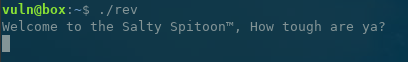
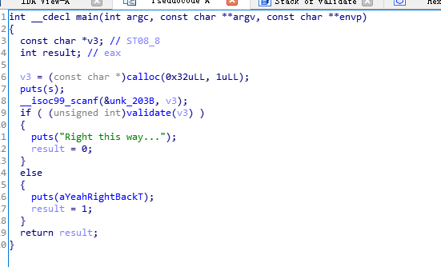
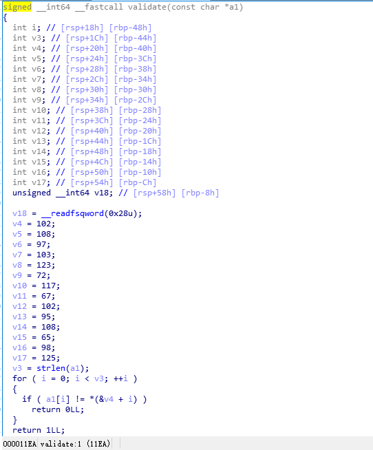

# 1.2 helithumper\_re
运行rev



要求输入flag

使用IDA反编译查看



可以看得到，调用了validate函数判断用户的输入是否正确，跟进validate



从上面代码中可以看出，如果a1\[i\] != \*(&v4 + i)，则会退出。\*(&v4 + i) 分别对应变量v5, v6, v7 .... v17

所以只要循环输出v4 -- v17即可

```cpp
>>> a = [102,108,97,103,123,72,117,67,102,95,108,65,98,125]
>>> for i in a:
...     print chr(i),
... 
f l a g { H u C f _ l A b }
```
使用gdb反编译validate函数

```cpp
gdb-peda$ disassemble validate 
Dump of assembler code for function validate:
   0x00000000000011ea <+0>: push   rbp
   0x00000000000011eb <+1>: mov    rbp,rsp
   0x00000000000011ee <+4>: sub    rsp,0x60
   0x00000000000011f2 <+8>: mov    QWORD PTR [rbp-0x58],rdi     //函数接收参数，保存到rbp-0x58的位置
   0x00000000000011f6 <+12>:    mov    rax,QWORD PTR fs:0x28
   0x00000000000011ff <+21>:    mov    QWORD PTR [rbp-0x8],rax
   0x0000000000001203 <+25>:    xor    eax,eax
   0x0000000000001205 <+27>:    mov    DWORD PTR [rbp-0x40],0x66
   0x000000000000120c <+34>:    mov    DWORD PTR [rbp-0x3c],0x6c
   0x0000000000001213 <+41>:    mov    DWORD PTR [rbp-0x38],0x61
   0x000000000000121a <+48>:    mov    DWORD PTR [rbp-0x34],0x67
   0x0000000000001221 <+55>:    mov    DWORD PTR [rbp-0x30],0x7b
   0x0000000000001228 <+62>:    mov    DWORD PTR [rbp-0x2c],0x48
   0x000000000000122f <+69>:    mov    DWORD PTR [rbp-0x28],0x75
   0x0000000000001236 <+76>:    mov    DWORD PTR [rbp-0x24],0x43
   0x000000000000123d <+83>:    mov    DWORD PTR [rbp-0x20],0x66
   0x0000000000001244 <+90>:    mov    DWORD PTR [rbp-0x1c],0x5f
   0x000000000000124b <+97>:    mov    DWORD PTR [rbp-0x18],0x6c
   0x0000000000001252 <+104>:   mov    DWORD PTR [rbp-0x14],0x41
   0x0000000000001259 <+111>:   mov    DWORD PTR [rbp-0x10],0x62
   0x0000000000001260 <+118>:   mov    DWORD PTR [rbp-0xc],0x7d
   0x0000000000001267 <+125>:   mov    rax,QWORD PTR [rbp-0x58]     //把rbp-0x58地址的值赋值给rax
   0x000000000000126b <+129>:   mov    rdi,rax                  //rdi = rax
   0x000000000000126e <+132>:   call   0x1040 <strlen@plt>          //call strlen() func
   0x0000000000001273 <+137>:   mov    DWORD PTR [rbp-0x44],eax
   0x0000000000001276 <+140>:   mov    DWORD PTR [rbp-0x48],0x0
   0x000000000000127d <+147>:   jmp    0x12aa <validate+192>
   0x000000000000127f <+149>:   mov    eax,DWORD PTR [rbp-0x48]
   0x0000000000001282 <+152>:   movsxd rdx,eax
   0x0000000000001285 <+155>:   mov    rax,QWORD PTR [rbp-0x58]
   0x0000000000001289 <+159>:   add    rax,rdx
   0x000000000000128c <+162>:   movzx  eax,BYTE PTR [rax]
   0x000000000000128f <+165>:   movsx  edx,al
   0x0000000000001292 <+168>:   mov    eax,DWORD PTR [rbp-0x48]
   0x0000000000001295 <+171>:   cdqe   
   0x0000000000001297 <+173>:   mov    eax,DWORD PTR [rbp+rax*4-0x40]
   0x000000000000129b <+177>:   cmp    edx,eax
   0x000000000000129d <+179>:   je     0x12a6 <validate+188>
   0x000000000000129f <+181>:   mov    eax,0x0
   0x00000000000012a4 <+186>:   jmp    0x12b7 <validate+205>
   0x00000000000012a6 <+188>:   add    DWORD PTR [rbp-0x48],0x1
   0x00000000000012aa <+192>:   mov    eax,DWORD PTR [rbp-0x48]
   0x00000000000012ad <+195>:   cmp    eax,DWORD PTR [rbp-0x44]
   0x00000000000012b0 <+198>:   jl     0x127f <validate+149>
   0x00000000000012b2 <+200>:   mov    eax,0x1
   0x00000000000012b7 <+205>:   mov    rcx,QWORD PTR [rbp-0x8]
   0x00000000000012bb <+209>:   xor    rcx,QWORD PTR fs:0x28
   0x00000000000012c4 <+218>:   je     0x12cb <validate+225>
   0x00000000000012c6 <+220>:   call   0x1050 <__stack_chk_fail@plt>
   0x00000000000012cb <+225>:   leave  
   0x00000000000012cc <+226>:   ret    
End of assembler dump.

```