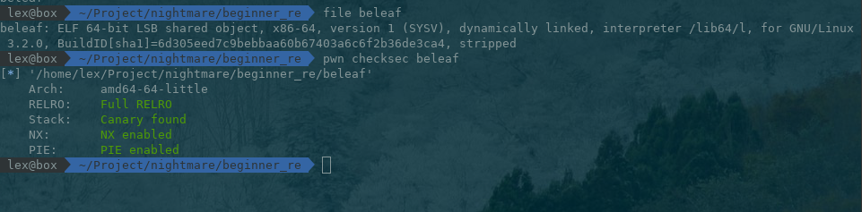
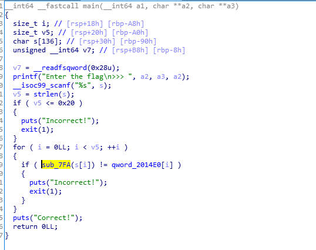
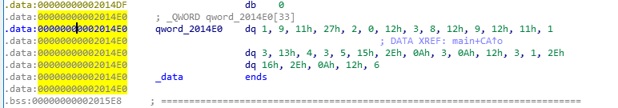
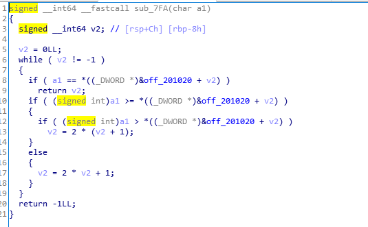
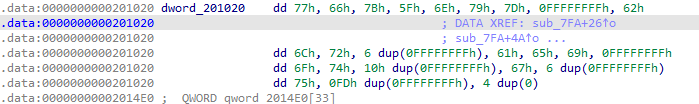

# 1.3 beleaf reverse
首先查看文件格式类型



运行后需要用户输入数据，用IDA反汇编查看文件，得到源代码如下：



代码的关键点在sub\_7FA(s\[i\] != qword\_2014E0\[i\])，从代码中可以看出flag的长度不能小于0x20，查看qword\_2014E0这个数组对应的值：



可以看到数组里面的值为

```cpp
[1, 9, 0x11, 0x27, 2, 0, 0x12, 3, 8, 0x12, 9, 0x12, 0x11, 1, 3, 0x13, 4, 3, 5, 0x15, 0x2e, 0x1, 3, 0xa, 0x12, 3, 1, 0x2e, 0x16, 0x2e, 0xa, 0x12, 6]
```
然后我们再看看sub\_7FA函数是怎么处理输入的字符串



从代码中看到，关键点在于

```cpp
if ( a1 == *((_DWORD *)&off_201020 + v2) )
      return v2;
```
也就是返回的v2的值要一一对应qword\_2014E0数组的值，也就是说v2的第一次返回值必须是1，第二次必须是9，所以输入的a1第一个值为a1 == \*((\_DWORD \*)&off\_201020 + 1，第二个值为a1 == \*((\_DWORD \*)&off\_201020 + 9

接着查看off\_201020(数组，v2在这里是index)所对应的值是哪些



从上面可以看出，对应的值分别是0x77, 0x66, 0x7b, 0x5f, 0x6e, 0x79, 0x7d, 0xffffffff, 0x62, 0x6c, 0x72, 0xffffffff, 0xffffffff, .....

poc

```cpp
values = [0x77,0x66,0x7b,0x5f,0x6e,0x79,0x7d,0xffffffff,0x62,0x6c,0x72,0xffffffff,0xffffffff,0xffffffff,0xffffffff,0xffffffff,0xffffffff,0x61,0x65,0x69,0xffffffff,0x6f,0x74,0xffffffff,0xffffffff,0xffffffff,0xffffffff,0xffffffff,0xffffffff,0xffffffff,0xffffffff,0xffffffff,0xffffffff,0xffffffff,0xffffffff,0xffffffff,0xffffffff,0xffffffff,0xffffffff,0x67,0xffffffff,0xffffffff,0xffffffff,0xffffffff,0xffffffff,0xffffffff,0x75,0xffffffff,0xffffffff,0xffffffff,0xffffffff,0xffffffff,0xffffffff,0xffffffff,0xffffffff,0xffffffff,0xffffffff,0xffffffff,0xffffffff,0xffffffff,0xffffffff,0xffffffff,0xffffffff,0xffffffff,0xffffffff,0xffffffff,0xffffffff,0xffffffff,0xffffffff,0xffffffff,0xffffffff,0xffffffff,0xffffffff,0xffffffff,0xffffffff,0xffffffff,0xffffffff,0xffffffff,0xffffffff,0xffffffff,0xffffffff,0xffffffff,0xffffffff,0xffffffff,0xffffffff,0xffffffff,0xffffffff,0xffffffff,0xffffffff,0xffffffff,0xffffffff,0xffffffff,0xffffffff,0xffffffff,0xffffffff,0xffffffff,0xffffffff,0xffffffff,0xffffffff,0xffffffff,0xffffffff,0xffffffff,0xffffffff,0xffffffff,0xffffffff,0xffffffff,0xffffffff,0xffffffff,0xffffffff,0xffffffff,0xffffffff,0xffffffff,0xffffffff,0xffffffff,0xffffffff,0xffffffff,0xffffffff,0xffffffff,0xffffffff,0xffffffff,0xffffffff,0xffffffff,0xffffffff,0xffffffff,0xffffffff,0xffffffff,0xffffffff,0xffffffff,0xffffffff,0xffffffff,0xffffffff,0xffffffff,0xffffffff,0xffffffff,0xffffffff,0xffffffff,0xffffffff,0xffffffff,0xffffffff,0xffffffff,0xffffffff,0xffffffff,0xffffffff,0xffffffff,0xffffffff,0xffffffff,0xffffffff,0xffffffff,0xffffffff,0xffffffff,0xffffffff,0xffffffff,0xffffffff,0xffffffff,0xffffffff,0xffffffff,0xffffffff,0xffffffff,0xffffffff,0xffffffff,0xffffffff,0xffffffff,0xffffffff,0xffffffff,0xffffffff,0xffffffff,0xffffffff,0xffffffff,0xffffffff,0xffffffff,0xffffffff,0xffffffff,0xffffffff,0xffffffff,0xffffffff,0xffffffff,0xffffffff,0xffffffff,0xffffffff,0xffffffff,0xffffffff,0xffffffff,0xffffffff,0xffffffff,0xffffffff,0xffffffff,0xffffffff,0xffffffff,0xffffffff,0xffffffff,0xffffffff,0xffffffff,0xffffffff,0xffffffff,0xffffffff,0xffffffff,0xffffffff,0xffffffff,0xffffffff,0xffffffff,0xffffffff,0xffffffff,0xffffffff,0xffffffff,0xffffffff,0xffffffff,0xffffffff,0xffffffff,0xffffffff,0xffffffff,0xffffffff,0xffffffff,0xffffffff,0xffffffff,0xffffffff,0xffffffff,0xffffffff,0xffffffff,0xffffffff,0xffffffff,0xffffffff,0xffffffff,0xffffffff,0xffffffff,0xffffffff,0xffffffff,0xffffffff,0xffffffff,0xffffffff,0xffffffff,0xffffffff,0xffffffff,0xffffffff,0xffffffff,0xffffffff,0xffffffff,0xffffffff,0xffffffff,0xffffffff,0xffffffff,0xffffffff,0xffffffff,0xffffffff,0xffffffff,0xffffffff,0xffffffff,0xffffffff,0xffffffff,0xffffffff,0xffffffff,0xffffffff,0xffffffff,0xffffffff,0xffffffff,0xffffffff,0xffffffff,0xffffffff,0xffffffff,0xffffffff,0xffffffff,0xffffffff,0xffffffff,0xffffffff,0xffffffff,0xffffffff,0xffffffff,0xffffffff,0xffffffff,0xffffffff,0xffffffff,0xffffffff,0xffffffff,0xffffffff,0xffffffff,0xffffffff,0xffffffff,0xffffffff,0xffffffff,0xffffffff,0xffffffff,0xffffffff,0xffffffff,0xffffffff,0xffffffff,0xffffffff,0xffffffff,0xffffffff,0xffffffff,0xffffffff,0xffffffff,0xffffffff,0xffffffff,0xffffffff,0xffffffff,0xffffffff,0xffffffff,0xffffffff,0xffffffff,0xffffffff,0xffffffff,0x00]
wanted = [0x01,0x09,0x11,0x27,0x02,0x00,0x12,0x03,0x08,0x12,0x09,0x12,0x11,0x01,0x03,0x13,0x04,0x03,0x05,0x15,0x2e,0x0a,0x03,0x0a,0x12,0x03,0x01,0x2e,0x16,0x2e,0x0a,0x12,0x06,]
flag = ''

for i in wanted:
    flag += chr(values[i])

print flag
```