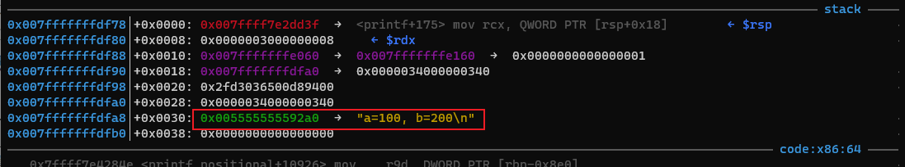
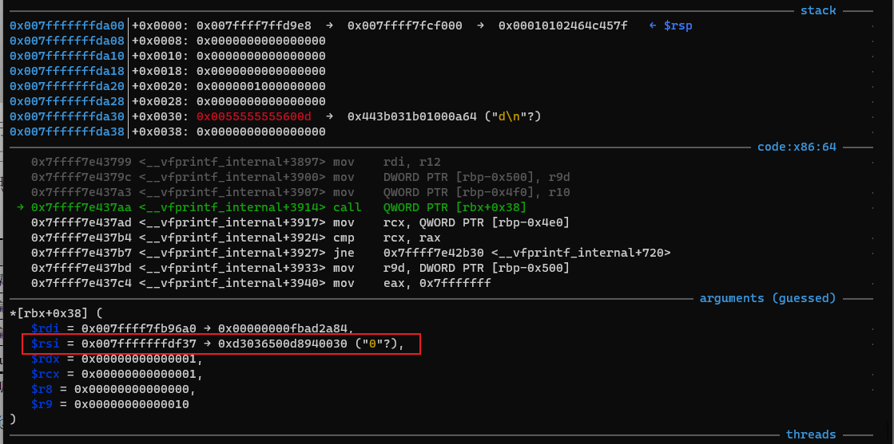
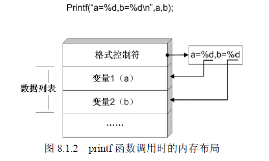
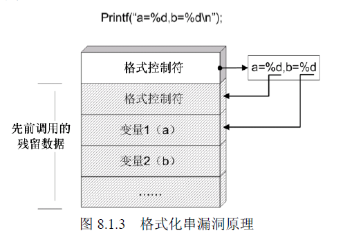

# 3 格式化字符串
格式化字符串漏洞的主要原因是对用户的输入没有进行过滤，从而使用户可以输入`%p`等控制字符。然后程序使用`printf`之类的函数输出，这样就会造成内存信息的泄露。

首先看下面的例子：

```cpp
#include <stdio.h>
#include <stdlib.h>

int main(void) {
    int a = 100, b = 200;
    printf("a=%d, b=%d\n", a, b);
    printf("a=%d, b=%d\n");
    return 0;
}
```
输出结果

```cpp
➜  c ./fmt_string
a=100, b=200
a=1431671456, b=0   //十六进制 0x005555555592a0 
```
其中第二行`a`的结果是格式化字符串地址的值，`b`为0

从汇编代码来看

```cpp
gef➤  disassemble main
Dump of assembler code for function main:
   0x0000555555555149 <+0>:     endbr64
   0x000055555555514d <+4>:     push   rbp
   0x000055555555514e <+5>:     mov    rbp,rsp
   0x0000555555555151 <+8>:     sub    rsp,0x10
   0x0000555555555155 <+12>:    mov    DWORD PTR [rbp-0x8],0x64
   0x000055555555515c <+19>:    mov    DWORD PTR [rbp-0x4],0xc8
   0x0000555555555163 <+26>:    mov    edx,DWORD PTR [rbp-0x4]                    //第三个参数
   0x0000555555555166 <+29>:    mov    eax,DWORD PTR [rbp-0x8]
   0x0000555555555169 <+32>:    mov    esi,eax                                    //第二个参数
   0x000055555555516b <+34>:    lea    rdi,[rip+0xe92]        # 0x555555556004    //第一个参数
   0x0000555555555172 <+41>:    mov    eax,0x0
   0x0000555555555177 <+46>:    call   0x555555555050 <printf@plt>
   0x000055555555517c <+51>:    lea    rdi,[rip+0xe81]        # 0x555555556004    //第一个参数
   0x0000555555555183 <+58>:    mov    eax,0x0
   0x0000555555555188 <+63>:    call   0x555555555050 <printf@plt>
   0x000055555555518d <+68>:    mov    eax,0x0
   0x0000555555555192 <+73>:    leave
   0x0000555555555193 <+74>:    ret
End of assembler dump.
```
可以看到最后格式化字符串输出的值的地址为`0x005555555592a0`



跟入`printf`函数内部

```cpp
[ Legend: Modified register | Code | Heap | Stack | String ]
───────────────────────────────────────────────────────────────────────────────────────────────────────── registers ────
$rax   : 0xc00
$rbx   : 0x007ffff7fb54a0  →  0x0000000000000000
$rcx   : 0xa
$rdx   : 0xa
$rsp   : 0x007fffffffda00  →  0x007ffff7ffd9e8  →  0x007ffff7fcf000  →  0x00010102464c457f
$rbp   : 0x007fffffffdf70  →  0x007fffffffe070  →  0x0000000000000000
$rsi   : 0x007fffffffdf2e  →  "1431671456"
$rdi   : 0x007ffff7fb96a0  →  0x00000000fbad2a84
$rip   : 0x007ffff7e437aa  →  <__vfprintf_internal+3914> call QWORD PTR [rbx+0x38]
$r8    : 0x0
$r9    : 0x2
$r10   : 0x00555555556007  →  "d, b=%d\n"
$r11   : 0x007fffffffdf2e  →  "1431671456"
$r12   : 0x007ffff7fb96a0  →  0x00000000fbad2a84
$r13   : 0x00555555556004  →  "a=%d, b=%d\n"
$r14   : 0x007fffffffdf80  →  0x0000003000000010
$r15   : 0x64
$eflags: [zero carry parity adjust sign trap INTERRUPT direction overflow resume virtualx86 identification]
$cs: 0x33 $ss: 0x2b $ds: 0x00 $es: 0x00 $fs: 0x00 $gs: 0x00
───────────────────────────────────────────────────────────────────────────────────────────────────────────── stack ────
0x007fffffffda00│+0x0000: 0x007ffff7ffd9e8  →  0x007ffff7fcf000  →  0x00010102464c457f   ← $rsp
0x007fffffffda08│+0x0008: 0x0000000000000000
0x007fffffffda10│+0x0010: 0x0000000000000000
0x007fffffffda18│+0x0018: 0x0000000000000000
0x007fffffffda20│+0x0020: 0x0000000200000000
0x007fffffffda28│+0x0028: 0x0000000000000000
0x007fffffffda30│+0x0030: 0x00555555556007  →  "d, b=%d\n"
0x007fffffffda38│+0x0038: 0x0000000000000000
─────────────────────────────────────────────────────────────────────────────────────────────────────── code:x86:64 ────
   0x7ffff7e43799 <__vfprintf_internal+3897> mov    rdi, r12
   0x7ffff7e4379c <__vfprintf_internal+3900> mov    DWORD PTR [rbp-0x500], r9d
   0x7ffff7e437a3 <__vfprintf_internal+3907> mov    QWORD PTR [rbp-0x4f0], r10
 → 0x7ffff7e437aa <__vfprintf_internal+3914> call   QWORD PTR [rbx+0x38]
   0x7ffff7e437ad <__vfprintf_internal+3917> mov    rcx, QWORD PTR [rbp-0x4e0]
   0x7ffff7e437b4 <__vfprintf_internal+3924> cmp    rcx, rax
   0x7ffff7e437b7 <__vfprintf_internal+3927> jne    0x7ffff7e42b30 <__vfprintf_internal+720>
   0x7ffff7e437bd <__vfprintf_internal+3933> mov    r9d, DWORD PTR [rbp-0x500]
   0x7ffff7e437c4 <__vfprintf_internal+3940> mov    eax, 0x7fffffff
─────────────────────────────────────────────────────────────────────────────────────────────── arguments (guessed) ────
*[rbx+0x38] (
   $rdi = 0x007ffff7fb96a0 → 0x00000000fbad2a84,
   $rsi = 0x007fffffffdf2e → "1431671456",
   $rdx = 0x0000000000000a,
   $rcx = 0x0000000000000a,
   $r8 = 0x00000000000000,
   $r9 = 0x00000000000002
)
─────────────────────────────────────────────────────────────────────────────────────────────────────────── threads ────
[#0] Id 1, Name: "fmt_string", stopped 0x7ffff7e437aa in __vfprintf_internal (), reason: SINGLE STEP
───────────────────────────────────────────────────────────────────────────────────────────────────────────── trace ────
[#0] 0x7ffff7e437aa → __vfprintf_internal(s=0x7ffff7fb96a0 <_IO_2_1_stdout_>, format=0x555555556004 "a=%d, b=%d\n", ap=0x7fffffffdf80, mode_flags=0x0)
[#1] 0x7ffff7e2dd3f → __printf(format=<optimized out>)
[#2] 0x55555555518d → main()
```
可以在`code`区看到会调用`[rbx+0x38]`处的函数，并传入了格式化字符串结果的地址

继续跟踪



读取参数`b` 的值时候，传入的则是一个`0`

在内存中的布局大致如下



当调用第二个`printf`函数的时候




