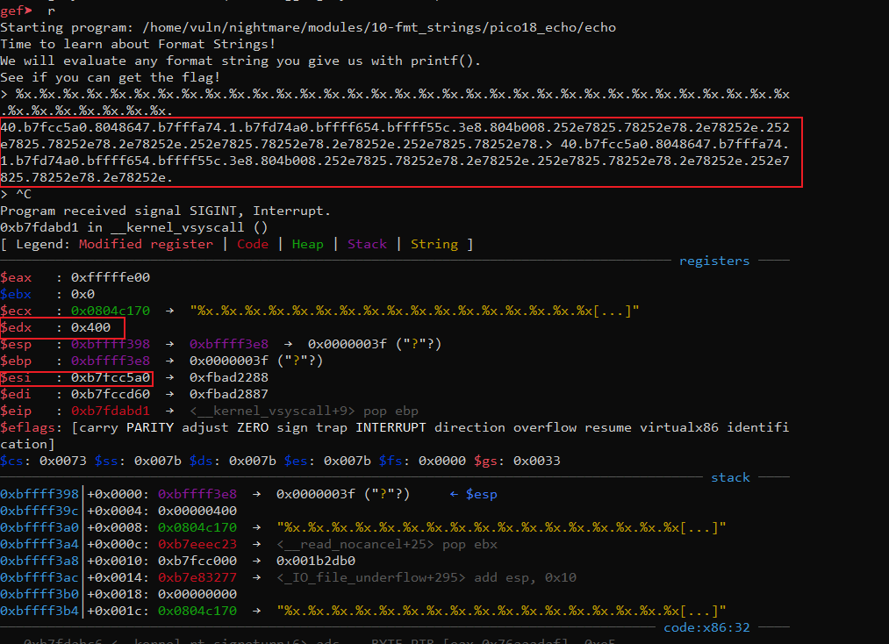
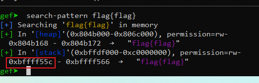
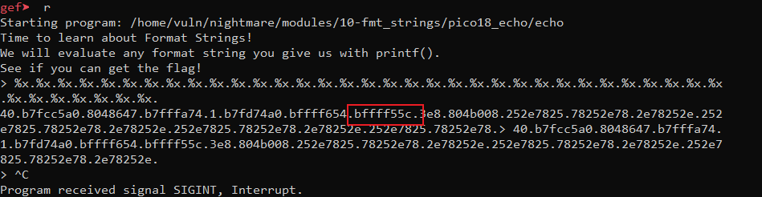
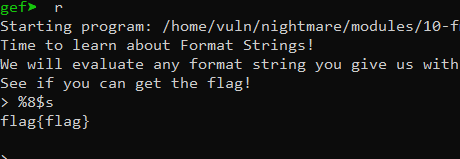

# 3.2 pico18 echo


```cpp
vuln@ubuntu:~/nightmare/modules/10-fmt_strings/pico18_echo$ pwn checksec echo
[!] Pwntools does not support 32-bit Python.  Use a 64-bit release.
[*] '/home/vuln/nightmare/modules/10-fmt_strings/pico18_echo/echo'
    Arch:     i386-32-little
    RELRO:    Partial RELRO
    Stack:    No canary found
    NX:       NX enabled
    PIE:      No PIE (0x8048000)
```
使用`IDA` 来查看程序

```cpp
int __cdecl __noreturn main(int argc, const char **argv, const char **envp)
{
  __gid_t v3; // [esp+14h] [ebp-94h]
  FILE *stream; // [esp+18h] [ebp-90h]
  char s[64]; // [esp+1Ch] [ebp-8Ch] BYREF
  char v6[64]; // [esp+5Ch] [ebp-4Ch] BYREF
  unsigned int v7; // [esp+9Ch] [ebp-Ch]

  v7 = __readgsdword(0x14u);
  setvbuf(stdout, 0, 2, 0);
  v3 = getegid();
  setresgid(v3, v3, v3);
  memset(s, 0, sizeof(s));
  memset(s, 0, sizeof(s));
  puts("Time to learn about Format Strings!");
  puts("We will evaluate any format string you give us with printf().");
  puts("See if you can get the flag!");
  stream = fopen("flag.txt", "r");
  if ( !stream )
  {
    puts(
      "Flag File is Missing. Problem is Misconfigured, please contact an Admin if you are running this on the shell server.");
    exit(0);
  }
  fgets(v6, 64, stream);
  while ( 1 )
  {
    printf("> ");
    fgets(s, 64, stdin);
    printf(s);
  }
}
```
从上面程序可以看出，程序打开了`flag.txt`并读取内容保存到了`stream`变量中。

使用`gdb`调试程序



输入`%x`能够打印出内存中的数据，接着在内存中搜索`flag`相关关键字，看能不能找到`stream` 变量的地址



可以看到`flag`的地址，对应上程序输出的第八位地址的值



所以只要打印出第八个位置的地址，就能得到`flag`



