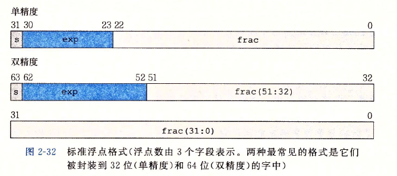
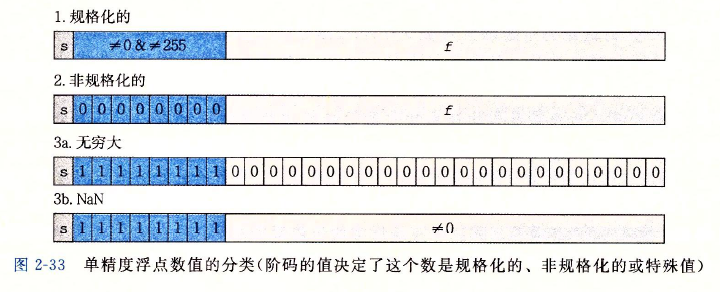

# 4 Array  Index


这节的前置知识主要是浮点数在计算机中的存储方式。


在`IEEE` 标准中，浮点标准用 $V=(-1)^{s} * M * 2^{E}$ 的形式来表示一个数：

* 符号(sign) s决定这个数是负数（s=1）还是正数（s=0）
* 尾数(significand) M是一个二进制小数
* 阶码(exponent) E的作用是对浮点数加权，权重是2的E次幂

将浮点数的位表示划分为三个字段，分别对这些值进行编码：

* 一个单独的符号位s直接编码符号s
* k位的阶码字段$exp = e_{k-1} ... e_1e_0$ 编码阶码E
* n位小数字段 $frac = f_{n-1} ... f_1f_0$ 编码尾数M，但是编码出来的值也依赖于阶码字段的值是否等于0

在C语言中，浮点数有`float`和`double`两种类型：

* 对于`float` 类型来说，s、exp 和 frac 字段分别为1位，k=8位，n=23位，得到一个32位表示
* 对于`double`类型来说，s、exp、和 frac 字段分别位1位，k=11，n=52位，得到一个64位表示



被编码的值可以分成三种不同的情况：



所以可以得出，当浮点数以0xf开头的时候，则是一个很大的负数，同时在内存中是以64/32位的形式存储的，最低有效位排在最前面。

使用`python` 把十六进制转换成有符号的`double`类型

```python
>>> "%.20g" % struct.unpack("<d", p64(0xfeffffffffffffff))[0]
'-5.4861240687936880742e+303'
>>> struct.pack("<d", -5.4861240687936880742e+303)
b'\xff\xff\xff\xff\xff\xff\xff\xfe'
```


