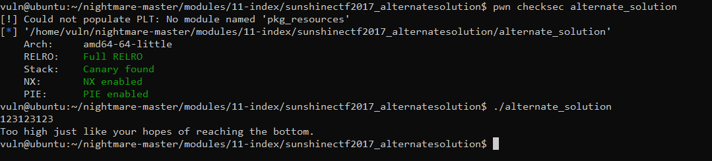

# 4.3 Sunshine CTF 2017 Alternate Solution
首先看下程序的信息



使用`IDA`反编译

```cpp
int __cdecl main(int argc, const char **argv, const char **envp)
{
  float v3; // xmm2_4
  char *i; // rax
  FILE *stream; // [rsp+18h] [rbp-58h]
  char s[10]; // [rsp+26h] [rbp-4Ah] BYREF
  char v8[56]; // [rsp+30h] [rbp-40h] BYREF
  unsigned __int64 v9; // [rsp+68h] [rbp-8h]

  v9 = __readfsqword(0x28u);
  fgets(s, 10, _bss_start);
  v3 = atof(s);
  if ( v3 < 37.35928559 )
  {
    puts("Too low just like you're chances of reaching the bottom.");
    exit(0);
  }
  if ( v3 > 37.35928559 )
  {
    puts("Too high just like your hopes of reaching the bottom.");
    exit(0);
  }
  stream = fopen("flag.txt", "r");
  for ( i = fgets(v8, 50, stream); i; i = fgets(v8, 50, stream) )
    printf("%s", v8);
  return 0;
}
```
尝试输入`37.35928559` 

```cpp
vuln@ubuntu:~/nightmare-master/modules/11-index/sunshinectf2017_alternatesolution$ ./alternate_solution
37.35928559
Too low just like you're chances of reaching the bottom.
vuln@ubuntu:~/nightmare-master/modules/11-index/sunshinectf2017_alternatesolution$
```
从之前的章节中我们知道浮点数有3种类型：规格化，非规格化和无穷大/NaN，这里我们可以输入`NaN`来绕过判断：

```cpp
vuln@ubuntu:~/nightmare-master/modules/11-index/sunshinectf2017_alternatesolution$ ./alternate_solution
NaN
sun{50m3times yoU_h@v3_t0 get cr3@t1v3}
```
