## 漏洞成因

```
该漏洞是由于在Struts2开发框架中使用namespace功能定义XML配置时，namespace值未被设置且在上层动作配置（Action Configuration）中未设置或用通配符namespace，可能导致远程代码执行。同理，url标签未设置value和action值且上层动作未设置或用通配符namespace时也可能导致远程代码执行
```

## 环境搭建

下载 `https://archive.apache.org/dist/struts/2.5.16/struts-2.5.16-all.zip`

使用IDEA来搭建环境
首先解压zip包，然后到apps目录下，解压war包，把解压好后目录结构如图：
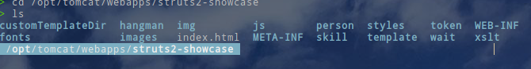

接着在IDEA中创建一个`webapp`的项目，然后把`showcase/WEB-INF/`中的文件拷贝到IDEA的`web/WEB-INF/`目录下
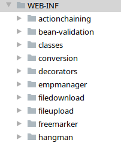

接着把`showcase/`下面的其他目录拷贝到IDEA的`web`目录下，然后进入`showcase/WEB-INF/src/java/`目录，把文件拷贝到IDEA的`src/`目录下
然后再到IDEA中设置lib包的位置，lib包就在IDEA的`WEB-INF/lib`目录下，这样环境就配置好了

要触发漏洞，需要修改 `struts-actionchaining.xml`配置文件，从上面的描述，需要吧`namespace`给去掉，或者配置成通配符

```xml
<struts>
    <package name="actionchaining" extends="struts-default">
        <action name="actionChain1" class="org.apache.struts2.showcase.actionchaining.ActionChain1">
            <result type="redirectAction">
                <param name = "actionName">register2</param>
            </result>
        </action>
    </package>
</struts>
```

访问网址进行测试：
在url中访问 `site/${(100*100)}/actionChain1.action`
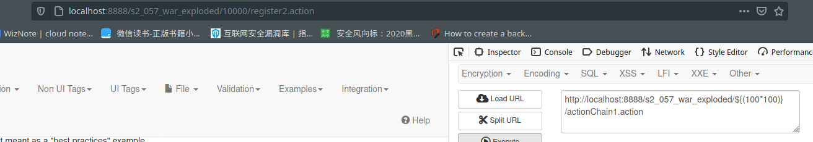

从hackbar中，我们注入了表达式，表达式被成功执行，此时浏览器的地址栏显示地址为10000/register2.action
该漏洞的触发方式有3种，chain, redirectAction, postback：

```xml
struts-default.xml文件：
<result-types>
            <result-type name="chain" class="com.opensymphony.xwork2.ActionChainResult"/>
            <result-type name="redirectAction" class="org.apache.struts2.result.ServletActionRedirectResult"/>
            <result-type name="postback" class="org.apache.struts2.result.PostbackResult" />
        </result-types>
```

在`DefaultActionMapper.parseNameAndNamespace`函数处下断点,，截取部分代码，访问url

```java
protected void parseNameAndNamespace(String uri, ActionMapping mapping, ConfigurationManager configManager) {
        int lastSlash = uri.lastIndexOf(47);
        String namespace;	//namespace: "/${(10*10)}"
        String name;		//name: "actionChain1"
        if (lastSlash == -1) {
            namespace = "";
            name = uri;
        } else if (lastSlash == 0) {
            namespace = "/";
            name = uri.substring(lastSlash + 1);
        } else if (this.alwaysSelectFullNamespace) {	//true
            namespace = uri.substring(0, lastSlash);
            name = uri.substring(lastSlash + 1);
        } else {
            Configuration config = configManager.getConfiguration();
            String prefix = uri.substring(0, lastSlash);
            namespace = "";
            boolean rootAvailable = false;
            Iterator i$ = config.getPackageConfigs().values().iterator();

            while(i$.hasNext()) {
                PackageConfig cfg = (PackageConfig)i$.next();
                String ns = cfg.getNamespace();
                if (ns != null && prefix.startsWith(ns) && (prefix.length() == ns.length() || prefix.charAt(ns.length()) == '/') && ns.length() > namespace.length()) {
                    namespace = ns;
                }

                if ("/".equals(ns)) {
                    rootAvailable = true;
                }
            }

            name = uri.substring(namespace.length() + 1);
            if (rootAvailable && "".equals(namespace)) {
                namespace = "/";
            }
        }

        if (!this.allowSlashesInActionNames) {
            int pos = name.lastIndexOf(47);
            if (pos > -1 && pos < name.length() - 1) {
                name = name.substring(pos + 1);
            }
        }

        mapping.setNamespace(namespace);
        mapping.setName(this.cleanupActionName(name));
    }
```

在进入函数后，可以看到`alwaysSelectFullNamespace = true`，那么`namespace`就是我们可以控制的输入点

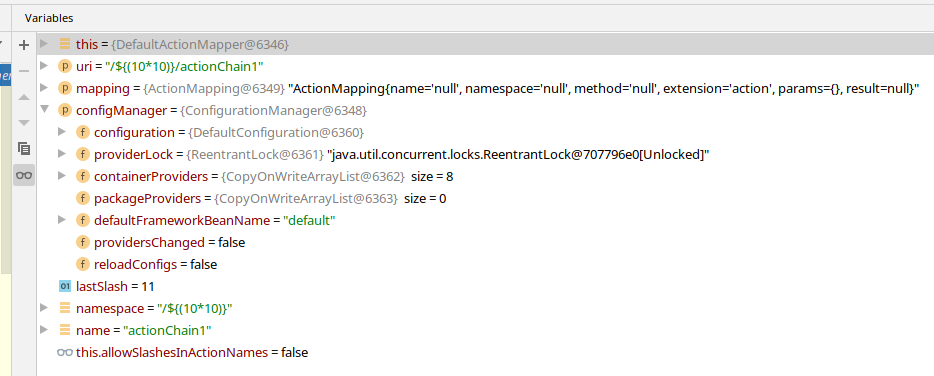

接着`namespace`保存到ActionMapping对象中，交由函数`parseActionName`来进行处理
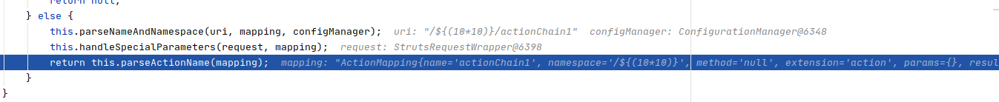


在`parseNameAndNamespace`处理完之后，会调用到`DefaultActionInvocation`类的`executeResult()`函数来进行处理，该函数用来决定此时程序是用什么样的方式来处理action，比如如下所示的则为使用`ActionChainResult`类来做处理，也就是`chain`的方式

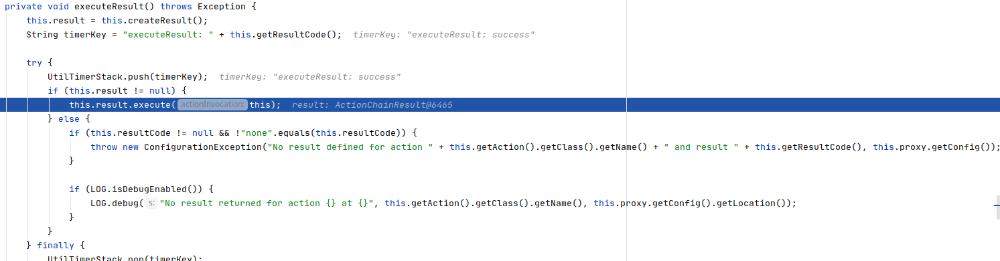

## Redirect Action 攻击面

在使用`Redirect Action`来触发漏洞的时候，会使用`ServletActionRedirectResult`来进行处理
```java
java.lang.Object
     org.apache.struts2.result.StrutsResultSupport
          org.apache.struts2.result.ServletRedirectResult
               org.apache.struts2.result.ServletActionRedirectResult 
```
因为在`struts-actionchaining.xml`文件中没有设置`namespace`，所以此处的`namespace`为`null`
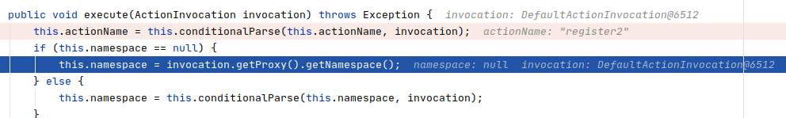

然后步入函数`invocation.getProxy().getNamespace()`
`invocation.getProxy()`实际上调用了`DefaultActionProxy`类的`getNamespace`方法

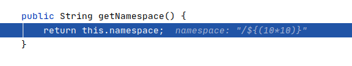

调用完成后，可以看到`namespace`变为了输入点的内容

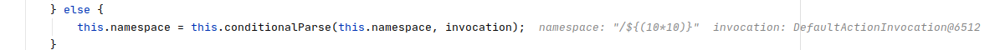

接着到 `super.execute()` 函数这里的时候，跟进函数内部，接着继续跟进，然后就会跳到`StrutsResultSupport`类的`execute`函数进行处理

```java
public void execute(ActionInvocation invocation) throws Exception {
        this.lastFinalLocation = this.conditionalParse(this.location, invocation);	//${(10*10)}/register2.action
        this.doExecute(this.lastFinalLocation, invocation);
    }
```

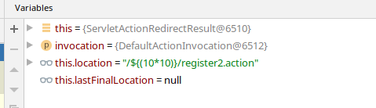

此时`location`为要跳转的url地址，跟进去看看是如何处理的

```java
protected String conditionalParse(String param, ActionInvocation invocation) {
        return this.parse && param != null && invocation != null ? TextParseUtil.translateVariables(param, invocation.getStack(), new StrutsResultSupport.EncodingParsedValueEvaluator()) : param;
    }
```

此时调用了`TextParseUtil.translateVariables`，跟进

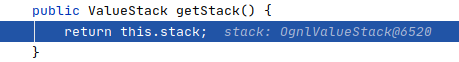

此时的stack为`ognlvalueStack`，接着再跟进函数`translateVariables`

```java
public static String translateVariables(String expression, ValueStack stack, TextParseUtil.ParsedValueEvaluator evaluator) {
        return translateVariables(new char[]{'$', '%'}, expression, stack, String.class, evaluator).toString();
    }
```

此时
`expression = /${(10*10)}/register2.action`
`evaluator`对象的值为：

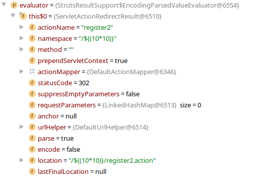

跟进后调用的函数

```java
public static Object translateVariables(char[] openChars, String expression, final ValueStack stack, final Class asType, final TextParseUtil.ParsedValueEvaluator evaluator, int maxLoopCount) {
        TextParseUtil.ParsedValueEvaluator ognlEval = new TextParseUtil.ParsedValueEvaluator() {
            public Object evaluate(String parsedValue) {
                Object o = stack.findValue(parsedValue, asType);
                if (evaluator != null && o != null) {
                    o = evaluator.evaluate(o.toString());
                }

                return o;
            }
        };
        TextParser parser = (TextParser)((Container)stack.getContext().get("com.opensymphony.xwork2.ActionContext.container")).getInstance(TextParser.class);
        return parser.evaluate(openChars, expression, ognlEval, maxLoopCount);
    }
```

函数创建了一个`ognleval`对象，并且传入了`parser.evaluate`

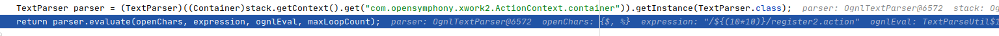

在经过一系列的运算解析之后，返回到`StrutsResultSupport`类的`execute`方法，此时我们可以看到，`this.lastFinalLocation`的值已经改变

```
public void execute(ActionInvocation invocation) throws Exception {
        this.lastFinalLocation = this.conditionalParse(this.location, invocation);
        this.doExecute(this.lastFinalLocation, invocation);
    }
```

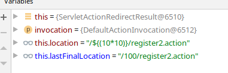

此时注入的表达式已经被成功执行。从上面的分析可以看出，漏洞的主要成因在2个点上，先是`alwaysSelectFullNamespace`设置为`true`，所以`namespace`从url获取，也就是`payload`的输入点，其次是`xml`文件中`namespace`为null，否则就不会用用户的输入作为`namespace`，那么漏洞就没法触发。


## Action Chaining 攻击面
首先把`struts-actionchaining.xml`文件进行修改，把`result type` 改成 `chain`，要修改的文件

```
> find . -name "struts-actionchaining.xml"
./web/WEB-INF/src/java/struts-actionchaining.xml
./web/WEB-INF/classes/struts-actionchaining.xml
./src/struts-actionchaining.xml
./out/production/s2-057/struts-actionchaining.xml
./out/artifacts/s2_057_war_exploded/WEB-INF/src/java/struts-actionchaining.xml
./out/artifacts/s2_057_war_exploded/WEB-INF/classes/struts-actionchaining.xml
```
```xml
<action name="actionChain1" class="org.apache.struts2.showcase.actionchaining.ActionChain1">
            <result type="chain">
                <param name="actionName">register2</param>
            </result>
		</action>
```

使用`chain`的方式，会调用 `com.opensymphony.xworks2.ActionChainResult.execute()` 方法来进行处理，在该函数下断点

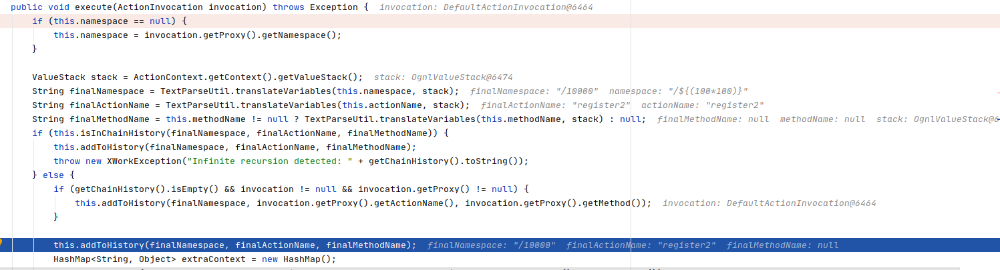

当`namespace`为`null`的时候，则会调用`invocation.getProxy().getNamespace()`去获取`namespace`，获取到`namespace`后，经过`TextParseUtil.translateVariable`函数处理之后，`namespace`进行了表达式运算，从 `/${(100*100)} ==> /10000`，这样漏洞就触发了。

## PostBack Result 攻击面

先修改`struts-actionchaining.xml`文件
```
<result type="postback">
    <param name = "actionName">register2</param>
</result>
```

从上面得知该方式使用了`org.apache.struts2.result.PostbackResult.execute()`函数来做处理，在该函数下段点，在`DefaultActionInvocation`类中可以看到具体调用到了`PostbackResult`类来做处理

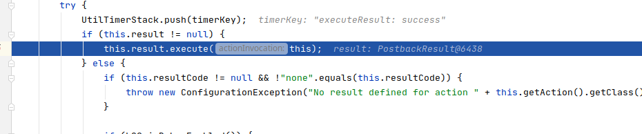

跟进到`PostbackResult.execute()`

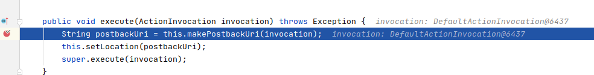

继续跟进 `this.makePostbackUri` 函数，可以看到`namespace`为`null`，也是通过`invocation.getProxy().getNamespace()`函数来获取`namespace`的

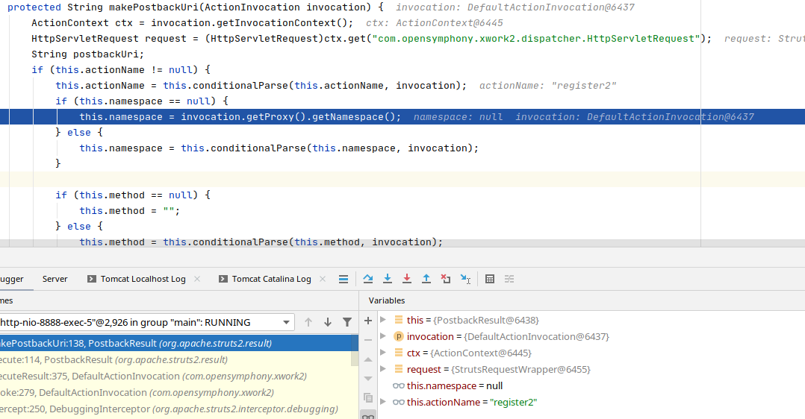

处理完成后

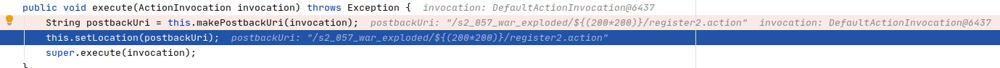

接着就是调用`super.execute`函数，实际上调用了`StrutsResultSupport.execute`函数来做处理，也就和上面的`Redirect Action`的是一样的了

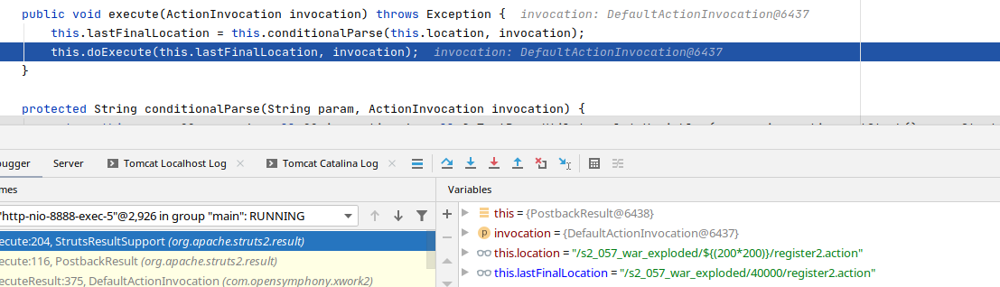

表达式成功执行

## 参考文档

[https://xz.aliyun.com/t/2618](https://xz.aliyun.com/t/2618)

[https://github.com/jas502n/St2-057/blob/master/README.md](https://github.com/jas502n/St2-057/blob/master/README.md)


