# CVE-2019-0230 S2-059

## 漏洞成因

该漏洞形成，是因为在处理用户输入的时候，进行了二次解析，所以导致了OGNL表达式注入，影响版本 Struts 2.0.0 - Struts 2.5.20。

漏洞需要开启 Alt Syntax（默认开启），并且只能在 id 属性中触发。

```
The altSyntax is an option that can be defined in struts.properties. By default it is set to true and it is strongly recommend you do not change that unless you are upgrading from WebWork 2.1.7 or previous versions.
```

## 环境搭建

下载 `https://archive.apache.org/dist/struts/2.5.16/struts-2.5.16-min-lib.zip`

使用IDEA创建一个Struts2项目

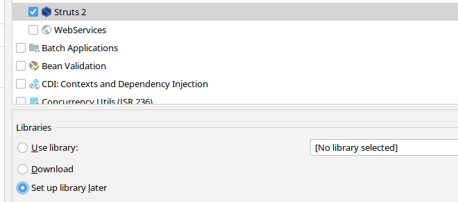

这里选择 Set up library later
创建好后，在IDEA的WEB-INF目录下创建一个lib文件夹，并且把下载好的 struts-2.5.16-min-lib.zip 里面的 jar 包解压到lib目录下
然后还需要一个log4j-core.jar，根据版本信息下载对应的 Jar 包放到 lib 目录下，接着右键点击 Add as Library
还要设置`Facets`，`Struts.xml`和`struts-default.xml`必须放到同一个`facets`下，不然会出错

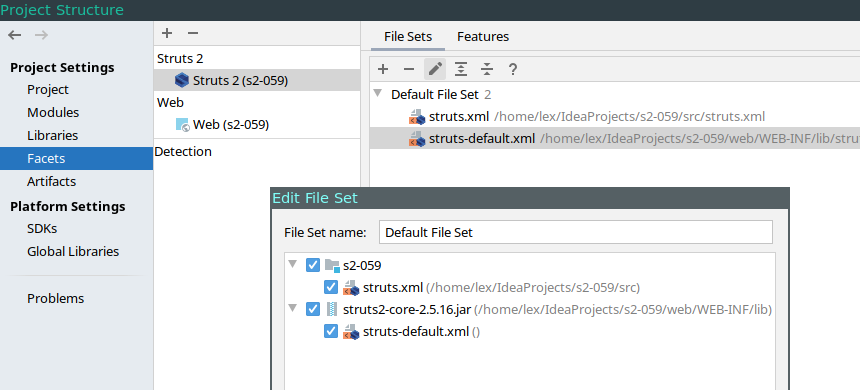

在 2.5 的版本，`web.xml` 的设置如下，idea默认生成的是低版本的配置信息

```xml
<?xml version="1.0" encoding="UTF-8"?>
<web-app xmlns="http://xmlns.jcp.org/xml/ns/javaee"
         xmlns:xsi="http://www.w3.org/2001/XMLSchema-instance"
         xsi:schemaLocation="http://xmlns.jcp.org/xml/ns/javaee http://xmlns.jcp.org/xml/ns/javaee/web-app_4_0.xsd"
         version="4.0">
    <filter>
        <filter-name>struts2</filter-name>
        <filter-class>org.apache.struts2.dispatcher.filter.StrutsPrepareAndExecuteFilter</filter-class>
    </filter>
    <filter-mapping>
        <filter-name>struts2</filter-name>
        <url-pattern>/*</url-pattern>
    </filter-mapping>
</web-app>
```

设置好 `web.xml`，创建一个`package`

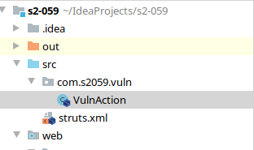

对应代码如下：

```java
package com.s2059.vuln;

import com.sun.org.apache.bcel.internal.generic.ATHROW;

public class VulnAction {
    private String skillName = null;
    private String SUCCESS = "success";

    public String getSkillName() {
        return skillName;
    }

    public void setSkillName(String skillName) {
        this.skillName = skillName;
    }

    public String execute() throws Exception {
        return SUCCESS;
    }
}

```

然后在 `struts2.xml` 中设置对应的action

```xml
<?xml version="1.0" encoding="UTF-8"?>

<!DOCTYPE struts PUBLIC
        "-//Apache Software Foundation//DTD Struts Configuration 2.0//EN"
        "http://struts.apache.org/dtds/struts-2.0.dtd">

<struts>
    <package name="poctest" extends="struts-default" namespace="/">
        <action name="vuln" class="com.s2059.vuln.VulnAction" method="execute">
            <result name="success">/vuln.jsp</result>
        </action>
    </package>
</struts>

```

创建`vuln.jsp`，漏洞只在 `a` 标签 `id` 属性中触发

```java
<%--
  Created by IntelliJ IDEA.
  User: lex
  Date: 10/15/20
  Time: 4:39 AM
  To change this template use File | Settings | File Templates.
--%>
<%@ page contentType="text/html;charset=UTF-8" language="java" %>
<%@ page import="java.util.*" pageEncoding="UTF-8" %>
<%@ taglib prefix="s" uri="/struts-tags" %>
<html>
<head>
    <title>s2-059</title>
</head>
<body>
<s:a id="%{skillName}">s2-059 test</s:a>
</body>
</html>
```

## 漏洞分析

打开后访问 `http://localhost:8080/s2_059_war_exploded/vuln?skillName=s`

从IDEA的输出窗口中可以看到如下信息：从IDEA的输出窗口中可以看到如下信息：

```
16-Oct-2020 05:43:40.778 FINE [http-nio-8080-exec-4] org.apache.jasper.compiler.SmapUtil$SDEInstaller.copyConstantPool 298 read class attr -- 'setParent'
16-Oct-2020 05:43:40.778 FINE [http-nio-8080-exec-4] org.apache.jasper.compiler.SmapUtil$SDEInstaller.copyConstantPool 299 read class attr -- '(Ljavax/servlet/jsp/tagext/Tag;)V'
16-Oct-2020 05:43:40.778 FINE [http-nio-8080-exec-4] org.apache.jasper.compiler.SmapUtil$SDEInstaller.copyConstantPool 300 copying 2 bytes
16-Oct-2020 05:43:40.778 FINE [http-nio-8080-exec-4] org.apache.jasper.compiler.SmapUtil$SDEInstaller.copyConstantPool 301 read class attr -- '%{skillName}'
16-Oct-2020 05:43:40.778 FINE [http-nio-8080-exec-4] org.apache.jasper.compiler.SmapUtil$SDEInstaller.copyConstantPool 302 copying 4 bytes
16-Oct-2020 05:43:40.779 FINE [http-nio-8080-exec-4] org.apache.jasper.compiler.SmapUtil$SDEInstaller.copyConstantPool 303 copying 4 bytes
16-Oct-2020 05:43:40.779 FINE [http-nio-8080-exec-4] org.apache.jasper.compiler.SmapUtil$SDEInstaller.copyConstantPool 304 read class attr -- 'setId'
16-Oct-2020 05:43:40.779 FINE [http-nio-8080-exec-4] org.apache.jasper.compiler.SmapUtil$SDEInstaller.copyConstantPool 305 copying 4 bytes
16-Oct-2020 05:43:40.779 FINE [http-nio-8080-exec-4] org.apache.jasper.compiler.SmapUtil$SDEInstaller.copyConstantPool 306 copying 4 bytes
16-Oct-2020 05:43:40.779 FINE [http-nio-8080-exec-4] org.apache.jasper.compiler.SmapUtil$SDEInstaller.copyConstantPool 307 read class attr -- 'doStartTag'
16-Oct-2020 05:43:40.779 FINE [http-nio-8080-exec-4] org.apache.jasper.compiler.SmapUtil$SDEInstaller.copyConstantPool 308 copying 4 bytes
16-Oct-2020 05:43:40.779 FINE [http-nio-8080-exec-4] org.apache.jasper.compiler.SmapUtil$SDEInstaller.copyConstantPool 309 copying 2 bytes
16-Oct-2020 05:43:40.779 FINE [http-nio-8080-exec-4] org.apache.jasper.compiler.SmapUtil$SDEInstaller.copyConstantPool 310 read class attr -- 'org/apache/jasper/runtime/JspRuntimeLibrary'
16-Oct-2020 05:43:40.779 FINE [http-nio-8080-exec-4] org.apache.jasper.compiler.SmapUtil$SDEInstaller.copyConstantPool 311 copying 4 bytes
16-Oct-2020 05:43:40.779 FINE [http-nio-8080-exec-4] org.apache.jasper.compiler.SmapUtil$SDEInstaller.copyConstantPool 312 read class attr -- 'startBufferedBody'
16-Oct-2020 05:43:40.779 FINE [http-nio-8080-exec-4] org.apache.jasper.compiler.SmapUtil$SDEInstaller.copyConstantPool 313 read class attr -- '(Ljavax/servlet/jsp/PageContext;Ljavax/servlet/jsp/tagext/BodyTag;)Ljavax/servlet/jsp/JspWriter;'
16-Oct-2020 05:43:40.780 FINE [http-nio-8080-exec-4] org.apache.jasper.compiler.SmapUtil$SDEInstaller.copyConstantPool 314 copying 2 bytes
16-Oct-2020 05:43:40.780 FINE [http-nio-8080-exec-4] org.apache.jasper.compiler.SmapUtil$SDEInstaller.copyConstantPool 315 read class attr -- 'payload test'
```

从上面可以看到，在 `SetId` 之后使用了 `doStartTag` 函数做处理，然后在 `struts2` 里面找到这个方法，并且下断点，方法在 `org.apache.struts2.views.jsp.ComponentTagSupport` 里面定义了

```java
public int doStartTag() throws JspException {
    ValueStack stack = this.getStack();
    this.component = this.getBean(stack, (HttpServletRequest)this.pageContext.getRequest(), (HttpServletResponse)this.pageContext.getResponse());
    Container container = (Container)stack.getContext().get("com.opensymphony.xwork2.ActionContext.container");
    container.inject(this.component);
    this.populateParams();
    boolean evalBody = this.component.start(this.pageContext.getOut());
    if (evalBody) {
        return this.component.usesBody() ? 2 : 1;
    } else {
        return 0;
    }
}
```

接着到IDEA中查看

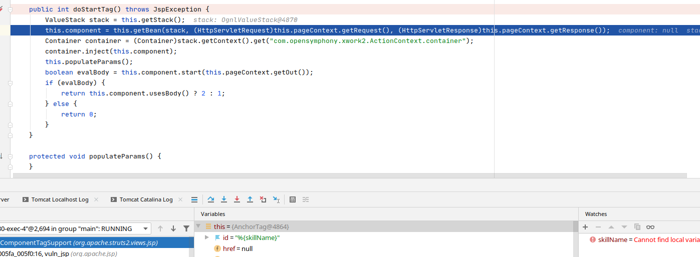

该函数调用了父类的 `populateParams()`，在内部对 id 进行了赋值

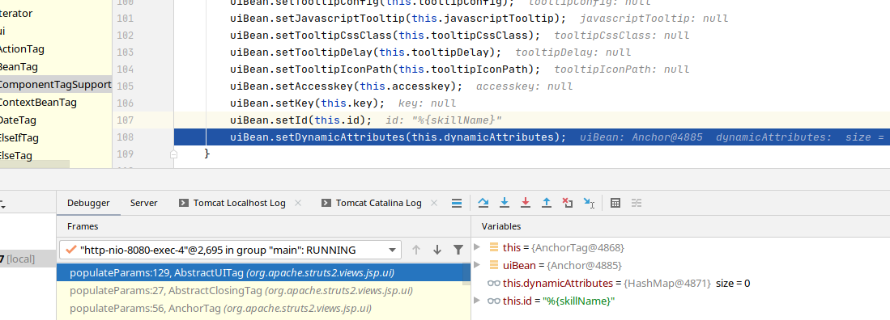

跟进 `setId()` 函数

```java
public void setId(String id) {
    if (id != null) {
        this.id = this.findString(id);
    }

}
```

调用了 `this.findString()`

```java
protected String findString(String expr) {
    return (String)this.findValue(expr, String.class);
}
```

跟进 `this.findValue()`

```java
protected Object findValue(String expr, Class toType) {
    if (this.altSyntax() && toType == String.class) {
        return ComponentUtils.containsExpression(expr) ? TextParseUtil.translateVariables('%', expr, this.stack) : expr;
    } else {
        expr = this.stripExpressionIfAltSyntax(expr);
        return this.getStack().findValue(expr, toType, this.throwExceptionOnELFailure);
    }
}
```

这里对 *this.altSyntax()* 和 `toType` 进行了与操作，判断通过才可以通过，接着跟进 

```java
return ComponentUtils.containsExpression(expr) ? TextParseUtil.translateVariables('%', expr, this.stack) : expr;
```

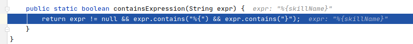

这里判断 `expr` 是否包含了 `"%{}"`，返回 True，所以接着就调用了 `TextParseUtil.translateVariables('%', expr, this.stack)`

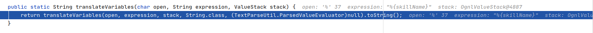

该函数的作用是对属性值做赋值操作，接着进入 `this.componment.start()` 函数，可以看到，此时 `id` 的值已经为 `s`

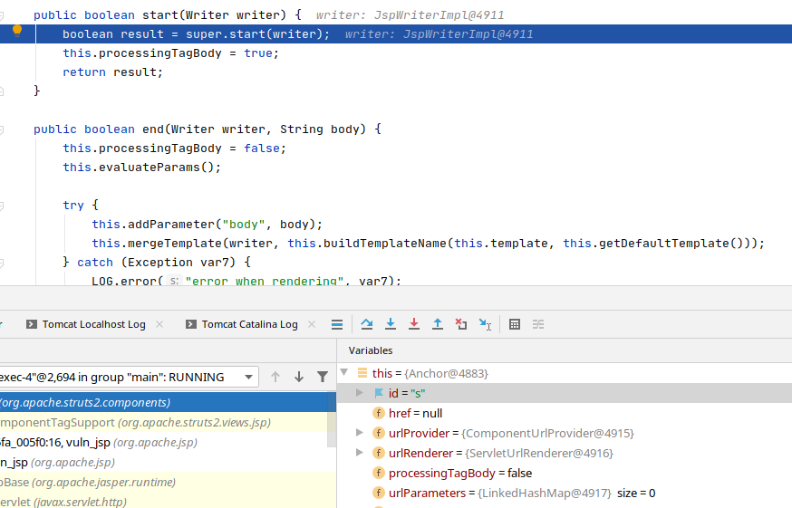

跟进 `start` 方法，最后调用到了 `ClosingUIBean.start` 方法，此时 `result = true`

```java
public boolean start(Writer writer) {
    boolean result = super.start(writer);

    try {
        this.evaluateParams();
        this.mergeTemplate(writer, this.buildTemplateName(this.openTemplate, this.getDefaultOpenTemplate()));
    } catch (Exception var4) {
        LOG.error("Could not open template", var4);
    }

    return result;
}
```

跟进 `this.evaluateParams()` ，实际调用了`UIBean.evaluateParams()`，函数内调用了 `this.populateCOmponentHtmlId(form)`

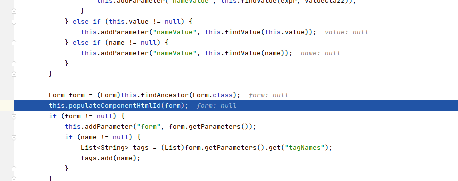

跟进 `this.populateCOmponentHtmlId`，此时 `id=s`

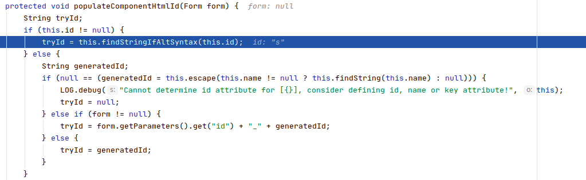

进入函数 `this.findStringIfAltSyntax()`


因为 `this.altSyntax()` 返回 `true`， 所以此时调用了 `this.findString(expr)`，进入 `this.findString()`

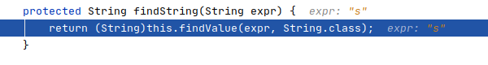

进入 `findValue()`

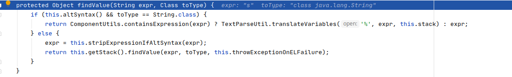

可以看到，此时再次执行了 `TextParseUtil.translateVariables()` 函数，造成二次解析，所以导致了OGNL注入

## 参考文档
[https://paper.seebug.org/1302/](https://paper.seebug.org/1302/)

[https://cwiki.apache.org/confluence/display/WW/S2-059](https://cwiki.apache.org/confluence/display/WW/S2-059)