# CVE-2020-16875 Exchange Server RCE

## 漏洞成因

漏洞的形成是因为`New-DlpPolicy`命令对`TempleteData`参数的过滤不严，从而导致了`RCE`。我们可以通过访问`https://example.com/ecp/DLPPolicy/ManagePolicyFromISV.aspx?pwmcid=20&ReturnObjectType=1`页面来上传`payload`。

## 漏洞分析

在知道漏洞的原因后，我们找到对应的`aspx`文件
```c#
<%@ Page Language="C#"  
    Inherits="Microsoft.Exchange.Management.ControlPanel.ManagePolicyFromISV"
    MasterPageFile="~/CommonMaster.Master"
    Title="<%$Strings:DLPImportTitle%>"
    Caption="<%$Strings:DLPImportCaption%>"
    FVAResource="ManagePolicyFromISVFVA"
    HelpId="ManagePolicyFromISV"
%>
```
该页面由`Microsoft.Exchange.Management.ControlPanel.ManagePolicyFromISV`类进行处理，在这个类的`ExecuteUpload`函数下断点进行跟踪

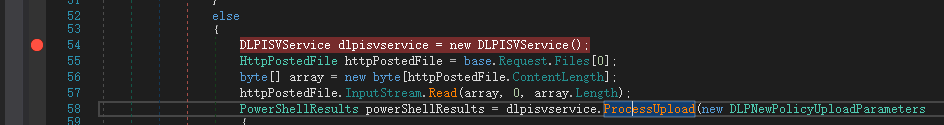

接着上传payload，我们跟进函数，并且一步一步向下走
```c#
PowerShellResults powerShellResults = dlpisvservice.ProcessUpload(new DLPNewPolicyUploadParameters
{
    Mode = this.policyMode.SelectedValue,
    State = RuleState.Enabled.ToString(),
    Name = this.name.Text,
    Description = this.description.Text,
    TemplateData = array
});

```
接着到达`{Microsoft.Exchange.MessagingPolicies.CompliancePrograms.Tasks.NewDlpPolicyImpl}.LoadDlpPolicyFromCustomTemplateData()`来处理传入的`TemplateData`
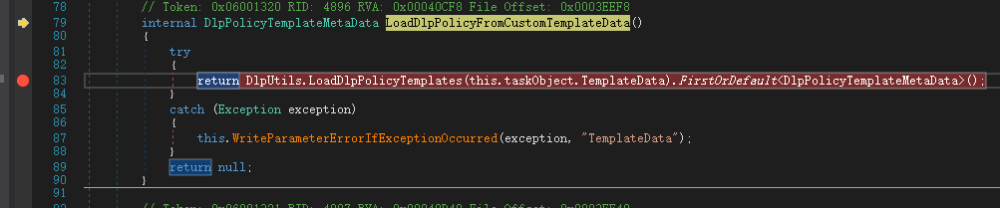

在这里调用`DlpUtils.LoadDlpPolicyTemplates`函数来加载数据，跟进

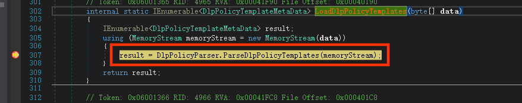

传入的数据交给了返回类型为`IEnumerable<DlpPolicyTemplateMetaData>`的`Microsoft.Exchange.MessagingPolicies.CompliancePrograms.Tasks.DlpPolicyParser.ParserDlpPolicyTemplates`函数做解析处理，查看该函数的定义，部分代码如下：

```c#
internal static IEnumerable<DlpPolicyTemplateMetaData> ParseDlpPolicyTemplates(Stream data)
{
    List<DlpPolicyTemplateMetaData> result;
    try
    {
        XDocument xdocument = XDocument.Load(data);
        if (EtrSettingsConfiguration.GetSnapshot(MachineSettingsContext.Local, null, null).DlpPolicyTemplateSchemaValidation.Enabled)
        {
            xdocument.Validate(DlpPolicyParser.Schema.Value, null);
        }
        result = (from dlpPolicyTemplate in xdocument.Element("dlpPolicyTemplates").Elements("dlpPolicyTemplate")
        select DlpPolicyParser.ParseDlpPolicyTemplate(dlpPolicyTemplate.ToString())).ToList<DlpPolicyTemplateMetaData>();
    }
    ...
    ...
    return result;
}
```

该函数解析了`xml`，判断是否为合法的`xml`数据，获取`dlpPolicyTemplate`标签之间的数据，接着再由重写返回类型为`DlpPolicyTemplateMetaData`的`Microsoft.Exchange.MessagingPolicies.CompliancePrograms.Tasks.DlpPolicyParser.ParseDlpPolicyTemplates`对每条数据进行处理并且验证

```c#
internal static DlpPolicyTemplateMetaData ParseDlpPolicyTemplate(string data)
{
    DlpPolicyTemplateMetaData result;
    try
    {
        XElement root = XDocument.Parse(data).Root;
        DlpPolicyTemplateMetaData dlpPolicyTemplateMetaData = new DlpPolicyTemplateMetaData();
        dlpPolicyTemplateMetaData.Version = root.Attribute("version").Value.Trim();
        dlpPolicyTemplateMetaData.State = (RuleState)Enum.Parse(typeof(RuleState), root.Attribute("state").Value.Trim());
        dlpPolicyTemplateMetaData.Mode = (RuleMode)Enum.Parse(typeof(RuleMode), root.Attribute("mode").Value.Trim());
        dlpPolicyTemplateMetaData.ImmutableId = ((root.Attribute("id") == null) ? Guid.Empty : Guid.Parse(root.Attribute("id").Value.Trim()));
        dlpPolicyTemplateMetaData.ContentVersion = root.Element("contentVersion").Value.Trim();
        dlpPolicyTemplateMetaData.PublisherName = root.Element("publisherName").Value.Trim();
        dlpPolicyTemplateMetaData.LocalizedNames = DlpPolicyParser.ParseLocalizedString(root.Element("name"));
        dlpPolicyTemplateMetaData.LocalizedDescriptions = DlpPolicyParser.ParseLocalizedString(root.Element("description"));
        dlpPolicyTemplateMetaData.LocalizedKeywords = (from localizedKeyword in root.Element("keywords").Elements("keyword")
        select DlpPolicyParser.ParseLocalizedString(localizedKeyword)).ToList<Dictionary<string, string>>();
        dlpPolicyTemplateMetaData.RuleParameters = (from ruleParameter in root.Element("ruleParameters").Elements("ruleParameter")
        select new DlpTemplateRuleParameter
        {
            Type = ruleParameter.Attribute("type").Value.Trim(),
            Required = bool.Parse(ruleParameter.Attribute("required").Value),
            Token = ruleParameter.Attribute("token").Value.Trim(),
            LocalizedDescriptions = DlpPolicyParser.ParseLocalizedString(ruleParameter.Element("description"))
        }).ToList<DlpTemplateRuleParameter>();
        dlpPolicyTemplateMetaData.PolicyCommands = (from policyCommand in root.Element("policyCommands").Elements("commandBlock")
        select policyCommand.Value.Trim()).ToList<string>();
        dlpPolicyTemplateMetaData.LocalizedPolicyCommandResources = (from localizedResource in root.Element("policyCommandsResources").Elements("resource")
        select new KeyValuePair<string, Dictionary<string, string>>(localizedResource.Attribute("token").Value.Trim(), DlpPolicyParser.ParseLocalizedString(localizedResource))).ToDictionary((KeyValuePair<string, Dictionary<string, string>> pair) => pair.Key, (KeyValuePair<string, Dictionary<string, string>> pair) => pair.Value, StringComparer.OrdinalIgnoreCase);
        //对数据进行验证，跟进该函数内部
        dlpPolicyTemplateMetaData.Validate();
        result = dlpPolicyTemplateMetaData;
    }
    catch (ArgumentException innerException)
    {
        throw new DlpPolicyParsingException(Strings.DlpPolicyStateStateInvalid, innerException);
    }
    catch (NullReferenceException innerException2)
    {
        throw new DlpPolicyParsingException(Strings.DlpPolicyXmlMissingElements, innerException2);
    }
    catch (XmlException innerException3)
    {
        throw new DlpPolicyParsingException(Strings.DlpPolicyXmlInvalid, innerException3);
    }
    return result;
}

```
从上面代码中，我们可以看到，每条数据都保存到了`dlpPolicyTemplateMetaData`变量中，接着又调用了`dlpPolicyTemplateMetaData.Validate()`对数据进行验证。

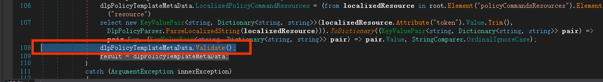

跟进`Microsoft.Exchange.MessagingPolicies.CompliancePrograms.Tasks.DlpPolicyTemplateMetaData.Validate()`函数，我们可以看到对每条数据都进行了验证，但是从函数名来看，似乎只是验证数据长度是否符合要求

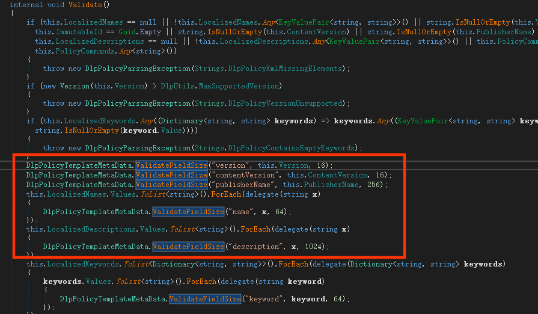

查看`ValidateFieldSize`函数的定义，可以确定只是简单的限制了长度，并没有做其他的过滤：

```c#
internal static void ValidateFieldSize(string fieldName, string value, int sizeLimit)
    {
        if (value.Length > sizeLimit)
        {
            throw new DlpPolicyParsingException(Strings.DlpPolicyFieldLengthsExceedsLimit(fieldName, sizeLimit));
        }
    }
```
这时候我们可以看到，传入的`payload`被完整的保存了下来

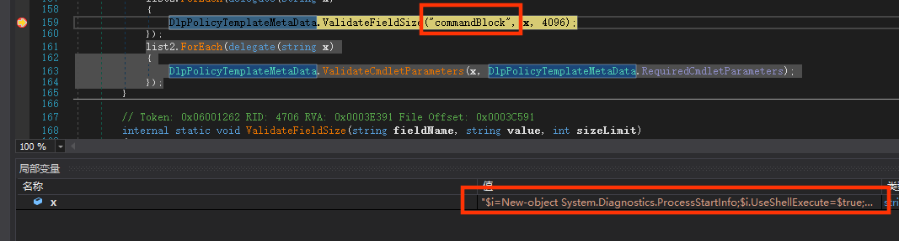


接下来还要进一步的对`cmdlet`参数进行验证

```c#
DlpPolicyTemplateMetaData.ValidateCmdletParameters(x, DlpPolicyTemplateMetaData.RequiredCmdletParameters)
```
查看该函数定义：

```c#
internal static void ValidateCmdletParameters(string cmdlet, IEnumerable<KeyValuePair<string, string>> requiredParameters)
{
    foreach (KeyValuePair<string, string> keyValuePair in requiredParameters)
    {
        if (cmdlet.StartsWith(keyValuePair.Key, StringComparison.InvariantCultureIgnoreCase) && !Regex.IsMatch(cmdlet, keyValuePair.Value, RegexOptions.IgnoreCase))
        {
            throw new DlpPolicyParsingException(Strings.DlpPolicyMissingRequiredParameter(cmdlet, keyValuePair.Value));
        }
    }
}
```

`requiredParameters`的键值为：`["New-TransportRule", "-DlpPolicy"]`。首先判断了`cmdlet`的开头是否为传入的`New-TransportRule`，接着再判断是否匹配`-DlpPolicy`的值，如果开头匹配并且内容不匹配，则直接抛出异常解析错误。我们跟入查看此时的值是什么：

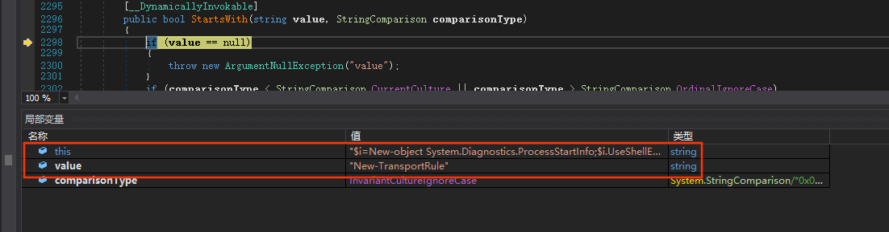

从上面可以看到，在判断`StartsWith`的时候，返回的结果就是`False`了，所以程序可以正常执行，不会抛出异常。


接着继续一步一步调试，跟踪到`{Microsoft.Exchange.MessagingPolicies.CompliancePrograms.Tasks.NewDlpPolicyImpl}.Validate()`函数，这里判断数据是否被修改过，如果修改了，则使用新的数据。在这里可以看到，传入的`TemplateData`被成功传入了`CmdletInfo`中，作为命令的参数。
```
dlpPolicyTemplateMetaData = this.LoadDlpPolicyFromCustomTemplateData();
```

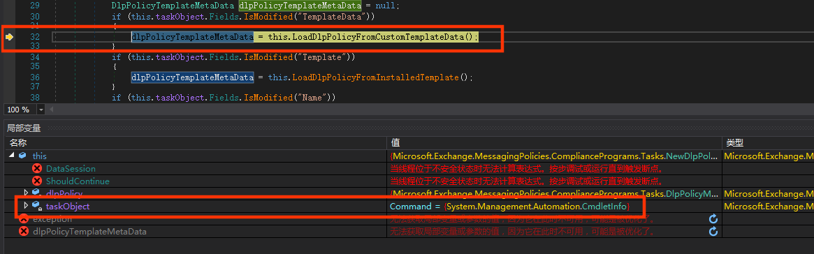

最后调用`DlpUtils.CheckForUnifiedComplianceAvailability<ADComplianceProgram>(this.taskObject, SystemConfigurationTasksHelper.GetCmdletName(this.taskObject.GetType()))`进行进一步处理。

单步跟进，函数到了`Microsoft.Exchange.Configuration.Tasks.Task.ProcessRecord()`对`{Microsoft.Exchange.MessagingPolicies.CompliancePrograms.Tasks.NewDlpPolicy}`进行处理。

这时候进入到`this.ProcessTaskStage`的`MainFunc`中，这时候我们查看局部变量的数据，可以看到我们的数据都已经传入了。
`ProcessTaskStage`定义：

```c#
private void ProcessTaskStage(TaskStage taskStage, Action initFunc, Action mainFunc, Action completeFunc)
```

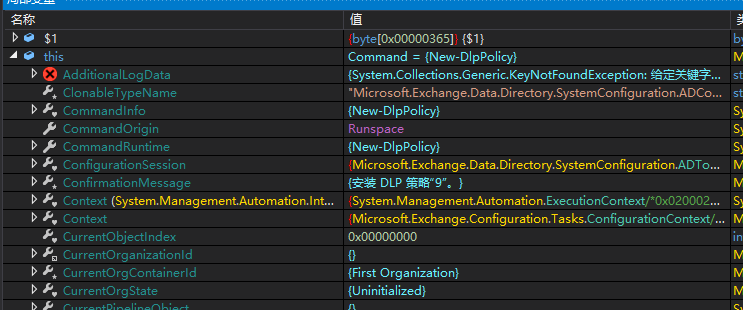

`MainFunc`函数定义如下：

```c#
delegate
{
    using (new CmdletMonitoredScope(this.CurrentTaskContext.UniqueId, "BizLogic", "Task.ProcessRecord/InnerProcessRecord", LoggerHelper.CmdletPerfMonitors))
    {
        using (new CmdletMonitoredScope(this.CurrentTaskContext.UniqueId, "BizLogic", "InnerProcessRecord/InternalStateReset", LoggerHelper.CmdletPerfMonitors))
        {
            this.InternalStateReset();
        }
        if (!this.HasErrors)
        {
            this.PreInternalValidate();
            using (new CmdletMonitoredScope(this.CurrentTaskContext.UniqueId, "BizLogic", "InnerProcessRecord/InternalValidate", LoggerHelper.CmdletPerfMonitors))
            //函数首先会进入到这里进行一个内部验证，如果验证通过则会进行下一步，但是实际上如果程序未超时，格式正确，这里什么都没有做
            {
                this.InternalValidate();
            }
            this.PostInternalValidate();
        }
        if (!this.HasErrors)
        {
            ProvisioningValidationError[] array = ProvisioningLayer.ValidateUserScope(this);
            if (array != null && array.Length != 0)
            {
                for (int i = 0; i < array.Length; i++)
                {
                    ProvisioningValidationException exception = new ProvisioningValidationException(array[i].Description, array[i].AgentName, array[i].Exception);
                    this.WriteError(exception, (ErrorCategory)array[i].ErrorCategory, null, array.Length - 1 == i);
                }
            }
            this.InternalProvisioningValidation();
        }
        //在创建新的dlp策略时候，这里会调用新的cmdinfo对象{Get-Notification}来发出确认信息

        if (!this.HasErrors)
        {
            LocalizedString confirmationMessage = this.ConfirmationMessage;
            if (confirmationMessage == LocalizedString.Empty || this.ShouldProcess(confirmationMessage))
            {
                string orgId = (this.CurrentOrganizationId != null) ? this.CurrentOrganizationId.ToString() : string.Empty;
                if (this.IsVerboseOn && !TaskLogger.IsSetupLogging)
                {
                    this.WriteVerbose(Strings.VerboseResolvedOrganization(orgId));
                }
                this.PreInternalProcessRecord();
                using (new CmdletMonitoredScope(this.CurrentTaskContext.UniqueId, "BizLogic", "InnerProcessRecord/InternalProcessRecord", LoggerHelper.CmdletPerfMonitors))
                {
                    //前面验证过后，最后会到这里来
                    this.InternalProcessRecord();
                    goto IL_1C8;
                }
            }
            this.CurrentTaskContext.WasCancelled = true;
            CmdletLogger.SafeSetLogger(this.CurrentTaskContext.UniqueId, RpsCmdletMetadata.ExecutionResult, "Cancelled");
        }
        IL_1C8:
        ProvisioningLayer.OnComplete(this, !this.CurrentTaskContext.WasCancelled && !this.HasErrors, null);
    }
}
```

程序接着会进入到`InternalProcessRecord()`，实际上是进入了`Microsoft.Exchange.MessagingPolicies.CompliancePrograms.Tasks.NewDlpPolicy.InternalProcessRecord()`


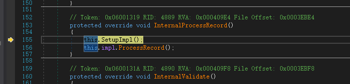

在该函数运行后，会进入到`{Microsoft.Exchange.MessagingPolicies.CompliancePrograms.Tasks.DlpUtils}.AddTenantDlpPolicy()`函数，在这里会造成RCE，函数定义如下：

```c#
public static void AddTenantDlpPolicy(IConfigDataProvider dataSession, DlpPolicyMetaData dlpPolicy, string organizationParameterValue, out IEnumerable<PSObject> results, bool skipTransportRules = false)
{
    results = null;
    ADComplianceProgram adcomplianceProgram = dlpPolicy.ToAdObject();
    ADComplianceProgramCollection dlpPolicyCollection = DlpUtils.GetDlpPolicyCollection(dataSession, DlpUtils.TenantDlpPoliciesCollectionName);
    adcomplianceProgram.OrganizationId = dlpPolicyCollection.OrganizationId;
    adcomplianceProgram.SetId(dlpPolicyCollection.Id.GetChildId(dlpPolicy.Name));
    dataSession.Save(adcomplianceProgram, "d:\\dbs\\sh\\e16df\\1128_112205\\cmd\\e\\sources\\dev\\management\\SRC\\Management\\SystemConfigurationTasks\\DlpPolicy\\Utils.cs", 272, "AddTenantDlpPolicy");

    // skipTransportRules必须为false，否则无法触发漏洞
    if (skipTransportRules)
    {
        return;
    }
    //关键点1
    IEnumerable<string> cmdlets = Utils.AddOrganizationScopeToCmdlets(dlpPolicy.PolicyCommands, organizationParameterValue);
    string domainController = null;
    ADSessionSettings sessionSettings = null;
    MessagingPoliciesSyncLogDataSession messagingPoliciesSyncLogDataSession = dataSession as MessagingPoliciesSyncLogDataSession;
    if (messagingPoliciesSyncLogDataSession != null)
    {
        domainController = messagingPoliciesSyncLogDataSession.LastUsedDc;
        sessionSettings = messagingPoliciesSyncLogDataSession.SessionSettings;
    }
    try
    {
        results = CmdletRunner.RunCmdlets(cmdlets, false);
    }
    catch (ParseException e)
    {
        DlpUtils.HandleScriptExecutionError(adcomplianceProgram, DlpUtils.GetErrorHandlingDataSession(domainController, sessionSettings, dataSession), e);
    }
    catch (RuntimeException e2)
    {
        DlpUtils.HandleScriptExecutionError(adcomplianceProgram, DlpUtils.GetErrorHandlingDataSession(domainController, sessionSettings, dataSession), e2);
    }
    catch (CmdletExecutionException e3)
    {
        DlpUtils.HandleScriptExecutionError(adcomplianceProgram, DlpUtils.GetErrorHandlingDataSession(domainController, sessionSettings, dataSession), e3);
    }
}
```

从函数中，可以看到，程序直接读取了`dlpPolicy.PolicyCommands`，赋值给了`cmdlets`，

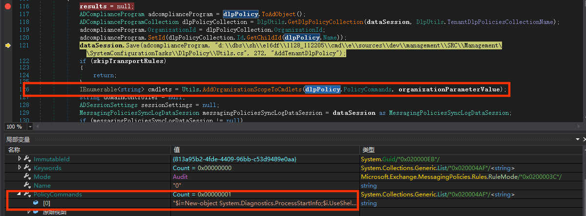

而`cmdlets`最后则传给了`CmdletRunner.RunCmdlets`函数，作为`powershell`运行起来了，从而造成了RCE

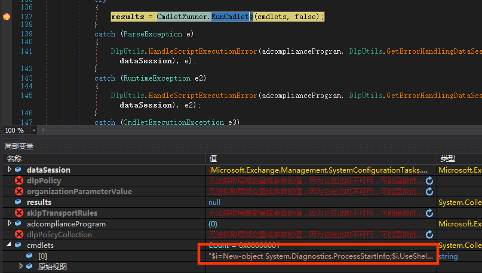

进入该函数，可以看到对命令进行了调用

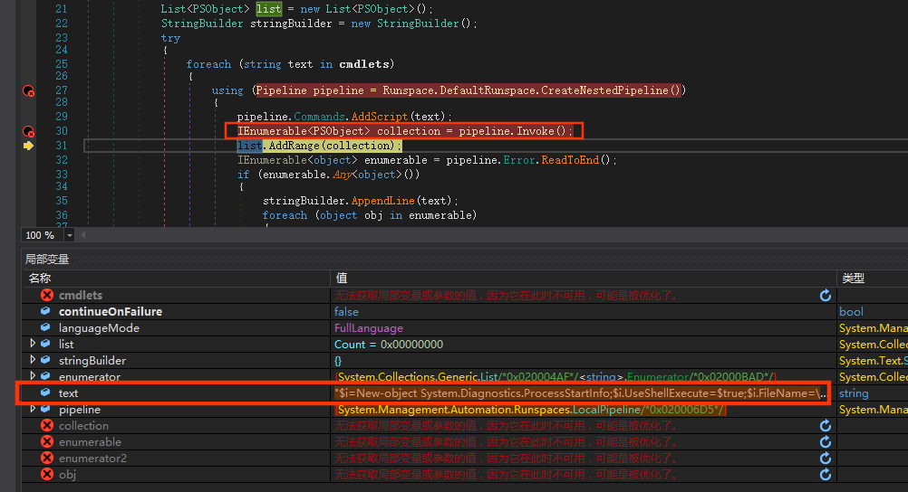


造成这个漏洞形成，主要是因为没有对`TemplateData`进行过滤，而`DlpUtils.AddTenantDlpPolicy()`函数会对模板文件中的`CommandBlock`进行执行，从而导致RCE

## 更新补丁

补丁代码对`CommandBlock`块的数据进行了多重的验证，首先判断了是否只是包含单个命令，其次再判断传入的`cmdlet`是否以`New-TransportRule`开头，接着再判断`cmdlet`的内容是否有匹配到`-DlpPolicy`，只要有其中一个不正确，则抛出异常。

```c#
internal static void ValidateCmdletParameters(string cmdlet, IEnumerable<KeyValuePair<string, string>> requiredParameters)
{
	if (string.IsNullOrWhiteSpace(cmdlet))
	{
		return;
	}
	Collection<PSParseError> collection2;
	Collection<PSToken> collection = PSParser.Tokenize(cmdlet, out collection2);
	if (collection2 != null && collection2.Count > 0)
	{
		throw new DlpPolicyParsingException(Strings.DlpPolicyNotSupportedCmdlet(cmdlet));
	}
	if (collection != null)
	{
		if ((from token in collection
		where token.Type == PSTokenType.Command
		select token).ToList<PSToken>().Count > 1)
		{
			throw new DlpPolicyParsingException(Strings.DlpPolicyMultipleCommandsNotSupported(cmdlet));
		}
	}
	bool flag = false;
	foreach (KeyValuePair<string, string> keyValuePair in requiredParameters)
	{
		if (cmdlet.StartsWith(keyValuePair.Key, StringComparison.InvariantCultureIgnoreCase))
		{
			if (!Regex.IsMatch(cmdlet, keyValuePair.Value, RegexOptions.IgnoreCase))
			{
				throw new DlpPolicyParsingException(Strings.DlpPolicyMissingRequiredParameter(cmdlet, keyValuePair.Value));
			}
			flag = true;
		}
	}
	if (!flag)
	{
		throw new DlpPolicyParsingException(Strings.DlpPolicyNotSupportedCmdlet(cmdlet));
	}
}
```

### 补丁绕过
[ https://x41-dsec.de/security/advisory/exploit/research/2020/12/21/x41-microsoft-exchange-rce-dlp-bypass/]( https://x41-dsec.de/security/advisory/exploit/research/2020/12/21/x41-microsoft-exchange-rce-dlp-bypass/)

## 参考文档

[https://srcincite.io/advisories/src-2020-0019/](https://srcincite.io/advisories/src-2020-0019/)
