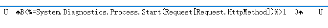

# CVE-2020-17803 & CVE-2020-17804 Exchange Server RCE


## 漏洞成因

`New-ExchangeCertificate`和`Export-ExchangeCertificate`命令可以向任意目录写入文件导致

## 漏洞分析

首先来看看`New-ExchangeCertificate`的代码是怎么写的：

漏洞代码出现在`New-ExchangeCertificate`的`WriteRequest`函数

```c#
private void WriteRequest(byte[] data, string text)
{
	try
	{
		if (this.BinaryEncoded)
		{
			using (FileStream fileStream = File.Create(this.RequestFile))
			{
				fileStream.Write(data, 0, data.Length);
				goto IL_4F;
			}
		}

        //写入的文件为base64格式的
		using (StreamWriter streamWriter = File.CreateText(this.RequestFile))
		{
			streamWriter.Write(text);
		}
		IL_4F:;
	}
	catch (IOException ex)
	{
		base.WriteError(new InvalidOperationException(Strings.RequestCertificateFileInvalid(ex.Message)), ErrorCategory.InvalidOperation, null);
	}
}
```
上面的代码很简单，只要使用了`BinaryEncoded`进行编码，那么就会直接向目标文件写入编码后的数据，但是在使用`New-ExchangeCertificate`写入编码文件时候，有一个不太友好的地方，对`";`等字符不能处理，所以在写`shell`的时候存在一定的限制。


接着看`Export-ExchangeCertificate`的`WriteCertiricate`函数

```c#
private void WriteCertiricate(ExchangeCertificateRpc outputValues)
{
	try
	{
		if (this.BinaryEncoded)
		{
			using (FileStream fileStream = File.Create(this.FileName))
			{
				fileStream.Write(outputValues.ReturnExportFileData, 0, outputValues.ReturnExportFileData.Length);
				goto IL_5E;
			}
		}
		using (StreamWriter streamWriter = File.CreateText(this.FileName))
		{
			streamWriter.Write(outputValues.ReturnExportBase64);
		}
		IL_5E:;
	}
	catch (Exception ex)
	{
		if (!this.HandleException(ex))
		{
			throw;
		}
		base.WriteError(new InvalidOperationException(Strings.ExportCertificateFileInvalid(ex.Message)), ErrorCategory.InvalidOperation, null);
	}
}
```

代码都差不多，导出的时候必须要使用`BinaryEncoded`，否则导出的文件是`base64`编码过的，无法解析执行。进行编码后的文件，是可以显示我们写入的内容的




## 更新补丁

`Export-ExchangeCertificate`的`WriteCertiricate`对输出的文件名进行了过滤，并且对后缀做了限制，如果不是预先定义的后缀名，则统一加上`.pfx`后缀

```c#
private void WriteCertiricate(ExchangeCertificateRpc outputValues)
{
	try
	{
		string text = this.FileName;
		string text2 = Path.GetExtension(text).Replace(".", "").ToUpper();
		text2 = text2.Replace("-", "_");
		if (!Enum.IsDefined(typeof(AllowedCertificateTypes), text2))
		{
			text += ".pfx";
		}
		if (this.BinaryEncoded)
		{
			using (FileStream fileStream = File.Create(text))
			{
				fileStream.Write(outputValues.ReturnExportFileData, 0, outputValues.ReturnExportFileData.Length);
				goto IL_A5;
			}
		}
		using (StreamWriter streamWriter = File.CreateText(text))
		{
			streamWriter.Write(outputValues.ReturnExportBase64);
		}
		IL_A5:;
	}
	catch (Exception ex)
	{
		if (!this.HandleException(ex))
		{
			throw;
		}
		base.WriteError(new InvalidOperationException(Strings.ExportCertificateFileInvalid(ex.Message)), ErrorCategory.InvalidOperation, null);
	}
}
```

`New-ExchangeCertificate`的`WriteRequest`补丁也差不多，加上`.req`后缀

```c#
private void WriteRequest(byte[] data, string text)
{
	try
	{
		string text2 = this.RequestFile;
		string text3 = Path.GetExtension(text2).Replace(".", "").ToUpper();
		text3 = text3.Replace("-", "_");
		if (!Enum.IsDefined(typeof(AllowedCertificateTypes), text3))
		{
			text2 += ".req";
		}
		if (this.BinaryEncoded)
		{
			using (FileStream fileStream = File.Create(text2))
			{
				fileStream.Write(data, 0, data.Length);
				goto IL_96;
			}
		}
		using (StreamWriter streamWriter = File.CreateText(text2))
		{
			streamWriter.Write(text);
		}
		IL_96:;
	}
	catch (IOException ex)
	{
		base.WriteError(new InvalidOperationException(Strings.RequestCertificateFileInvalid(ex.Message)), ErrorCategory.InvalidOperation, null);
	}
}
```

## 参考文档

[https://srcincite.io/advisories/src-2020-0025/](https://srcincite.io/advisories/src-2020-0025/)

[https://srcincite.io/advisories/src-2020-0026](https://srcincite.io/advisories/src-2020-0026)
